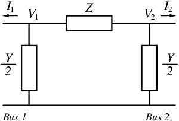
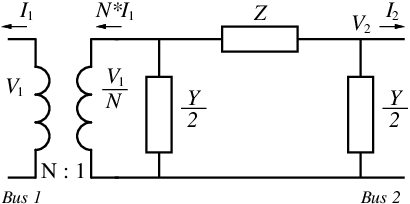

# Branch Model

Transmission lines and different types of transformers (traditional, Load
Tap-Changing transformers (LTC) and Phase Angle Regulators (PARs)) can be
modeled with a common branch model.

## Transmission Line Model

The most common circuit that is used to represent the transmission line model
is $`\pi`$ circuit as shown in Figure 1. The positive flow direction is into
buses. Commonly used convention is to define positive direction to be from
sending to receiving bus. We decide to use this symmetric convention because it
provides more flexibility for modeling.

<div align="center">
   

  Figure 1: Transmission line $`\pi`$ equivalent circuit
</div>

Here
``` math
Z = R + jX
```
and
``` math
Y = G + jB,
```
where $`R`$ is line series resistance, $`X`$ is line series reactance, $`B`$ is
line shunt charging, and $`G`$ is line shunt conductance. As can be seen from
Figure 1 total $`B`$ and $`G`$ are separated between two buses. The current
entering bus 1 can be obtained from Kirchhoff's current law as
```math
I_1 = y(V_2 - V_1) - \frac{Y}{2} V_1,
```
where $`V_1`$ and $`V_2`$ are respective bus voltages and
```math
y = \frac{1}{Z} = \frac{R}{R^2+X^2} + j\frac{-X}{R^2+X^2} = g + jb.
```
Similarly, current entering bus 2 is given as
```math
I_2 = y(V_1 - V_2) + \frac{Y}{2} V_2.
```
These equations can be written in a compact form as:
```math
\begin{bmatrix}
I_{1}\\
I_{2}
\end{bmatrix}
= \mathbf{Y}
\begin{bmatrix}
V_{1}\\
V_{2}
\end{bmatrix}
```
where:
```math
\mathbf{Y}_{TL}=\begin{bmatrix}
-(g + jb) - \dfrac{G+jB}{2} &   g + jb \\
  g + jb                    & -(g + jb) - \dfrac{G+jB}{2}
\end{bmatrix}
```

### Branch contributions to residuals at adjacent buses

After some algebra, one obtains expressions for real and imaginary components
for the currents entering adjacent buses:
```math
I_{r1} = -\left(g + \frac{G}{2}\right) V_{r1} + \left(b + \frac{B}{2} \right) V_{i1} 
         + g V_{r2} - b V_{i2}
```

```math
I_{i1} = -\left(b + \frac{B}{2} \right) V_{r1} - \left(g + \frac{G}{2}\right) V_{i1}
         + b V_{r2} + g V_{i2}
```

```math
I_{r2} = g V_{r1} - b V_{i1}
         - \left(g + \frac{G}{2}\right) V_{r2} + \left(b + \frac{B}{2} \right) V_{i2} 
```

```math
I_{i1} = b V_{r1} + g V_{i1}
         - \left(b + \frac{B}{2} \right) V_{r2} - \left(g + \frac{G}{2}\right) V_{i2}
```


## Transformer Branch Model

**Note: Transformer model not yet implemented**

The branch model can be created by adding the ideal transformer in series with
the $`\pi`$ circuit as shown in Figure 2 where $`\tau`$ is a tap ratio
magnitude and $`\theta`$ is the phase shift angle and
$`N = \tau e^{j \theta}`$.

<div align="center">
   
   
   
  Figure 2: Branch equivalent circuit
</div>


The branch admitance matrix is then:

```math
\mathbf{Y}_{BR}=
\begin{bmatrix}
 -\left(g + jb + \dfrac{G+jB}{2} \right) \dfrac{1}{\tau^2} & (g + jb)\dfrac{1}{\tau e^{-j\theta}}\\
                                                           &                                     \\
     (g + jb)\dfrac{1}{\tau e^{j\theta}}                   & -\left(g + jb + \dfrac{G+jB}{2}\right)
\end{bmatrix}
```

### Branch contribution to residuals at adjacent busses

The currents entering adjacent buses are obtained in a similar manner as for
the $`\pi`$-model.
