# CommonMath

Smooth, autodiff-friendly approximations of piecewise functions used across
GridKit component models. In model equations, these functions act as smooth
activation functions for saturation, limits, deadbands, and antiwindup behavior. See
`CommonMath.hpp` for implementation details.

- [Primitives](#primitives)
- [Derived Functions](#derived-functions)

## Primitives

| Symbol | Name | API | Description |
|--------|------|-----|-------------|
| $\sigma$ | Logistic Function | `sigmoid` | Smooth approximation to the Heaviside step function |
| $\rho$ | Ramp | `ramp` | Smooth approximation to the ramp function |
| $q$ | Quadratic Ramp | `qramp` | Smooth approximation to the quadratic ramp function |


The default scale $\mu$ of these functions is chosen such that $\sigma'(0)=f_{\text{sync}}$, where $f_{\text{sync}}$ is the fundamental frequency of the `PhasorDynamics` model. As $\mu\to\infty$, $\rho$ and $q$ converge to $\text{ReLU}$ and $\text{ReQU}$ everywhere, while $\sigma$ converges to $H$ for $x\ne0$.

### Logistic Function

The Heaviside function $H$ is a unit step, defined as:

```math
\begin{aligned}
  H(x)
    &=
      \begin{cases}
        0 & x\le 0 \\[0pt]
        1 & x\gt 0
      \end{cases}
\end{aligned}
```

We use the logistic function as a smooth approximation to the Heaviside function. This approximation is evaluated using the equivalent hyperbolic-tangent form below to avoid overflow when evaluating the exponential form directly.

```math
\begin{aligned}
  \sigma(x) = \dfrac{1}{2}\left(1+\tanh\left(\dfrac{\mu x}{2}\right)\right) &\approx H(x)  
\end{aligned}
```

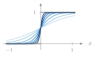

### Ramp

The rectified linear unit $\text{ReLU}$ is a one-sided ramp:

```math
\begin{aligned}
  \text{ReLU}(x)
    &=
      \begin{cases}
        0 & x\le 0 \\[0pt]
        x & x\gt 0
      \end{cases}
\end{aligned}
```

We implement the Ramp function as the $\text{softplus}(x)$, non-negative approximation of $\text{ReLU}(x)$. We do not use $x\,\sigma(x)$ because it introduces a negative tail for $x \lt 0$, while $\text{softplus}(x)$ stays nonnegative.

```math
\begin{aligned}
  \rho(x)
  = \dfrac{1}{\mu}\ln(1+e^{\mu x}) \approx \text{ReLU}(x)
\end{aligned}
```

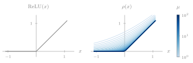

Although $\rho(x)$ is real-analytic, the implemented form is an overflow-safe representation of the function:

```math
\begin{aligned}
  \rho(x) =
  \dfrac{x+\lvert x\rvert}{2}
  + \dfrac{1}{\mu}\ln\left(1+e^{-\mu\lvert x\rvert}\right)
\end{aligned}
```
The kinks of the two terms cancel exactly.

### Quadratic Ramp

The rectified quadratic unit $\text{ReQU}$ is a one-sided quadratic ramp:

```math
\begin{aligned}
  \text{ReQU}(x)
    &=
      \begin{cases}
        0 & x\le 0 \\[0pt]
        x^2 & x\gt 0
      \end{cases}
\end{aligned}
```

We implement an approximation to $\text{ReQU}$ using the logistic function.

```math
\begin{aligned}
  q(x) = x^2\,\sigma(x) \approx \text{ReQU}(x) 
\end{aligned}
```

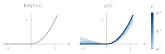

## Derived Functions

| Name | API | Description |
|------|-----|-------------|
| Maximum | `max` | Smooth binary maximum |
| Minimum | `min` | Smooth binary minimum |
| Clamp | `clamp` | Bounded saturation |
| Type I Deadband | `deadband1` | No-offset signed two-sided deadband |
| Type II Deadband | `deadband2` | Offset signed two-sided deadband |
| Slew | `slew` | Symmetric slew-rate limiter |
| Linear Segment | `linseg` | Saturated linear segment contribution |
| Above | `above` | Above-lower-limit indicator |
| Below | `below` | Below-upper-limit indicator |
| Inside | `inside` | Interior pulse indicator |
| Outside | `outside` | Outside-band indicator |
| Antiwindup | `antiwindup` | Anti-windup limited derivative |

### Maximum

```math
\begin{aligned}
  \text{max}(x,y)
    &=
      \begin{cases}
        x & x\gt y \\[0pt]
        y & x\le y
      \end{cases} \\[0pt]
    &=y+\text{ReLU}(x-y)=\approx y+\rho(x-y)
\end{aligned}
```

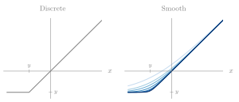

### Minimum

```math
\begin{aligned}
  \text{min}(x,y)
    &=
      \begin{cases}
        x & x\lt y \\[0pt]
        y & x\ge y
      \end{cases} \\[0pt]
    &=x-\text{ReLU}(x-y)\approx x-\rho(x-y)
\end{aligned}
```

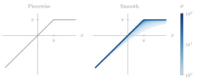

### Clamp

The limits satisfy $\ell\le u$.

```math
\begin{aligned}
  \text{clamp}(x;\ell,u)
    &=
      \begin{cases}
        \ell & x\lt \ell \\[0pt]
        x    & \ell\le x\le u \\[0pt]
        u    & x\gt u
      \end{cases} \\[0pt]
    &\approx \ell+\rho(x-\ell)-\rho(x-u)
\end{aligned}
```

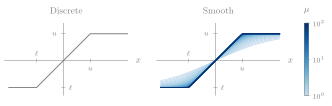

### Type I Deadband

The limits satisfy $\ell\le u$.

```math
\begin{aligned}
  \text{deadband1}(x;\ell,u)
    &=
      \begin{cases}
        x & x\lt \ell \\[0pt]
        0 & \ell\le x\le u \\[0pt]
        x & x\gt u
      \end{cases} \\[0pt]
    &\approx x\left[\sigma(\ell-x)+\sigma(x-u)\right]
\end{aligned}
```

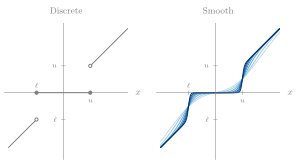

### Type II Deadband

The limits satisfy $\ell\le u$.

```math
\begin{aligned}
  \text{deadband2}(x;\ell,u)
    &=
      \begin{cases}
        x-\ell & x\lt \ell \\[0pt]
        0      & \ell\le x\le u \\[0pt]
        x-u    & x\gt u
      \end{cases} \\[0pt]
    &\approx \rho(x-u)-\rho(\ell-x)
\end{aligned}
```

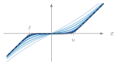

### Slew

The rate limit satisfies $r\ge0$.

```math
\begin{aligned}
  \text{slew}(f;r)
    &=
      \begin{cases}
        -r & f\lt -r \\[0pt]
        f  & -r\le f\le r \\[0pt]
        r  & f\gt r
      \end{cases} \\[0pt]
    &\approx -r+\rho(f+r)-\rho(f-r)
\end{aligned}
```

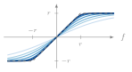

### Linear Segment

The breakpoints satisfy $a<b$.

```math
\begin{aligned}
  \text{linseg}(x;a,b,h)
    &=
      \begin{cases}
        0                       & x\lt a \\[0pt]
        \dfrac{h}{b-a}(x-a)     & a\le x\le b \\[0pt]
        h                       & x\gt b
      \end{cases} \\[0pt]
    &\approx \dfrac{h}{b-a}\left[\rho(x-a)-\rho(x-b)\right]
\end{aligned}
```

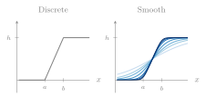

### Above

```math
\begin{aligned}
  \text{above}(x;\ell)
    &=
      \begin{cases}
        0 & x\le \ell \\[0pt]
        1 & x\gt \ell
      \end{cases} \\[0pt]
    &\approx \sigma(x-\ell)
\end{aligned}
```

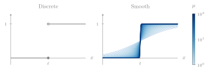

### Below

```math
\begin{aligned}
  \text{below}(x;u)
    &=
      \begin{cases}
        1 & x\lt u \\[0pt]
        0 & x\ge u
      \end{cases} \\[0pt]
    &\approx \sigma(u-x)
\end{aligned}
```

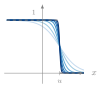

### Inside

The limits satisfy $\ell\le u$.

```math
\begin{aligned}
  \text{inside}(x;\ell,u)
    &=
      \begin{cases}
        1 & \ell\le x\le u \\[0pt]
        0 & \text{otherwise}
      \end{cases} \\[0pt]
    &\approx \sigma(x-\ell)+\sigma(u-x)-1
\end{aligned}
```

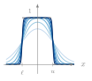

### Outside

The limits satisfy $\ell\le u$.

```math
\begin{aligned}
  \text{outside}(x;\ell,u)
    &=
      \begin{cases}
        1 & x\lt \ell\ \lor\ x\gt u \\[0pt]
        0 & \text{otherwise}
      \end{cases} \\[0pt]
    &\approx \sigma(\ell-x)+\sigma(x-u)
\end{aligned}
```

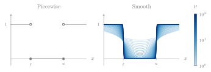

### Antiwindup

The limits satisfy $\ell\le u$.

```math
\begin{aligned}
  \text{antiwindup}(x,f;\ell,u)
    &=
      \begin{cases}
        f & \ell\lt x\lt u \\[0pt]
        f & x\le\ell\ \land\ f\gt 0 \\[0pt]
        f & x\ge u\ \land\ f\lt 0 \\[0pt]
        0 & \text{otherwise}
      \end{cases} \\[0pt]
  \phi_L
    &= \text{above}(x;\ell) \\[0pt]
  \phi_U
    &= \text{below}(x;u) \\[0pt]
  \phi(x,f)
    &= \phi_L\phi_U+(1-\phi_U)\sigma(-f)+(1-\phi_L)\sigma(f) \\[0pt]
  \text{antiwindup}(x,f;\ell,u)
    &\approx \phi(x,f)\,f
\end{aligned}
```
