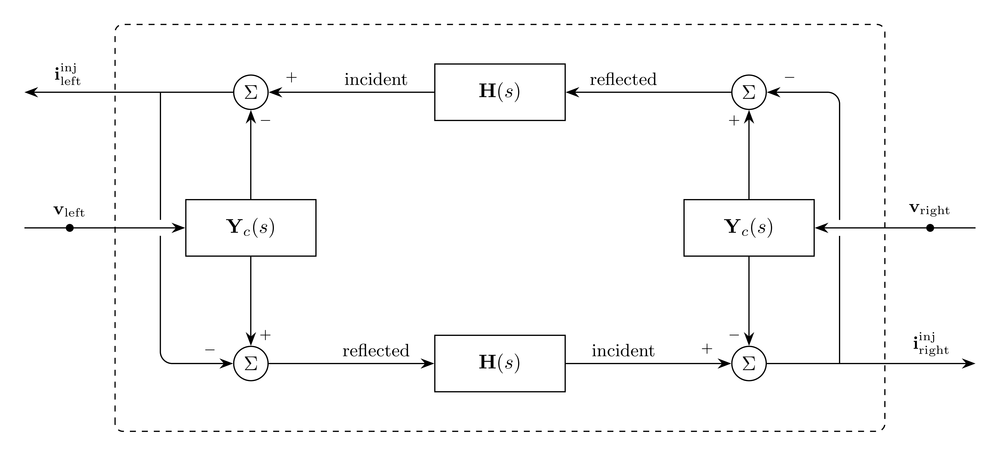

# BranchDistributedFrequencyDependent Model

`BranchDistributedFrequencyDependent` represents a distributed EMT branch with
characteristic admittance $\mathbf{Y}_c$ and propagation model $\mathbf{H}$.

## Block Diagram

<div align="center">
   

  Figure 1: BranchDistributedFrequencyDependent composite model
</div>

## Model Parameters

Symbol | Units | JSON | Description          | Typical Value | Note
------ | ----- | ---- | -------------------- | ------------- | ----
$N$    | [-]   |      | Number of phases     | --            | $\mathbf{v} \in \mathbb{R}^N$
$K$    | [-]   |      | Number of conductors | --            | $\mathbf{i} \in \mathbb{R}^K$

### Parameter Validation

```math
\begin{aligned}
N > 0 \qquad
K > 0
\end{aligned}
```
### Model Derived Parameters

None.

## Model Submodels

Submodel           | Qty | Symbol              | Description               | Note
-------------------|-----|---------------------|---------------------------|-----
`RationalTransfer` | $2$ | $\mathbf{Y}_c(s)$   | Characteristic admittance | $\mathbf{Y}_c(s) \in \mathbb{R}^{K \times N}$
`Propagation`      | $2$ | $\mathbf{H}(s)$     | Propagation function      | $\mathbf{H}(s) \in \mathbb{R}^{K \times K}$

## Model Variables

### Internal Variables

#### Differential

None.

#### Algebraic

Symbol                                       | Units | Description                           | Note
---------------------------------------------|-------|---------------------------------------|-----
$\mathbf{i}^{\mathrm{ref}}_{\mathrm{left}}$  | [A]   | Reflected current at `left` terminal  | $\mathbf{i}^{\mathrm{ref}}_{\mathrm{left}} \in \mathbb{R}^K$
$\mathbf{i}^{\mathrm{ref}}_{\mathrm{right}}$ | [A]   | Reflected current at `right` terminal | $\mathbf{i}^{\mathrm{ref}}_{\mathrm{right}} \in \mathbb{R}^K$

### External Variables

External variables enter the composite model but are owned by the EMT bus.

#### Differential

Symbol                               | Units | Description                              | Note
-------------------------------------|-------|------------------------------------------|-----
$\mathbf{v}_{\mathrm{left}}$         | [V]   | `left` terminal voltage owned by EMT bus | $\mathbf{v}_{\mathrm{left}} \in \mathbb{R}^N$
$\mathbf{v}_{\mathrm{right}}$        | [V]   | `right` terminal voltage owned by EMT bus | $\mathbf{v}_{\mathrm{right}} \in \mathbb{R}^N$

#### Algebraic

None.

## Model Equations

### Differential Equations

None.

### Algebraic Equations

```math
\begin{aligned}
0 &= -\mathbf{i}^{\mathrm{ref}}_{\mathrm{left}}
     + 2\,\mathbf{i}^{\mathrm{sh}}_{\mathrm{left}}
     - \mathbf{i}^{\mathrm{inc}}_{\mathrm{left}} \\
0 &= -\mathbf{i}^{\mathrm{ref}}_{\mathrm{right}}
     + 2\,\mathbf{i}^{\mathrm{sh}}_{\mathrm{right}}
     - \mathbf{i}^{\mathrm{inc}}_{\mathrm{right}}
\end{aligned}
```

### Bus Residual Contributions

The distributed frequency-dependent line contributes to the KCL residual at
each terminal bus. Each expression is accumulated into the owning bus residual.

```math
\begin{aligned}
\mathbf{i}^{\mathrm{inj}}_{\mathrm{left}} &:=
  -\mathbf{i}^{\mathrm{sh}}_{\mathrm{left}}
  + \mathbf{i}^{\mathrm{inc}}_{\mathrm{left}} \\
\mathbf{i}^{\mathrm{inj}}_{\mathrm{right}} &:=
  -\mathbf{i}^{\mathrm{sh}}_{\mathrm{right}}
  + \mathbf{i}^{\mathrm{inc}}_{\mathrm{right}}
\end{aligned}
```

## Initialization

The line owns no differential states. Given the initial values from the
terminal buses and internal composite subcomponents, the reflected currents
initialize from the algebraic residuals:

```math
\begin{aligned}
\mathbf{i}^{\mathrm{ref}}_{\mathrm{left}}(0) &=
  2\,\mathbf{i}^{\mathrm{sh}}_{\mathrm{left}}(0)
  - \mathbf{i}^{\mathrm{inc}}_{\mathrm{left}}(0) \\
\mathbf{i}^{\mathrm{ref}}_{\mathrm{right}}(0) &=
  2\,\mathbf{i}^{\mathrm{sh}}_{\mathrm{right}}(0)
  - \mathbf{i}^{\mathrm{inc}}_{\mathrm{right}}(0)
\end{aligned}
```

The internal `RationalTransfer` and `Propagation` submodels initialize according
to their own model contracts.

## Model Outputs

Output  | Units | Description                             | Note
--------|-------|-----------------------------------------|-----
`ileft` | [A]   | Current injection at `left` terminal    | $\mathbf{i}^{\mathrm{inj}}_{\mathrm{left}} \in \mathbb{R}^K$
`iright` | [A]   | Current injection at `right` terminal   | $\mathbf{i}^{\mathrm{inj}}_{\mathrm{right}} \in \mathbb{R}^K$
