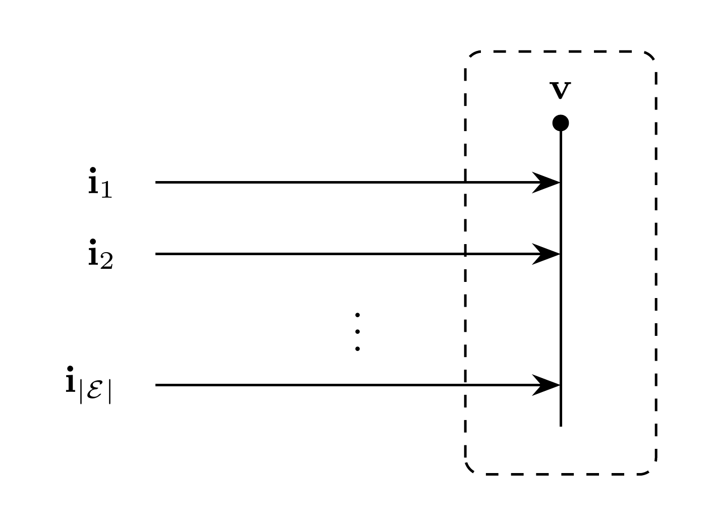

# Bus Model

`Bus` is a container of `KCL` and Norton sources. `KCL` owns the bus voltage;
each Norton source owns its shunt current and admittance states.
$\mathcal{E}$ denotes the set of Norton sources.

## Block Diagram



Figure 1: Bus model

## Model Parameters

Symbol | Units | JSON | Description | Note
------ | ----- | ---- | ----------- | ----
$N$ | [-] | `N` | Number of phases | Required, positive integer

### Parameter Validation

```math
N \in \mathbb{Z}_{>0}
```

### Derived Parameters

Terminal $e$ has $K_e$ current channels and a conductor-to-phase map
$\mathbf{P}_e\in\mathbb{R}^{N\times K_e}$ supplied by the connected device.
For a direct phase connection, $K_e=N$ and $\mathbf{P}_e=\mathbf{I}_N$.

## Model Ports

Symbol | Port | Type | Units | Description | Note
------ | ---- | ---- | ----- | ----------- | ----
$\mathbf{i}_e^\mathrm{inc}$ | `i_inc` | Input | [A] | Incident current from device $e$ | One per terminal, $\mathbb{R}^{K_e}$
$\mathbf{i}_e^\mathrm{sh}$ | `Ish` | Output | [A] | Shunt current supplied to device $e$ | One per terminal, $\mathbb{R}^{K_e}$
$\mathbf{v}$ | `v` | Output | [V] | Bus voltage supplied to connected devices | $\mathbf{v} \in \mathbb{R}^N$

## Submodels

Symbol | Description | Type | Order | JSON | Inputs | Outputs
------ | ----------- | ---- | ----- | ---- | ------ | -------
$\mathbf{v}$ | Bus voltage and current balance | KCL | $N$ | — | Current contributions | $\mathbb{R}^N$
$\mathbf{n}_e$ | Norton source | [Norton](../Source/Norton/README.md) | $K_e(1+Q_e)$ | Device coefficients or `shunts.<name>` | $\mathbf{P}_e^\mathsf T\mathbf{v},\mathbf{i}_e^\mathrm{inc}$ | $\mathbf{i}_e^\mathrm{sh}$

### Submodel Validation

Each source satisfies its admittance coefficient constraints.

## Model Variables

### Internal Variables

#### Differential

Symbol | Units | Description | Note
------ | ----- | ----------- | ----
$\mathbf{v}$ | [V] | Bus voltage vector | $\mathbf{v} \in \mathbb{R}^N$

#### Algebraic

Symbol | Units | Description | Note
------ | ----- | ----------- | ----
$\mathbf{i}_e^\mathrm{sh}$ | [A] | Shunt current owned by Norton source $e$ | $\mathbb{R}^{K_e}$

A bus voltage is algebraic when no connected equation depends on its derivative.

### External Variables

#### Differential

None.

#### Algebraic

None.

## Model Equations

### Internal Equations

#### Differential

```math
0=-\mathbf{i}_e^\mathrm{sh}
  +\mathbf{y}_e[\mathbf{P}_e^\mathsf T\mathbf{v}],
\qquad e\in\mathcal E
```

#### Algebraic

```math
0=\sum_{e\in\mathcal E}\mathbf{P}_e
  (\mathbf{i}_e^\mathrm{inc}-\mathbf{i}_e^\mathrm{sh})
```

Direct current inputs also contribute to KCL.

### External Equations

None.

## Initialization

`KCL` initializes the voltage from the bus state entry. Each Norton source
initializes its admittance states and shunt current.

## Monitors

Monitor | Units | Description | Note
------- | ----- | ----------- | ----
`v` | [V] | Bus voltage | $\mathbf{v} \in \mathbb{R}^N$
`i_sh` | [A] | Total shunt current | $\sum_{e\in\mathcal E}\mathbf P_e\mathbf i_e^\mathrm{sh}$
