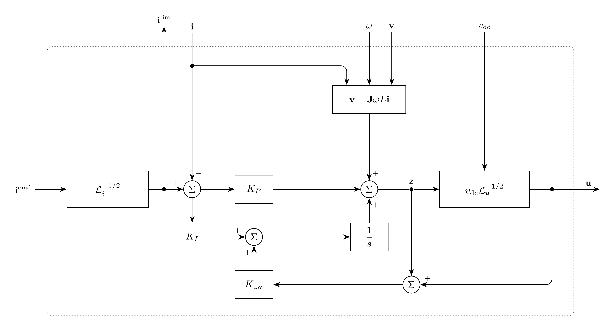

# InnerCurrentControl Model

`InnerCurrentControl` regulates converter current in power-invariant $dq$
coordinates using PI control, capacitor-voltage feedforward, and cross-coupling
compensation.[^unifi] A direction-preserving limit bounds the current command,
and tracking anti-windup[^tracking-anti-windup] follows the limited voltage
command returned by [PWM](../PWM/README.md).

## Block Diagram



Figure 1: InnerCurrentControl model

## Model Parameters

Symbol | Units | JSON | Description | Note
------ | ----- | ---- | ----------- | ----
$L$ | [H] | `L` | Inverter-side filter inductance | Required, positive
$K_P$ | [$\Omega$] | `Kp` | Proportional gain | Required, positive
$K_I$ | [$\Omega/\mathrm{s}$] | `Ki` | Integral gain | Required, positive
$K_{\mathrm{aw}}$ | [$\mathrm{s}^{-1}$] | `Kaw` | Tracking anti-windup gain | Required, positive
$I^{\max}$ | [A] | `Imax` | Current-command norm limit | Required, positive

For a balanced fundamental, $I^{\max} = \sqrt{3}\,I_{\mathrm{phase,rms}}^{\max}$.

### Parameter Validation

All parameters must be finite.

```math
L, K_P, K_I, K_{\mathrm{aw}}, I^{\max} > 0
```

### Derived Parameters

The limit coefficient and matrix representation of the complex unit are

```math
\begin{aligned}
a_i &= \dfrac{1}{(I^{\max})^2} \\
\mathbf{J} &=
\begin{bmatrix}
0 & -1 \\
1 & 0
\end{bmatrix}
\end{aligned}
```

## Model Ports

Symbol | Port | Type | Units | Description | Note
------ | ---- | ---- | ----- | ----------- | ----
$\mathbf{v}$ | `v` | Input | [V] | Filter-capacitor voltage | $\mathbf{v} \in \mathbb{R}^2$
$\mathbf{i}$ | `i` | Input | [A] | Inverter-side filter current | $\mathbf{i} \in \mathbb{R}^2$
$\mathbf{i}^{\mathrm{cmd}}$ | `icmd` | Input | [A] | Current command | From the outer controller
$\omega$ | `omega` | Input | [rad/s] | Electrical angular frequency of the $dq$ frame | From PLL
$\mathbf{u}^{\mathrm{lim}}$ | `ulim` | Input | [V] | Limited voltage command | From PWM
$\mathbf{i}^{\mathrm{lim}}$ | `ilim` | Output | [A] | Limited current command | $\mathbf{i}^{\mathrm{lim}} \in \mathbb{R}^2$
$\mathbf{u}$ | `u` | Output | [V] | Converter voltage command | $\mathbf{u} \in \mathbb{R}^2$

All vectors use $(d,q)$ order in the same power-invariant
[Park](../../../Operators/Reference/Park/README.md) frame, with zero-sequence
components omitted. All inputs must be connected and finite. Return `ilim` to
the outer controller and `u` to PWM.

## Submodels

None.

### Submodel Validation

None.

## Model Variables

### Internal Variables

#### Differential

Symbol | Units | Description | Note
------ | ----- | ----------- | ----
$\boldsymbol{\xi}$ | [V] | Integral contribution | $\boldsymbol{\xi} \in \mathbb{R}^2$

#### Algebraic

Symbol | Units | Description | Note
------ | ----- | ----------- | ----
$\mathbf{i}^{\mathrm{lim}}$ | [A] | Limited current command | $\mathbf{i}^{\mathrm{lim}} \in \mathbb{R}^2$
$\mathbf{u}$ | [V] | Converter voltage command | $\mathbf{u} \in \mathbb{R}^2$

### External Variables

#### Differential

Connected voltage, current, and frequency variables may be differential.

#### Algebraic

Symbol | Units | Description | Note
------ | ----- | ----------- | ----
$\mathbf{v}$ | [V] | Filter-capacitor voltage | $\mathbf{v} \in \mathbb{R}^2$
$\mathbf{i}$ | [A] | Inverter-side filter current | $\mathbf{i} \in \mathbb{R}^2$
$\mathbf{i}^{\mathrm{cmd}}$ | [A] | Current command | $\mathbf{i}^{\mathrm{cmd}} \in \mathbb{R}^2$
$\omega$ | [rad/s] | Electrical angular frequency of the $dq$ frame | From PLL
$\mathbf{u}^{\mathrm{lim}}$ | [V] | Limited voltage command | From PWM

## Model Equations

The current error, feedforward voltage, and limiter factor are

```math
\begin{aligned}
\mathbf{e} &= \mathbf{i}^{\mathrm{lim}} - \mathbf{i} \\
\mathbf{b} &= \mathbf{v} + \mathbf{J}\omega L\mathbf{i} \\
\mathcal{L}_i(\mathbf{i}^{\mathrm{cmd}}) &=
  \max\left(1,a_i\|\mathbf{i}^{\mathrm{cmd}}\|_2^2\right)
\end{aligned}
```

The limit uses the CommonMath smooth
[`max`](../../../../../CommonMath.md#maximum) and does not depend on terminal
voltage. See [REGCA correspondence](../README.md#regca-correspondence) for
the unmodeled LVPL and LVACM functions.

### Internal Equations

#### Differential

```math
0 = -\dfrac{\mathrm{d}\boldsymbol{\xi}}{\mathrm{d}t}
    + K_I\mathbf{e} + K_{\mathrm{aw}}(\mathbf{u}^{\mathrm{lim}}-\mathbf{u})
```

#### Algebraic

```math
\begin{aligned}
0 &= \mathbf{i}^{\mathrm{lim}}-
  \dfrac{\mathbf{i}^{\mathrm{cmd}}}{\sqrt{\mathcal{L}_i(\mathbf{i}^{\mathrm{cmd}})}} \\
0 &= \mathbf{u}-\mathbf{b}-K_P\mathbf{e}-\boldsymbol{\xi}
\end{aligned}
```

### External Equations

None.

PWM owns the voltage limit. Tracking its limited command prevents
windup. Both outputs are owned algebraic variables.

## Initialization

The initialized current command defines $\mathbf{i}^{\mathrm{lim}}$ and
$\mathbf{e}$. The default voltage output is $\mathbf{b}+K_P\mathbf{e}$,
giving zero integral contribution.

The state-file keys `ud` and `uq` replace the respective defaults with finite
output values. The integral contribution is then derived from them:

```math
\boldsymbol{\xi} \leftarrow \mathbf{u}-\mathbf{b}-K_P\mathbf{e}.
```

Optional `ilimd` and `ilimq` must match the limiter and cannot override the
connected command. The integral states `xid` and `xiq` cannot be prescribed in
the state file. Derivatives start at zero; the consistent-initial-condition
solve preserves the integral states and obtains derivatives and algebraic
outputs from the connected inputs.

## Monitors

Monitor | Units | Description | Note
------- | ----- | ----------- | ----
`xi` | [V] | Integral contribution | $\boldsymbol{\xi} \in \mathbb{R}^2$
`ilim` | [A] | Limited current command | $\mathbf{i}^{\mathrm{lim}} \in \mathbb{R}^2$
`u` | [V] | Converter voltage command | $\mathbf{u} \in \mathbb{R}^2$

See [case connections](../../../INPUT_FORMAT.md#case-connections) for vector
ports and monitor expansion.

[^unifi]: UNIFI Consortium, [*UNIFI's Grid-Forming (GFM) Inverter Reference Design: A Tutorial on Modeling, Control, and Experimental Implementation*](https://docs.nlr.gov/docs/fy25osti/92994.pdf),
    NREL/TP-5D00-92994, July 2025, Section 2.2, equation (7).

[^tracking-anti-windup]: K. J. Åström and L. Rundqwist,
    [*Integrator Windup and How to Avoid It*](https://doi.org/10.23919/ACC.1989.4790464),
    American Control Conference, pp. 1693–1698, 1989, Fig. 2.
    Back-calculation applied componentwise, with $K_{\mathrm{aw}} = 1/T_t$.
