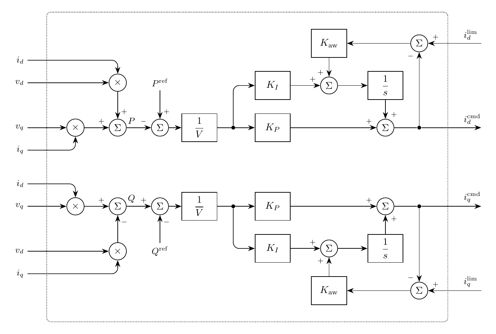

# OuterPowerControl Model

`OuterPowerControl` regulates measured terminal active and reactive power in
power-invariant $dq$ coordinates. Its PI controller supplies a current command
to [InnerCurrentControl](../InnerCurrentControl/README.md).

## Block Diagram



Figure 1: OuterPowerControl model

## Model Parameters

Symbol | Units | JSON | Description | Note
------ | ----- | ---- | ----------- | ----
$I$ | [A] | `I` | Nominal phase RMS current | Optional, positive; absolute-tolerance scale
$V$ | [V] | `V` | Rated line-to-line RMS voltage | Required, positive
$K_P$ | [-] | `Kp` | Proportional gain | Required, positive
$K_I$ | [$\mathrm{s}^{-1}$] | `Ki` | Integral gain | Required, positive
$K_{\mathrm{aw}}$ | [$\mathrm{s}^{-1}$] | `Kaw` | Tracking anti-windup gain | Required, positive

### Parameter Validation

All parameters must be finite. The voltage rating and gains must be positive;
Power-reference inputs may be positive, zero, or negative.

### Derived Parameters

None.

## Model Ports

Symbol | Port | Type | Units | Description | Note
------ | ---- | ---- | ----- | ----------- | ----
$P^{\mathrm{ref}}$ | `Pref` | Input | [W] | Active-power reference | Required
$Q^{\mathrm{ref}}$ | `Qref` | Input | [var] | Reactive-power reference | Required
$\mathbf{v}$ | `v` | Input | [V] | Terminal voltage | $\mathbf{v} \in \mathbb{R}^2$
$\mathbf{i}$ | `i` | Input | [A] | Terminal current | $\mathbf{i} \in \mathbb{R}^2$
$\mathbf{i}^{\mathrm{lim}}$ | `ilim` | Input | [A] | Limited current command | From InnerCurrentControl
$\mathbf{i}^{\mathrm{cmd}}$ | `icmd` | Output | [A] | Inverter-side current command | $\mathbf{i}^{\mathrm{cmd}} \in \mathbb{R}^2$

All vectors use $(d,q)$ order in the same power-invariant
[Park](../../../Operators/Reference/Park/README.md) frame. Measure voltage and
injected current at the same terminal: Bus voltage and Filter `ig` for an LCL
filter. All inputs must be connected and finite.

Connect `icmd` to InnerCurrentControl and return its `ilim` output for
tracking anti-windup.

## Submodels

None.

### Submodel Validation

None.

## Model Variables

### Internal Variables

#### Differential

Symbol | Units | Description | Note
------ | ----- | ----------- | ----
$\boldsymbol{\eta}$ | [A] | Integral contribution | $\boldsymbol{\eta} \in \mathbb{R}^2$

#### Algebraic

Symbol | Units | Description | Note
------ | ----- | ----------- | ----
$\mathbf{i}^{\mathrm{cmd}}$ | [A] | Inverter-side current command | $\mathbf{i}^{\mathrm{cmd}} \in \mathbb{R}^2$

### External Variables

#### Differential

The connected terminal voltage and current variables may be differential.

#### Algebraic

Symbol | Units | Description | Note
------ | ----- | ----------- | ----
$\mathbf{v}$ | [V] | Terminal voltage | When algebraic
$\mathbf{i}$ | [A] | Terminal current | When algebraic
$\mathbf{i}^{\mathrm{lim}}$ | [A] | Limited current command |

## Model Equations

The terminal powers are

```math
P=v_di_d+v_qi_q,\qquad Q=v_qi_d-v_di_q.
```

The power error normalized by rated voltage is

```math
\mathbf{e}=\frac{1}{V}
\begin{bmatrix}P^{\mathrm{ref}}-P\\Q-Q^{\mathrm{ref}}\end{bmatrix}.
```

### Internal Equations

#### Differential

```math
0 = -\dfrac{\mathrm{d}\boldsymbol{\eta}}{\mathrm{d}t}
    + K_I\mathbf{e}
    + K_{\mathrm{aw}}(\mathbf{i}^{\mathrm{lim}}-\mathbf{i}^{\mathrm{cmd}})
```

#### Algebraic

```math
0 = \mathbf{i}^{\mathrm{cmd}}-K_P\mathbf{e}-\boldsymbol{\eta}
```

### External Equations

None.

## Initialization

[Balanced initialization](../../../STATE.md#application) receives the current
command requested by the inner controller and supplies measured terminal power
as the required `Pref` and `Qref` inputs. Existing reference values must agree. The integral contribution follows from the resolved outputs:

```math
\boldsymbol{\eta} \leftarrow \mathbf{i}^{\mathrm{cmd}}-K_P\mathbf{e}.
```

Without an initialization frequency, omitted `icmdd`, `icmdq` default to
$K_P\mathbf{e}$, giving zero integral contribution. The integral states `etad`
and `etaq` cannot be prescribed. Their derivatives start at zero; consistent
initialization preserves the integrals and resolves derivatives and algebraic
commands.

## Monitors

Monitor | Units | Description | Note
------- | ----- | ----------- | ----
`eta` | [A] | Integral contribution | $\boldsymbol{\eta} \in \mathbb{R}^2$
`icmd` | [A] | Inverter-side current command | $\mathbf{i}^{\mathrm{cmd}} \in \mathbb{R}^2$

See [case connections](../../../INPUT_FORMAT.md#case-connections) for vector
ports and monitor expansion.
