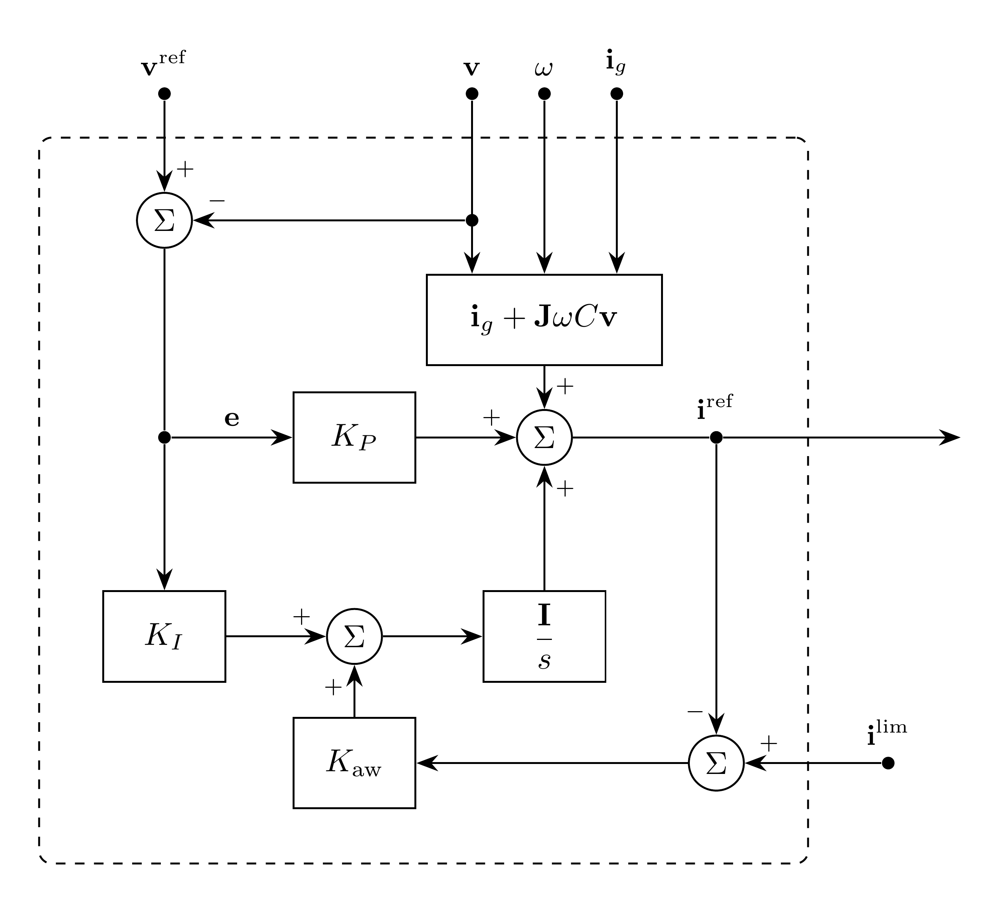

# OuterVoltageControl Model

`OuterVoltageControl` regulates filter-capacitor voltage in power-invariant
$dq$ coordinates using PI control, grid-current feedforward, and cross-coupling
compensation.[^unifi] It supplies the current command for
[InnerCurrentControl](../InnerCurrentControl/README.md).

## Block Diagram



Figure 1: OuterVoltageControl model

## Model Parameters

Symbol | Units | JSON | Description | Note
------ | ----- | ---- | ----------- | ----
$C$ | [F] | `C` | Filter capacitance | Required, positive
$K_P$ | [S] | `Kp` | Proportional gain | Required, positive
$K_I$ | [S/s] | `Ki` | Integral gain | Required, positive
$K_{\mathrm{aw}}$ | [$\mathrm{s}^{-1}$] | `Kaw` | Tracking anti-windup gain | Required, positive

### Parameter Validation

All parameters must be finite and positive.

### Derived Parameters

The matrix representation of the complex unit is

```math
\mathbf{J} =
\begin{bmatrix}
0 & -1 \\
1 & 0
\end{bmatrix}
```

## Model Ports

Symbol | Port | Type | Units | Description | Note
------ | ---- | ---- | ----- | ----------- | ----
$\mathbf{v}^{\mathrm{ref}}$ | `vref` | Input | [V] | Capacitor-voltage reference | $\mathbf{v}^{\mathrm{ref}} \in \mathbb{R}^2$
$\mathbf{v}$ | `v` | Input | [V] | Filter-capacitor voltage | $\mathbf{v} \in \mathbb{R}^2$
$\mathbf{i}_g$ | `ig` | Input | [A] | Grid-side filter current | $\mathbf{i}_g \in \mathbb{R}^2$
$\omega$ | `omega` | Input | [rad/s] | Electrical angular frequency of the $dq$ frame | Supplied through the frequency signal port
$\mathbf{i}^{\mathrm{lim}}$ | `ilim` | Input | [A] | Limited current command | From InnerCurrentControl
$\mathbf{i}^{\mathrm{cmd}}$ | `icmd` | Output | [A] | Total current command | $\mathbf{i}^{\mathrm{cmd}} \in \mathbb{R}^2$

All vectors use $(d,q)$ order in the same power-invariant
[Park](../../../Operators/Reference/Park/README.md) frame, with zero-sequence
components omitted. All inputs must be connected and finite. In the
[voltage-control example](../../../../../../examples/EMT/CurrentControl/README.md),
[PLL](../../../Operators/Reference/PLL/README.md) supplies the common frame angle
and frequency through signal ports, with
$\mathbf{v}^{\mathrm{ref}}=[V^\star,0]^\mathsf{T}$. For balanced voltage,
$V^\star=V_{\mathrm{LL,rms}}^\star$.

## Submodels

None.

### Submodel Validation

None.

## Model Variables

### Internal Variables

#### Differential

Symbol | Units | Description | Note
------ | ----- | ----------- | ----
$\boldsymbol{\eta}$ | [A] | Integral contribution | $\boldsymbol{\eta} \in \mathbb{R}^2$

#### Algebraic

Symbol | Units | Description | Note
------ | ----- | ----------- | ----
$\mathbf{i}^{\mathrm{cmd}}$ | [A] | Inverter-side current command | $\mathbf{i}^{\mathrm{cmd}} \in \mathbb{R}^2$

### External Variables

#### Differential

Connected voltage, current, and angle-source variables may be differential.

#### Algebraic

Symbol | Units | Description | Note
------ | ----- | ----------- | ----
$\mathbf{v}^{\mathrm{ref}}$ | [V] | Capacitor-voltage reference | $\mathbf{v}^{\mathrm{ref}} \in \mathbb{R}^2$
$\mathbf{v}$ | [V] | Filter-capacitor voltage | $\mathbf{v} \in \mathbb{R}^2$
$\mathbf{i}_g$ | [A] | Grid-side filter current | $\mathbf{i}_g \in \mathbb{R}^2$
$\omega$ | [rad/s] | Electrical angular frequency of the $dq$ frame | Supplied through the frequency signal port
$\mathbf{i}^{\mathrm{lim}}$ | [A] | Limited current command | From InnerCurrentControl

## Model Equations

The voltage error and feedforward current are

```math
\begin{aligned}
\mathbf{e} &= \mathbf{v}^{\mathrm{ref}}-\mathbf{v} \\
\mathbf{b} &= \mathbf{i}_g+\mathbf{J}\omega C\mathbf{v}
\end{aligned}
```

### Internal Equations

#### Differential

```math
0 = -\dfrac{\mathrm{d}\boldsymbol{\eta}}{\mathrm{d}t}
    + K_I\mathbf{e}
    + K_{\mathrm{aw}}(\mathbf{i}^{\mathrm{lim}}-\mathbf{i}^{\mathrm{cmd}})
```

#### Algebraic

```math
0 = \mathbf{i}^{\mathrm{cmd}}-\mathbf{b}-K_P\mathbf{e}-\boldsymbol{\eta}
```

### External Equations

None.

InnerCurrentControl owns the smooth circular current limiter. Tracking its
limited command prevents outer-loop windup. Both command components are owned
algebraic variables.

## Initialization

The initialized inputs define $\mathbf{e}$ and $\mathbf{b}$. The default
current-command outputs are

```math
\mathbf{i}^{\mathrm{cmd}} \leftarrow \mathbf{b}+K_P\mathbf{e}.
```

The state-file keys `icmdd` and `icmdq` replace the respective defaults with
finite output values. The integral contribution is then derived from them:

```math
\boldsymbol{\eta} \leftarrow \mathbf{i}^{\mathrm{cmd}}-\mathbf{b}-K_P\mathbf{e}.
```

Omitted outputs give zero integral contribution, up to roundoff. The integral
states `etad` and `etaq` cannot be prescribed in the state file. Derivatives
start at zero; the consistent-initial-condition solve preserves the integral
states and obtains derivatives and algebraic commands from the connected inputs.

## Monitors

Monitor | Units | Description | Note
------- | ----- | ----------- | ----
`eta` | [A] | Integral contribution | $\boldsymbol{\eta} \in \mathbb{R}^2$
`icmd` | [A] | Total current command | $\mathbf{i}^{\mathrm{cmd}} \in \mathbb{R}^2$

See [case connections](../../../INPUT_FORMAT.md#case-connections) for vector
ports and monitor expansion.

[^unifi]: UNIFI Consortium, [*UNIFI's Grid-Forming (GFM) Inverter Reference Design: A Tutorial on Modeling, Control, and Experimental Implementation*](https://docs.nlr.gov/docs/fy25osti/92994.pdf),
    NREL/TP-5D00-92994, July 2025, Section 2.2, equation (6), and Figure 2.
