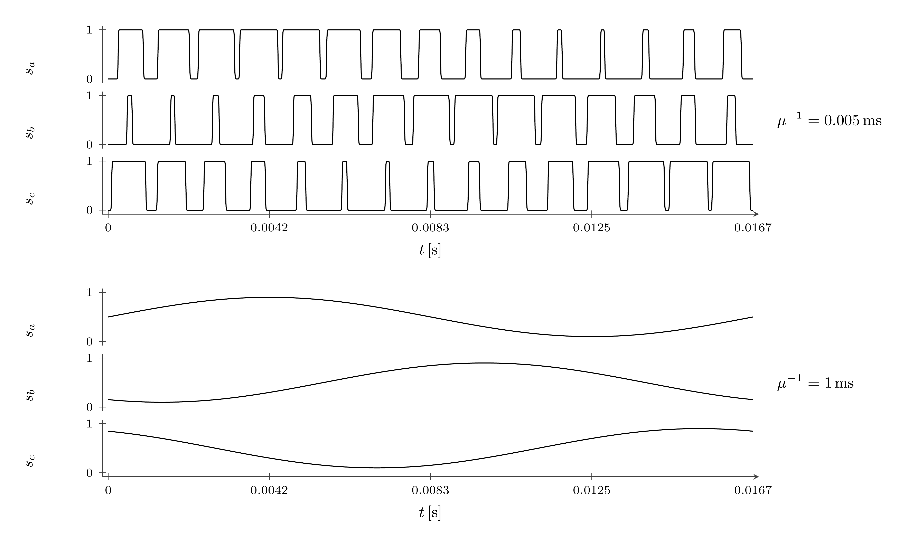

# PWM Model

`PWM` maps a converter voltage command to a three-phase switching signal.
Without inputs, it generates sinusoidal PWM.

## Block Diagram


Figure 1: PWM model with voltage inputs

## Model Parameters

Symbol | Units | JSON | Description | Note
------ | ----- | ---- | ----------- | ----
$M$ | [-] | `M` | Modulation index | Required without inputs
$f_\mathrm{m}$ | [Hz] | `fm` | Modulation frequency | Required without inputs
$f_\mathrm{c}$ | [Hz] | `fc` | Carrier frequency | Required
$\alpha$ | [-] | `alignment` | Pulse alignment | Default $\frac{1}{2}$
$M^{\max}$ | [-] | `Mmax` | Modulation limit with voltage inputs | Default $1$

### Parameter Validation

All parameters and derived coefficients must be finite.

```math
\begin{aligned}
f_\mathrm{c} &> 0 \\
0 &\le \alpha \le 1 \\
0 &< M^{\max} \le 1
\end{aligned}
```

Without inputs, $0\le M\le1$ and $f_\mathrm{c}>f_\mathrm{m}>0$.

### Derived Parameters

```math
\begin{aligned}
T_\mathrm{c} &= \dfrac{1}{f_\mathrm{c}} \\
a_u &= \dfrac{8}{3(M^{\max})^2} \\
\boldsymbol{\phi} &=[0,-2\pi/3,2\pi/3]^\mathsf{T}
\end{aligned}
```

The phase offsets use $(a,b,c)$ order. Without inputs,
$\omega_\mathrm{m}=2\pi f_\mathrm{m}$.

## Model Ports

Symbol | Port | Type | Units | Description | Note
------ | ---- | ---- | ----- | ----------- | ----
$\mathbf{u}^{\mathrm{cmd}}$ | `u` | Input | [V] | Converter voltage command | Optional, $\mathbf{u}^{\mathrm{cmd}} \in \mathbb{R}^2$
$v_\mathrm{dc}$ | `vdc` | Input | [V] | DC voltage | With `u`, $v_\mathrm{dc}\ge0$
$\theta$ | `theta` | Input | [rad] | Electrical reference angle | With `u`
$\mathbf{s}$ | `s` | Output | [-] | Switching function | $\mathbf{s} \in [0,1]^3$
$\mathbf{u}^{\mathrm{lim}}$ | `ulim` | Output | [V] | Limited voltage command | With `u`, $\mathbf{u}^{\mathrm{lim}} \in \mathbb{R}^2$

Connect all three inputs together. Voltage commands use power-invariant
$(d,q)$ coordinates; $\theta$ locates the d-axis relative to phase a.

## Submodels

None.

### Submodel Validation

None.

## Model Variables

### Internal Variables

#### Differential

None.

#### Algebraic

None.

### External Variables

#### Differential

Symbol | Units | Description | Note
------ | ----- | ----------- | ----
$v_\mathrm{dc}$ | [V] | DC voltage | When differential
$\theta$ | [rad] | Electrical reference angle | When differential

#### Algebraic

Symbol | Units | Description | Note
------ | ----- | ----------- | ----
$\mathbf{u}^{\mathrm{cmd}}$ | [V] | Converter voltage command | $\mathbf{u}^{\mathrm{cmd}} \in \mathbb{R}^2$

External-variable classification follows the connected producers.

## Model Equations

With voltage inputs, using the smooth
[maximum](../../../../../CommonMath.md#maximum),

```math
\begin{aligned}
\mathcal{L}_u &= \max\left(v_\mathrm{dc}^2,a_u\|\mathbf{u}^{\mathrm{cmd}}\|_2^2\right) \\
\mathbf{m}_{dq} = \begin{bmatrix}m_d & m_q\end{bmatrix}^\mathsf{T}
  &= \dfrac{2\mathbf{u}^{\mathrm{cmd}}}{\sqrt{\mathcal{L}_u}} \\
m_\ell &= \sqrt{\dfrac{2}{3}}
  \left[m_d\cos(\theta+\phi_\ell)-m_q\sin(\theta+\phi_\ell)\right]
\end{aligned}
```

Without inputs, $m_\ell=M\sin(\omega_\mathrm{m}t+\phi_\ell)$.
For $\ell\in\{a,b,c\}$,

```math
d_\ell=\dfrac{1+m_\ell}{2}
```

The periodic switching function uses the
[sigmoid](../../../../../CommonMath.md#logistic-function) $\sigma$:

```math
\begin{aligned}
a_k(d) &= [k+\alpha(1-d)]T_\mathrm{c} \\
b_k(d) &= [k+\alpha+(1-\alpha)d]T_\mathrm{c} \\
S_\mu(t,d) &= \sum_{k\in\mathbb{Z}}
  \left[\sigma(t-a_k(d))-\sigma(t-b_k(d))\right]
\end{aligned}
```

Every pulse uses the instantaneous duty; there is no sample-and-hold.
The shared sharpness $\mu>0$ gives an isolated-edge width
$\Delta t_{10\text{–}90}=2\ln(9)/\mu$.

### Internal Equations

#### Differential

None.

#### Algebraic

None.

### External Equations

```math
\begin{aligned}
s_\ell &\leftarrow S_\mu(t,d_\ell), \qquad \ell\in\{a,b,c\} \\
\mathbf{u}^{\mathrm{lim}} &\leftarrow
  \dfrac{v_\mathrm{dc}\mathbf{u}^{\mathrm{cmd}}}{\sqrt{\mathcal{L}_u}}
\end{aligned}
```

The limited-voltage output requires voltage inputs.

## Initialization

None beyond the EMT initialization contract.

## Monitors

Monitor | Units | Description | Note
------- | ----- | ----------- | ----
`s` | [-] | Switching function | $\mathbf{s} \in [0,1]^3$
`m` | [-] | Phase modulation command | $\mathbf{m} \in \mathbb{R}^3$
`ulim` | [V] | Limited voltage command | $\mathbf{u}^{\mathrm{lim}} \in \mathbb{R}^2$, requires `u`

## Development

For fixed duty $d\in[0,1]$, periodic summation preserves the carrier mean:

```math
\begin{aligned}
\dfrac{1}{T_\mathrm{c}}\int_0^{T_\mathrm{c}}S_\mu(t,d)\,\mathrm{d}t
&=\dfrac{1}{T_\mathrm{c}}\int_{-\infty}^{\infty}
  [\sigma(t-a_0(d))-\sigma(t-b_0(d))]\,\mathrm{d}t \\
&=\dfrac{b_0(d)-a_0(d)}{T_\mathrm{c}}=d
\end{aligned}
```

Small $\mu T_\mathrm{c}$ approaches instantaneous duty; large $\mu T_\mathrm{c}$
resolves switching. The exact mean applies to fixed duty, not a changing command.



Figure 2: Centered PWM for $M=0.8$, $f_\mathrm{m}=60\,\mathrm{Hz}$, and
$f_\mathrm{c}=900\,\mathrm{Hz}$ at $\mu^{-1}=0.005\,\mathrm{ms}$ and $1\,\mathrm{ms}$
