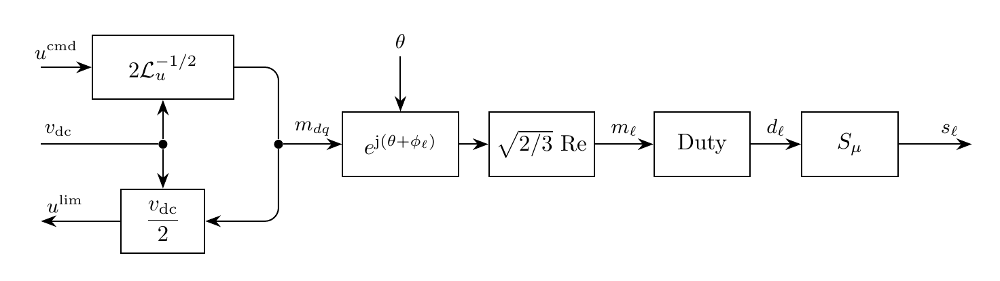

# PWM Model

`PWM` produces a three-phase sinusoidal PWM switching signal. The model adds no
DAE variables or residual rows.

## Block Diagram



Figure 1: Centered PWM switching signal for $M=0.8$, $f_{\mathrm{m}}=60\,\mathrm{Hz}$, and $f_{\mathrm{c}}=900\,\mathrm{Hz}$ at $\mu=240$ and $\mu=1$

## Model Parameters

Symbol | Units | JSON | Description | Note
------ | ----- | ---- | ----------- | ----
$M$ | [-] | `M` | Modulation index | Required, $M \in [0,1]$
$f_{\mathrm{m}}$ | [Hz] | `fm` | Modulation frequency | Required, positive
$f_{\mathrm{c}}$ | [Hz] | `fc` | Carrier frequency | Required, $f_{\mathrm{c}}>f_{\mathrm{m}}$
$\alpha$ | [-] | `alignment` | Pulse alignment | Default $\frac{1}{2}$

### Parameter Validation

```math
\begin{aligned}
0 &\le M \le 1 \\
f_{\mathrm{c}} &> f_{\mathrm{m}} > 0 \\
\dfrac{f_{\mathrm{c}}}{f_{\mathrm{m}}} &\in 3\mathbb{N} \\
0 &\le \alpha \le 1
\end{aligned}
```

### Derived Parameters

```math
\begin{aligned}
\omega_{\mathrm{m}} &:= 2\pi f_{\mathrm{m}} \\
\omega_{\mathrm{c}} &:= 2\pi f_{\mathrm{c}} \\
T_{\mathrm{c}} &:= \dfrac{2\pi}{\omega_{\mathrm{c}}}
                   = \dfrac{1}{f_{\mathrm{c}}} \\
\boldsymbol{\phi}
&:=
\begin{bmatrix}
\phi_a & \phi_b & \phi_c
\end{bmatrix}^{\mathsf T}
=
\begin{bmatrix}
0 & -\dfrac{2\pi}{3} & \dfrac{2\pi}{3}
\end{bmatrix}^{\mathsf T}
\end{aligned}
```

For phase $\ell\in\{a,b,c\}$ and carrier interval $k\in\mathbb{Z}$, the
carrier reference time, sampled modulation signal, and full duty ratio are

```math
\begin{aligned}
t_k &:= \left(k+\alpha\right)T_{\mathrm{c}} \\
m_{\ell,k} &:= M\sin\left(\omega_{\mathrm{m}}t_k+\phi_\ell\right) \\
d_{\ell,k} &:= \dfrac{1+m_{\ell,k}}{2}.
\end{aligned}
```

The switching function uses the GridKit
[`sigmoid`](../../../../../CommonMath.md#primitives) with shared sharpness
$\mu>0$.

## Model Ports

Symbol | Port | Type | Units | Description | Note
------ | ---- | ---- | ----- | ----------- | ----
$\mathbf{s}$ | `s` | Output | [-] | Three-phase switching function | $\mathbf{s} \in [0,1]^3$

## Submodels

None.

### Submodel Validation

None.

## Model Variables

### Internal Variables

#### Differential

None.

#### Algebraic

None.

### External Variables

#### Differential

None.

#### Algebraic

None.

## Model Equations

### Internal Equations

#### Differential

None.

#### Algebraic

None.

### External Equations

```math
s_\ell(t)
\leftarrow
\sum_{k\in\mathbb{Z}}
\left[
  \sigma\left(\dfrac{t-t_k}{T_{\mathrm{c}}}
                     +\alpha d_{\ell,k}\right)
  -\sigma\left(\dfrac{t-t_k}{T_{\mathrm{c}}}
                     -(1-\alpha)d_{\ell,k}\right)
\right],
\qquad
\ell\in\{a,b,c\}.
```

## Initialization

None beyond the EMT initialization contract.

## Monitors

Monitor | Units | Description | Note
------- | ----- | ----------- | ----
`s` | [-] | Three-phase switching function | $\mathbf{s} \in [0,1]^3$
