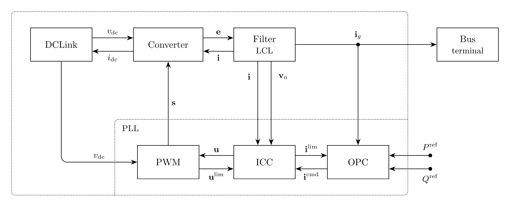
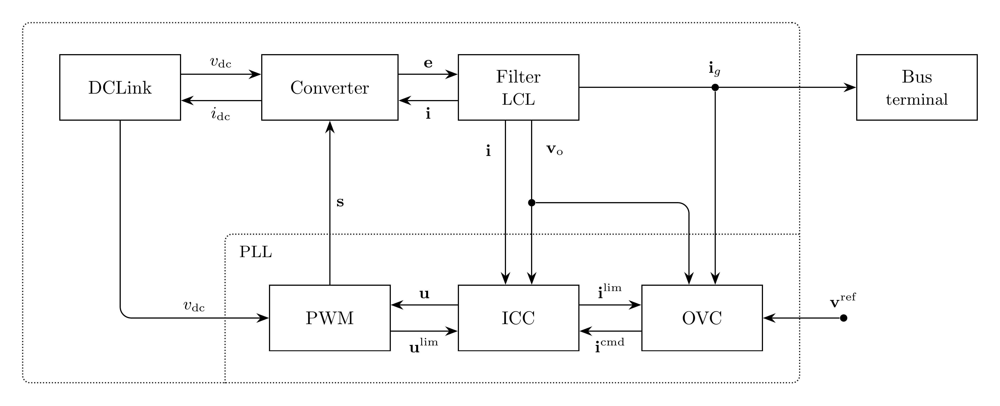

# Controller Models

EMT controller models exchange signals with other components. In the switching
inverter examples, PLL supplies angle to the Park operators and frequency to
the controllers through signal ports.

Arrows indicate signal flow. The converter current $\mathbf{i}$ is positive
out of the bridge; $i_{\mathrm{dc}}$ is positive into the bridge. The converter
receives $\mathbf{i}$ from the Filter and supplies $i_{\mathrm{dc}}$ to DCLink.
The forward power-invariant Park transforms are implicit at the boundary of
the $dq$ controller region; PWM applies the inverse transform internally.

Symbol | Producer | Consumer | Coordinates
------ | -------- | -------- | -----------
$\mathbf{e}$ | `Converter.e` | `Filter.e` | $abc$
$\mathbf{v}_{\mathrm{o}}$ | `Filter.vo` | PLL and voltage Park inputs | $abc$
$\mathbf{i}$ | `Filter.i` | `Converter.i` and current Park input | $abc$
$\mathbf{i}_g$ | `Filter.ig` | Terminal Bus and grid-current Park input | $abc$
$v_{\mathrm{dc}}$ | `DCLink.vdc` | Converter and PWM | Scalar
$i_{\mathrm{dc}}$ | `Converter.idc` | `DCLink.idc` | Scalar

The current and voltage controllers retain their local voltage-input name
`v`: it receives the $dq$ components of transformed $\mathbf{v}_{\mathrm{o}}$.
`Filter.v` is the separate $abc$ voltage input from the terminal Bus.

## Grid Following

## GFM Voltage Control

## Models

- [InnerCurrentControl](InnerCurrentControl/README.md): converter current control in $dq$ coordinates.
- [OuterPowerControl](OuterPowerControl/README.md): active and reactive power control in $dq$ coordinates.
- [OuterVoltageControl](OuterVoltageControl/README.md): filter-capacitor voltage control in $dq$ coordinates.
- [DC Link](DCLink/README.md): capacitor voltage and current balance.
- [IEEET1](IEEET1/README.md)
- [PWM](PWM/README.md)
- [TGOV1](TGOV1/README.md)
- [SEXS-PTI](SEXS-PTI/README.md): simplified excitation system.
- [GASTPTI](GASTPTI/README.md): gas turbine governor with exhaust-temperature limiting.
- [IEEEST](IEEEST/README.md): power system stabilizer.
