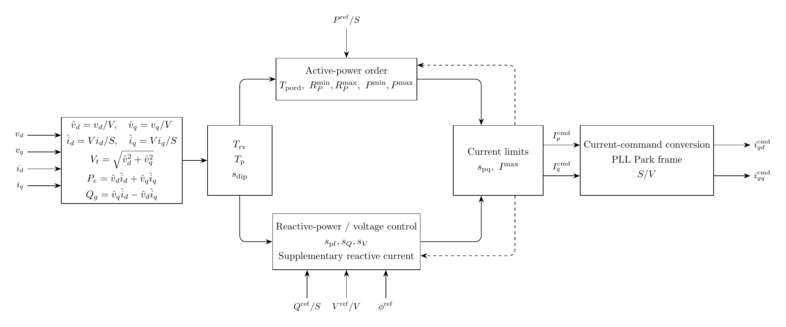

# REECB Model

`Reecb` implements the source renewable electrical controller with terminal
measurements and current commands in a common power-invariant Park frame.
It retains the [PhasorDynamics REECB](../../../../PhasorDynamics/Controller/REECB/README.md)
control equations, selectors, and smooth limits. The electrical network, PLL,
and inner current regulator remain separate models.

## Block Diagram



Figure 1: REECB signal paths. The equations below define the selector modes and limits.

## Model Parameters

Symbol | Units | JSON | Description | Default | Note
------ | ----- | ---- | ----------- | ------- | ----
$S$ | [VA] | `S` | Rated apparent power | — | Required, positive
$V$ | [V] | `V` | Rated line-to-line RMS voltage | — | Required, positive
$s_\mathrm{pf}$ | [boolean] | `PfFlag` | Power-factor control selector | `false` | `true` = power-factor control, `false` = reactive-power control
$s_V$ | [boolean] | `VFlag` | Voltage-reference selector under $s_Q=1$ | `false` | `true` = cascaded Q-PI voltage command, `false` = direct external voltage reference
$s_Q$ | [boolean] | `QFlag` | Reactive-path selector | `false` | `true` = Volt/VAr PI control, `false` = reactive-current lag
$s_\mathrm{pq}$ | [boolean] | `Pqflag` | Converter current-priority selector | `false` | `true` = P priority, `false` = Q priority
$T_\mathrm{rv}$ | [s] | `Trv` | Voltage-measurement filter time constant | 0.02 |
$T_\mathrm{p}$ | [s] | `Tp` | Electrical-power measurement filter time constant | 0.0 |
$V_0^{\mathrm{ref}}$ | [p.u.] | `Vref0` | Reactive-current-injection voltage reference | $V_t$ | Initialized from terminal voltage when omitted
$V_\mathrm{dip}$ | [p.u.] | `Vdip` | Low-voltage threshold for the voltage-band gate | 0.85 |
$V_\mathrm{up}$ | [p.u.] | `Vup` | High-voltage threshold for the voltage-band gate | 1.15 |
$D_1^\mathrm{db}$ | [p.u.] | `dbd1` | Lower deadband threshold for voltage-error response | 0.0 |
$D_2^\mathrm{db}$ | [p.u.] | `dbd2` | Upper deadband threshold for voltage-error response | 0.0 |
$K_\mathrm{qv}$ | [p.u.] | `kqv` | Reactive-current injection gain | 5.0 |
$I_{q,\mathrm{inj}}^{\min}$ | [p.u.] | `Iql1` | Minimum reactive-current injection | -1.1 |
$I_{q,\mathrm{inj}}^{\max}$ | [p.u.] | `Iqh1` | Maximum reactive-current injection | 1.1 |
$Q^{\max}$ | [p.u.] | `Qmax` | Maximum reactive-power control output | 0.436 |
$Q^{\min}$ | [p.u.] | `Qmin` | Minimum reactive-power control output | -0.436 |
$K_\mathrm{qp}$ | [p.u.] | `Kqp` | Reactive-power controller proportional gain | 0.0 |
$K_\mathrm{qi}$ | [p.u./s] | `Kqi` | Reactive-power controller integral gain | 0.1 |
$V^{\max}$ | [p.u.] | `Vmax` | Maximum voltage-control output | 1.1 |
$V^{\min}$ | [p.u.] | `Vmin` | Minimum voltage-control output | 0.9 |
$K_\mathrm{vp}$ | [p.u.] | `Kvp` | Voltage controller proportional gain | 18.0 |
$K_\mathrm{vi}$ | [p.u./s] | `Kvi` | Voltage controller integral gain | 5.0 |
$T_\mathrm{iq}$ | [s] | `Tiq` | Reactive-current command lag time constant | 0.02 |
$T_\mathrm{pord}$ | [s] | `Tpord` | Active-power order filter time constant | 0.02 |
$R_P^{\max}$ | [p.u./s] | `dPmax` | Positive active-power order ramp-rate limit | 99.0 |
$R_P^{\min}$ | [p.u./s] | `dPmin` | Negative active-power order ramp-rate limit | -99.0 |
$P^{\max}$ | [p.u.] | `Pmax` | Maximum active-power order | 1.0 |
$P^{\min}$ | [p.u.] | `Pmin` | Minimum active-power order | 0.0 |
$I^{\max}$ | [p.u.] | `Imax` | Maximum terminal-current command | 1.3 |

Power and current parameters use bases $S$ and $S/V$, respectively. Voltage
parameters use $V$. Explicit lags `Trv`, `Tp`, `Tiq`, and `Tpord` have the same
1 ms floor as the phasor model.

### Parameter Validation

All parameters must be finite. Ratings and `Imax` are positive; gains and
supplied time constants are nonnegative. Lower limits must not exceed upper
limits; `Vdip < Vup`, `dbd1 <= 0 <= dbd2`, and `dPmin < 0 < dPmax` are required.

### Derived Parameters

Each Boolean selector becomes a zero-or-one scalar. Define
$s_{Q\mathrm{PI}}=s_Qs_V$, $s_{V\mathrm{ref}}=s_Q(1-s_V)$,
and $s_{Q\mathrm{ref}}=1-s_{V\mathrm{ref}}$.

## Model Ports

Symbol | Port | Type | Units | Description | Note
------ | ---- | ---- | ----- | ----------- | ----
$\mathbf v$ | `v` | Input | [V] | Terminal Bus voltage | Required, $(d,q)$
$\mathbf i_g$ | `i` | Input | [A] | Current injected at that Bus | Required, $(d,q)$
$P^{\mathrm{ref}}$ | `Pref` | Input | [W] | Active-power reference | Optional
$Q^{\mathrm{ref}}$ | `Qref` | Input | [var] | Reactive-power reference | Optional; from REPCA `qext`
$V^{\mathrm{ref}}$ | `Vref` | Input | [V] | Direct terminal-voltage reference | Optional; $s_Q=1$, $s_V=0$
$\phi^{\mathrm{ref}}$ | `pfaref` | Input | [rad] | Power-factor angle reference | Optional; $s_\mathrm{pf}=1$
$\mathbf i_g^{\mathrm{cmd}}$ | `icmd` | Output | [A] | Terminal-current command | $(d,q)$

Vector ports expand to `vd/vq`, `id/iq`, and `icmdd/icmdq`. All vectors use the
same [Park](../../../Operators/Reference/Park/README.md) frame. References
have fixed units: the source phasor `qext` maps to `Qref` in power modes and
`Vref` in direct-voltage mode. `pfaref` is a signed angle, not a power factor.
For positive active power, positive $\phi^{\mathrm{ref}}$ requests positive
reactive injection. Unconnected active references are initialized and latched.

For an LCL filter, `icmd` commands its grid-side current. The inner regulator
must account for capacitor current when forming its converter-current command.

## Submodels

None.

### Submodel Validation

None.

## Model Variables

### Internal Variables

Internal control variables use the component per-unit bases; the output
$\mathbf i_g^{\mathrm{cmd}}$ is in amperes.

#### Differential

Symbol | Units | Description | Note
------ | ----- | ----------- | ----
$V^{\mathrm{meas}}$ | [p.u.] | Filtered terminal voltage |
$P^{\mathrm{meas}}$ | [p.u.] | Filtered terminal active power |
$x_Q^{\mathrm{PI}}$ | [p.u.] | Reactive-power integral contribution |
$x_V^{\mathrm{PI}}$ | [p.u.] | Voltage integral contribution |
$Q_V$ | [p.u.] | Reactive-current lag state |
$P^{\mathrm{ord}}$ | [p.u.] | Active-power order |

#### Algebraic

Symbol | Units | Description | Note
------ | ----- | ----------- | ----
$V_t$, $V^{\mathrm{safe}}$ | [p.u.] | Terminal magnitude and guarded filtered magnitude |
$s_{\mathrm{dip}}$ | [-] | Voltage-band enable gate |
$I_q^{\mathrm{inj}}$ | [p.u.] | Supplementary reactive-current command |
$Q_c^{\mathrm{ref}}$, $e_Q$ | [p.u.] | Selected reactive reference and error |
$V_Q^{\mathrm{PI}}$, $e_V^{\mathrm{PI}}$ | [p.u.] | Q-loop voltage command and voltage error |
$r_P^{\mathrm{ord}}$ | [p.u./s] | Limited active-order rate |
$I_L^{\mathrm{cap}}$, $I_q^{\max}$, $I_p^{\max}$ | [p.u.] | Off-axis capacity and current limits |
$I_q^{\mathrm{base}}$, $I_q^{\mathrm{raw}}$ | [p.u.] | Voltage-loop and pre-limit reactive commands |
$I_q^{\mathrm{cmd}}$, $I_p^{\mathrm{cmd}}$ | [p.u.] | Reactive and active current commands | PLL-aligned axes
$\mathbf i_g^{\mathrm{cmd}}$ | [A] | Terminal-current command | Shared Park frame

### External Variables

#### Differential

Connected measurement and reference signals may be differential.

#### Algebraic

The voltage, current, and reference inputs listed under Model Ports.

## Model Equations

Normalize the terminal measurements and form power:

```math
\begin{aligned}
\hat{\mathbf v}&=\mathbf v/V,&\hat{\mathbf i}_g&=V\mathbf i_g/S,\\
P_e&=\hat v_d\hat i_{gd}+\hat v_q\hat i_{gq},&
Q_g&=\hat v_q\hat i_{gd}-\hat v_d\hat i_{gq}.
\end{aligned}
```

Define $a_Q=K_{\mathrm{qp}}e_Q+x_Q^{\mathrm{PI}}$,
$a_V=K_{\mathrm{vp}}e_V^{\mathrm{PI}}+x_V^{\mathrm{PI}}$, and
$e_V^{\mathrm{db}}=\mathrm{deadband2}(V_0^{\mathrm{ref}}-V^{\mathrm{meas}};D_1^{\mathrm{db}},D_2^{\mathrm{db}})$.
The clamp, gate, and anti-windup functions use [CommonMath](../../../../../CommonMath.md).
The moving-band anti-windup, asymmetric slew limiter, and smooth current-circle
root are identical to the source REECB functions.

### Internal Equations

#### Differential

```math
\begin{aligned}
0&=-\dot V^{\mathrm{meas}}+(V_t-V^{\mathrm{meas}})/T_{\mathrm{rv}},\\
0&=-\dot P^{\mathrm{meas}}+(P_e-P^{\mathrm{meas}})/T_{\mathrm p},\\
0&=-\dot x_Q^{\mathrm{PI}}+s_{Q\mathrm{PI}}s_{\mathrm{dip}}
  \mathrm{antiwindup}(a_Q,K_{\mathrm{qi}}e_Q;V^{\min},V^{\max}),\\
0&=-\dot x_V^{\mathrm{PI}}+s_Qs_{\mathrm{dip}}
  \mathrm{awband}(a_V,K_{\mathrm{vi}}e_V^{\mathrm{PI}},I_q^{\max}),\\
0&=-\dot Q_V+(1-s_Q)s_{\mathrm{dip}}(Q_c^{\mathrm{ref}}/V^{\mathrm{safe}}-Q_V)/T_{\mathrm{iq}},\\
0&=-\dot P^{\mathrm{ord}}+s_{\mathrm{dip}}
  \mathrm{antiwindup}(P^{\mathrm{ord}},r_P^{\mathrm{ord}};P^{\min},P^{\max}).
\end{aligned}
```

#### Algebraic

```math
\begin{aligned}
0&=-V_t^2+\hat v_d^2+\hat v_q^2,\\
0&=-V^{\mathrm{safe}}+\max(V^{\mathrm{meas}},0.01),\\
0&=-s_{\mathrm{dip}}+\mathrm{inside}(V_t;V_{\mathrm{dip}},V_{\mathrm{up}}),\\
0&=-I_q^{\mathrm{inj}}+\mathrm{clamp}(K_{\mathrm{qv}}e_V^{\mathrm{db}};I_{q,\mathrm{inj}}^{\min},I_{q,\mathrm{inj}}^{\max}),\\
0&=-Q_c^{\mathrm{ref}}+s_{Q\mathrm{ref}}
 [s_{\mathrm{pf}}P^{\mathrm{meas}}\tan\phi^{\mathrm{ref}}+(1-s_{\mathrm{pf}})Q^{\mathrm{ref}}/S],\\
0&=-e_Q+\mathrm{clamp}(Q_c^{\mathrm{ref}};Q^{\min},Q^{\max})-Q_g,\\
0&=-V_Q^{\mathrm{PI}}+\mathrm{clamp}(a_Q;V^{\min},V^{\max}),\\
0&=-e_V^{\mathrm{PI}}+s_{Q\mathrm{PI}}V_Q^{\mathrm{PI}}
  +s_{V\mathrm{ref}}V^{\mathrm{ref}}/V-s_QV^{\mathrm{meas}},\\
0&=-r_P^{\mathrm{ord}}+\mathrm{aslew}((P^{\mathrm{ref}}/S-P^{\mathrm{ord}})/T_{\mathrm{pord}};R_P^{\min},R_P^{\max}),\\
0&=-I_L^{\mathrm{cap}}+\mathrm{sqrtramp}((I^{\max})^2-[s_{\mathrm{pq}}I_p^{\mathrm{cmd}}+(1-s_{\mathrm{pq}})I_q^{\mathrm{cmd}}]^2),\\
0&=-I_q^{\max}+s_{\mathrm{pq}}I_L^{\mathrm{cap}}+(1-s_{\mathrm{pq}})I^{\max},\\
0&=-I_p^{\max}+s_{\mathrm{pq}}I^{\max}+(1-s_{\mathrm{pq}})I_L^{\mathrm{cap}},\\
0&=-I_q^{\mathrm{base}}+\mathrm{clamp}(a_V;-I_q^{\max},I_q^{\max}),\\
0&=-I_q^{\mathrm{raw}}+s_QI_q^{\mathrm{base}}+(1-s_Q)Q_V+I_q^{\mathrm{inj}},\\
0&=-I_q^{\mathrm{cmd}}+\mathrm{clamp}(I_q^{\mathrm{raw}};-I_q^{\max},I_q^{\max}),\\
0&=-I_p^{\mathrm{cmd}}+\mathrm{clamp}(P^{\mathrm{ord}}/V^{\mathrm{safe}};0,I_p^{\max}),\\
0&=-\mathbf i_g^{\mathrm{cmd}}+\frac SV
 \begin{bmatrix}I_p^{\mathrm{cmd}}\\-I_q^{\mathrm{cmd}}\end{bmatrix}.
\end{aligned}
```

Positive reactive injection has negative $q$-axis current in the terminal-aligned
PLL frame. The PLL determines the command orientation; instantaneous Bus-voltage
angle is not applied a second time. Power-factor interpretation assumes PLL
alignment, while terminal power feedback uses both measured voltage components.

### External Equations

None.

## Initialization

The `icmdd/icmdq` outputs default to measured terminal current. Their base
conversion and reactive-current sign determine the command operating point.
Source limiter inverses then determine the lag and PI states and the active
references. Omitted `Vref0` follows the initial terminal magnitude. Source
initialization expands command limits when necessary to include the operating
point and rejects incompatible or nonfinite conditions before changing state.

The existing initialization procedure provides required references to connected
upstream producers; unconnected references are latched locally. The state file
may prescribe only output currents. Differential-state derivatives start at zero.

## Monitors

Monitor | Units | Description | Note
------- | ----- | ----------- | ----
`icmd` | [A] | Terminal-current command | $(d,q)$
`ipcmd`, `iqcmd` | [p.u.] | Active/reactive current commands | Component base
`iqv` | [p.u.] | Supplementary reactive-current command | Component base
`vmeas` | [p.u.] | Filtered terminal voltage |
`pmeas` | [p.u.] | Filtered active power | Component base
