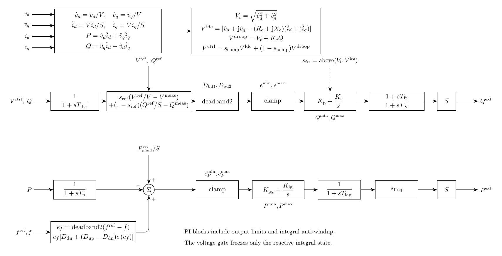

# REPCA Model

`Repca` implements the WECC renewable plant controller with the same control
paths, selectors, and limits as [PhasorDynamics REPCA](../../../../PhasorDynamics/Controller/REPCA/README.md).
Its terminal measurements and power commands use SI units; controller states
and control parameters use the plant per-unit base.

## Block Diagram



Figure 1: REPCA model

## Model Parameters

Symbol | Units | JSON | Description | Note
------ | ----- | ---- | ----------- | ----
$S$ | [VA] | `S` | Rated apparent power | Required, positive
$s_\mathrm{comp}$ | [boolean] | `VcompFlag` | Voltage-compensation selector | Default `true`. `true` = line-drop compensation, `false` = reactive droop
$s_\mathrm{ref}$ | [boolean] | `RefFlag` | Reactive-loop reference selector | Default `true`. `true` = voltage control, `false` = reactive-power control
$s_\mathrm{freq}$ | [boolean] | `Freqflag` | Active-power output selector | Default `false`. `true` = command enabled, `false` = zero output
$T_\mathrm{fltr}$ | [s] | `Tfltr` | Voltage and reactive-power filter time constant | Default 0.05
$V^\mathrm{frz}$ | [p.u.] | `Vfrz` | Reactive-power PI freeze-voltage threshold | Default 0.7
$R_c$ | [p.u.] | `Rc` | Line-drop compensation resistance | Default 0.0. Component base
$X_c$ | [p.u.] | `Xc` | Line-drop compensation reactance | Default 0.0. Component base
$K_c$ | [p.u.] | `Kc` | Reactive-droop coefficient | Default 1.0
$D_\mathrm{bd1}$ | [p.u.] | `dbdlow` | Lower reactive-loop deadband threshold | Default 0.0
$D_\mathrm{bd2}$ | [p.u.] | `dbdupper` | Upper reactive-loop deadband threshold | Default 0.0
$e^{\max}$ | [p.u.] | `emax` | Maximum reactive-loop error limit | Default 1.0
$e^{\min}$ | [p.u.] | `emin` | Minimum reactive-loop error limit | Default -1.0
$K_\mathrm{p}$ | [p.u.] | `Kp` | Reactive-power controller proportional gain | Default 10.0
$K_\mathrm{i}$ | [p.u./s] | `Ki` | Reactive-power controller integral gain | Default 10.0
$Q^{\max}$ | [p.u.] | `Qmax` | Maximum reactive-power command | Default 1.0. Component base
$Q^{\min}$ | [p.u.] | `Qmin` | Minimum reactive-power command | Default -1.0. Component base
$T_\mathrm{ft}$ | [s] | `Tft` | Reactive-command lead time constant | Default 0.0
$T_\mathrm{fv}$ | [s] | `Tfv` | Reactive-command lag time constant | Default 3.0
$T_\mathrm{p}$ | [s] | `Tp` | Active-power measurement filter time constant | Default 0.0
$D_\mathrm{bd1}^{f}$ | [p.u.] | `fdbd1` | Lower frequency-error deadband threshold | Default 0.0
$D_\mathrm{bd2}^{f}$ | [p.u.] | `fdbd2` | Upper frequency-error deadband threshold | Default 0.0
$D_\mathrm{dn}$ | [p.u./p.u.] | `Ddn` | Down-regulation (overfrequency) gain | Default 20.0
$D_\mathrm{up}$ | [p.u./p.u.] | `Dup` | Up-regulation (underfrequency) gain | Default 0.0
$e_P^{\max}$ | [p.u.] | `femax` | Maximum active-power error limit | Default 1.0
$e_P^{\min}$ | [p.u.] | `femin` | Minimum active-power error limit | Default -1.0
$K_\mathrm{pg}$ | [p.u.] | `Kpg` | Active-power controller proportional gain | Default 10.0
$K_\mathrm{ig}$ | [p.u./s] | `Kig` | Active-power controller integral gain | Default 10.0
$P^{\max}$ | [p.u.] | `Pmax` | Maximum active-power command | Default 2.0. Component base
$P^{\min}$ | [p.u.] | `Pmin` | Minimum active-power command | Default 0.0. Component base
$T_\mathrm{lag}$ | [s] | `Tlag` | Active-power command lag time constant | Default 3.0
$V$ | [V] | `V` | Rated line-to-line RMS voltage | Required, positive

### Parameter Validation

All numeric parameters must be finite; `S` and `V` must be positive.
Selectors are Boolean. Time constants and frequency-droop gains are
nonnegative. Deadband and error bounds bracket zero; power bounds are ordered.

### Derived Parameters

The explicit lags `Tfltr`, `Tfv`, `Tp`, and `Tlag` are raised to 0.001 s,
matching PhasorDynamics REPCA. Selector masks are constant model parameters.

## Model Ports

Symbol | Port | Type | Units | Description | Note
------ | ---- | ---- | ----- | ----------- | ----
$v_d,v_q$ | `v` | Input | [V] | Regulated-terminal voltage | Required, two signals
$i_d,i_q$ | `i` | Input | [A] | Current injected at the terminal | Required, two signals
$f$ | `freq` | Input | [p.u.] | Absolute frequency | Optional, defaults to one
$V^{\mathrm{ref}}$ | `vref` | Input | [V] | Regulated-voltage reference | Optional, derived at initialization
$P_{\mathrm{plant}}^{\mathrm{ref}}$ | `pref` | Input | [W] | Plant active-power reference | Optional, derived at initialization
$Q^{\mathrm{ref}}$ | `qref` | Input | [var] | Plant reactive-power reference | Optional, derived at initialization
$f^{\mathrm{ref}}$ | `freqref` | Input | [p.u.] | Absolute frequency reference | Optional, derived at initialization
$Q^{\mathrm{ext}}$ | `qext` | Output | [var] | Reactive-power command | To electrical control
$P^{\mathrm{ext}}$ | `pext` | Output | [W] | Active-power command | Zero when `Freqflag` is false

Voltage and current share the same power-invariant Park frame. An LCL plant
uses terminal Bus voltage and Filter `ig`, not converter-side current.
Attached inputs must have linked sources. Unconnected references are latched
from initialization. Both outputs remain owned algebraic variables when unused.

## Submodels

None.

### Submodel Validation

None.

## Model Variables

### Internal Variables

#### Differential

Symbol | Units | Description | Note
------ | ----- | ----------- | ----
$V^{\mathrm{meas}}$ | [p.u.] | Filtered regulated voltage |
$Q^{\mathrm{meas}}$ | [p.u.] | Filtered reactive power | Plant base
$x_Q^{\mathrm{PI}}$ | [p.u.] | Reactive-power integral state | Plant base
$x_Q^{\mathrm{lag}}$ | [p.u.] | Reactive-command lead-lag state | Plant base
$P^{\mathrm{meas}}$ | [p.u.] | Filtered active power | Plant base
$x_P^{\mathrm{PI}}$ | [p.u.] | Active-power integral state | Plant base
$P^{\mathrm{ref}}$ | [p.u.] | Active-command lag state | Plant base

#### Algebraic

Symbol | Units | Description | Note
------ | ----- | ----------- | ----
$V_t,V^{\mathrm{ldc}},V^{\mathrm{droop}},V^{\mathrm{ctrl}}$ | [p.u.] | Terminal and compensated voltages |
$s_{\mathrm{frz}}$ | [-] | Reactive-integrator voltage gate |
$e_{\mathrm{RQ}},e_{\mathrm{RQ}}^{\mathrm{db}},e_{\mathrm{RQ}}^{\mathrm{lim}}$ | [p.u.] | Reactive-loop errors |
$Q^{\mathrm{PI}}$ | [p.u.] | Limited reactive PI output | Plant base
$e_f,e_P,e_P^{\mathrm{lim}}$ | [p.u.] | Frequency and active-loop errors |
$P^{\mathrm{PI}}$ | [p.u.] | Limited active PI output | Plant base
$Q^{\mathrm{ext}}$ | [var] | Reactive-power command |
$P^{\mathrm{ext}}$ | [W] | Active-power command |

### External Variables

#### Differential

Connected terminal voltage, current, and reference variables may be differential.

#### Algebraic

Connected signal inputs may be algebraic.

## Model Equations

Terminal measurements are converted to the plant base:

```math
\begin{aligned}
\hat v_d&=v_d/V,& \hat v_q&=v_q/V,&
\hat i_d&=Vi_d/S,& \hat i_q&=Vi_q/S,\\
P&=\hat v_d\hat i_d+\hat v_q\hat i_q,&
Q&=\hat v_q\hat i_d-\hat v_d\hat i_q.
\end{aligned}
```

References use $V^{\mathrm{ref}}/V$, $P_{\mathrm{plant}}^{\mathrm{ref}}/S$, and
$Q^{\mathrm{ref}}/S$ internally. The common Park rotation preserves the
line-drop compensation magnitude and measured powers.

### Internal Equations

#### Differential

```math
\begin{aligned}
  0 &= -\dot{V}^\mathrm{meas} + \dfrac{1}{T_\mathrm{fltr}} (V^\mathrm{ctrl} - V^\mathrm{meas}) \\
  0 &= -\dot{Q}^\mathrm{meas} + \dfrac{1}{T_\mathrm{fltr}} (Q - Q^\mathrm{meas}) \\
  0 &= -\dot{x}_Q^\mathrm{PI} + s_\mathrm{frz}\, \text{antiwindup}(Q^\mathrm{PI}, K_\mathrm{i}e_\mathrm{RQ}^\mathrm{lim};\,Q^{\min}, Q^{\max}) \\
  0 &= -\dot{x}_Q^\mathrm{lag} + \dfrac{1}{T_\mathrm{fv}} (Q^\mathrm{PI} - x_Q^\mathrm{lag}) \\
  0 &= -\dot{P}^\mathrm{meas} + \dfrac{1}{T_\mathrm{p}} (P - P^\mathrm{meas}) \\
  0 &= -\dot{x}_P^\mathrm{PI} + \text{antiwindup}(P^\mathrm{PI}, K_\mathrm{ig}e_P^\mathrm{lim};\,P^{\min}, P^{\max}) \\
  0 &= -\dot{P}^\mathrm{ref} + \dfrac{1}{T_\mathrm{lag}} (P^\mathrm{PI} - P^\mathrm{ref}).
\end{aligned}
```

CommonMath defines the [`antiwindup`](../../../../../CommonMath.md#antiwindup)
target and smooth approximation.

#### Algebraic

```math
\begin{aligned}
  0 &= -V_t^2 + \hat v_d^2 + \hat v_q^2 \\
  0 &= -(V^\mathrm{ldc})^2 + (\hat v_d - R_c \hat i_d + X_c \hat i_q)^2 + (\hat v_q - R_c \hat i_q - X_c \hat i_d)^2 \\
  0 &= -V^\mathrm{droop} + V_t + K_c Q \\
  0 &= -V^\mathrm{ctrl} + s_\mathrm{comp}V^\mathrm{ldc} + (1-s_\mathrm{comp})V^\mathrm{droop} \\
  0 &= -s_\mathrm{frz} + \text{above}(V_t;\,V^\mathrm{frz}) \\
  0 &= -e_\mathrm{RQ} + s_\mathrm{ref}(V^\mathrm{ref}/V - V^\mathrm{meas}) + (1-s_\mathrm{ref}) (Q^\mathrm{ref}/S - Q^\mathrm{meas}) \\
  0 &= -e_\mathrm{RQ}^\mathrm{db} + \text{deadband2}(e_\mathrm{RQ};\,D_\mathrm{bd1},D_\mathrm{bd2}) \\
  0 &= -e_\mathrm{RQ}^\mathrm{lim} + \text{clamp}(e_\mathrm{RQ}^\mathrm{db};\,e^{\min},e^{\max}) \\
  0 &= -Q^\mathrm{PI} + \text{clamp}(K_\mathrm{p}e_\mathrm{RQ}^\mathrm{lim}+x_Q^\mathrm{PI};\,Q^{\min},Q^{\max}) \\
  0 &= -T_\mathrm{fv} (Q^\mathrm{ext}/S-x_Q^\mathrm{lag}) + T_\mathrm{ft} (Q^\mathrm{PI}-x_Q^\mathrm{lag}) \\
  0 &= -e_f + \text{deadband2}(f^\mathrm{ref}-f;\,D_\mathrm{bd1}^{f},D_\mathrm{bd2}^{f}) \\
  0 &= -e_P + P_\mathrm{plant}^\mathrm{ref}/S - P^\mathrm{meas} + \text{droop}(e_f;D_\mathrm{dn},D_\mathrm{up}) \\
  0 &= -e_P^\mathrm{lim} + \text{clamp}(e_P;\,e_P^{\min},e_P^{\max}) \\
  0 &= -P^\mathrm{PI} + \text{clamp}(K_\mathrm{pg}e_P^\mathrm{lim}+x_P^\mathrm{PI};\,P^{\min},P^{\max}) \\
  0 &= -P^\mathrm{ext}/S + s_\mathrm{freq}P^\mathrm{ref}.
\end{aligned}
```

CommonMath defines the [derived limiter functions](../../../../../CommonMath.md#derived-functions)
used above.

The asymmetric frequency response is

```math
\mathrm{droop}(e_f;D_{\mathrm{dn}},D_{\mathrm{up}})
=e_f\left[D_{\mathrm{dn}}+(D_{\mathrm{up}}-D_{\mathrm{dn}})\sigma(e_f)\right].
```

### External Equations

None.

## Initialization

[Balanced initialization](../../../STATE.md#application) receives the required
`qext` and, when enabled, `pext`. Omitted commands default to measured terminal
power; disabled `pext` must be zero. The output requirements determine the
lead-lag and PI states. Inverting the same smooth limits used in the residual
determines consistent references, which are published to attached unresolved
inputs with initializable producers or latched locally. Conflicting prescribed references are rejected.

As in PhasorDynamics REPCA, power-command limits expand to include the initial
operating point. Internal states cannot be prescribed through the state file.
All seven state derivatives start at zero.

## Monitors

Monitor | Units | Description | Note
------- | ----- | ----------- | ----
`qext` | [var] | Reactive-power command |
`pext` | [W] | Active-power command |
`vmeas` | [p.u.] | Filtered regulated voltage |
`qmeas` | [p.u.] | Filtered reactive power | Plant base
`pmeas` | [p.u.] | Filtered active power | Plant base
