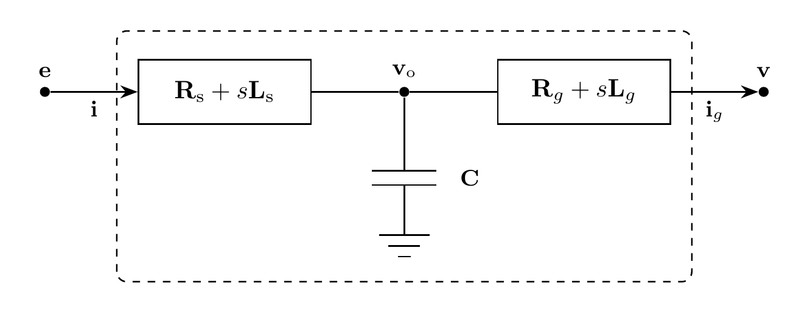

# Filter Model

`Filter` represents a three-phase LCL filter between a converter and a terminal
Bus. Currents are positive from the converter toward the Bus.

## Block Diagram



Figure 1: Filter model

## Model Parameters

Symbol | Units | JSON | Description | Note
------ | ----- | ---- | ----------- | ----
$V$ | [V] | `V` | Nominal line-to-line RMS voltage | Optional, positive; absolute-tolerance scale
$I$ | [A] | `I` | Nominal phase RMS current | Optional, positive; absolute-tolerance scale
$\mathbf{R}_{\mathrm{s}}$ | [$\Omega$] | `Rs` | Converter-side series resistance | $\mathbf{R}_{\mathrm{s}} \in \mathbb{R}^{3\times3}$, default zero
$\mathbf{L}_{\mathrm{s}}$ | [H] | `Ls` | Converter-side series inductance | $\mathbf{L}_{\mathrm{s}} \in \mathbb{R}^{3\times3}$, required
$\mathbf{C}$ | [F] | `C` | Shunt capacitance | $\mathbf{C} \in \mathbb{R}^{3\times3}$, required
$\mathbf{R}_g$ | [$\Omega$] | `Rg` | Grid-side series resistance | $\mathbf{R}_g \in \mathbb{R}^{3\times3}$, default zero
$\mathbf{L}_g$ | [H] | `Lg` | Grid-side series inductance | $\mathbf{L}_g \in \mathbb{R}^{3\times3}$, required

### Parameter Validation

All matrices must be finite and symmetric. Resistance matrices must be positive
semidefinite; inductance and capacitance matrices must be positive definite.

### Derived Parameters

None.

## Model Ports

Symbol | Port | Type | Units | Description | Note
------ | ---- | ---- | ----- | ----------- | ----
$\mathbf{v}$ | `v` | Input | [V] | Terminal Bus voltage | $\mathbf{v} \in \mathbb{R}^3$
$\mathbf{e}$ | `e` | Input | [V] | Converter output voltage | $\mathbf{e} \in \mathbb{R}^3$
$\mathbf{i}$ | `i` | Output | [A] | Converter-side current | $\mathbf{i} \in \mathbb{R}^3$
$\mathbf{v}_{\mathrm{o}}$ | `vo` | Output | [V] | Capacitor voltage | $\mathbf{v}_{\mathrm{o}} \in \mathbb{R}^3$
$\mathbf{i}_g$ | `ig` | Output | [A] | Current injected into the terminal Bus | $\mathbf{i}_g \in \mathbb{R}^3$

Vector ports use phase order `a`, `b`, `c`. Scalar names append the phase letter,
for example `ea`, `voa`, and `iga`. The `bus` input binds the terminal Bus voltage
and registers $\mathbf{i}_g$ as a current injection.

## Submodels

None.

### Submodel Validation

None.

## Model Variables

### Internal Variables

#### Differential

Symbol | Units | Description | Note
------ | ----- | ----------- | ----
$\mathbf{i}$ | [A] | Converter-side inductor current | $\mathbf{i} \in \mathbb{R}^3$
$\mathbf{v}_{\mathrm{o}}$ | [V] | Capacitor voltage | $\mathbf{v}_{\mathrm{o}} \in \mathbb{R}^3$
$\mathbf{i}_g$ | [A] | Grid-side inductor current | $\mathbf{i}_g \in \mathbb{R}^3$

#### Algebraic

None.

### External Variables

#### Differential

When a connected equation depends on the bus-voltage derivative:

Symbol | Units | Description | Note
------ | ----- | ----------- | ----
$\mathbf{v}$ | [V] | Terminal Bus voltage | $\mathbf{v} \in \mathbb{R}^3$

#### Algebraic

Otherwise, $\mathbf{v}$ is algebraic. The converter supplies its voltage as a
signal, which may be computed from other variables.

Symbol | Units | Description | Note
------ | ----- | ----------- | ----
$\mathbf{e}$ | [V] | Converter output voltage | $\mathbf{e} \in \mathbb{R}^3$

## Model Equations

### Internal Equations

#### Differential

```math
\begin{aligned}
0 &= \mathbf{L}_{\mathrm{s}}\dfrac{\mathrm{d}\mathbf{i}}{\mathrm{d}t}
   + \mathbf{R}_{\mathrm{s}}\mathbf{i} + \mathbf{v}_{\mathrm{o}}-\mathbf{e} \\
0 &= \mathbf{C}\dfrac{\mathrm{d}\mathbf{v}_{\mathrm{o}}}{\mathrm{d}t}
   + \mathbf{i}_g-\mathbf{i} \\
0 &= \mathbf{L}_g\dfrac{\mathrm{d}\mathbf{i}_g}{\mathrm{d}t}
   + \mathbf{R}_g\mathbf{i}_g + \mathbf{v}-\mathbf{v}_{\mathrm{o}}
\end{aligned}
```

#### Algebraic

None.

### External Equations

None.

## Initialization

With [balanced initialization](../../STATE.md#application), terminal Bus voltage
and prescribed `iga`, `igb`, `igc` determine the peak phasors

```math
\begin{aligned}
\hat{\mathbf{v}}_{\mathrm{o}} &= \hat{\mathbf{v}}+(\mathbf{R}_g+\mathrm{j}\omega\mathbf{L}_g)\hat{\mathbf{i}}_g,\\
\hat{\mathbf{i}} &= \hat{\mathbf{i}}_g+\mathrm{j}\omega\mathbf{C}\hat{\mathbf{v}}_{\mathrm{o}},\\
\hat{\mathbf{e}} &= \hat{\mathbf{v}}_{\mathrm{o}}+(\mathbf{R}_{\mathrm{s}}+\mathrm{j}\omega\mathbf{L}_{\mathrm{s}})\hat{\mathbf{i}}.
\end{aligned}
```

Filter initializes its currents, capacitor voltage, and sinusoidal derivatives,
and requests the bridge voltage from its source. Additional prescribed outputs
must agree. Without an initialization frequency, omitted outputs default to zero
and consistent initialization determines the derivatives.

## Monitors

Monitor | Units | Description | Note
------- | ----- | ----------- | ----
`i` | [A] | Converter-side current | Expands to `ia`, `ib`, `ic`
`vo` | [V] | Capacitor voltage | Expands to `voa`, `vob`, `voc`
`ig` | [A] | Grid-side current | Expands to `iga`, `igb`, `igc`
