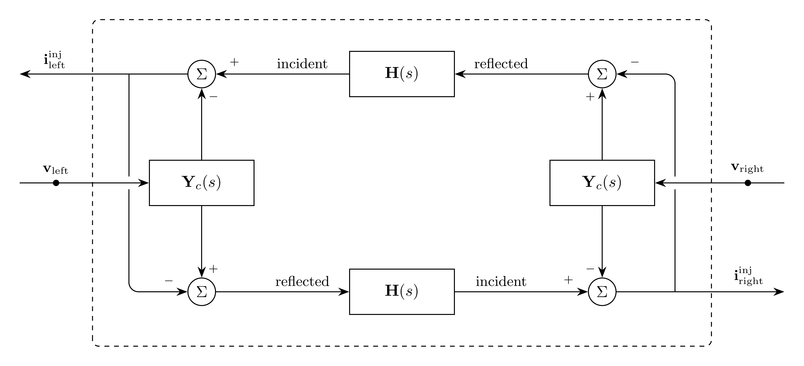

# LineDistributed Model

`LineDistributed` represents a distributed EMT line with
characteristic impedance $\mathbf{Z}_c$ and propagation model $\mathbf{H}$.

## Block Diagram

<div align="center">
   

  Figure 1: LineDistributed model
</div>

## Model Parameters

Symbol            | Units       | JSON         | Description                                            | Note
----------------- | ----------- | ------------ | ------------------------------------------------------ | ----
$\mathbf{P}_\phi$ | [-]         | `conductors` | Permutation matrix mapping each conductor to its phase | $\mathbf{P}_\phi \in \mathbb{R}^{N \times K}$
$\mathbf{z}_c$    | [$\Omega$]  | `Zc`         | Characteristic impedance                              | $\mathbf{z}_c \in \mathbb{R}^{N \times K}$
$\mathbf{h}$      | [-]         | `H`          | Propagation function                                  | $\mathbf{h} \in \mathbb{R}^{K \times K}$

### Parameter Validation

None.

### Model Derived Parameters

The number of phases $N$ and conductors $K$ are the row and column counts of
$\mathbf{P}_\phi$, respectively.

## Model Variables

### Internal Variables

#### Differential

Symbol | Units | Description | Note
------ | ----- | ----------- | ----
$\mathbf{i}^{\mathrm{sh}}_{1}$ | [A] | Shunt current at terminal `1` | $\mathbf{i}^{\mathrm{sh}}_{1} \in \mathbb{R}^K$
$\mathbf{i}^{\mathrm{sh}}_{2}$ | [A] | Shunt current at terminal `2` | $\mathbf{i}^{\mathrm{sh}}_{2} \in \mathbb{R}^K$

#### Algebraic

Symbol | Units | Description | Note
------ | ----- | ----------- | ----
$\mathbf{i}^{\mathrm{inc}}_{1}$ | [A] | Incident current at terminal `1` | $\mathbf{i}^{\mathrm{inc}}_{1} \in \mathbb{R}^K$
$\mathbf{i}^{\mathrm{inc}}_{2}$ | [A] | Incident current at terminal `2` | $\mathbf{i}^{\mathrm{inc}}_{2} \in \mathbb{R}^K$
$\mathbf{i}^{\mathrm{ref}}_{1}$ | [A] | Reflected current at terminal `1` | $\mathbf{i}^{\mathrm{ref}}_{1} \in \mathbb{R}^K$
$\mathbf{i}^{\mathrm{ref}}_{2}$ | [A] | Reflected current at terminal `2` | $\mathbf{i}^{\mathrm{ref}}_{2} \in \mathbb{R}^K$

### External Variables

External variables are owned by the EMT bus.

#### Differential

Symbol                               | Units | Description                              | Note
-------------------------------------|-------|------------------------------------------|-----
$\mathbf{v}_{1}$         | [V]   | Terminal `1` voltage owned by EMT bus | $\mathbf{v}_{1} \in \mathbb{R}^N$
$\mathbf{v}_{2}$        | [V]   | Terminal `2` voltage owned by EMT bus | $\mathbf{v}_{2} \in \mathbb{R}^N$

#### Algebraic

None.

## Model Ports

Symbol | Port | Type | Units | Description | Note
------ | ---- | ---- | ----- | ----------- | ----
$\mathbf{i}^{\mathrm{inj}}_{1}$ | `i1` | Output | [A] | Current injection at terminal `1` | $\mathbf{i}^{\mathrm{inj}}_{1} \in \mathbb{R}^N$
$\mathbf{i}^{\mathrm{inj}}_{2}$ | `i2` | Output | [A] | Current injection at terminal `2` | $\mathbf{i}^{\mathrm{inj}}_{2} \in \mathbb{R}^N$

## Model Equations

### Differential Equations

```math
\begin{aligned}
0 &= -\mathbf{v}_{1}
     + \mathbf{z}_c*\,\mathbf{i}^{\mathrm{sh}}_{1} \\
0 &= -\mathbf{v}_{2}
     + \mathbf{z}_c*\,\mathbf{i}^{\mathrm{sh}}_{2}
\end{aligned}
```

### Algebraic Equations

```math
\begin{aligned}
0 &= -\mathbf{i}^{\mathrm{inc}}_{1}
     + \mathbf{h}*\,\mathbf{i}^{\mathrm{ref}}_{2} \\
0 &= -\mathbf{i}^{\mathrm{inc}}_{2}
     + \mathbf{h}*\,\mathbf{i}^{\mathrm{ref}}_{1} \\
0 &= -\mathbf{i}^{\mathrm{ref}}_{1}
     + 2\,\mathbf{i}^{\mathrm{sh}}_{1}
     - \mathbf{i}^{\mathrm{inc}}_{1} \\
0 &= -\mathbf{i}^{\mathrm{ref}}_{2}
     + 2\,\mathbf{i}^{\mathrm{sh}}_{2}
     - \mathbf{i}^{\mathrm{inc}}_{2}
\end{aligned}
```

### Port Equations

```math
\begin{aligned}
\mathbf{i}^{\mathrm{inj}}_{1} &=
  \mathbf{P}_\phi\left(
  \mathbf{i}^{\mathrm{inc}}_{1}
  -
  \mathbf{i}^{\mathrm{sh}}_{1}
  \right) \\
\mathbf{i}^{\mathrm{inj}}_{2} &=
  \mathbf{P}_\phi
  \left(
  \mathbf{i}^{\mathrm{inc}}_{2}
  -
  \mathbf{i}^{\mathrm{sh}}_{2}
  \right)
\end{aligned}
```

## Initialization

Let subscript $0$ denote initial values. The shunt currents initialize from the
characteristic-impedance residuals:

```math
\begin{aligned}
0 &= -\mathbf{v}_{1,0} + \mathbf{z}_c*\,\mathbf{i}^{\mathrm{sh}}_{1,0} \\
0 &= -\mathbf{v}_{2,0} + \mathbf{z}_c*\,\mathbf{i}^{\mathrm{sh}}_{2,0}
\end{aligned}
```

The algebraic currents initialize from the algebraic residuals:

```math
\begin{aligned}
0 &= -\mathbf{i}^{\mathrm{inc}}_{1,0} + \mathbf{h}*\,\mathbf{i}^{\mathrm{ref}}_{2,0} \\
0 &= -\mathbf{i}^{\mathrm{inc}}_{2,0} + \mathbf{h}*\,\mathbf{i}^{\mathrm{ref}}_{1,0} \\
0 &= -\mathbf{i}^{\mathrm{ref}}_{1,0} + 2\,\mathbf{i}^{\mathrm{sh}}_{1,0} - \mathbf{i}^{\mathrm{inc}}_{1,0} \\
0 &= -\mathbf{i}^{\mathrm{ref}}_{2,0} + 2\,\mathbf{i}^{\mathrm{sh}}_{2,0} - \mathbf{i}^{\mathrm{inc}}_{2,0}
\end{aligned}
```

## Monitors

Monitor | Units | Description | Note
------- | ----- | ----------- | ----
`i_sh_1` | [A] | Shunt current at terminal `1` | $\mathbf{i}^{\mathrm{sh}}_{1} \in \mathbb{R}^K$
`i_sh_2` | [A] | Shunt current at terminal `2` | $\mathbf{i}^{\mathrm{sh}}_{2} \in \mathbb{R}^K$
`i_inc_1` | [A] | Incident current at terminal `1` | $\mathbf{i}^{\mathrm{inc}}_{1} \in \mathbb{R}^K$
`i_inc_2` | [A] | Incident current at terminal `2` | $\mathbf{i}^{\mathrm{inc}}_{2} \in \mathbb{R}^K$
`i_ref_1` | [A] | Reflected current at terminal `1` | $\mathbf{i}^{\mathrm{ref}}_{1} \in \mathbb{R}^K$
`i_ref_2` | [A] | Reflected current at terminal `2` | $\mathbf{i}^{\mathrm{ref}}_{2} \in \mathbb{R}^K$
