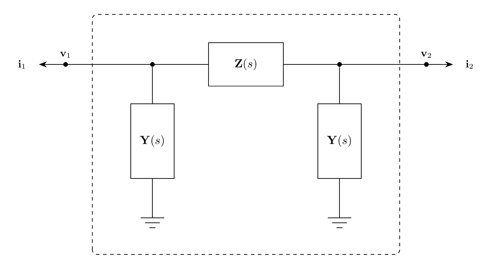

# LineLumped Model

`LineLumped` represents an $N$-phase, $K$-conductor lumped EMT line over length
$\Delta x$. Series current $\mathbf{i}_{12}$ is directed from terminal 1 to
terminal 2.

## Block Diagram



Figure 1: LineLumped model

The conductor-to-phase mappings are shown in the equations and omitted from
the diagram for clarity.

## Model Parameters

Define the phase- and conductor-index sets

```math
\mathcal{N} = \{1,\ldots,N\},
\qquad
\mathcal{K} = \{1,\ldots,K\}.
```

Symbol | Units | JSON | Description | Note
------ | ----- | ---- | ----------- | ----
$N$ | [-] | `N` | Number of phases | Required, positive integer
$K$ | [-] | `K` | Number of conductors | Required, positive integer
$\mathbf{c}$ | [-] | `conductors` | Conductor phase-index list | $\mathbf{c} \in \mathcal{N}^K$
$\Delta x$ | [m] | `dx` | Line segment length | Required, positive

### Parameter Validation

```math
\begin{aligned}
N &\in \mathbb{Z}_{>0} \\
K &\in \mathbb{Z}_{>0} \\
\mathbf{c} &\in \mathcal{N}^K \\
\{c_k \mid k \in \mathcal{K}\} &= \mathcal{N} \\
\Delta x &> 0
\end{aligned}
```

### Derived Parameters

```math
P_{\phi,nk} =
\begin{cases}
1, & n = c_k \\
0, & n \ne c_k
\end{cases},
\quad n \in \mathcal{N},\quad k \in \mathcal{K}
```

## Submodels

Symbol | Description | Type | Order | JSON | Inputs | Outputs
------ | ----------- | ---- | ----- | ---- | ------ | -------
$\mathbf{z}$ | Per-unit-length series impedance | [VectorFit](../../../Operators/Rational/VectorFit/README.md) | $KQ_{\mathbf{z}}$ | `Zp` | $\mathbb{R}^K$ | $\mathbb{R}^K$
$\mathbf{y}_1$ | Per-unit-length shunt admittance at terminal 1 | [VectorFit](../../../Operators/Rational/VectorFit/README.md) | $KQ_{\mathbf{y}}$ | `Yp` | $\mathbb{R}^K$ | $\mathbb{R}^K$
$\mathbf{y}_2$ | Per-unit-length shunt admittance at terminal 2 | [VectorFit](../../../Operators/Rational/VectorFit/README.md) | $KQ_{\mathbf{y}}$ | `Yp` | $\mathbb{R}^K$ | $\mathbb{R}^K$

`Yp` provides one coefficient set; the two terminal instances maintain
independent states.

### Submodel Validation

```math
\mathrm{rank}(\mathbf{E}^{\mathbf{z}}) = K
```

## Model Variables

### Internal Variables

#### Differential

Symbol | Units | Description | Note
------ | ----- | ----------- | ----
$\mathbf{i}_{12}$ | [A] | Series current from terminal 1 to terminal 2 | $\mathbf{i}_{12} \in \mathbb{R}^K$

#### Algebraic

Symbol | Units | Description | Note
------ | ----- | ----------- | ----
$\mathbf{i}_1^\mathrm{sh}$ | [A] | Shunt current at terminal 1 | $\mathbf{i}_1^\mathrm{sh} \in \mathbb{R}^K$
$\mathbf{i}_2^\mathrm{sh}$ | [A] | Shunt current at terminal 2 | $\mathbf{i}_2^\mathrm{sh} \in \mathbb{R}^K$

### External Variables

#### Differential

Symbol | Units | Description | Note
------ | ----- | ----------- | ----
$\mathbf{v}_1$ | [V] | Terminal 1 voltage owned by EMT bus | $\mathbf{v}_1 \in \mathbb{R}^N$
$\mathbf{v}_2$ | [V] | Terminal 2 voltage owned by EMT bus | $\mathbf{v}_2 \in \mathbb{R}^N$

#### Algebraic

None.

## Model Ports

Symbol | Port | Type | Units | Description | Note
------ | ---- | ---- | ----- | ----------- | ----
$\mathbf{v}_1$ | `v1` | Input | [V] | Terminal 1 bus voltage | $\mathbf{v}_1 \in \mathbb{R}^N$
$\mathbf{v}_2$ | `v2` | Input | [V] | Terminal 2 bus voltage | $\mathbf{v}_2 \in \mathbb{R}^N$
$\mathbf{i}_1$ | `i1` | Output | [A] | Current injection at terminal 1 | $\mathbf{i}_1 \in \mathbb{R}^N$
$\mathbf{i}_2$ | `i2` | Output | [A] | Current injection at terminal 2 | $\mathbf{i}_2 \in \mathbb{R}^N$

## Model Equations

### Differential Equations

```math
0 = \Delta x\,\mathbf{z}[\mathbf{i}_{12}]
  + \mathbf{P}_\phi^\mathsf T(\mathbf{v}_2-\mathbf{v}_1)
```

### Algebraic Equations

```math
\begin{aligned}
0 &= \Delta x\,\mathbf{y}_2[\mathbf{P}_\phi^\mathsf T\mathbf{v}_2]
  + 2\mathbf{i}_2^\mathrm{sh} \\
0 &= \Delta x\,\mathbf{y}_1[\mathbf{P}_\phi^\mathsf T\mathbf{v}_1]
  + 2\mathbf{i}_1^\mathrm{sh}
\end{aligned}
```

### Wiring

```math
\begin{aligned}
\mathbf{i}_1 &\leftarrow
  \mathbf{P}_\phi\left(
    \mathbf{i}_1^\mathrm{sh}
    - \mathbf{i}_{12}
  \right) \\
\mathbf{i}_2 &\leftarrow
  \mathbf{P}_\phi\left(
    \mathbf{i}_2^\mathrm{sh}
    + \mathbf{i}_{12}
  \right)
\end{aligned}
```

## Initialization

### Input Initialization

```math
\begin{aligned}
\mathbf{V}_r
  &\leftarrow \text{solved terminal RMS voltage phasor} \\
\mathbf{v}_r
  &\leftarrow \sqrt{2}\,\mathrm{Re}(\mathbf{V}_r) \\
\dfrac{\mathrm{d}\mathbf{v}_r}{\mathrm{d}t}
  &\leftarrow \sqrt{2}\,\mathrm{Re}(s_0\mathbf{V}_r),
  \quad r \in \{1,2\}.
\end{aligned}
```

### Internal Initialization

The current phasors satisfy

```math
\begin{aligned}
\mathbf{0}
  &= \Delta x\,\mathbf{Z}(s_0)\mathbf{I}_{12}
     + \mathbf{P}_\phi^\mathsf T(\mathbf{V}_2-\mathbf{V}_1) \\
\mathbf{I}_r^\mathrm{sh}
  &= -\dfrac{\Delta x}{2}\mathbf{Y}(s_0)
     \mathbf{P}_\phi^\mathsf T\mathbf{V}_r,
  \quad r \in \{1,2\}.
\end{aligned}
```

Initialization requires $\mathbf{Z}(s_0)$ to be nonsingular. The series-
impedance submodel initializes from $\mathbf{I}_{12}$, and each shunt-
admittance submodel initializes from
$\mathbf{P}_\phi^\mathsf T\mathbf{V}_r$. At $t=0$,

```math
\begin{aligned}
\mathbf{i}_{12}
  &\leftarrow \sqrt{2}\,\mathrm{Re}(\mathbf{I}_{12}) \\
\dfrac{\mathrm{d}\mathbf{i}_{12}}{\mathrm{d}t}
  &\leftarrow \sqrt{2}\,\mathrm{Re}(s_0\mathbf{I}_{12}) \\
\mathbf{i}_r^\mathrm{sh}
  &\leftarrow \sqrt{2}\,\mathrm{Re}(\mathbf{I}_r^\mathrm{sh}) \\
\dfrac{\mathrm{d}\mathbf{i}_r^\mathrm{sh}}{\mathrm{d}t}
  &\leftarrow \sqrt{2}\,\mathrm{Re}(s_0\mathbf{I}_r^\mathrm{sh}),
  \quad r \in \{1,2\}.
\end{aligned}
```

### Output Initialization

```math
\begin{aligned}
\mathbf{I}_1
  &= \mathbf{P}_\phi(\mathbf{I}_1^\mathrm{sh}-\mathbf{I}_{12}) \\
\mathbf{I}_2
  &= \mathbf{P}_\phi(\mathbf{I}_2^\mathrm{sh}+\mathbf{I}_{12}) \\
\mathbf{i}_r
  &\leftarrow \sqrt{2}\,\mathrm{Re}(\mathbf{I}_r) \\
\dfrac{\mathrm{d}\mathbf{i}_r}{\mathrm{d}t}
  &\leftarrow \sqrt{2}\,\mathrm{Re}(s_0\mathbf{I}_r),
  \quad r \in \{1,2\}.
\end{aligned}
```

## Monitors

Monitor | Units | Description | Note
------- | ----- | ----------- | ----
`i12` | [A] | Series current from terminal 1 to terminal 2 | $\mathbf{i}_{12} \in \mathbb{R}^K$
`i_sh1` | [A] | Shunt current at terminal 1 | $\mathbf{i}_1^\mathrm{sh} \in \mathbb{R}^K$
`i_sh2` | [A] | Shunt current at terminal 2 | $\mathbf{i}_2^\mathrm{sh} \in \mathbb{R}^K$

## Development

The initial three-phase formulation is a subset of the generalized formulation
above.

### Derived Parameters

```math
\begin{aligned}
\mathbf{R} &= \Delta x\,\mathbf{R}' \\
\mathbf{L} &= \Delta x\,\mathbf{L}' \\
\mathbf{G} &= \Delta x\,\mathbf{G}' \\
\mathbf{C} &= \Delta x\,\mathbf{C}'
\end{aligned}
```

### Differential Equations

```math
0 = \mathbf{R}\mathbf{i}_{12}
  + \mathbf{L}\dfrac{\mathrm{d}\mathbf{i}_{12}}{\mathrm{d}t}
  + \mathbf{v}_2-\mathbf{v}_1
```

### Algebraic Equations

```math
\begin{aligned}
0 &= \mathbf{G}\mathbf{v}_2
  + \mathbf{C}\dfrac{\mathrm{d}\mathbf{v}_2}{\mathrm{d}t}
  + 2\mathbf{i}_2^\mathrm{sh} \\
0 &= \mathbf{G}\mathbf{v}_1
  + \mathbf{C}\dfrac{\mathrm{d}\mathbf{v}_1}{\mathrm{d}t}
  + 2\mathbf{i}_1^\mathrm{sh}
\end{aligned}
```
