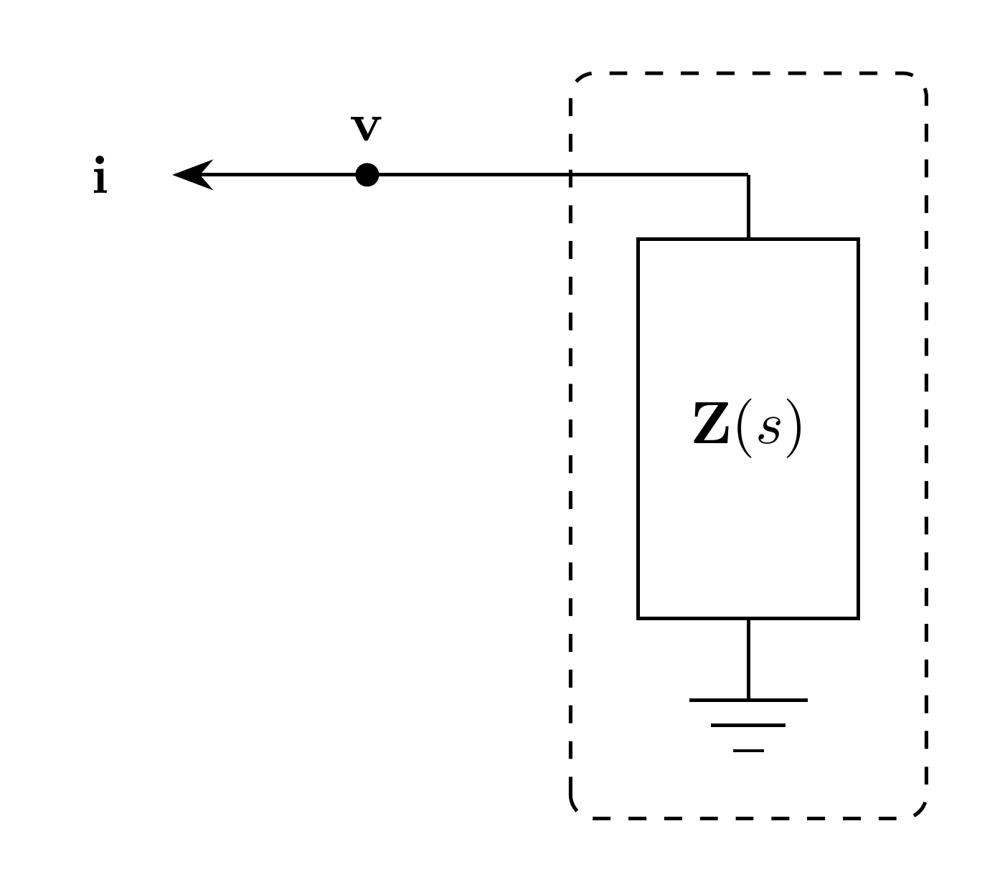

# LoadZ Model

`LoadZ` represents a three-phase impedance load. Current $\mathbf{i}$ is injected
from the load into the EMT bus.

## Block Diagram



Figure 1: LoadZ model

## Model Parameters

Symbol | Units | JSON | Description | Note
------ | ----- | ---- | ----------- | ----
$N$ | [-] | `N` | Number of phases | Fixed at $3$
$\mathbf{R}$ | [$\Omega$] | `R` | Resistance matrix | Used when `Z` is absent
$\mathbf{L}$ | [H] | `L` | Inductance matrix | Used when `Z` is absent

### Parameter Validation

```math
N = 3
```

### Derived Parameters

None.

## Model Ports

Symbol | Port | Type | Units | Description | Note
------ | ---- | ---- | ----- | ----------- | ----
$\mathbf{v}$ | `v` | Input | [V] | Bus voltage at load port | $\mathbf{v} \in \mathbb{R}^N$
$\mathbf{i}$ | `i` | Output | [A] | Current injection at load port | $\mathbf{i} \in \mathbb{R}^N$

## Submodels

Symbol | Description | Type | Order | JSON | Inputs | Outputs
------ | ----------- | ---- | ----- | ---- | ------ | -------
$\mathbf{z}$ | Impedance | [VectorFit](../../../Operators/Rational/VectorFit/README.md) | $NQ_{\mathbf{z}}$ | `Z` | $\mathbb{R}^N$ | $\mathbb{R}^N$

### Submodel Validation

`Z` has three inputs and three outputs. When `Z` is supplied, `R` and `L`
must be zero. Each current component is differential when its column of
$\mathbf{E}^{\mathbf{z}}$ is nonzero and algebraic otherwise. Nonzero columns
must be linearly independent, so the tagged current derivatives can be
initialized consistently.

## Model Variables

### Internal Variables

#### Differential

Symbol | Units | Description | Note
------ | ----- | ----------- | ----
$\mathbf{i}$ | [A] | Current injection from load into EMT bus | $\mathbf{i} \in \mathbb{R}^N$, nonzero column of $\mathbf{E}^{\mathbf{z}}$

#### Algebraic

Symbol | Units | Description | Note
------ | ----- | ----------- | ----
$\mathbf{i}$ | [A] | Current injection from load into EMT bus | $\mathbf{i} \in \mathbb{R}^N$, zero column of $\mathbf{E}^{\mathbf{z}}$

### External Variables

#### Differential

Symbol | Units | Description | Note
------ | ----- | ----------- | ----
$\mathbf{v}$ | [V] | Bus voltage vector owned by EMT bus | $\mathbf{v} \in \mathbb{R}^N$

#### Algebraic

None.

## Model Equations

### Internal Equations

#### Differential

The impedance output contributes to the current equations,

```math
0 = \mathbf{z}[\mathbf{i}] + \mathbf{v}
```

#### Algebraic

Current components with zero columns of $\mathbf{E}^{\mathbf{z}}$ are algebraic.

### External Equations

```math
\mathbf{f} \leftarrow \mathbf{i}
```

## Initialization

The default initialization starts inductive currents and rational memory
states de-energized. A legacy purely resistive load solves its current from
the bus voltage when its resistance matrix is nonsingular. Singular resistance
retains the zero-current guess for the assembled circuit initialization.
`initializeSteadyState(omega)` instead uses the attached
voltage values and derivatives as sinusoidal samples, solves
$\mathbf{Z}(j\omega)\mathbf{I}=-\mathbf{V}$, and initializes all rational
memory states. Singular transfer matrices return an initialization error.

## Monitors

Monitor | Units | Description | Note
------- | ----- | ----------- | ----
`i` | [A] | Load current injection | $\mathbf{i} \in \mathbb{R}^N$

## Resistance-Inductance Specialization

When `Z` is absent, the same VectorFit submodel uses $\mathbf{D}=\mathbf{R}$
and $\mathbf{E}=\mathbf{L}$ with no poles. Both matrices must be finite.
