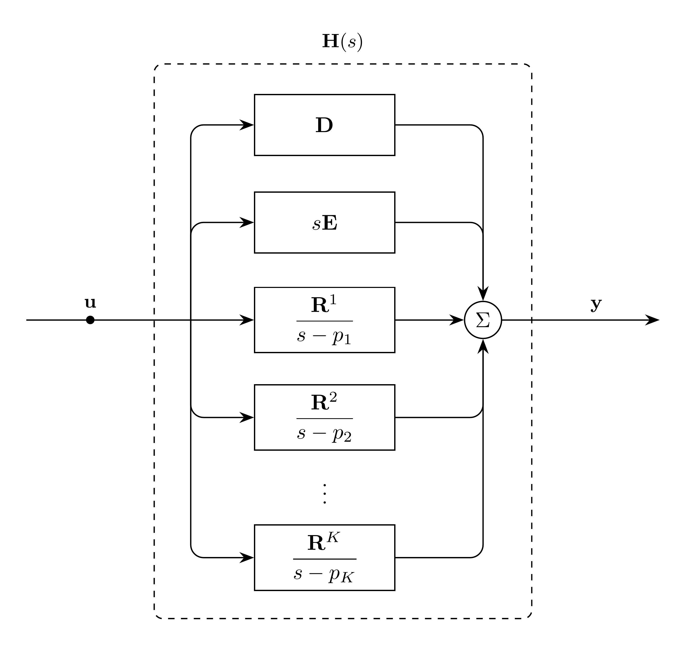

# RationalTransfer Model

`RationalTransfer` represents a vector-fitted matrix rational approximation with
complex poles and residues.

The rational approximation is represented in pole form:

```math
\mathbf{H}(s) \approx \mathbf{D} + s\mathbf{E}
  + \sum_{q=1}^{Q} \frac{\mathbf{R}^q}{s - p_q}
```

The Laplace domain representation of this model is:
```math
\mathbf{Y}(s) = \mathbf{H}(s)\mathbf{U}(s)
```

The time domain representation of this model is:
```math
\mathbf{y}(t) = (\mathbf{h}*\mathbf{u})(t)
```

## Block Diagram

<div align="center">
   

  Figure 1: RationalTransfer convolution model
</div>

## Model Parameters

For output dimension $N$, input dimension $K$, and pole count $Q$:

Symbol | Units | JSON | Description | Typical Value | Note
------ | ----- | ---- | ----------- | ------------- | ----
$\mathbf{D}$ | [-] | | Constant coefficient | | $\mathbf{D} \in \mathbb{R}^{N \times K}$
$\mathbf{E}$ | [s] | | Linear coefficient | | $\mathbf{E} \in \mathbb{R}^{N \times K}$
$\mathbf{p}$ | [1/s] | | Poles | | $\mathbf{p} \in \mathbb{C}^Q$
$\mathbf{R}$ | [1/s] | | Residues | | $\mathbf{R} \in \mathbb{C}^{N \times K \times Q}$

### Parameter Validation

Complex-valued poles and residues must be ordered as adjacent conjugate pairs.
For each pair, with $q$ the first index:

```math
\begin{aligned}
p_q &= (p_{q+1})^* &
\mathbf{R}^q &= (\mathbf{R}^{q+1})^*
\end{aligned}
```

### Model Derived Parameters

Define the real-valued quantities used below. Superscript $q$ denotes
pole-indexed residues and memory states.

```math
\begin{aligned}
\mathbf{a} &= \operatorname{Re}(\mathbf{p}) \\
\boldsymbol{\omega} &= \operatorname{Im}(\mathbf{p}) \\
\mathbf{R}_{\mathrm{r}}^q &= \operatorname{Re}(\mathbf{R}^q) \\
\mathbf{R}_{\mathrm{i}}^q &= \operatorname{Im}(\mathbf{R}^q)
\end{aligned}
```

## Model Variables

### Internal Variables

#### Differential

In the general case, there are $2QK$ scalar internal differential states,
grouped as one $\mathbf{x}_{\mathrm{r}}$ and $\mathbf{x}_{\mathrm{i}}$ pair of
$K$-vectors per pole. Real-valued poles do not need the imaginary state.

Symbol | Units | Description | Note
------ | ----- | ----------- | ----
$\mathbf{x}_{\mathrm{r}}$ | [-] | Real memory states | $\mathbf{x}_{\mathrm{r}} \in \mathbb{R}^K$
$\mathbf{x}_{\mathrm{i}}$ | [-] | Imaginary memory states | $\mathbf{x}_{\mathrm{i}} \in \mathbb{R}^K$

#### Algebraic

Symbol | Units | Description | Note
------ | ----- | ----------- | ----
$\mathbf{y}$ | [-] | Rational approximation output state | $\mathbf{y} \in \mathbb{R}^N$

### External Variables

#### Differential

Symbol | Units | Description | Note
------ | ----- | ----------- | ----
$\mathbf{u}$ | [-] | Input vector | $\mathbf{u} \in \mathbb{R}^K$

#### Algebraic

None.

## Model Equations

### Differential Equations

For real-valued poles, the imaginary-memory equation is not needed.

```math
\begin{aligned}
0 &= -\dot{\mathbf{x}}_{\mathrm{r}}^q
     + a_q\mathbf{x}_{\mathrm{r}}^q
     - \omega_q\mathbf{x}_{\mathrm{i}}^q
     + \mathbf{u} \\
0 &= -\dot{\mathbf{x}}_{\mathrm{i}}^q
     + \omega_q\mathbf{x}_{\mathrm{r}}^q
     + a_q\mathbf{x}_{\mathrm{i}}^q \\
0 &= -\mathbf{y} + \mathbf{D}\mathbf{u} + \mathbf{E}\dot{\mathbf{u}}
     + \sum_{q=1}^{Q}
         \mathbf{R}_{\mathrm{r}}^q\mathbf{x}_{\mathrm{r}}^q
         - \mathbf{R}_{\mathrm{i}}^q\mathbf{x}_{\mathrm{i}}^q
\end{aligned}
```

### Algebraic Equations

Rows of the output residual with all-zero rows of $\mathbf{E}$ are algebraic.

## Initialization

For an affine initial input trajectory, let subscript $0$ denote initial values.
Memory states initialize to:

```math
\begin{aligned}
\mathbf{x}_{\mathrm{r},0}^q &=
-\frac{a_q}{a_q^2 + \omega_q^2}\mathbf{u}_0
-\frac{a_q^2 - \omega_q^2}{(a_q^2 + \omega_q^2)^2}
  \dot{\mathbf{u}}_0 \\
\mathbf{x}_{\mathrm{i},0}^q &=
\frac{\omega_q}{a_q^2 + \omega_q^2}\mathbf{u}_0
+\frac{2a_q\omega_q}{(a_q^2 + \omega_q^2)^2}\dot{\mathbf{u}}_0
\end{aligned}
```

The output state initializes from the output residual:

```math
\mathbf{y}_0 = \mathbf{D}\mathbf{u}_0 + \mathbf{E}\dot{\mathbf{u}}_0
  + \sum_{q=1}^{Q}
    \left(
      \mathbf{R}_{\mathrm{r}}^q\mathbf{x}_{\mathrm{r},0}^q
      - \mathbf{R}_{\mathrm{i}}^q\mathbf{x}_{\mathrm{i},0}^q
    \right)
```

## Model Outputs

Output | Units | Description | Note
------ | ----- | ----------- | ----
$\mathbf{y}$ | [-] | Rational approximation output state | $\mathbf{y} \in \mathbb{R}^N$
