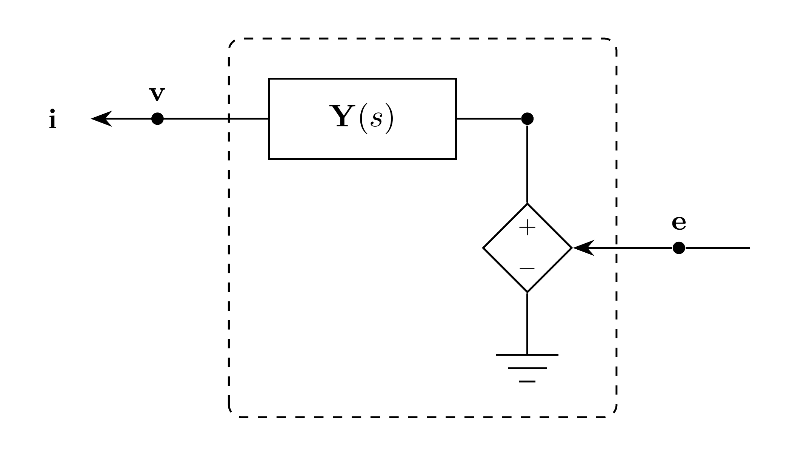

# DependentVoltageSource Model

`DependentVoltageSource` represents a three-phase EMT voltage source driven by
an input voltage signal and connected to the EMT bus through terminal
admittance.

## Block Diagram



Figure 1: DependentVoltageSource model

## Model Parameters

Symbol | Units | JSON | Description | Note
------ | ----- | ---- | ----------- | ----
$N$ | [-] | `N` | Number of phases | Fixed at $3$
$\mathbf{R}_\mathrm{s}$ | [$\Omega$] | `Rs` | Series resistance matrix | Used when $\mathbf{Y}$ is absent
$\mathbf{L}_\mathrm{s}$ | [H] | `Ls` | Series inductance matrix | Used when $\mathbf{Y}$ is absent

### Parameter Validation

```math
\begin{aligned}
N &= 3 \\
\mathbf{R}_\mathrm{s},\mathbf{L}_\mathrm{s} &\in \mathbb{R}^{3\times3}
\end{aligned}
```

### Derived Parameters

None.

## Model Ports

Symbol | Port | Type | Units | Description | Note
------ | ---- | ---- | ----- | ----------- | ----
$\mathbf{e}$ | `e` | Input | [V] | Source voltage | $\mathbf{e} \in \mathbb{R}^3$
$\mathbf{v}$ | `v` | Input | [V] | Bus voltage at source port | $\mathbf{v} \in \mathbb{R}^3$
$\mathbf{i}$ | `i` | Output | [A] | Current injection at source port | $\mathbf{i} \in \mathbb{R}^3$

In case JSON, the logical vector input $\mathbf{e}$ is connected through the
scalar signal ports `ea`, `eb`, and `ec`.

## Submodels

Symbol | Description | Type | Order | JSON | Inputs | Outputs
------ | ----------- | ---- | ----- | ---- | ------ | -------
$\mathbf{y}$ | Terminal admittance | [VectorFit](../../../Operators/Rational/VectorFit/README.md) | $3Q_{\mathbf{y}}$ | `Y` | $\mathbb{R}^3$ | $\mathbb{R}^3$

### Submodel Validation

When $\mathbf{Y}$ is supplied, $\mathbf{R}_\mathrm{s}$ and
$\mathbf{L}_\mathrm{s}$ must be zero and the linear coefficient of
$\mathbf{Y}$ must be zero.

## Model Variables

### Internal Variables

#### Differential

None.

#### Algebraic

Symbol | Units | Description | Note
------ | ----- | ----------- | ----
$\mathbf{u}$ | [V] | Admittance input $\mathbf{e}-\mathbf{v}$ | Present when `Y` is supplied

### External Variables

#### Differential

Symbol | Units | Description | Note
------ | ----- | ----------- | ----
$\mathbf{v}$ | [V] | Bus voltage vector owned by EMT bus | $\mathbf{v} \in \mathbb{R}^3$

#### Algebraic

Symbol | Units | Description | Note
------ | ----- | ----------- | ----
$\mathbf{e}$ | [V] | Source voltage signal | $\mathbf{e} \in \mathbb{R}^3$

## Model Equations

### Internal Equations

#### Differential

None.

#### Algebraic

```math
0 = \mathbf{u} + \mathbf{v} - \mathbf{e}
```

### External Equations

```math
\mathbf{i} \leftarrow \mathbf{y}[\mathbf{e} - \mathbf{v}]
```

## Initialization

The default initialization sets the branch voltage to the source voltage minus
the bus voltage and starts rational memory states de-energized. Legacy series
currents start at zero. `initializeSteadyState(omega)` instead uses the attached
voltage values and derivatives as sinusoidal samples, solves the legacy
impedance branch when needed, and initializes all rational memory states.

## Monitors

Monitor | Units | Description | Note
------- | ----- | ----------- | ----
`e` | [V] | Source voltage | $\mathbf{e} \in \mathbb{R}^3$
`i` | [A] | Source current injection | $\mathbf{i} \in \mathbb{R}^3$

## Series Impedance Specialization

When `Y` is absent, a VectorFit impedance submodel uses
$\mathbf{D}=\mathbf{R}_\mathrm{s}$ and
$\mathbf{E}=\mathbf{L}_\mathrm{s}$, with no poles. It reads the owned branch
current and contributes its output to

```math
0 = \mathbf{z}[\mathbf{i}] + \mathbf{v} - \mathbf{e}.
```

Each current component is differential when its column of
$\mathbf{L}_\mathrm{s}$ is nonzero and algebraic otherwise. Both series
matrices must be finite. Nonzero inductance columns must be linearly independent.
