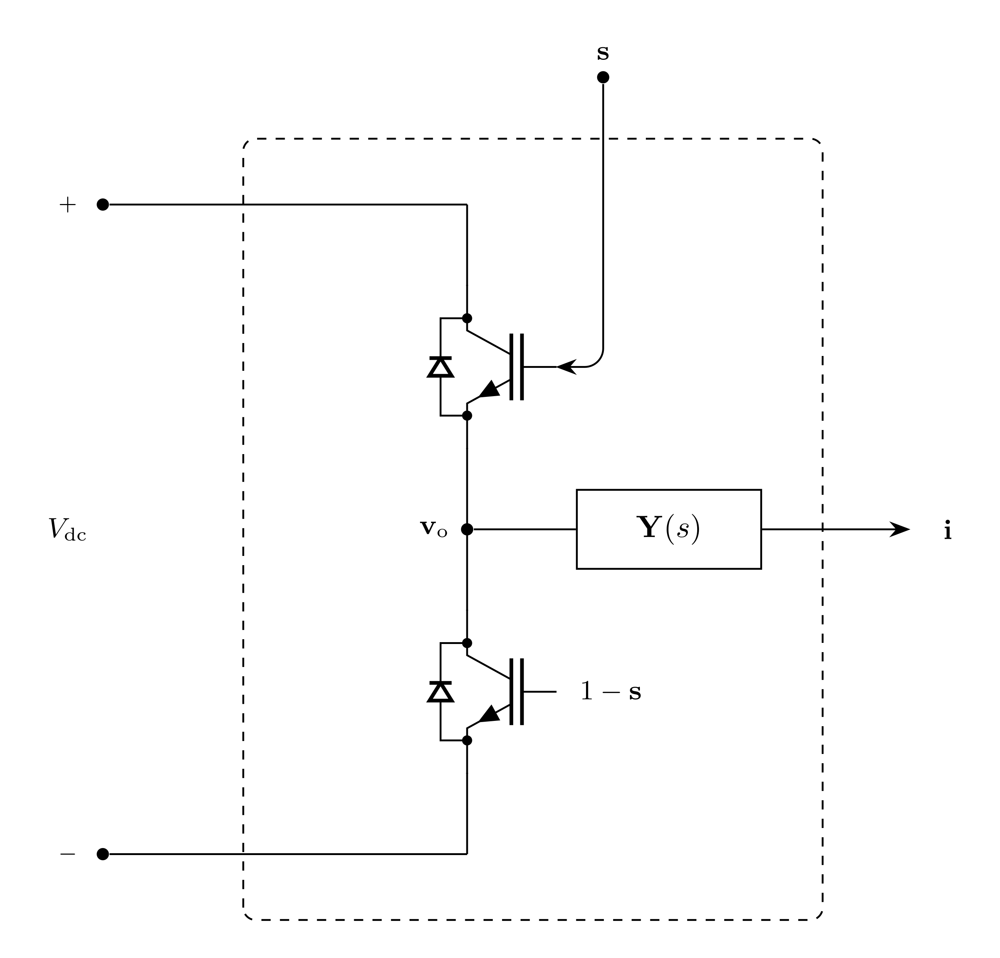

# Inverter Model

`Inverter` represents a three-phase, two-level EMT voltage-source inverter
connected to the EMT bus through terminal admittance.

## Block Diagram



Figure 1: Inverter model

## Model Parameters

None.

### Parameter Validation

None.

### Derived Parameters

The oriented bridge incidence matrix and bridge Laplacian are

```math
\begin{aligned}
\mathbf{A} &=
\begin{bmatrix}
1 & -1 & 0 \\
0 & 1 & -1 \\
-1 & 0 & 1
\end{bmatrix} \\
\mathbf{P} &= \mathbf{A}^\mathsf{T}\mathbf{A}
=
\begin{bmatrix}
2 & -1 & -1 \\
-1 & 2 & -1 \\
-1 & -1 & 2
\end{bmatrix}.
\end{aligned}
```

## Model Ports

Symbol | Port | Type | Units | Description | Note
------ | ---- | ---- | ----- | ----------- | ----
$\mathbf{v}$ | `v` | Input | [V] | Bus voltage at source port | $\mathbf{v} \in \mathbb{R}^3$
$s_a$ | `sa` | Input | [-] | Phase-a switching function | $s_a \in [0,1]$
$s_b$ | `sb` | Input | [-] | Phase-b switching function | $s_b \in [0,1]$
$s_c$ | `sc` | Input | [-] | Phase-c switching function | $s_c \in [0,1]$
$V_{\mathrm{dc}}$ | `vdc` | Input | [V] | DC-link voltage | $V_{\mathrm{dc}} \ge 0$
$\mathbf{i}$ | `i` | Output | [A] | Current injection at source port | $\mathbf{i} \in \mathbb{R}^3$

## Submodels

Symbol | Description | Type | Order | JSON | Inputs | Outputs
------ | ----------- | ---- | ----- | ---- | ------ | -------
$\mathbf{y}$ | Terminal admittance | [VectorFit](../../../Operators/Rational/VectorFit/README.md) | $3Q_{\mathbf{y}}$ | `Y` | $\mathbb{R}^3$ | $\mathbb{R}^3$

### Submodel Validation

None.

## Model Variables

### Internal Variables

#### Differential

None.

#### Algebraic

Symbol | Units | Description | Note
------ | ----- | ----------- | ----
$\mathbf{e}$ | [V] | Source voltage vector | $\mathbf{e} \in \mathbb{R}^3$

### External Variables

#### Differential

Symbol | Units | Description | Note
------ | ----- | ----------- | ----
$\mathbf{v}$ | [V] | Bus voltage vector owned by EMT bus | $\mathbf{v} \in \mathbb{R}^3$

#### Algebraic

Symbol | Units | Description | Note
------ | ----- | ----------- | ----
$\mathbf{s}$ | [-] | Switching function vector | $\mathbf{s} \in [0,1]^3$
$V_{\mathrm{dc}}$ | [V] | DC-link voltage | $V_{\mathrm{dc}} \ge 0$

## Model Equations

### Internal Equations

#### Differential

None.

#### Algebraic

```math
0 = \mathbf{e}
  - \dfrac{V_{\mathrm{dc}}}{3}\mathbf{P}\mathbf{s}
```

### External Equations

```math
\mathbf{i} \leftarrow \mathbf{y}[\mathbf{e} - \mathbf{v}]
```

## Initialization

None beyond the EMT initialization contract.

## Monitors

Monitor | Units | Description | Note
------- | ----- | ----------- | ----
`e` | [V] | Source voltage | $\mathbf{e} \in \mathbb{R}^3$
`i` | [A] | Source current injection | $\mathbf{i} \in \mathbb{R}^3$
