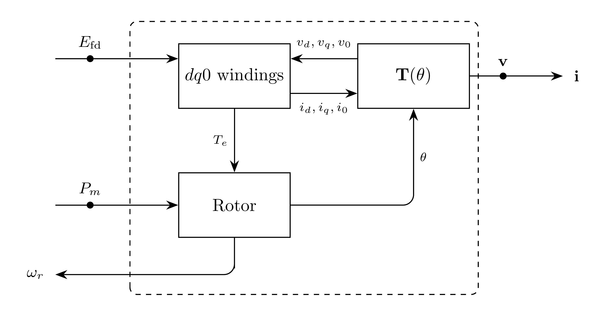

# Machine Model

`Machine` represents an $N$-phase round-rotor synchronous machine
in instantaneous phase coordinates with fundamental per-unit winding
parameters. The rotor carries the field winding $\mathrm{fd}$, one d-axis
damper $\mathrm{1d}$, and two q-axis dampers $\mathrm{1q}$ and $\mathrm{2q}$.
Current $\mathbf{i}$ is injected from the machine into the EMT bus.

The winding physics rows are written in the rotor $dq0$ frame; explicit Park
residual rows define the $dq0$ projections of the terminal voltage and the
instantaneous abc stator currents, so the bus coupling is instantaneous abc SI
volts and amps while the machine physics validates line by line against the
reference model. The equivalent time-varying inductance synthesis in abc
coordinates is recorded in [Development](#development).

> [!NOTE]
> The formulation supports $N$ phases; initial development targets three
> phases. Internal machine quantities are in the machine per-unit system on
> the rated bases. Round-rotor saturation applies one factor $K_s$ to both
> magnetizing inductances. The differential leakage inductance between
> same-axis rotor windings is neglected. The reference model is the MathWorks
> Synchronous Machine block with round rotor and fundamental parameters.

## Block Diagram



Figure 1: Machine model

## Model Parameters

Symbol | Units | JSON | Description | Note
------ | ----- | ---- | ----------- | ----
$N$ | [-] | `N` | Number of phases | Required, positive integer
$S_\mathrm{b}$ | [VA] | `S` | Rated three-phase apparent power | Required, positive
$V_\mathrm{b}$ | [V] | `V` | Rated line-to-line RMS voltage | Required, positive
$f_\mathrm{b}$ | [Hz] | `f` | Rated electrical frequency | Required, positive
$H$ | [s] | `H` | Inertia constant | Required, positive
$F$ | [p.u.] | `F` | Friction torque factor | Nonnegative
$R_s$ | [p.u.] | `Rs` | Stator winding resistance | Nonnegative
$L_l$ | [p.u.] | `Ll` | Stator leakage inductance | Positive
$L_\mathrm{md}$ | [p.u.] | `Lmd` | Unsaturated d-axis magnetizing inductance | Positive
$L_\mathrm{mq}$ | [p.u.] | `Lmq` | Unsaturated q-axis magnetizing inductance | Positive
$L_0$ | [p.u.] | `L0` | Zero-sequence inductance | Positive, defaults to $L_l$
$R_\mathrm{fd}$ | [p.u.] | `Rfd` | Field winding resistance | Positive
$L_\mathrm{lfd}$ | [p.u.] | `Llfd` | Field leakage inductance | Positive
$R_\mathrm{1d}$ | [p.u.] | `R1d` | d-axis damper resistance | Positive
$L_\mathrm{l1d}$ | [p.u.] | `Ll1d` | d-axis damper leakage inductance | Positive
$R_\mathrm{1q}$ | [p.u.] | `R1q` | q-axis damper 1 resistance | Positive
$L_\mathrm{l1q}$ | [p.u.] | `Ll1q` | q-axis damper 1 leakage inductance | Positive
$R_\mathrm{2q}$ | [p.u.] | `R2q` | q-axis damper 2 resistance | Positive
$L_\mathrm{l2q}$ | [p.u.] | `Ll2q` | q-axis damper 2 leakage inductance | Positive
$S(1.0)$ | [p.u.] | `S10` | Saturation factor at $1.0$ per-unit flux | Nonnegative
$S(1.2)$ | [p.u.] | `S12` | Saturation factor at $1.2$ per-unit flux | Nonnegative
$P_0$ | [W] | `p0` | Initial active power injection | SI, into bus
$Q_0$ | [var] | `q0` | Initial reactive power injection | SI, into bus

### Parameter Validation

```math
\begin{aligned}
N &\in \mathbb{Z}_{>0} \\
S_\mathrm{b} &> 0 \\
V_\mathrm{b} &> 0 \\
f_\mathrm{b} &> 0 \\
H &> 0 \\
F &\ge 0 \\
R_s &\ge 0 \\
L_l, L_\mathrm{md}, L_\mathrm{mq}, L_0 &> 0 \\
L_\mathrm{lfd}, L_\mathrm{l1d}, L_\mathrm{l1q}, L_\mathrm{l2q} &> 0 \\
R_\mathrm{fd}, R_\mathrm{1d}, R_\mathrm{1q}, R_\mathrm{2q} &> 0 \\
S(1.0), S(1.2) &\ge 0
\end{aligned}
```

### Derived Parameters

```math
\begin{aligned}
\omega_\mathrm{b} &= 2\pi f_\mathrm{b} \\
V_\mathrm{pk} &= \sqrt{2/3}\,V_\mathrm{b} \\
I_\mathrm{pk} &= \dfrac{\sqrt{2}\,S_\mathrm{b}}{\sqrt{3}\,V_\mathrm{b}} \\
k_\mathrm{fd} &= \dfrac{R_\mathrm{fd}}{L_\mathrm{md}}
\end{aligned}
```

The scaled-quadratic saturation coefficients $S_A$ and $S_B$ follow from
$S(1.0)$ and $S(1.2)$: with $s = \sqrt{S(1.0)/S(1.2)}$,

```math
S_A = \min\left(\dfrac{1.2 s + 1}{s + 1},\;
                \dfrac{1.2 s - 1}{s - 1}\right),
\qquad
S_B = \dfrac{S(1.2)}{(S_A - 1.2)^2},
```

and both are zero when $S(1.2) = 0$.

## Model Ports

Symbol | Port | Type | Units | Description | Note
------ | ---- | ---- | ----- | ----------- | ----
$\mathbf{v}$ | `v` | Input | [V] | Bus voltage at machine port | $\mathbf{v} \in \mathbb{R}^N$
$\mathbf{i}$ | `i` | Output | [A] | Current injection at machine port | $\mathbf{i} \in \mathbb{R}^N$
$E_\mathrm{fd}$ | `efd` | Input | [p.u.] | Field voltage on the exciter base | Optional signal, latched when unattached
$P_m$ | `pm` | Input | [p.u.] | Mechanical power | Optional signal, latched when unattached
$\omega_r$ | `speed` | Output | [p.u.] | Rotor speed | Optional signal

## Submodels

None.

### Submodel Validation

None.

## Model Variables

### Internal Variables

#### Differential

Symbol | Units | Description | Note
------ | ----- | ----------- | ----
$\theta$ | [rad] | Electrical rotor angle | d-axis relative to the phase-a magnetic axis
$\omega_r$ | [p.u.] | Rotor speed |
$\psi_d$ | [p.u.] | d-axis stator flux linkage |
$\psi_q$ | [p.u.] | q-axis stator flux linkage |
$\psi_0$ | [p.u.] | Zero-sequence stator flux linkage |
$\psi_\mathrm{fd}$ | [p.u.] | Field flux linkage |
$\psi_\mathrm{1d}$ | [p.u.] | d-axis damper flux linkage |
$\psi_\mathrm{1q}$ | [p.u.] | q-axis damper 1 flux linkage |
$\psi_\mathrm{2q}$ | [p.u.] | q-axis damper 2 flux linkage |

#### Algebraic

Symbol | Units | Description | Note
------ | ----- | ----------- | ----
$i_d$ | [p.u.] | d-axis stator current | Positive out of the machine
$i_q$ | [p.u.] | q-axis stator current | Positive out of the machine
$i_0$ | [p.u.] | Zero-sequence stator current |
$i_\mathrm{fd}$ | [p.u.] | Field current |
$i_\mathrm{1d}$ | [p.u.] | d-axis damper current |
$i_\mathrm{1q}$ | [p.u.] | q-axis damper 1 current |
$i_\mathrm{2q}$ | [p.u.] | q-axis damper 2 current |
$\psi_\mathrm{ad}$ | [p.u.] | d-axis air-gap flux linkage |
$\psi_\mathrm{aq}$ | [p.u.] | q-axis air-gap flux linkage |
$\psi_\mathrm{at}$ | [p.u.] | Air-gap flux magnitude |
$K_s$ | [-] | Saturation factor |
$T_e$ | [p.u.] | Electrical torque |
$\mathbf{i}_s$ | [p.u.] | Instantaneous stator currents | $\mathbf{i}_s \in \mathbb{R}^N$

### External Variables

#### Differential

Symbol | Units | Description | Note
------ | ----- | ----------- | ----
$\mathbf{v}$ | [V] | Bus voltage vector owned by EMT bus | $\mathbf{v} \in \mathbb{R}^N$

#### Algebraic

Symbol | Units | Description | Note
------ | ----- | ----------- | ----
$E_\mathrm{fd}$ | [p.u.] | Field voltage owned by an exciter | Latched setpoint when unattached
$P_m$ | [p.u.] | Mechanical power owned by a governor | Latched setpoint when unattached

## Model Equations

The Park transformation uses the phase offsets
$\gamma_a = 0$, $\gamma_b = -2\pi/3$, $\gamma_c = +2\pi/3$, with the q-axis
lagging the d-axis. For a phase quantity $\mathbf{x}$,

```math
x_d = \dfrac{2}{3}\sum_{n \in \mathcal{N}} x_n \cos(\theta + \gamma_n),
\qquad
x_q = -\dfrac{2}{3}\sum_{n \in \mathcal{N}} x_n \sin(\theta + \gamma_n),
\qquad
x_0 = \dfrac{1}{3}\sum_{n \in \mathcal{N}} x_n.
```

The terminal voltage enters in machine per unit as
$\mathbf{v}_\mathrm{pu} = \mathbf{v} / V_\mathrm{pk}$, with $v_d$, $v_q$, and
$v_0$ its Park projections. The field voltage enters on the reciprocal base
as $e_\mathrm{fd} = k_\mathrm{fd} E_\mathrm{fd}$, and the mechanical torque is
$T_m = P_m / \omega_r$. The saturated magnetizing inductances are

```math
L_\mathrm{ad} = K_s L_\mathrm{md},
\qquad
L_\mathrm{aq} = K_s L_\mathrm{mq}.
```

### Internal Equations

#### Differential

```math
\begin{aligned}
0 &= \dfrac{\mathrm{d}\theta}{\mathrm{d}t} - \omega_\mathrm{b}\,\omega_r \\
0 &= 2H\dfrac{\mathrm{d}\omega_r}{\mathrm{d}t}
     - \dfrac{P_m}{\omega_r} + T_e + F\,\omega_r \\
0 &= \dfrac{1}{\omega_\mathrm{b}}\dfrac{\mathrm{d}\psi_d}{\mathrm{d}t}
     - \omega_r\,\psi_q - R_s\,i_d - v_d \\
0 &= \dfrac{1}{\omega_\mathrm{b}}\dfrac{\mathrm{d}\psi_q}{\mathrm{d}t}
     + \omega_r\,\psi_d - R_s\,i_q - v_q \\
0 &= \dfrac{1}{\omega_\mathrm{b}}\dfrac{\mathrm{d}\psi_0}{\mathrm{d}t}
     - R_s\,i_0 - v_0 \\
0 &= \dfrac{1}{\omega_\mathrm{b}}\dfrac{\mathrm{d}\psi_\mathrm{fd}}{\mathrm{d}t}
     + R_\mathrm{fd}\,i_\mathrm{fd} - e_\mathrm{fd} \\
0 &= \dfrac{1}{\omega_\mathrm{b}}\dfrac{\mathrm{d}\psi_\mathrm{1d}}{\mathrm{d}t}
     + R_\mathrm{1d}\,i_\mathrm{1d} \\
0 &= \dfrac{1}{\omega_\mathrm{b}}\dfrac{\mathrm{d}\psi_\mathrm{1q}}{\mathrm{d}t}
     + R_\mathrm{1q}\,i_\mathrm{1q} \\
0 &= \dfrac{1}{\omega_\mathrm{b}}\dfrac{\mathrm{d}\psi_\mathrm{2q}}{\mathrm{d}t}
     + R_\mathrm{2q}\,i_\mathrm{2q}
\end{aligned}
```

#### Algebraic

The flux linkage and current relations use the saturated magnetizing
inductances, and the saturation row uses the
[quadratic ramp](../../../../../CommonMath.md#primitives):

```math
\begin{aligned}
0 &= \psi_d + (L_\mathrm{ad} + L_l)\,i_d
     - L_\mathrm{ad}\,(i_\mathrm{fd} + i_\mathrm{1d}) \\
0 &= \psi_q + (L_\mathrm{aq} + L_l)\,i_q
     - L_\mathrm{aq}\,(i_\mathrm{1q} + i_\mathrm{2q}) \\
0 &= \psi_0 + L_0\,i_0 \\
0 &= \psi_\mathrm{fd} - (L_\mathrm{ad} + L_\mathrm{lfd})\,i_\mathrm{fd}
     - L_\mathrm{ad}\,i_\mathrm{1d} + L_\mathrm{ad}\,i_d \\
0 &= \psi_\mathrm{1d} - L_\mathrm{ad}\,i_\mathrm{fd}
     - (L_\mathrm{ad} + L_\mathrm{l1d})\,i_\mathrm{1d} + L_\mathrm{ad}\,i_d \\
0 &= \psi_\mathrm{1q} - (L_\mathrm{aq} + L_\mathrm{l1q})\,i_\mathrm{1q}
     - L_\mathrm{aq}\,i_\mathrm{2q} + L_\mathrm{aq}\,i_q \\
0 &= \psi_\mathrm{2q} - L_\mathrm{aq}\,i_\mathrm{1q}
     - (L_\mathrm{aq} + L_\mathrm{l2q})\,i_\mathrm{2q} + L_\mathrm{aq}\,i_q \\
0 &= \psi_\mathrm{ad} - \psi_d - L_l\,i_d \\
0 &= \psi_\mathrm{aq} - \psi_q - L_l\,i_q \\
0 &= \psi_\mathrm{at} - \sqrt{\psi_\mathrm{ad}^2 + \psi_\mathrm{aq}^2} \\
0 &= K_s\left(1 + S_B\,\mathrm{qramp}(\psi_\mathrm{at} - S_A)\right) - 1 \\
0 &= T_e - (\psi_d\,i_q - \psi_q\,i_d) \\
0 &= i_{s,n} - \left(i_d \cos(\theta + \gamma_n)
     - i_q \sin(\theta + \gamma_n) + i_0\right),
     \quad n \in \mathcal{N}
\end{aligned}
```

### External Equations

```math
\mathbf{i} \leftarrow I_\mathrm{pk}\,\mathbf{i}_s
```

### Wiring

The rotor speed $\omega_r$ is exposed on the `speed` output signal. The
`efd` and `pm` inputs read the attached signals, or the latched setpoints
$E_\mathrm{fd}^\mathrm{set}$ and $P_m^\mathrm{set}$ when unattached.

## Initialization

The bus terminal voltage and the scheduled power injections are taken as a
balanced positive-sequence operating point. All algebra is in machine per
unit with peak-value phasors sampled at the initialization instant $t_0$;
$\bar{v}$ and $\bar{\imath}$ denote the terminal voltage and injected current
phasors.

```math
\begin{aligned}
\bar{v} &\leftarrow \dfrac{1}{V_\mathrm{pk}}\left(
   \dfrac{2}{3}\left(v_a - \dfrac{v_b}{2} - \dfrac{v_c}{2}\right)
   + \mathrm{j}\,\dfrac{v_b - v_c}{\sqrt{3}}\right) \\
\bar{s} &\leftarrow \dfrac{P_0 + \mathrm{j} Q_0}{S_\mathrm{b}},
  \qquad \bar{\imath} \leftarrow \left(\bar{s}/\bar{v}\right)^{\ast} \\
\psi_\mathrm{at} &\leftarrow \left|\bar{v} + (R_s + \mathrm{j} L_l)\,\bar{\imath}\right|,
  \qquad K_s \leftarrow \dfrac{1}{1 + S_B\,\mathrm{qramp}(\psi_\mathrm{at} - S_A)} \\
\theta &\leftarrow \angle\left(\bar{v} + (R_s + \mathrm{j} L_q)\,\bar{\imath}\right)
   - \dfrac{\pi}{2},
  \qquad L_q = K_s L_\mathrm{mq} + L_l \\
i_d + \mathrm{j}\,i_q &\leftarrow \bar{\imath}\,e^{-\mathrm{j}\theta},
  \qquad v_d + \mathrm{j}\,v_q \leftarrow \bar{v}\,e^{-\mathrm{j}\theta},
  \qquad i_0 \leftarrow 0 \\
\psi_d &\leftarrow v_q + R_s\,i_q,
  \qquad \psi_q \leftarrow -(v_d + R_s\,i_d),
  \qquad \psi_0 \leftarrow 0 \\
i_\mathrm{fd} &\leftarrow \dfrac{\psi_d + (L_\mathrm{ad} + L_l)\,i_d}{L_\mathrm{ad}},
  \qquad i_\mathrm{1d}, i_\mathrm{1q}, i_\mathrm{2q} \leftarrow 0 \\
\psi_\mathrm{fd} &\leftarrow (L_\mathrm{ad} + L_\mathrm{lfd})\,i_\mathrm{fd}
   - L_\mathrm{ad}\,i_d,
  \qquad \psi_\mathrm{1d} \leftarrow L_\mathrm{ad}\,(i_\mathrm{fd} - i_d) \\
\psi_\mathrm{1q} &\leftarrow -L_\mathrm{aq}\,i_q,
  \qquad \psi_\mathrm{2q} \leftarrow -L_\mathrm{aq}\,i_q \\
T_e &\leftarrow \psi_d\,i_q - \psi_q\,i_d,
  \qquad \omega_r \leftarrow 1 \\
P_m^\mathrm{set} &\leftarrow T_e + F,
  \qquad E_\mathrm{fd}^\mathrm{set} \leftarrow L_\mathrm{md}\,i_\mathrm{fd}
\end{aligned}
```

Every state derivative starts at zero except the rotor angle, which advances
at synchronous speed:

```math
\dfrac{\mathrm{d}\theta}{\mathrm{d}t} \leftarrow \omega_\mathrm{b}.
```

## Monitors

Monitor | Units | Description | Note
------- | ----- | ----------- | ----
`theta` | [rad] | Electrical rotor angle |
`omega` | [p.u.] | Rotor speed |
`te` | [p.u.] | Electrical torque |
`ifd` | [p.u.] | Field current |
`efd` | [p.u.] | Latched field voltage setpoint | Exciter base
`ks` | [-] | Saturation factor |
`psi_at` | [p.u.] | Air-gap flux magnitude |
`ia` | [A] | Phase a current injection | SI
`ib` | [A] | Phase b current injection | SI
`ic` | [A] | Phase c current injection | SI
`p` | [W] | Active power injection | SI
`q` | [var] | Reactive power injection | SI
`id` | [p.u.] | d-axis stator current |
`iq` | [p.u.] | q-axis stator current |

## Development

The implemented formulation is algebraically identical to the phase-domain
form in which the stator flux linkages couple through the time-varying
inductance synthesis

```math
\mathbf{L}_{s}(\theta) = \mathbf{T}(\theta)^{-1}
  \,\mathrm{diag}(L_\mathrm{ad} + L_l,\; L_\mathrm{aq} + L_l,\; L_0)\,
  \mathbf{T}(\theta),
```

with $\mathbf{T}(\theta)$ the Park transformation above; for example, the
phase-a self inductance is

```math
L_{aa}(\theta) = \dfrac{L_\mathrm{ad} + L_\mathrm{aq}}{3} + \dfrac{L_0}{3} + L_l\,\dfrac{2}{3}
  + \dfrac{L_\mathrm{ad} - L_\mathrm{aq}}{3}\cos 2\theta .
```

Writing the explicit Park rows instead keeps every entry of the saturated
synthesis out of the Jacobian and validates the winding rows directly against
the reference model.
