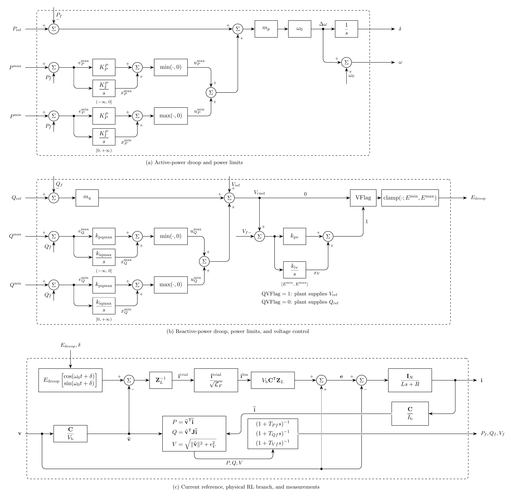

# Droop-Controlled Grid-Forming Inverter (REGFMA/REGFM_A1) Model

`Regfma` implements an averaged EMT realization of the WECC REGFM_A1
active- and reactive-power droop, power-limit, voltage, and fault-current
controls behind a physical RL branch.[^wecc]
Current $\mathbf{i}$ is injected from the inverter into the EMT bus.

The controls use stationary, power-invariant $\alpha\beta$ coordinates for
balanced fundamental studies. The current-reference realization below replaces
the detailed PSCAD inner controls.[^pscad]

## Block Diagram



Figure 1: REGFMA model

## Model Parameters

Symbol | Units | JSON | Description | Note
------ | ----- | ---- | ----------- | ----
$S_\mathrm{b}$ | [VA] | `S` | Rated three-phase apparent power | Required, positive
$V_\mathrm{b}$ | [V] | `V` | Rated line-to-line RMS voltage | Required, positive
$\omega_0$ | [rad/s] | `omega0` | Rated electrical angular frequency | Default $120\pi$
$X_L$ | [p.u.] | `XL` | Filter series reactance | Default $0.15$
$R_L$ | [p.u.] | `RL` | Filter series resistance | Default $0.03$
$m_p$ | [p.u.] | `mp` | Active-power droop gain | Default $0.01$
$m_q$ | [p.u.] | `mq` | Reactive-power droop gain | Default $0.05$
$k_{\mathrm{pv}}$ | [p.u.] | `kpv` | Voltage proportional gain | Default $0$
$k_{\mathrm{iv}}$ | [$\mathrm{s}^{-1}$] | `kiv` | Voltage integral gain | Default $5.86$
$E^{\min}$ | [p.u.] | `Emin` | Minimum droop voltage magnitude | Default $0$
$E^{\max}$ | [p.u.] | `Emax` | Maximum droop voltage magnitude | Default $1.15$
$P^{\min}$ | [p.u.] | `Pmin` | Minimum active-power output | Default $0$
$P^{\max}$ | [p.u.] | `Pmax` | Maximum active-power output | Default $0.9$
$Q^{\min}$ | [p.u.] | `Qmin` | Minimum reactive-power output | Default $-0.44$
$Q^{\max}$ | [p.u.] | `Qmax` | Maximum reactive-power output | Default $0.44$
$k_{\mathrm{ppmax}}$ | [p.u.] | `kppmax` | Active-power-limit proportional gain | Default $0.01$
$k_{\mathrm{ipmax}}$ | [$\mathrm{s}^{-1}$] | `kipmax` | Active-power-limit integral gain | Default $0.1$
$k_{\mathrm{pqmax}}$ | [p.u.] | `kpqmax` | Reactive-power-limit proportional gain | Defaults $3$ (`VFlag = true`), $0.1$ (`false`)
$k_{\mathrm{iqmax}}$ | [$\mathrm{s}^{-1}$] | `kiqmax` | Reactive-power-limit integral gain | Defaults $20$ (`VFlag = true`), $10$ (`false`)
$T_{Pf}$ | [s] | `TPf` | Active-power filter time constant | Default $0.01$
$T_{Qf}$ | [s] | `TQf` | Reactive-power filter time constant | Default $0.01$
$T_{Vf}$ | [s] | `TVf` | Voltage filter time constant | Default $0.01$
$I_F^{\max}$ | [p.u.] | `ImaxF` | Transient current-reference limit | Default $2$
$\mathrm{VFlag}$ | [-] | `VFlag` | Enable terminal-voltage PI control | Default `true`
$\mathrm{QVFlag}$ | [-] | `QVFlag` | Select plant voltage-reference control | Default `true`

All per-unit quantities use the inverter rating base. `VFlag = false` selects
direct internal-voltage control. `QVFlag = false` selects the plant
reactive-power reference.

### Parameter Validation

All parameters and derived coefficients must be finite.

```math
\begin{aligned}
S_\mathrm{b}, V_\mathrm{b}, \omega_0, R_L, X_L, m_p &> 0 \\
T_{Pf}, T_{Qf}, T_{Vf}, I_F^{\max} &> 0 \\
m_q, k_{\mathrm{pv}}, k_{\mathrm{iv}} &\ge 0 \\
k_{\mathrm{ppmax}}, k_{\mathrm{ipmax}}, k_{\mathrm{pqmax}}, k_{\mathrm{iqmax}} &\ge 0 \\
0 &\le E^{\min} < E^{\max} \\
P^{\min} &\le P^{\max} \\
Q^{\min} &\le Q^{\max}
\end{aligned}
```

`VFlag` and `QVFlag` must be Boolean and fixed during simulation.

### Derived Parameters

The phase count is fixed at $N=3$. The base quantities, physical filter
parameters, and normalized active-power-limit gains are

```math
\begin{aligned}
I_\mathrm{b} &= \dfrac{S_\mathrm{b}}{V_\mathrm{b}} \\
Z_\mathrm{b} &= \dfrac{V_\mathrm{b}^2}{S_\mathrm{b}} \\
R &= R_L Z_\mathrm{b} \\
L &= \dfrac{X_L Z_\mathrm{b}}{\omega_0} \\
K_P^P &= \dfrac{k_{\mathrm{ppmax}}}{m_p} \\
K_I^P &= \dfrac{k_{\mathrm{ipmax}}}{m_p}
\end{aligned}
```

For $b \in \{\min,\max\}$, the corresponding specification states and
frequency corrections satisfy

```math
x_{P,\mathrm{WECC}}^b = m_p x_P^b,
\qquad
u_{P,\mathrm{WECC}}^b = m_p u_P^b.
```

The stationary transformation and matrix representation of the complex unit are

```math
\mathbf{C} = \sqrt{\dfrac{2}{3}}
\begin{bmatrix}
1 & -\dfrac{1}{2} & -\dfrac{1}{2} \\
0 & \dfrac{\sqrt{3}}{2} & -\dfrac{\sqrt{3}}{2}
\end{bmatrix},
\qquad
\mathbf{J} =
\begin{bmatrix}
0 & -1 \\
1 & 0
\end{bmatrix}
```

$\mathbf{C}$ contains the $\alpha\beta$ rows of the
[Clarke](../../../Operators/Reference/Clarke/README.md) transformation.
The nominal-frequency impedance and its inverse are

```math
\mathbf{Z}_L = R_L\mathbf{I}_2+X_L\mathbf{J},
\qquad
\mathbf{Z}_L^{-1} = \dfrac{R_L\mathbf{I}_2-X_L\mathbf{J}}{R_L^2+X_L^2}
```

The voltage-magnitude regularization is $\epsilon_V=10^{-8}$ p.u.

## Model Ports

Symbol | Port | Type | Units | Description | Note
------ | ---- | ---- | ----- | ----------- | ----
$\mathbf{v}$ | `v` | Input | [V] | Bus voltage at inverter port | $\mathbf{v} \in \mathbb{R}^N$
$\mathbf{i}$ | `i` | Output | [A] | Current injection at inverter port | $\mathbf{i} \in \mathbb{R}^N$
$P_\mathrm{ref}$ | `pref` | Input | [p.u.] | Active-power reference | Optional signal, latched when unattached
$Q_\mathrm{ref}$ | `qref` | Input | [p.u.] | Reactive-power reference | Optional signal, latched when unattached
$V_\mathrm{ref}$ | `vref` | Input | [p.u.] | Voltage reference | Optional signal, latched when unattached

Phase vectors use $(a,b,c)$ order. Terminal voltages must be connected and all
connected inputs must be finite. The bus registers the injected current signals.

## Submodels

None.

### Submodel Validation

None.

## Model Variables

### Internal Variables

#### Differential

Symbol | Units | Description | Note
------ | ----- | ----------- | ----
$P_f$ | [p.u.] | Filtered terminal active power |
$Q_f$ | [p.u.] | Filtered terminal reactive power |
$V_f$ | [p.u.] | Filtered terminal voltage magnitude |
$x_P^{\max}$ | [p.u.] | Upper active-power-limit integral contribution |
$x_P^{\min}$ | [p.u.] | Lower active-power-limit integral contribution |
$x_Q^{\max}$ | [p.u.] | Upper reactive-power-limit integral contribution |
$x_Q^{\min}$ | [p.u.] | Lower reactive-power-limit integral contribution |
$x_V$ | [p.u.] | Voltage integral contribution | Held when `VFlag` is `false`
$\delta$ | [rad] | Internal angle in the rated-frequency frame |
$\mathbf{i}$ | [A] | Filter current injection | $\mathbf{i} \in \mathbb{R}^N$

#### Algebraic

None.

### External Variables

#### Differential

None.

#### Algebraic

Symbol | Units | Description | Note
------ | ----- | ----------- | ----
$\mathbf{v}$ | [V] | Bus voltage vector | $\mathbf{v} \in \mathbb{R}^N$
$P_\mathrm{ref}$ | [p.u.] | Active-power reference | Latched setpoint when unattached
$Q_\mathrm{ref}$ | [p.u.] | Reactive-power reference | Latched setpoint when unattached
$V_\mathrm{ref}$ | [p.u.] | Voltage reference | Latched setpoint when unattached

## Model Equations

The terminal measurements in inverter per unit are

```math
\begin{aligned}
\widehat{\mathbf{v}} &= \dfrac{\mathbf{C}\mathbf{v}}{V_\mathrm{b}} \\
\widehat{\mathbf{i}} &= \dfrac{\mathbf{C}\mathbf{i}}{I_\mathrm{b}} \\
P &= \widehat{\mathbf{v}}^\mathsf{T}\widehat{\mathbf{i}} \\
Q &= \widehat{\mathbf{v}}^\mathsf{T}\mathbf{J}\widehat{\mathbf{i}} \\
V &= \sqrt{\|\widehat{\mathbf{v}}\|_2^2+\epsilon_V^2}
\end{aligned}
```

Positive $P$ and $Q$ denote injection at the terminal. The power-limit errors
and PI outputs are

```math
\begin{aligned}
e_P^{\max} &= P^{\max}-P_f \\
e_P^{\min} &= P^{\min}-P_f \\
e_Q^{\max} &= Q^{\max}-Q_f \\
e_Q^{\min} &= Q^{\min}-Q_f \\
u_P^{\max} &= \min(K_P^P e_P^{\max}+x_P^{\max},0) \\
u_P^{\min} &= \max(K_P^P e_P^{\min}+x_P^{\min},0) \\
u_Q^{\max} &= \min(k_{\mathrm{pqmax}}e_Q^{\max}+x_Q^{\max},0) \\
u_Q^{\min} &= \max(k_{\mathrm{pqmax}}e_Q^{\min}+x_Q^{\min},0)
\end{aligned}
```

The frequency deviation and voltage command are

```math
\begin{aligned}
\Delta\omega &= \omega_0 m_p(P_\mathrm{ref}-P_f+u_P^{\max}+u_P^{\min}) \\
\omega &= \omega_0+\Delta\omega \\
V_\mathrm{cmd} &= V_\mathrm{ref}+m_q(Q_\mathrm{ref}-Q_f)+u_Q^{\max}+u_Q^{\min} \\
e_V &= V_\mathrm{cmd}-V_f \\
E_\mathrm{raw} &=
\begin{cases}
V_\mathrm{cmd}, & \mathrm{VFlag}=\mathrm{false} \\
k_{\mathrm{pv}}e_V+x_V, & \mathrm{VFlag}=\mathrm{true}
\end{cases} \\
E_\mathrm{droop} &= \mathrm{clamp}(E_\mathrm{raw};E^{\min},E^{\max})
\end{aligned}
```

The control limits and integrator bounds use the CommonMath smooth
[`min`](../../../../../CommonMath.md#minimum),
[`max`](../../../../../CommonMath.md#maximum),
[`clamp`](../../../../../CommonMath.md#clamp), and
[`antiwindup`](../../../../../CommonMath.md#antiwindup) functions.

The source voltage and limited current reference are

```math
\begin{aligned}
\theta &= \omega_0 t+\delta \\
\widehat{\mathbf{e}}^{\mathrm{droop}} &= E_\mathrm{droop}
\begin{bmatrix}
\cos\theta \\
\sin\theta
\end{bmatrix} \\
\mathbf{i}^{\mathrm{trial}} &= \mathbf{Z}_L^{-1}
  (\widehat{\mathbf{e}}^{\mathrm{droop}}-\widehat{\mathbf{v}}) \\
\mathcal{L}_F &= \max\left(1,
  \dfrac{\|\mathbf{i}^{\mathrm{trial}}\|_2^2}{(I_F^{\max})^2}\right) \\
\mathbf{i}^{\mathrm{lim}} &= \dfrac{\mathbf{i}^{\mathrm{trial}}}{\sqrt{\mathcal{L}_F}} \\
\mathbf{e} &= \mathbf{v}+V_\mathrm{b}\mathbf{C}^\mathsf{T}\mathbf{Z}_L\mathbf{i}^{\mathrm{lim}}
\end{aligned}
```

The limiter bounds the nominal-frequency current reference and preserves its
direction. The physical filter current can overshoot. $\mathbf{e}$ includes
the bus common-mode voltage; zero-sequence current decays with time constant
$L/R$. Shunt capacitance and damping are external circuit elements.

### Internal Equations

#### Differential

```math
\begin{aligned}
0 &= -\dfrac{\mathrm{d}P_f}{\mathrm{d}t}+\dfrac{P-P_f}{T_{Pf}} \\
0 &= -\dfrac{\mathrm{d}Q_f}{\mathrm{d}t}+\dfrac{Q-Q_f}{T_{Qf}} \\
0 &= -\dfrac{\mathrm{d}V_f}{\mathrm{d}t}+\dfrac{V-V_f}{T_{Vf}} \\
0 &= -\dfrac{\mathrm{d}x_P^{\max}}{\mathrm{d}t}
  +\mathrm{antiwindup}(x_P^{\max},K_I^P e_P^{\max};-\infty,0) \\
0 &= -\dfrac{\mathrm{d}x_P^{\min}}{\mathrm{d}t}
  +\mathrm{antiwindup}(x_P^{\min},K_I^P e_P^{\min};0,+\infty) \\
0 &= -\dfrac{\mathrm{d}x_Q^{\max}}{\mathrm{d}t}
  +\mathrm{antiwindup}(x_Q^{\max},k_{\mathrm{iqmax}}e_Q^{\max};-\infty,0) \\
0 &= -\dfrac{\mathrm{d}x_Q^{\min}}{\mathrm{d}t}
  +\mathrm{antiwindup}(x_Q^{\min},k_{\mathrm{iqmax}}e_Q^{\min};0,+\infty) \\
0 &= -\dfrac{\mathrm{d}x_V}{\mathrm{d}t}
  +\begin{cases}
    0, & \mathrm{VFlag}=\mathrm{false} \\
    \mathrm{antiwindup}(x_V,k_{\mathrm{iv}}e_V;E^{\min},E^{\max}),
      & \mathrm{VFlag}=\mathrm{true}
  \end{cases} \\
0 &= -\dfrac{\mathrm{d}\delta}{\mathrm{d}t}+\Delta\omega \\
0 &= -\dfrac{\mathrm{d}\mathbf{i}}{\mathrm{d}t}
  +\dfrac{\mathbf{e}-\mathbf{v}-R\mathbf{i}}{L}
\end{aligned}
```

#### Algebraic

None.

### External Equations

None.

## Initialization

The terminal voltages and supplied phase-current injections define a balanced
positive-sequence operating point at $t_0$. The phase-current state-file values
`ia`, `ib`, and `ic` default to zero. They must be finite, have zero sum, and
satisfy $\|\widehat{\mathbf{i}}_0\|_2<I_F^{\max}$.

The initial limit factor satisfies
$\mathcal{L}_{F,0}=\max(1,\mathcal{L}_{F,0}\|\widehat{\mathbf{i}}_0\|_2^2/(I_F^{\max})^2)$.
The inverse of the CommonMath smooth clamp is denoted by $\mathrm{clamp}^{-1}$.

```math
\begin{aligned}
\mathbf{i}^{\mathrm{trial}}_0 &\leftarrow \sqrt{\mathcal{L}_{F,0}}\,\widehat{\mathbf{i}}_0 \\
\widehat{\mathbf{e}}^{\mathrm{droop}}_0 &\leftarrow
  \widehat{\mathbf{v}}_0+\mathbf{Z}_L\mathbf{i}^{\mathrm{trial}}_0 \\
E_0 &\leftarrow \|\widehat{\mathbf{e}}^{\mathrm{droop}}_0\|_2 \\
E_{\mathrm{raw},0} &\leftarrow \mathrm{clamp}^{-1}(E_0;E^{\min},E^{\max}) \\
P_f &\leftarrow P_0 \\
Q_f &\leftarrow Q_0 \\
V_f &\leftarrow V_0 \\
x_P^{\max},x_P^{\min},x_Q^{\max},x_Q^{\min} &\leftarrow 0 \\
\delta &\leftarrow \angle
  (\widehat e^{\mathrm{droop}}_{0,\alpha}+\mathrm{j}\widehat e^{\mathrm{droop}}_{0,\beta})
  -\omega_0 t_0 \\
Q_\mathrm{ref} &\leftarrow
\begin{cases}
0, & \mathrm{QVFlag}=\mathrm{true} \\
Q_f, & \mathrm{QVFlag}=\mathrm{false}
\end{cases} \\
P_\mathrm{ref} &\leftarrow P_f-u_P^{\max}-u_P^{\min} \\
V_\mathrm{ref} &\leftarrow
\begin{cases}
E_{\mathrm{raw},0}-m_q(Q_\mathrm{ref}-Q_f)-u_Q^{\max}-u_Q^{\min},
  & \mathrm{VFlag}=\mathrm{false} \\
V_f-m_q(Q_\mathrm{ref}-Q_f)-u_Q^{\max}-u_Q^{\min},
  & \mathrm{VFlag}=\mathrm{true}
\end{cases} \\
x_V &\leftarrow
\begin{cases}
E_0, & \mathrm{VFlag}=\mathrm{false} \\
E_{\mathrm{raw},0}-k_{\mathrm{pv}}e_V, & \mathrm{VFlag}=\mathrm{true}
\end{cases}
\end{aligned}
```

The initial magnitude must satisfy $E^{\min}<E_0<E^{\max}$; the active voltage
integral must lie within $[E^{\min},E^{\max}]$. Inferred references are latched
when unattached. Attached references and all differential states are preserved.
At the matched nominal-frequency operating point,

```math
\dfrac{\mathrm{d}\mathbf{i}}{\mathrm{d}t}\leftarrow
\omega_0 I_\mathrm{b}\mathbf{C}^\mathsf{T}\mathbf{J}\widehat{\mathbf{i}}_0
```

Consistent initialization resolves the state derivatives from the applied
references. Power-limit integral derivatives can initially be nonzero under
smooth anti-windup.

## Monitors

Monitor | Units | Description | Note
------- | ----- | ----------- | ----
`pf` | [p.u.] | Filtered terminal active power |
`qf` | [p.u.] | Filtered terminal reactive power |
`vf` | [p.u.] | Filtered terminal voltage magnitude |
`xpmax` | [p.u.] | Upper active-power-limit integral contribution |
`xpmin` | [p.u.] | Lower active-power-limit integral contribution |
`xqmax` | [p.u.] | Upper reactive-power-limit integral contribution |
`xqmin` | [p.u.] | Lower reactive-power-limit integral contribution |
`xv` | [p.u.] | Voltage integral contribution |
`delta` | [rad] | Internal angle in the rated-frequency frame |
`i` | [A] | Filter current injection | $\mathbf{i} \in \mathbb{R}^N$
`e` | [V] | Applied internal voltage | $\mathbf{e} \in \mathbb{R}^N$
`omega` | [rad/s] | Internal angular frequency |
`edroop` | [p.u.] | Droop voltage magnitude |
`p` | [W] | Active power injection | $S_\mathrm{b}P$
`q` | [var] | Reactive power injection | $S_\mathrm{b}Q$
`v` | [V] | Terminal voltage magnitude | $V_\mathrm{b}V$

See [case connections](../../../INPUT_FORMAT.md#case-connections) for vector
ports and monitor expansion.

[^wecc]: Pacific Northwest National Laboratory,
    [*Model Specification of Droop-Controlled, Grid-Forming Inverters (REGFM_A1)*](https://www.wecc.org/sites/default/files/documents/products/2024/Model%20Specification%20of%20Droop-Controlled%20Grid-Forming%20Inverters-REGFM_A1.pdf),
    PNNL-32278, September 2023, Table 1, Figures 3–4, equations (4)–(9), and Section 5.

[^pscad]: Pacific Northwest National Laboratory,
    [*PSCAD and PSSE Version of WECC Grid-Forming Inverter Models*](https://github.com/pnnl/PSCAD-and-PSSE-Version-of-WECC-Grid-Forming-Inverter-Models/releases/tag/V1),
    release V1, REGFM_A1 main-circuit parameters `L1_pu` and `R1_pu`.
    The published model includes virtual-admittance and inner-current controls.
