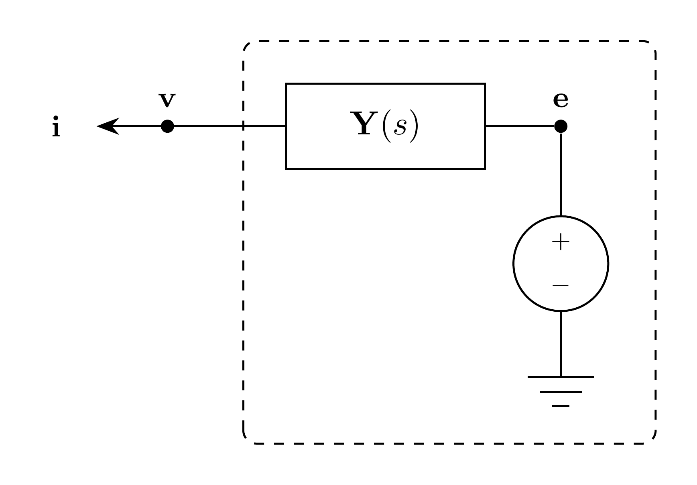

# VoltageSource Model

`VoltageSource` represents a three-phase sinusoidal EMT voltage source connected
to the EMT bus through terminal admittance.

## Block Diagram



Figure 1: VoltageSource model

## Model Parameters

Symbol | Units | JSON | Description | Note
------ | ----- | ---- | ----------- | ----
$N$ | [-] | `N` | Number of phases | Fixed at $3$
$\mathbf{E}$ | [V] | `E` | Source voltage magnitudes | $\mathbf{E} \in \mathbb{R}_{\ge 0}^N$, RMS
$\boldsymbol{\phi}$ | [rad] | `phi` | Source phase offsets | $\boldsymbol{\phi} \in \mathbb{R}^N$
$\omega$ | [rad/s] | `omega` | Source angular frequency | Required, positive
$\mathbf{R}_\mathrm{s}$ | [$\Omega$] | `Rs` | Series resistance matrix | Used when `Y` is absent
$\mathbf{L}_\mathrm{s}$ | [H] | `Ls` | Series inductance matrix | Used when `Y` is absent

### Parameter Validation

```math
\begin{aligned}
N &= 3 \\
\mathbf{E} &\in \mathbb{R}_{\ge 0}^N \\
\boldsymbol{\phi} &\in \mathbb{R}^N \\
\omega &> 0
\end{aligned}
```

### Derived Parameters

Define the phase-index set

```math
\mathcal{N} = \{1,\ldots,N\}.
```

## Model Ports

Symbol | Port | Type | Units | Description | Note
------ | ---- | ---- | ----- | ----------- | ----
$\mathbf{v}$ | `v` | Input | [V] | Bus voltage at source port | $\mathbf{v} \in \mathbb{R}^N$
$\mathbf{i}$ | `i` | Output | [A] | Current injection at source port | $\mathbf{i} \in \mathbb{R}^N$

## Submodels

Symbol | Description | Type | Order | JSON | Inputs | Outputs
------ | ----------- | ---- | ----- | ---- | ------ | -------
$\mathbf{y}$ | Terminal admittance | [VectorFit](../../../Operators/Rational/VectorFit/README.md) | $NQ_{\mathbf{y}}$ | `Y` | $\mathbb{R}^N$ | $\mathbb{R}^N$

### Submodel Validation

`Y` has three inputs and three outputs. Its linear coefficient is zero because
its input is the algebraic branch voltage. When `Y` is supplied, `Rs` and `Ls`
must be zero.

## Model Variables

### Internal Variables

#### Differential

None.

#### Algebraic

Symbol | Units | Description | Note
------ | ----- | ----------- | ----
$\mathbf{e}$ | [V] | Source voltage vector | $\mathbf{e} \in \mathbb{R}^N$
$\mathbf{u}$ | [V] | Admittance input $\mathbf{e}-\mathbf{v}$ | Present when `Y` is supplied

### External Variables

#### Differential

Symbol | Units | Description | Note
------ | ----- | ----------- | ----
$\mathbf{v}$ | [V] | Bus voltage vector owned by EMT bus | $\mathbf{v} \in \mathbb{R}^N$

#### Algebraic

None.

## Model Equations

### Internal Equations

#### Differential

None.

#### Algebraic

```math
0 = e_n - \sqrt{2}E_n\cos(\omega t + \phi_n),
\quad n \in \mathcal{N}
\qquad
0 = \mathbf{u} + \mathbf{v} - \mathbf{e}
```

### External Equations

```math
\mathbf{i} \leftarrow \mathbf{y}[\mathbf{e} - \mathbf{v}]
```

## Initialization

The default initialization sets the branch voltage to the source voltage minus
the bus voltage and starts rational memory states de-energized. Legacy series
currents start at zero. `initializeSteadyState(omega)` instead uses the attached
voltage values and derivatives as sinusoidal samples, solves the legacy
impedance branch when needed, and initializes all rational memory states.

## Monitors

Monitor | Units | Description | Note
------- | ----- | ----------- | ----
`e` | [V] | Source voltage | $\mathbf{e} \in \mathbb{R}^N$
`i` | [A] | Source current injection | $\mathbf{i} \in \mathbb{R}^N$

## Series Impedance Specialization

When `Y` is absent, a VectorFit impedance submodel uses
$\mathbf{D}=\mathbf{R}_\mathrm{s}$ and
$\mathbf{E}=\mathbf{L}_\mathrm{s}$, with no poles. It reads the owned branch
current and contributes its output to

```math
0 = \mathbf{z}[\mathbf{i}] + \mathbf{v} - \mathbf{e}.
```

Each current component is differential when its column of
$\mathbf{L}_\mathrm{s}$ is nonzero and algebraic otherwise. Both series
matrices must be finite. Nonzero inductance columns must be linearly independent.
