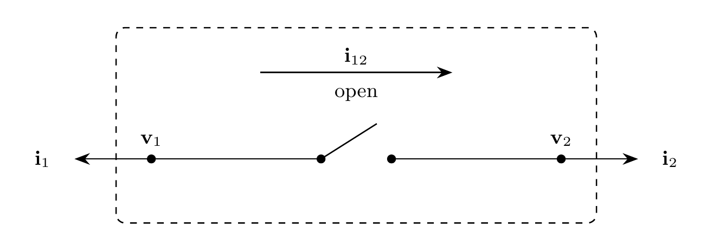

# Switch Model

`Switch` represents an ideal $N$-phase EMT switch between two buses. Series
current $\mathbf{i}_{12}$ is directed from terminal 1 to terminal 2. The
required Boolean input `open` operates all phases: `true` is open and
`false` is closed. The switch contains no energy storage; switching
transients arise from the connected EMT network.

## Block Diagram



Figure 1: Switch model

## Model Parameters

Symbol | Units | JSON | Description | Note
------ | ----- | ---- | ----------- | ----
$N$ | [-] | `N` | Number of phases | Required, positive integer

### Parameter Validation

```math
N \in \mathbb{Z}_{>0}
```

### Derived Parameters

None.

## Model Ports

Symbol | Port | Type | Units | Description | Note
------ | ---- | ---- | ----- | ----------- | ----
$\mathbf{v}_1$ | `v1` | Input | [V] | Terminal 1 bus voltage | $\mathbf{v}_1 \in \mathbb{R}^N$
$\mathbf{v}_2$ | `v2` | Input | [V] | Terminal 2 bus voltage | $\mathbf{v}_2 \in \mathbb{R}^N$
$\mathrm{open}$ | `open` | Input | [-] | Ganged switch command | Required Boolean; `true` open, `false` closed
$\mathbf{i}_1$ | `i1` | Output | [A] | Current injection at terminal 1 | $\mathbf{i}_1 \in \mathbb{R}^N$
$\mathbf{i}_2$ | `i2` | Output | [A] | Current injection at terminal 2 | $\mathbf{i}_2 \in \mathbb{R}^N$

## Submodels

None.

### Submodel Validation

None.

## Model Variables

### Internal Variables

#### Differential

None.

#### Algebraic

Symbol | Units | Description | Note
------ | ----- | ----------- | ----
$\mathbf{i}_{12}$ | [A] | Series current from terminal 1 to terminal 2 | $\mathbf{i}_{12} \in \mathbb{R}^N$

### External Variables

#### Differential

Symbol | Units | Description | Note
------ | ----- | ----------- | ----
$\mathbf{v}_1$ | [V] | Terminal 1 voltage owned by EMT bus | $\mathbf{v}_1 \in \mathbb{R}^N$
$\mathbf{v}_2$ | [V] | Terminal 2 voltage owned by EMT bus | $\mathbf{v}_2 \in \mathbb{R}^N$

#### Algebraic

None.

## Model Equations

### Internal Equations

#### Differential

None.

#### Algebraic

```math
\begin{cases}
\mathbf{i}_{12} = \mathbf{0}, & \text{open}, \\
\mathbf{v}_2-\mathbf{v}_1 = \mathbf{0}, & \text{closed}.
\end{cases}
```

### External Equations

```math
\begin{aligned}
\mathbf{i}_1 &\leftarrow -\mathbf{i}_{12} \\
\mathbf{i}_2 &\leftarrow \mathbf{i}_{12}.
\end{aligned}
```

## Initialization

The `open` command is applied at $t_0$ before enforcing the algebraic
equations. The switch has no additional model-specific initialization.

## Monitors

Monitor | Units | Description | Note
------- | ----- | ----------- | ----
`open` | [-] | Switch command | Boolean; `true` open, `false` closed
`i12` | [A] | Series current from terminal 1 to terminal 2 | $\mathbf{i}_{12} \in \mathbb{R}^N$
