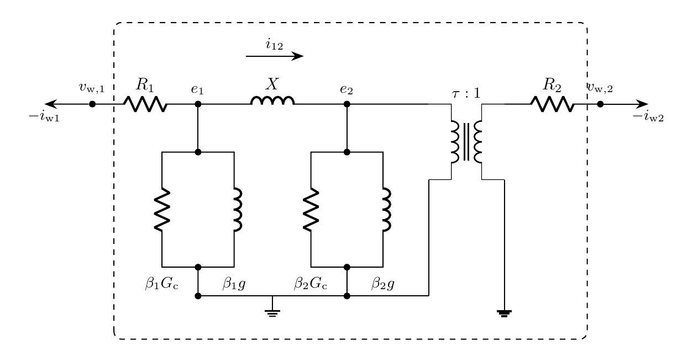

# Transformer Model

`Transformer` represents a three-phase bank of two-winding transformers in
instantaneous phase coordinates with a duality-derived $\pi$ core. Terminal
connection maps apply the winding configuration. Currents $\mathbf{i}_1$ and
$\mathbf{i}_2$ are injected from the transformer into the EMT buses.

> [!NOTE]
> Internal quantities use the rated transformer per-unit bases. The
> magnetizing branch is split between the two winding nodes, and its final
> slope is the terminal saturation inductance. Phases are magnetically
> independent; core topology, hysteresis, and capacitances are not represented.
> The reference is Jazebi et al., Duality Derived Transformer Models for
> Low-Frequency Electromagnetic Transients, Parts I and II.

## Block Diagram



Figure 1: Transformer model

## Model Parameters

Symbol | Units | JSON | Description | Note
------ | ----- | ---- | ----------- | ----
$N$ | [-] | `N` | Number of phases | Fixed at $3$
$S_\mathrm{b}$ | [VA] | `S` | Rated three-phase apparent power | Required, positive
$V_1$ | [V] | `V1` | Rated line-to-line RMS voltage of winding 1 | Required, positive
$V_2$ | [V] | `V2` | Rated line-to-line RMS voltage of winding 2 | Required, positive
$f_\mathrm{b}$ | [Hz] | `f` | Rated frequency | Required, positive
$\mathbf{P}_1$ | [-] | `P1` | Terminal 1 connection map | Default $\mathbf{I}_N$
$\mathbf{P}_2$ | [-] | `P2` | Terminal 2 connection map | Default $\mathbf{I}_N$
$\tau$ | [p.u.] | `tap` | Off-nominal ratio on winding 1 | Default $1$
$R$ | [p.u.] | `R` | Short-circuit resistance | Nonnegative
$X$ | [p.u.] | `X` | Short-circuit reactance | Required, positive
$I_0$ | [p.u.] | `I0` | No-load current at rated voltage | Required, positive
$P_0$ | [W] | `P0` | No-load loss at rated voltage | Nonnegative
$\psi_\mathrm{K}$ | [p.u.] | `knee` | Knee flux linkage | Default $1.2$
$L_\mathrm{sat}$ | [p.u.] | `Lsat` | Terminal saturation inductance | Positive, defaults to $2X$
$\beta$ | [-] | `split` | Winding 1 share of the magnetizing branch | Default $0.5$

### Parameter Validation

```math
\begin{aligned}
N &= 3 \\
S_\mathrm{b}, V_1, V_2, f_\mathrm{b} &> 0 \\
\tau &> 0 \\
R &\ge 0 \\
X &> 0 \\
P_0 &\ge 0 \\
I_0 &> P_0 / S_\mathrm{b} \\
\psi_\mathrm{K}, L_\mathrm{sat} &> 0 \\
0 \le \beta &\le 1 \\
\mathbf{P}_1, \mathbf{P}_2 &\in \{-1, 0, 1\}^{N \times N}
\end{aligned}
```

Each column of $\mathbf{P}_e$ has one entry $+1$, at most one entry $-1$, and
zeros elsewhere. Ungrounded neutrals are not represented. The derived
$L_\mathrm{m}$ must exceed $L_\mathrm{sat}$.

### Derived Parameters

The phase count is fixed at $N=3$, with $\mathcal{N}=\{1,2,3\}$ and terminal
index $e \in \{1,2\}$. The positive-sequence unit phasors use the phase
offsets $\gamma_a = 0$, $\gamma_b = -2\pi/3$, and $\gamma_c = +2\pi/3$,
$\alpha_n = e^{\mathrm{j}\gamma_n}$.

```math
\begin{aligned}
\omega_\mathrm{b} &= 2\pi f_\mathrm{b} \\
V_{\mathrm{w},e} &= \dfrac{V_e}{\sqrt{3}}\left|(\mathbf{P}_e^\mathsf{T}\boldsymbol{\alpha})_1\right| \\
V_{\mathrm{pk},e} &= \sqrt{2}\,V_{\mathrm{w},e} \\
I_{\mathrm{pk},e} &= \dfrac{\sqrt{2}\,S_\mathrm{b}}{3\,V_{\mathrm{w},e}} \\
R_1 = R_2 &= R/2 \\
G_\mathrm{c} &= P_0 / S_\mathrm{b} \\
I_\mathrm{m} &= \sqrt{I_0^2 - G_\mathrm{c}^2} \\
L_\mathrm{m} &= 1 / I_\mathrm{m} \\
\beta_1 = \beta, \qquad \beta_2 &= 1 - \beta
\end{aligned}
```

## Model Ports

Symbol | Port | Type | Units | Description | Note
------ | ---- | ---- | ----- | ----------- | ----
$\mathbf{v}_1$ | `v1` | Input | [V] | Terminal 1 bus voltage | $\mathbf{v}_1 \in \mathbb{R}^N$
$\mathbf{v}_2$ | `v2` | Input | [V] | Terminal 2 bus voltage | $\mathbf{v}_2 \in \mathbb{R}^N$
$\mathbf{i}_1$ | `i1` | Output | [A] | Current injection at terminal 1 | $\mathbf{i}_1 \in \mathbb{R}^N$
$\mathbf{i}_2$ | `i2` | Output | [A] | Current injection at terminal 2 | $\mathbf{i}_2 \in \mathbb{R}^N$

In case JSON, `bus1` and `bus2` bind $\mathbf{v}_1$ and $\mathbf{v}_2$.

## Submodels

None.

### Submodel Validation

None.

## Model Variables

### Internal Variables

#### Differential

Symbol | Units | Description | Note
------ | ----- | ----------- | ----
$\mathbf{i}_{12}$ | [p.u.] | Series leakage current from node 1 to node 2 | $\mathbf{i}_{12} \in \mathbb{R}^N$
$\boldsymbol{\psi}_1$ | [p.u.] | Node 1 magnetizing flux linkage | $\boldsymbol{\psi}_1 \in \mathbb{R}^N$
$\boldsymbol{\psi}_2$ | [p.u.] | Node 2 magnetizing flux linkage | $\boldsymbol{\psi}_2 \in \mathbb{R}^N$

#### Algebraic

Symbol | Units | Description | Note
------ | ----- | ----------- | ----
$\mathbf{e}_1$ | [p.u.] | Node 1 voltage | $\mathbf{e}_1 \in \mathbb{R}^N$
$\mathbf{e}_2$ | [p.u.] | Node 2 voltage | $\mathbf{e}_2 \in \mathbb{R}^N$
$\mathbf{i}_\mathrm{m1}$ | [p.u.] | Node 1 magnetizing current | $\mathbf{i}_\mathrm{m1} \in \mathbb{R}^N$
$\mathbf{i}_\mathrm{m2}$ | [p.u.] | Node 2 magnetizing current | $\mathbf{i}_\mathrm{m2} \in \mathbb{R}^N$
$\mathbf{i}_\mathrm{w1}$ | [p.u.] | Winding 1 current | Positive into the winding
$\mathbf{i}_\mathrm{w2}$ | [p.u.] | Winding 2 current | Positive into the winding

### External Variables

#### Differential

When a connected equation depends on the bus-voltage derivative:

Symbol | Units | Description | Note
------ | ----- | ----------- | ----
$\mathbf{v}_1$ | [V] | Terminal 1 voltage owned by EMT bus | $\mathbf{v}_1 \in \mathbb{R}^N$
$\mathbf{v}_2$ | [V] | Terminal 2 voltage owned by EMT bus | $\mathbf{v}_2 \in \mathbb{R}^N$

#### Algebraic

Otherwise, the bus-voltage variables above are algebraic.

## Model Equations

The terminal voltages enter in transformer per unit through the connection
maps,

```math
\mathbf{v}_{\mathrm{w},e} = \dfrac{1}{V_{\mathrm{pk},e}}\,\mathbf{P}_e^\mathsf{T}\mathbf{v}_e,
\quad e \in \{1,2\}.
```

The magnetizing characteristic uses the
[ramp](../../../../CommonMath.md#ramp) $\rho$ and applies elementwise,

```math
g(\psi) = \dfrac{\psi}{L_\mathrm{m}}
  + \left(\dfrac{1}{L_\mathrm{sat}} - \dfrac{1}{L_\mathrm{m}}\right)
    \left(\rho(\psi - \psi_\mathrm{K}) - \rho(-\psi - \psi_\mathrm{K})\right).
```

### Internal Equations

#### Differential

```math
\begin{aligned}
0 &= \dfrac{X}{\omega_\mathrm{b}}\dfrac{\mathrm{d}\mathbf{i}_{12}}{\mathrm{d}t}
     + \mathbf{e}_2 - \mathbf{e}_1 \\
0 &= \dfrac{1}{\omega_\mathrm{b}}\dfrac{\mathrm{d}\boldsymbol{\psi}_1}{\mathrm{d}t}
     - \mathbf{e}_1 \\
0 &= \dfrac{1}{\omega_\mathrm{b}}\dfrac{\mathrm{d}\boldsymbol{\psi}_2}{\mathrm{d}t}
     - \mathbf{e}_2
\end{aligned}
```

#### Algebraic

```math
\begin{aligned}
0 &= \mathbf{e}_1 - \mathbf{v}_\mathrm{w1} + R_1\,\mathbf{i}_\mathrm{w1} \\
0 &= \mathbf{e}_2 - \tau\,\mathbf{v}_\mathrm{w2} + \tau R_2\,\mathbf{i}_\mathrm{w2} \\
0 &= \mathbf{i}_\mathrm{m1} - \beta_1\,g(\boldsymbol{\psi}_1) - \beta_1 G_\mathrm{c}\,\mathbf{e}_1 \\
0 &= \mathbf{i}_\mathrm{m2} - \beta_2\,g(\boldsymbol{\psi}_2) - \beta_2 G_\mathrm{c}\,\mathbf{e}_2 \\
0 &= \mathbf{i}_\mathrm{w1} - \mathbf{i}_\mathrm{m1} - \mathbf{i}_{12} \\
0 &= \mathbf{i}_\mathrm{w2} + \tau\,\mathbf{i}_{12} - \tau\,\mathbf{i}_\mathrm{m2}
\end{aligned}
```

### Terminal Currents

```math
\begin{aligned}
\mathbf{i}_1 &= -I_\mathrm{pk1}\,\mathbf{P}_1\,\mathbf{i}_\mathrm{w1} \\
\mathbf{i}_2 &= -I_\mathrm{pk2}\,\mathbf{P}_2\,\mathbf{i}_\mathrm{w2}
\end{aligned}
```

The bus registers these current signals and owns their residual and Jacobian
contributions to KCL.

## Initialization

The default initialization starts the series current and flux linkages
de-energized. `initializeSteadyState(omega)` instead uses the attached voltage
values and derivatives as sinusoidal samples of one phase,

```math
\bar{v}_{\mathrm{w},e} \leftarrow v_{\mathrm{w},e}
   - \dfrac{\mathrm{j}}{\omega_\mathrm{b}}\dfrac{\mathrm{d}v_{\mathrm{w},e}}{\mathrm{d}t},
```

and solves the node voltages with the unsaturated magnetizing admittance
$\bar{y}_e = \beta_e(G_\mathrm{c} - \mathrm{j}/L_\mathrm{m})$ and $\bar{z} = \mathrm{j}X$,

```math
\begin{bmatrix}
1 + R_1\bar{y}_1 + R_1/\bar{z} & -R_1/\bar{z} \\
-\tau^2 R_2/\bar{z} & 1 + \tau^2 R_2\bar{y}_2 + \tau^2 R_2/\bar{z}
\end{bmatrix}
\begin{bmatrix} \bar{e}_1 \\ \bar{e}_2 \end{bmatrix}
=
\begin{bmatrix} \bar{v}_\mathrm{w1} \\ \tau\,\bar{v}_\mathrm{w2} \end{bmatrix}.
```

```math
\begin{aligned}
\bar{\imath}_{12} &\leftarrow (\bar{e}_1 - \bar{e}_2)/\bar{z} \\
\bar{\psi}_e &\leftarrow -\mathrm{j}\,\bar{e}_e,
  \qquad \bar{\imath}_{\mathrm{m},e} \leftarrow \bar{y}_e\,\bar{e}_e \\
\bar{\imath}_\mathrm{w1} &\leftarrow \bar{\imath}_\mathrm{m1} + \bar{\imath}_{12},
  \qquad \bar{\imath}_\mathrm{w2} \leftarrow \tau\,(\bar{\imath}_\mathrm{m2} - \bar{\imath}_{12})
\end{aligned}
```

Each quantity takes the real part of its phasor at $t_0$; each state
derivative takes the real part of $\mathrm{j}\omega_\mathrm{b}$ times its phasor.
State-file `i12a`, `i12b`, `i12c`, `psi1a`, `psi1b`, `psi1c`, `psi2a`,
`psi2b`, and `psi2c` values override the series current and flux linkages at
$t_0$. The assembled consistent initialization resolves the remaining
variables.

## Monitors

Monitor | Units | Description | Note
------- | ----- | ----------- | ----
`i12` | [p.u.] | Series leakage current from node 1 to node 2 | $\mathbf{i}_{12} \in \mathbb{R}^N$
`psi1` | [p.u.] | Node 1 magnetizing flux linkage | $\boldsymbol{\psi}_1 \in \mathbb{R}^N$
`psi2` | [p.u.] | Node 2 magnetizing flux linkage | $\boldsymbol{\psi}_2 \in \mathbb{R}^N$
`i1` | [A] | Terminal 1 current injection | $\mathbf{i}_1 \in \mathbb{R}^N$
`i2` | [A] | Terminal 2 current injection | $\mathbf{i}_2 \in \mathbb{R}^N$

## Development

The per-unit rows are equivalent to the SI winding circuit referred to
winding 1, with base impedance $Z_\mathrm{b} = 3V_\mathrm{w1}^2/S_\mathrm{b}$:

```math
\begin{aligned}
L_\mathrm{s} &= X Z_\mathrm{b} / \omega_\mathrm{b} \\
R_1^\mathrm{SI} &= R_1 Z_\mathrm{b} \\
R_2^\mathrm{SI} &= R_2 Z_\mathrm{b}\,(V_\mathrm{w2}/V_\mathrm{w1})^2 \\
L_\mathrm{m}^\mathrm{SI} &= L_\mathrm{m} Z_\mathrm{b} / \omega_\mathrm{b} \\
\lambda_\mathrm{K} &= \psi_\mathrm{K}\,V_\mathrm{pk1} / \omega_\mathrm{b}
\end{aligned}
```

A no-load test at rated voltage sees the two magnetizing branches in
parallel, so $I_0$, $P_0$, $\psi_\mathrm{K}$, and $L_\mathrm{sat}$ are terminal
quantities of the bank.
