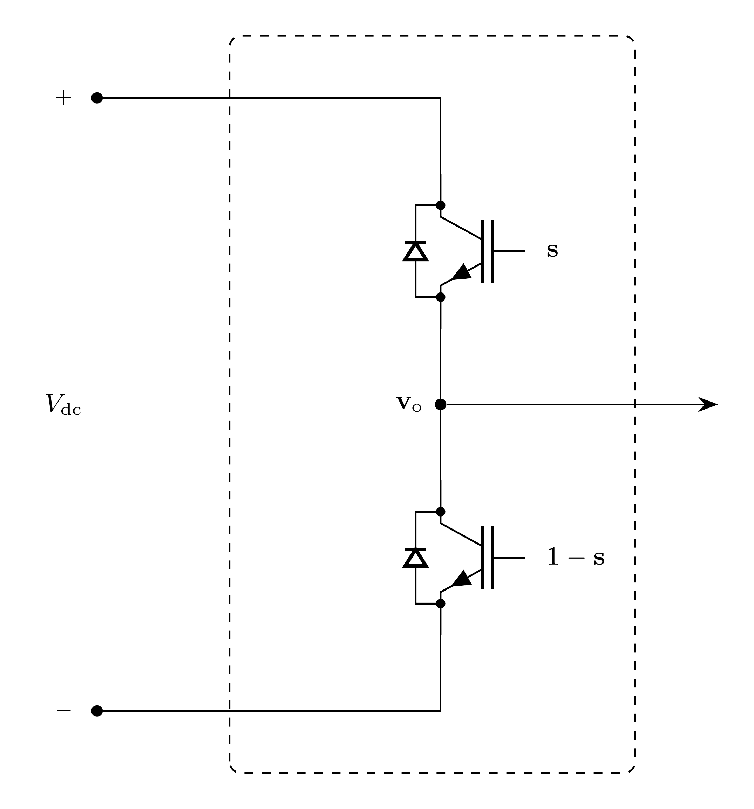

# Converter Model

`Converter` maps a DC-link voltage and three-phase switching function to the
bridge voltage of a two-level voltage-source inverter. The operator adds no DAE
variables or residual rows.

## Block Diagram



Figure 1: Converter model

## Model Parameters

None.

### Parameter Validation

None.

### Derived Parameters

The normalized phase incidence matrix and zero-sequence projector are

```math
\begin{aligned}
\mathbf{A} &=
\dfrac{1}{\sqrt{3}}\begin{bmatrix}
1 & -1 & 0 \\
0 & 1 & -1 \\
-1 & 0 & 1
\end{bmatrix} \\
\mathbf{P} &= \mathbf{A}^\mathsf{T}\mathbf{A}
=
\dfrac{1}{3}
\begin{bmatrix}
2 & -1 & -1 \\
-1 & 2 & -1 \\
-1 & -1 & 2
\end{bmatrix}
\end{aligned}
```

## Model Ports

Symbol | Port | Type | Units | Description | Note
------ | ---- | ---- | ----- | ----------- | ----
$\mathbf{s}$ | `s` | Input | [-] | Switching function vector | $\mathbf{s} \in [0,1]^3$
$V_{\mathrm{dc}}$ | `vdc` | Input | [V] | DC-link voltage | $V_{\mathrm{dc}} \ge 0$
$\mathbf{v}_{\mathrm{o}}$ | `vo` | Output | [V] | Bridge voltage vector | $\mathbf{v}_{\mathrm{o}} \in \mathbb{R}^3$

## Submodels

None.

### Submodel Validation

None.

## Model Variables

### Internal Variables

#### Differential

None.

#### Algebraic

None.

### External Variables

#### Differential

None.

#### Algebraic

Symbol | Units | Description | Note
------ | ----- | ----------- | ----
$\mathbf{s}$ | [-] | Switching function vector | $\mathbf{s} \in [0,1]^3$
$V_{\mathrm{dc}}$ | [V] | DC-link voltage | $V_{\mathrm{dc}} \ge 0$

## Model Equations

### Internal Equations

#### Differential

None.

#### Algebraic

None.

### External Equations

```math
\mathbf{v}_{\mathrm{o}} \leftarrow V_\mathrm{dc}\mathbf{P}\mathbf{s}
```

## Initialization

None beyond the EMT initialization contract.

## Monitors

Monitor | Units | Description | Note
------- | ----- | ----------- | ----
`vo` | [V] | Bridge voltage | $\mathbf{v}_{\mathrm{o}} \in \mathbb{R}^3$
