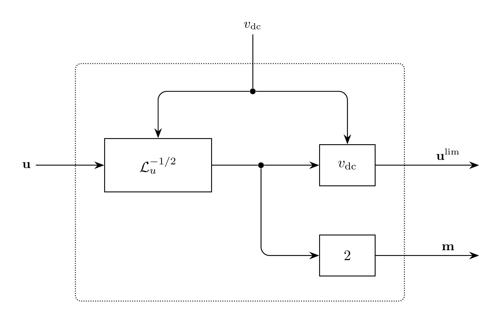

# Modulation Model

`Modulation` limits the $dq$ converter voltage command to the voltage
available from the DC link and normalizes it into the modulation command of
sinusoidal [PWM](../../Component/Controller/PWM/README.md). The limited command
is returned to
[InnerCurrentControl](../../Component/Controller/InnerCurrentControl/README.md)
for tracking anti-windup. The lossless operator adds no DAE variables or
residual rows.

## Block Diagram



Figure 1: Modulation model

## Model Parameters

Symbol | Units | JSON | Description | Note
------ | ----- | ---- | ----------- | ----
$M^{\max}$ | [-] | `Mmax` | Sinusoidal modulation limit | Default $1$, $0 < M^{\max} \le 1$

### Parameter Validation

```math
0 < M^{\max} \le 1
```

The limit must be finite.

### Derived Parameters

```math
a_u = \dfrac{8}{3(M^{\max})^2}
```

## Model Ports

Symbol | Port | Type | Units | Description | Note
------ | ---- | ---- | ----- | ----------- | ----
$\mathbf{u}$ | `u` | Input | [V] | Converter voltage command | $\mathbf{u} \in \mathbb{R}^2$
$v_{\mathrm{dc}}$ | `vdc` | Input | [V] | DC-link voltage | $v_{\mathrm{dc}} \ge 0$
$\mathbf{m}$ | `m` | Output | [-] | Modulation command | $\|\mathbf{m}\|_2 \le \sqrt{3/2}\,M^{\max}$
$\mathbf{u}^{\mathrm{lim}}$ | `ulim` | Output | [V] | Limited voltage command | $\mathbf{u}^{\mathrm{lim}} \in \mathbb{R}^2$

Vectors use $(d,q)$ order in the same power-invariant
[Park](../Reference/Park/README.md) frame as the current controller. All
inputs must be connected and finite. Connect `InnerCurrentControl.u` to `u`
and return `ulim` to its `ulim` input. Inverse-transform
$[m_d, m_q, 0]^\mathsf{T}$ to obtain the three-phase modulation command of
PWM.

## Submodels

None.

### Submodel Validation

None.

## Model Variables

### Internal Variables

#### Differential

None.

#### Algebraic

None.

### External Variables

#### Differential

None.

#### Algebraic

Symbol | Units | Description | Note
------ | ----- | ----------- | ----
$\mathbf{u}$ | [V] | Converter voltage command | $\mathbf{u} \in \mathbb{R}^2$
$v_{\mathrm{dc}}$ | [V] | DC-link voltage | $v_{\mathrm{dc}} \ge 0$

## Model Equations

The limiter factor is

```math
\mathcal{L}_u(v_{\mathrm{dc}},\mathbf{u}) =
  \max\left(v_{\mathrm{dc}}^2,a_u\|\mathbf{u}\|_2^2\right).
```

The direction-preserving limit uses the CommonMath smooth
[`max`](../../../../CommonMath.md#maximum) on squared voltages in
$\mathrm{V}^2$. In the power-invariant frame, a balanced phase peak of
$M^{\max}v_{\mathrm{dc}}/2$ corresponds to $\|\mathbf{u}\|_2 =
\sqrt{3/8}\,M^{\max}v_{\mathrm{dc}}$, the largest command sinusoidal PWM
realizes without zero-sequence injection.

### Internal Equations

#### Differential

None.

#### Algebraic

None.

### External Equations

```math
\begin{aligned}
\mathbf{m} &\leftarrow \dfrac{2\mathbf{u}}{\sqrt{\mathcal{L}_u(v_{\mathrm{dc}},\mathbf{u})}} \\
\mathbf{u}^{\mathrm{lim}} &\leftarrow
  \dfrac{v_{\mathrm{dc}}\mathbf{u}}{\sqrt{\mathcal{L}_u(v_{\mathrm{dc}},\mathbf{u})}}
  = \dfrac{v_{\mathrm{dc}}}{2}\mathbf{m}
\end{aligned}
```

Inside the limit, $\mathbf{m} = 2\mathbf{u}/v_{\mathrm{dc}}$ and
$\mathbf{u}^{\mathrm{lim}} = \mathbf{u}$. Beyond it, both outputs keep the
command direction at the limit magnitude. The outputs are algebraic
expressions without owned DAE variables and involve no division by
$v_{\mathrm{dc}}$: at zero DC voltage, the limited command is zero and the
modulation command lies on the limit circle.

## Initialization

From the initialized inputs, the outputs are evaluated as above. Prescribed
`md`, `mq`, `ulimd`, and `ulimq` values must match the evaluated outputs.

## Monitors

Monitor | Units | Description | Note
------- | ----- | ----------- | ----
`m` | [-] | Modulation command | Expands to `md`, `mq`
`ulim` | [V] | Limited voltage command | Expands to `ulimd`, `ulimq`

See [case connections](../../INPUT_FORMAT.md#case-connections) for vector
ports and monitor expansion.
