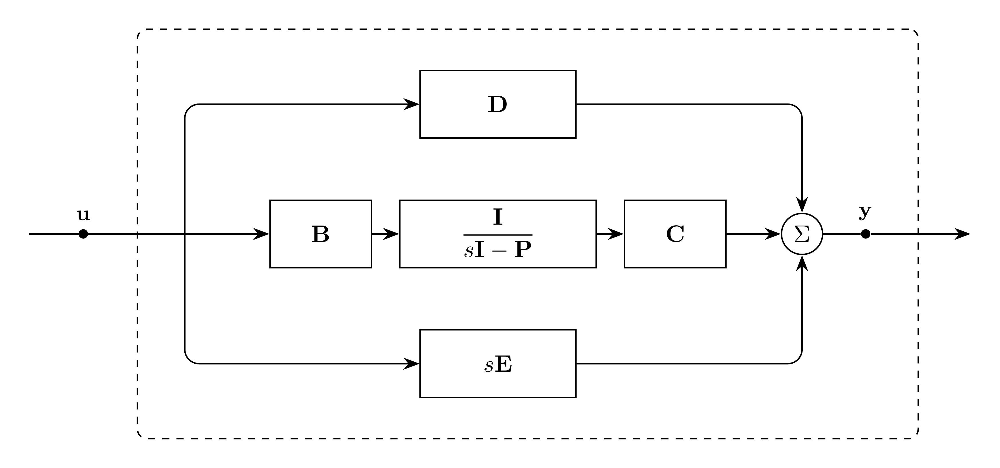

# StateSpace Model

`StateSpace` represents a vector-fitted matrix rational approximation with
complex poles and factorized residues.

Notes:
- This cannot be used in general to replace `VectorFit`, as that model can support full-rank residuals, while this only supports rank-1 residuals.

The rational approximation is represented in state-space form:

```math
\mathbf{H}(s) \approx \mathbf{D} + s\mathbf{E}
  + \mathbf{C}(s\mathbf{I} - \mathbf{P})^{-1}\mathbf{B}
```
The Laplace domain representation of this model is:
```math
\mathbf{Y}(s) = \mathbf{H}(s)\mathbf{U}(s)
```

The time domain representation of this model is:
```math
\mathbf{y}(t) = (\mathbf{h}*\mathbf{u})(t)
```

## Block Diagram

<div align="center">
   

  Figure 1: StateSpace rational approximation model
</div>

## Model Parameters

For output dimension $N$, input dimension $K$, and pole count $Q$:

Symbol | Units | JSON | Description | Note
------ | ----- | ---- | ----------- | ----
$\mathbf{D}$ | [-] | `D` | Constant coefficient | $\mathbf{D}\in\mathbb{R}^{N\times K}$
$\mathbf{E}$ | [s] | `E` | Linear coefficient | $\mathbf{E}\in\mathbb{R}^{N\times K}$
$\mathbf{p}$ | [1/s] | `poles` | Poles | $\mathbf{p}\in\mathbb{C}^Q$
$\mathbf{C}$ | [-] | `C` | Output matrix | $\mathbf{C}\in\mathbb{C}^{N\times Q}$
$\mathbf{B}$ | [1/s] | `B` | Input matrix | $\mathbf{B}\in\mathbb{C}^{Q\times K}$

### Parameter Validation

Complex-valued poles and factors must be ordered as adjacent conjugate pairs. For
each pair, with $q$ the first index:

```math
\begin{aligned}
p_q &\ne 0 \\
p_q &= (p_{q+1})^*
\end{aligned}
```

The corresponding columns of $\mathbf{C}$ and rows of $\mathbf{B}$ must follow
the same conjugate-pair ordering.

### Model Derived Parameters

```math
\begin{aligned}
\mathbf{P} &= \text{diag}(p_1,\dots,p_Q) \\
\mathbf{a} &= \text{Re}(\mathbf{p}) \\
\boldsymbol{\omega} &= \text{Im}(\mathbf{p}) \\
\mathbf{A} &= \text{diag}(a_1,\dots,a_Q) \\
\boldsymbol{\Omega} &= \text{diag}(\omega_1,\dots,\omega_Q) \\
\mathbf{C}_{\mathrm{r}} &= \text{Re}(\mathbf{C}) \\
\mathbf{C}_{\mathrm{i}} &= \text{Im}(\mathbf{C}) \\
\mathbf{B}_{\mathrm{r}} &= \text{Re}(\mathbf{B}) \\
\mathbf{B}_{\mathrm{i}} &= \text{Im}(\mathbf{B})
\end{aligned}
```

## Model Variables

### Internal Variables

#### Differential

Symbol | Units | Description | Note
------ | ----- | ----------- | ----
$\mathbf{w}$ | [-] | Real memory states | $\mathbf{w}\in\mathbb{R}^Q$
$\mathbf{v}$ | [-] | Imaginary memory states | $\mathbf{v}\in\mathbb{R}^Q$

#### Algebraic

None.

### External Variables

#### Differential

Symbol | Units | Description | Note
------ | ----- | ----------- | ----
$\mathbf{u}$ | [-] | Input vector | $\mathbf{u} \in \mathbb{R}^K$

#### Algebraic

None.

## Model Ports

Symbol | Port | Type | Units | Description | Note
------ | ---- | ---- | ----- | ----------- | ----
$\mathbf{u}$ | `input` | Input | [-] | Input vector port | $\mathbf{u} \in \mathbb{R}^K$
$\mathbf{y}$ | `out` | Output | [-] | Output contribution port | $\mathbf{y} \in \mathbb{R}^N$

## Model Equations

### Differential Equations

```math
\begin{aligned}
0 &= -\dot{\mathbf{w}}
     + \mathbf{A}\mathbf{w}
     - \boldsymbol{\Omega}\mathbf{v}
     + \mathbf{B}_{\mathrm{r}}\mathbf{u} \\
0 &= -\dot{\mathbf{v}}
     + \boldsymbol{\Omega}\mathbf{w}
     + \mathbf{A}\mathbf{v}
     + \mathbf{B}_{\mathrm{i}}\mathbf{u}
\end{aligned}
```

### Algebraic Equations

None.

### Wiring

```math
\mathbf{y}
= \mathbf{D}\mathbf{u}
  + \mathbf{E}\dot{\mathbf{u}}
  + \mathbf{C}_{\mathrm{r}}\mathbf{w}
  - \mathbf{C}_{\mathrm{i}}\mathbf{v}
```

## Initialization

For an affine initial input trajectory, let subscript $0$ denote initial values:

```math
\begin{aligned}
\mathbf{x}_0 &= -\mathbf{P}^{-1}\mathbf{B}\mathbf{u}_0 - \mathbf{P}^{-2}\mathbf{B}\dot{\mathbf{u}}_0 \\
\mathbf{w}_0 &= \text{Re}(\mathbf{x}_0) \\
\mathbf{v}_0 &= \text{Im}(\mathbf{x}_0) \\
\mathbf{y}_0 &= \mathbf{D}\mathbf{u}_0 + \mathbf{E}\dot{\mathbf{u}}_0 + \mathbf{C}_{\mathrm{r}}\mathbf{w}_0 - \mathbf{C}_{\mathrm{i}}\mathbf{v}_0
\end{aligned}
```

## Monitors

None.
