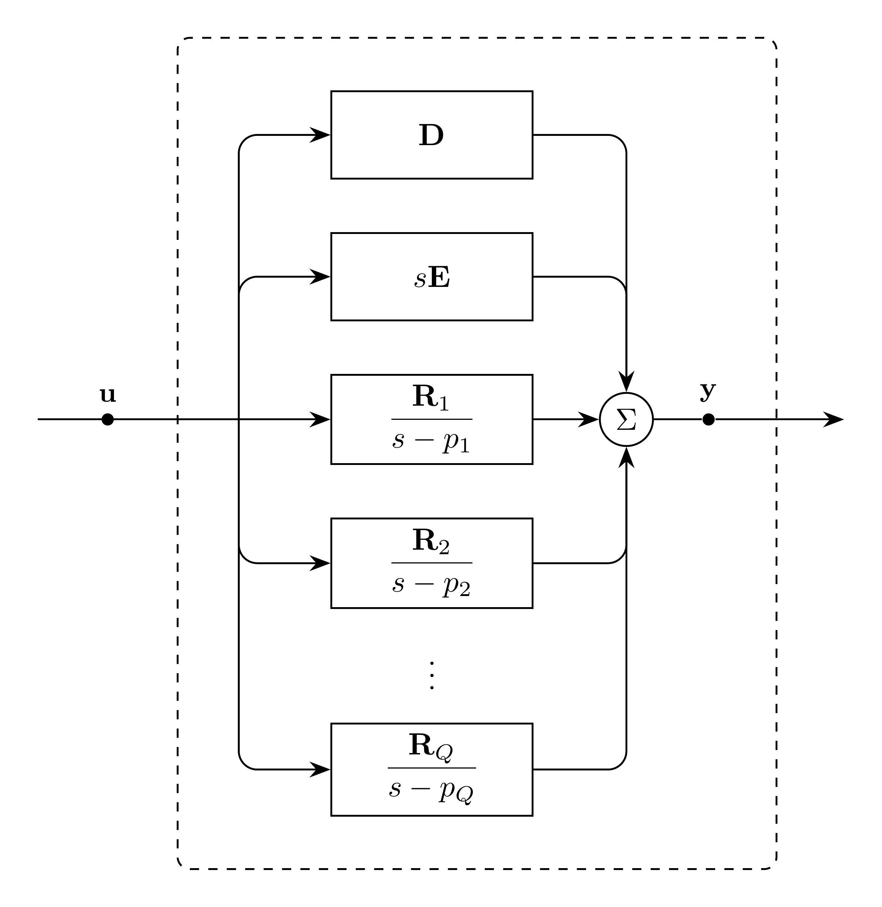

# VectorFit Model

`VectorFit` represents a vector-fitted matrix rational approximation with real
or complex poles and general residue matrices. For pole count $Q$, define the
pole-index set

```math
\mathcal{Q} = \{q \in \mathbb{Z}_{>0} \mid q \le Q\}.
```

Thus $\mathcal{Q}$ is empty when $Q=0$.

Then

```math
\mathbf{H}(s) \approx \mathbf{D} + s\mathbf{E}
  + \sum_{q \in \mathcal{Q}} \dfrac{\mathbf{R}_q}{s - p_q}.
```

`VectorFit` is a general rational operator; consuming models impose any
physical constraints.

> [!NOTE]
> The consuming model classifies the input $\mathbf{u}$ as differential or
> algebraic.
> Algebraic input requires $\mathbf{E} = \mathbf{0}$.

## Block Diagram



Figure 1: VectorFit model

## Model Parameters

For output dimension $N$, input dimension $K$, pole count $Q$, input units
$[u]$, and output units $[y]$:

Symbol | Units | JSON | Description | Note
------ | ----- | ---- | ----------- | ----
$\mathbf{D}$ | $[y]/[u]$ | `D` | Constant coefficient | $\mathbf{D} \in \mathbb{R}^{N \times K}$
$\mathbf{E}$ | $\mathrm{s}[y]/[u]$ | `E` | Linear coefficient | $\mathbf{E} \in \mathbb{R}^{N \times K}$
$\mathbf{p}$ | $[\mathrm{s}^{-1}]$ | `poles` | Poles | $\mathbf{p} \in \mathbb{C}^Q$
$\mathbf{R}$ | $[y]/(\mathrm{s}[u])$ | `residues` | Residues | $\mathbf{R} \in \mathbb{C}^{N \times K \times Q}$

### Parameter Validation

The input and output dimensions are positive integers, and the pole count is a
nonnegative integer. Let $\mathcal{Q}_\mathrm{r} \subseteq \mathcal{Q}$ contain
the real-pole indices and
$\mathcal{Q}_\mathrm{c} \subseteq \mathcal{Q}$ the first indices of the
nonreal conjugate pairs. Define their partner-index set as

```math
\mathcal{Q}_\mathrm{c}^{+}
  = \{q+1 \mid q \in \mathcal{Q}_\mathrm{c}\}.
```

The three sets $\mathcal{Q}_\mathrm{r}$, $\mathcal{Q}_\mathrm{c}$, and
$\mathcal{Q}_\mathrm{c}^{+}$ are pairwise disjoint and together contain every
pole index. Real poles have real residues, and each nonreal pole and residue is
followed by its conjugate.

```math
\begin{aligned}
N &\in \mathbb{Z}_{>0} \\
K &\in \mathbb{Z}_{>0} \\
Q &\in \mathbb{Z}_{\ge 0} \\
\mathbf{E} &= \mathbf{0},
  \quad \text{for algebraic input} \\
\mathcal{Q}_\mathrm{r} \cup \mathcal{Q}_\mathrm{c}
  \cup \mathcal{Q}_\mathrm{c}^{+}
  &= \mathcal{Q} \\
p_q &\in \mathbb{R},
  \quad \mathbf{R}_q \in \mathbb{R}^{N \times K},
  \quad q \in \mathcal{Q}_\mathrm{r} \\
p_{q+1} &= p_q^{\ast},
  \quad q \in \mathcal{Q}_\mathrm{c} \\
\mathbf{R}_{q+1} &= \mathbf{R}_q^{\ast},
  \quad q \in \mathcal{Q}_\mathrm{c}
\end{aligned}
```

### Derived Parameters

```math
\begin{aligned}
\mathbf{a} &= \mathrm{Re}(\mathbf{p}) \\
\boldsymbol{\omega} &= \mathrm{Im}(\mathbf{p}) \\
\mathbf{A} &= \mathrm{Re}(\mathbf{R}) \\
\mathbf{B} &= \mathrm{Im}(\mathbf{R})
\end{aligned}
```

## Model Ports

Symbol | Port | Type | Units | Description | Note
------ | ---- | ---- | ----- | ----------- | ----
$\mathbf{u}$ | `input` | Input | $[u]$ | Input vector port | $\mathbf{u} \in \mathbb{R}^K$
$\mathbf{y}$ | `out` | Output | $[y]$ | Output vector port | $\mathbf{y} \in \mathbb{R}^N$

## Submodels

None.

### Submodel Validation

None.

## Model Variables

### Internal Variables

#### Differential

Symbol | Units | Description | Note
------ | ----- | ----------- | ----
$\mathbf{w}_q$ | $\mathrm{s}[u]$ | Real memory states | $\mathbf{w}_q \in \mathbb{R}^K$, $q \in \mathcal{Q}_\mathrm{r} \cup \mathcal{Q}_\mathrm{c}$
$\mathbf{v}_q$ | $\mathrm{s}[u]$ | Imaginary memory states | $\mathbf{v}_q \in \mathbb{R}^K$, $q \in \mathcal{Q}_\mathrm{c}$

The documented real realization has order $KQ$.

#### Algebraic

None.

### External Variables

#### Differential

Symbol | Units | Description | Note
------ | ----- | ----------- | ----
$\mathbf{u}$ | $[u]$ | Input vector | Differential-input configuration, $\mathbf{u} \in \mathbb{R}^K$

#### Algebraic

Symbol | Units | Description | Note
------ | ----- | ----------- | ----
$\mathbf{u}$ | $[u]$ | Input vector | Algebraic-input configuration, $\mathbf{u} \in \mathbb{R}^K$

## Model Equations

### Internal Equations

#### Differential

```math
\begin{aligned}
0 &= -\dfrac{\mathrm{d}\mathbf{w}_q}{\mathrm{d}t}
     + a_q\mathbf{w}_q
     + \mathbf{u},
     \quad q \in \mathcal{Q}_\mathrm{r} \\
0 &= -\dfrac{\mathrm{d}\mathbf{w}_q}{\mathrm{d}t}
     + a_q\mathbf{w}_q
     - \omega_q\mathbf{v}_q
     + \mathbf{u} \\
0 &= -\dfrac{\mathrm{d}\mathbf{v}_q}{\mathrm{d}t}
     + \omega_q\mathbf{w}_q
     + a_q\mathbf{v}_q,
     \quad q \in \mathcal{Q}_\mathrm{c}
\end{aligned}
```

#### Algebraic

None.

### External Equations

```math
\mathbf{y} \leftarrow
  \mathbf{D}\mathbf{u}
  + \mathbf{E}\dfrac{\mathrm{d}\mathbf{u}}{\mathrm{d}t}
  + \sum_{q \in \mathcal{Q}_\mathrm{r}}
    \mathbf{A}_q\mathbf{w}_q
  + 2\sum_{q \in \mathcal{Q}_\mathrm{c}}
    (\mathbf{A}_q\mathbf{w}_q-\mathbf{B}_q\mathbf{v}_q)
```

For algebraic input, $\mathbf{E}=\mathbf{0}$ and the input-derivative term
vanishes.

## Initialization

None beyond the EMT initialization contract.

## Monitors

None.
