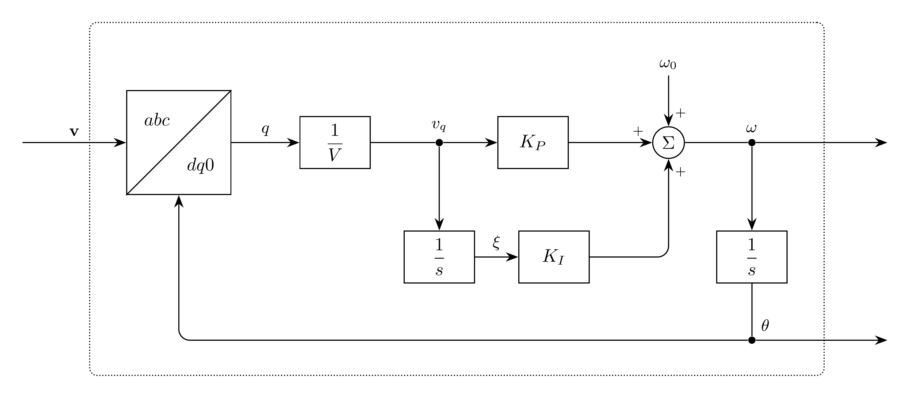

# PLL Model

`PLL` tracks the electrical reference angle and angular frequency of a
three-phase voltage with a synchronous-reference-frame phase-locked loop.
The angle is continuous and is not wrapped at multiples of $2\pi$.

## Block Diagram



Figure 1: PLL model

## Model Parameters

Symbol | Units | JSON | Description | Note
------ | ----- | ---- | ----------- | ----
$V$ | [V] | `V` | Rated line-to-line RMS voltage | Required, positive
$f_0$ | [Hz] | `f` | Nominal frequency | Required, positive
$K_P$ | [rad/s] | `Kp` | Proportional gain | Required, positive
$K_I$ | [rad/s$^2$] | `Ki` | Integral gain | Required, positive

### Parameter Validation

```math
V, f_0, K_P, K_I > 0
```

All parameters must be finite.

### Derived Parameters

```math
\begin{aligned}
\omega_0 &= 2\pi f_0 \\
V_\mathrm{pk} &= \sqrt{\dfrac{2}{3}}\,V
\end{aligned}
```

## Model Ports

Symbol | Port | Type | Units | Description | Note
------ | ---- | ---- | ----- | ----------- | ----
$\mathbf{v}$ | `va`, `vb`, `vc` | Input | [V] | Three-phase voltage | Required, $abc$ order
$\theta$ | `theta` | Output | [rad] | Electrical reference angle | d-axis relative to the phase-a axis
$\omega$ | `omega` | Output | [rad/s] | Electrical angular frequency |

In case JSON, `bus` binds the three voltage inputs to a Bus. Individual signal
ports also accept the Filter capacitor-voltage outputs. Connect `theta` to the
[Park operators](../Park/README.md) and `omega` to the connected controllers.

## Submodels

None.

### Submodel Validation

None.

## Model Variables

### Internal Variables

#### Differential

Symbol | Units | Description | Note
------ | ----- | ----------- | ----
$\theta$ | [rad] | Electrical reference angle |
$\xi$ | [s] | Integral of normalized q-axis voltage |

#### Algebraic

Symbol | Units | Description | Note
------ | ----- | ----------- | ----
$\omega$ | [rad/s] | Electrical angular frequency |

### External Variables

#### Differential

Symbol | Units | Description | Note
------ | ----- | ----------- | ----
$\mathbf{v}$ | [V] | Input phase voltages | Differential-input configuration

#### Algebraic

Otherwise, the voltage variables above are algebraic.

## Model Equations

The convention is the power-invariant [Park operator](../Park/README.md):
cosine d-axis and negative-sine q-axis, with phase offsets
$\gamma_a=0$, $\gamma_b=-2\pi/3$, and $\gamma_c=+2\pi/3$.
The machine uses amplitude-invariant scaling; its dq magnitudes therefore
differ by $\sqrt{2/3}$.
The normalized q-axis projection is

```math
v_q = -\dfrac{2}{3V_\mathrm{pk}}
  \sum_{n\in\{a,b,c\}} v_n\sin(\theta+\gamma_n).
```

This is the amplitude-invariant q voltage divided by the rated phase peak;
equivalently, it is `Park.out` q divided by $V$. For balanced voltages
$v_n=V_\mathrm{pk}\cos(\phi+\gamma_n)$, $v_q=\sin(\phi-\theta)$.
A voltage phase lead therefore increases the estimated frequency.

### Internal Equations

#### Differential

```math
\begin{aligned}
0 &= \dfrac{\mathrm{d}\theta}{\mathrm{d}t} - \omega \\
0 &= \dfrac{\mathrm{d}\xi}{\mathrm{d}t} - v_q
\end{aligned}
```

#### Algebraic

```math
0 = \omega - \omega_0 - K_Pv_q - K_I\xi
```

### External Equations

None.

## Initialization

Balanced initialization publishes the inferred angle and state-file frequency
before connected controllers prepare their operating points. Prescribed outputs
must agree.

The initialized bus samples define the stationary voltage phasor at $t_0$.
The default outputs are

```math
\begin{aligned}
v_\alpha &\leftarrow \dfrac{2v_a-v_b-v_c}{3} \\
v_\beta &\leftarrow \dfrac{v_b-v_c}{\sqrt{3}} \\
\theta &\leftarrow \operatorname{atan2}(v_\beta,v_\alpha) \\
\omega &\leftarrow \omega_0
\end{aligned}
```

The state-file keys `theta` and `omega` replace the respective defaults with
finite output values. From these outputs and the normalized q-axis voltage,

```math
\begin{aligned}
\xi &\leftarrow \dfrac{\omega-\omega_0-K_Pv_q}{K_I} \\
\dfrac{\mathrm{d}\theta}{\mathrm{d}t} &\leftarrow \omega \\
\dfrac{\mathrm{d}\xi}{\mathrm{d}t} &\leftarrow v_q
\end{aligned}
```

At the default angle and frequency, a balanced voltage gives zero q error and
zero integral state, up to roundoff. The voltage samples must be finite and
have nonzero $\alpha\beta$ magnitude unless `theta` is supplied. The integral
state `xi` is derived internally and cannot be prescribed in the state file.
The consistent-initial-condition solve preserves both differential states.

## Monitors

Monitor | Units | Description | Note
------- | ----- | ----------- | ----
`theta` | [rad] | Electrical reference angle |
`xi` | [s] | Integral of normalized q-axis voltage |
`omega` | [rad/s] | Electrical angular frequency |
`vq` | [p.u.] | Normalized q-axis voltage |
