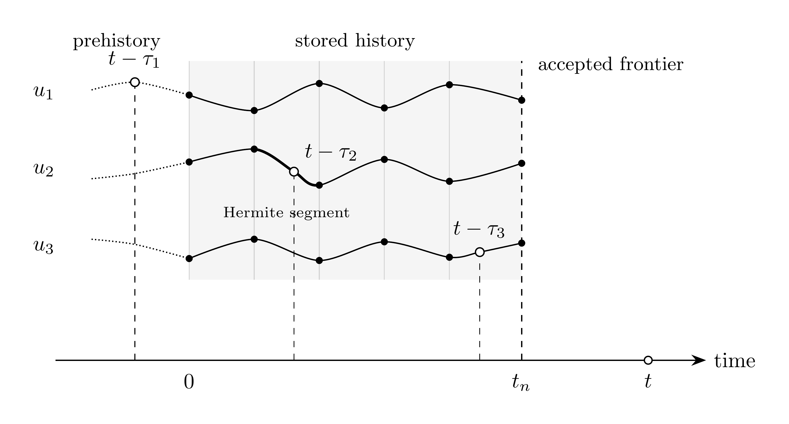

# Delay Model

`Delay` applies a constant transport delay to each of $M$ input channels:

```math
\mathbf{D}_{\boldsymbol{\tau}}(s)
  = \mathrm{diag}\left(e^{-s\tau_1},\ldots,e^{-s\tau_M}\right).
```

At runtime, accepted-step input samples are reconstructed with cubic Hermite
interpolation. `Delay` adds no DAE variables or residual rows. A scalar delay
is the $M=1$ case.

## Block Diagram


Figure 1: Delay model

## Model Parameters

Symbol | Units | JSON | Description | Note
------ | ----- | ---- | ----------- | ----
$M$ | [-] | `M` | Channel count | Required, positive integer
$\boldsymbol{\tau}$ | [s] | `tau` | Channel delays | Required, each positive

### Parameter Validation

```math
\begin{aligned}
M &\in \mathbb{Z}_{>0} \\
\tau_m &> 0
\end{aligned}
```

### Derived Parameters

```math
\tau_{\min} = \min(\boldsymbol{\tau}),
\qquad
\tau_{\max} = \max(\boldsymbol{\tau})
```

## Submodels

None.

### Submodel Validation

None.

## Model Variables

History samples are implementation data, not DAE variables or residual rows.

### Internal Variables

#### Differential

None.

#### Algebraic

None.

### External Variables

#### Differential

None.

#### Algebraic

Symbol | Units | Description | Note
------ | ----- | ----------- | ----
$\mathbf{u}$ | $[u]$ | Input vector | $\mathbf{u} \in \mathbb{R}^M$

## Model Ports

Symbol | Port | Type | Units | Description | Note
------ | ---- | ---- | ----- | ----------- | ----
$\mathbf{u}$ | `input` | Input | $[u]$ | Input vector port | $\mathbf{u} \in \mathbb{R}^M$
$\mathbf{y}$ | `out` | Output | $[u]$ | Delayed output port | $\mathbf{y} \in \mathbb{R}^M$

The output provides both value and time derivative.

## Model Equations

### Differential Equations

None.

### Algebraic Equations

None.

### Wiring

```math
\mathbf{y}
  \leftarrow \mathbf{u}(t-\boldsymbol{\tau}),
\qquad
\dfrac{\mathrm{d}\mathbf{y}}{\mathrm{d}t}
  \leftarrow \dfrac{\mathrm{d}\mathbf{u}}{\mathrm{d}t}(t-\boldsymbol{\tau})
```

Each channel satisfies $y_m(t)=u_m(t-\tau_m)$. Arguments at or before zero use
the prehistory defined under Initialization.

## History Realization

### History Record

Accepted input history is stored as the knot sequence

```math
(t_j,\ \mathbf{u}_j,\ \mathbf{u}'_j),
\qquad 0 = t_0 < t_1 < \cdots < t_n,
```

where $\mathbf{u}_j$ and $\mathbf{u}'_j$ are the input value and derivative at
$t_j$. The first knot holds the initialized values. Channels share knot times
and read the record at $t-\tau_m$ independently.



Figure 2: Delay history record and channel taps

> [!WARNING]
> Later knots are appended only at accepted steps, and the solver step size
> must not exceed $\tau_{\min}$. These constraints keep every lookup at or
> behind the accepted frontier; the realization must not extrapolate beyond
> it.

### Interpolation

Suppressing the channel index, a lookup at $\xi \le 0$ uses the analytic
prehistory. For $\xi \in (t_j,t_{j+1}]$, the bracketing knots define the cubic
Hermite interpolant

```math
\begin{aligned}
h_j &= t_{j+1}-t_j,
\qquad
\theta = \dfrac{\xi-t_j}{h_j} \\
u(\xi)
  &= (1-\theta)^2(1+2\theta)\,u_j
   + \theta(1-\theta)^2\,h_j\,u'_j \\
  &\quad
   + \theta^2(3-2\theta)\,u_{j+1}
   - \theta^2(1-\theta)\,h_j\,u'_{j+1},
\end{aligned}
```

Its derivative comes from the same polynomial. For smooth input and exact
knot data, the interpolant is $C^1$ with nominal fourth-order value accuracy
and third-order derivative accuracy in the knot spacing.

## Initialization

### Input Initialization

```math
\begin{aligned}
\widehat{\mathbf{u}}
  &\leftarrow \text{RMS input phasor} \\
\mathbf{u}
  &\leftarrow \sqrt{2}\,\mathrm{Re}(\widehat{\mathbf{u}}) \\
\dfrac{\mathrm{d}\mathbf{u}}{\mathrm{d}t}
  &\leftarrow \sqrt{2}\,\mathrm{Re}(s_0\widehat{\mathbf{u}}).
\end{aligned}
```

### Internal Initialization

The analytic prehistory is

```math
\begin{aligned}
\mathbf{u}(t)
  &= \sqrt{2}\,\mathrm{Re}
     \left(\widehat{\mathbf{u}}e^{s_0t}\right) \\
\dfrac{\mathrm{d}\mathbf{u}}{\mathrm{d}t}(t)
  &= \sqrt{2}\,\mathrm{Re}
     \left(s_0\widehat{\mathbf{u}}e^{s_0t}\right),
  \qquad t \le 0.
\end{aligned}
```

Only $t \in [-\tau_{\max},0]$ is needed. It matches the initialized input in
value and slope at $t=0$, avoiding delay-induced startup transients under a
consistent sinusoidal initialization.

### Output Initialization

```math
\begin{aligned}
\widehat{\mathbf{y}}
  &= \mathbf{D}_{\boldsymbol{\tau}}(s_0)\,\widehat{\mathbf{u}} \\
\mathbf{y}
  &\leftarrow \sqrt{2}\,\mathrm{Re}(\widehat{\mathbf{y}}) \\
\dfrac{\mathrm{d}\mathbf{y}}{\mathrm{d}t}
  &\leftarrow \sqrt{2}\,\mathrm{Re}(s_0\widehat{\mathbf{y}}).
\end{aligned}
```

## Monitors

None.
