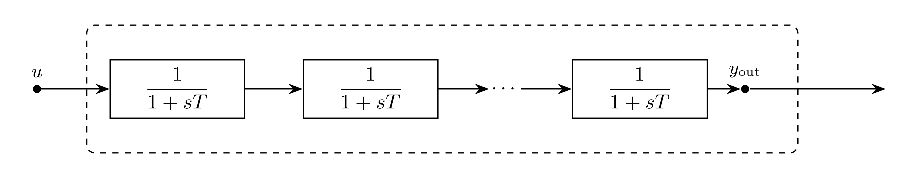

# Delay Model

`Delay` represents a scalar EMT delay operator using a lag-block chain.
The model maps input signal $u$ to delayed output $y_{\mathrm{out}}$.

Note:
- This is an exact approximation when used with forward-euler.
- For other integration methods this is a smooth approximation only.

## Block Diagram

<div align="center">
   

  Figure 1: Delay model
</div>

## Model Parameters

Symbol | Units | JSON | Description | Note
------ | ----- | ---- | ----------- | ----
$\tau$ | [s] | `tau` | Total delay | Required, positive
$f_{\max}$ | [Hz] | `fmax` | Highest frequency of interest | Required, positive

### Parameter Validation

```math
\begin{aligned}
\tau &> 0 \\
f_{\max} &> 0
\end{aligned}
```

### Model Derived Parameters

```math
\begin{aligned}
N &= \text{ceil}(f_{\max}\tau) \\
T &= \dfrac{\tau}{N}
\end{aligned}
```

## Model Variables

### Internal Variables

#### Differential

Symbol | Units | Description | Note
------ | ----- | ----------- | ----
$\mathbf{y}$ | [-] | Section differential states | $\mathbf{y}\in\mathbb{R}^N$

#### Algebraic

None.

### External Variables

#### Differential

Symbol | Units | Description | Note
------ | ----- | ----------- | ----
$u$ | [-] | Input signal | $u\in\mathbb{R}$

#### Algebraic

None.

## Model Ports

Symbol | Port | Type | Units | Description | Note
------ | ---- | ---- | ----- | ----------- | ----
$u$ | `input` | Input | [-] | Input signal port | $u\in\mathbb{R}$
$y_{\mathrm{out}}$ | `out` | Output | [-] | Delayed output port | $y_{\mathrm{out}} = y_{N-1}$

## Model Equations

### Differential Equations

```math
\begin{aligned}
0 &= -T\dot{y}_0 - y_0 + u \\
0 &= -T\dot{y}_n - y_n + y_{n-1}
\end{aligned}
```

### Algebraic Equations

None.

## Initialization

For an affine initial input trajectory, let subscript $0$ denote initial values:

```math
\begin{aligned}
y_{n,0} &= u_0 - (n+1)T\dot{u}_0 \\
\dot{y}_{n,0} &= \dot{u}_0 \\
y_{\mathrm{out},0} &= u_0 - \tau\dot{u}_0
\end{aligned}
```

## Monitors

None.
