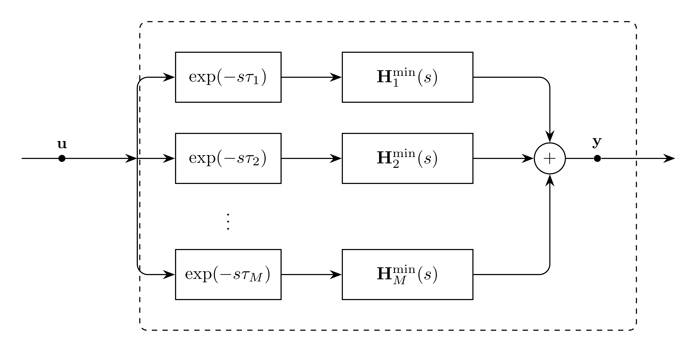

# Propagation Model

For input units $[u]$, `Propagation` is the $K$-channel current-form propagation
operator used by `LineDistributed`. It sums one branch per mode: a scalar
delay feeding that mode's fitted matrix.

## Block Diagram



Figure 1: Propagation model

## Model Parameters

Symbol | Units | JSON | Description | Note
------ | ----- | ---- | ----------- | ----
$K$ | [-] | `K` | Signal dimension | Required, positive integer

### Parameter Validation

```math
K \in \mathbb{Z}_{>0}
```

### Derived Parameters

The mode count is the length of the `modes` coefficient list, one branch
per mode:

```math
M = |\texttt{modes}|
```

## Submodels

Each entry of `modes` supplies one branch, $m = 1,\ldots,M$:

Symbol | Description | Type | Order | JSON | Inputs | Outputs
------ | ----------- | ---- | ----- | ---- | ------ | -------
$d_m$ | Mode delay | [Delay](../Delay/README.md) | History | `modes[m].delay` | $\mathbb{R}^K$ | $\mathbb{R}^K$
$\mathbf{H}^{\min}_m$ | Mode matrix | [VectorFit](../../Rational/VectorFit/README.md) | $KQ_m$ | `modes[m].Hmin` | $\mathbb{R}^K$ | $\mathbb{R}^K$

The represented propagation function is

```math
\mathbf{H}(s) = \sum_{m=1}^{M} \mathbf{H}^{\min}_m(s)\,\exp(-s\tau_m),
```

where each $\mathbf{H}^{\min}_m$ was fit on that mode's rank-one dyad
unwound by its own delay; see the `UniversalLineModel` application README
for the fitting targets.

### Submodel Validation

Every mode matrix must have stable poles and no term linear in $s$:

```math
\mathbf{E}_m = \mathbf{0}
```

### Submodel Wiring

```math
\begin{aligned}
\mathbf{w} &\leftarrow \mathbf{g}_\mathrm{in}[\mathbf{u}] \\
\mathbf{z} &\leftarrow \mathbf{d}[\mathbf{w}]
\end{aligned}
```

## Model Variables

### Internal Variables

#### Differential

None.

#### Algebraic

None.

### External Variables

#### Differential

None.

#### Algebraic

Symbol | Units | Description | Note
------ | ----- | ----------- | ----
$\mathbf{u}$ | $[u]$ | Input vector | $\mathbf{u} \in \mathbb{R}^K$

## Model Equations

### Internal Equations

#### Differential

None.

#### Algebraic

None.

### External Equations

```math
\mathbf{y} \leftarrow \sum_{m=1}^{M} \mathbf{H}^{\min}_m\!\left[d_m[\mathbf{u}]\right]
```

## Initialization

TBD

## Monitors

None.
