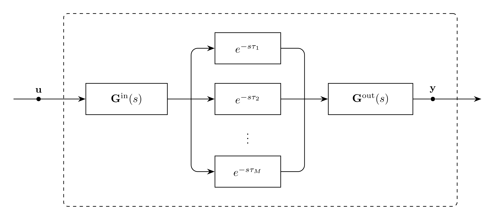

# Propagation Model

`Propagation` represents an EMT modal propagation operator, a sum of $M$
delayed modal shaping functions:

```math
\mathbf{H}(s) =
\sum_{m=1}^{M} e^{-s\tau_m}\mathbf{H}^{\mathrm{mps}}_m(s)
```

The Laplace domain representation of this model is:
```math
\mathbf{Y}(s) = \mathbf{H}(s)\mathbf{U}(s)
```

The time domain representation of this model is:
```math
\mathbf{y}(t) = (\mathbf{h}*\mathbf{u})(t)
```

Notes:
- The propagation operator uses pole-memory dynamics without $\mathbf{D}$ or $\mathbf{E}$ feedthrough terms.
- Each mode shares the pole vector $\mathbf{p}$ and has per-mode factors $\mathbf{C}_m$ and $\mathbf{B}_m$.

## Block Diagram

<div align="center">
   

  Figure 1: Propagation model
</div>

## Model Parameters

For conductor count $K$, modal count $M$, and pole count $Q$:

Symbol | Units | JSON | Description | Note
------ | ----- | ---- | ----------- | ----
$\boldsymbol{\tau}$ | [s] | `tau` | Modal propagation delays | $\boldsymbol{\tau} \in \mathbb{R}^M$
$\Delta t_{\min}$ | [s] | `dt_min` | Block resolution | Required, positive
$\mathbf{p}$ | [1/s] | `poles` | Poles | $\mathbf{p} \in \mathbb{C}^Q$
$\mathbf{C}_0,\dots,\mathbf{C}_M$ | [-] | `C` | Output matrices per propagation mode | $\mathbf{C}_m \in \mathbb{C}^{K \times Q}$
$\mathbf{B}_0,\dots,\mathbf{B}_M$ | [1/s] | `B` | Input matrices per propagation mode | $\mathbf{B}_m \in \mathbb{C}^{K \times Q}$

### Parameter Validation

```math
\begin{aligned}
\tau_m &> 0,\qquad \forall m \in \{1,\dots,M\} \\
\Delta t_{\min} &> 0
\end{aligned}
```

Complex-valued poles and the columns of $\mathbf{C}_m$ and $\mathbf{B}_m$ must
be ordered as adjacent conjugate pairs.

### Model Derived Parameters

```math
\begin{aligned}
n &= \operatorname{floor}\left(\dfrac{\tau_m}{\Delta t_{\min}}\right),\qquad \forall m \in \{1,\dots,M\} \\
\mathbf{P} &= \operatorname{diag}(p_1,\dots,p_Q) \\
\mathbf{a} &= \operatorname{Re}(\mathbf{p}) \\
\boldsymbol{\omega} &= \operatorname{Im}(\mathbf{p}) \\
\mathbf{A} &= \operatorname{diag}(a_1,\dots,a_Q) \\
\boldsymbol{\Omega} &= \operatorname{diag}(\omega_1,\dots,\omega_Q)
\end{aligned}
```

## Model Variables

### Internal Variables

#### Differential

Symbol | Units | Description | Note
------ | ----- | ----------- | ----
$\mathbf{z}_1,\dots,\mathbf{z}_n$ | [-] | Modal delay-chain states | $nK$ states per mode
$\mathbf{x}_{\mathrm{r}}$ | [-] | Real modal memory states | $\mathbf{x}_{\mathrm{r}} \in \mathbb{R}^Q$
$\mathbf{x}_{\mathrm{i}}$ | [-] | Imaginary modal memory states | $\mathbf{x}_{\mathrm{i}} \in \mathbb{R}^Q$

#### Algebraic

None.

### External Variables

#### Differential

Symbol         | Units | Description                         | Note
---------------|-------|-------------------------------------|-----
$\mathbf{u}$   | [-]   | Input vector read from `input` port | $\mathbf{u} \in \mathbb{R}^K$

#### Algebraic

None.

## Model Ports

Symbol | Port | Type | Units | Description | Note
------ | ---- | ---- | ----- | ----------- | ----
$\mathbf{u}$ | `input` | Input | [-] | Input vector port | $\mathbf{u} \in \mathbb{R}^K$
$\mathbf{y}$ | `out` | Output | [-] | Output contribution port | $\mathbf{y} \in \mathbb{R}^K$

## Model Equations

### Differential Equations

For real-valued poles, the imaginary-memory equation is not needed.

```math
\forall m \in \{1,\dots,M\}:\quad
\left\{
\begin{aligned}
0 &= -\tau_m\,\dot{\mathbf{z}}_1 + n\,(\mathbf{u} - \mathbf{z}_1) \\
0 &= -\tau_m\,\dot{\mathbf{z}}_2 + n\,(\mathbf{z}_1 - \mathbf{z}_2) \\
&\vdots \\
0 &= -\tau_m\,\dot{\mathbf{z}}_n + n\,(\mathbf{z}_{n-1} - \mathbf{z}_n) \\
0 &= -\dot{\mathbf{x}}_{\mathrm{r}}
     + \mathbf{A}\mathbf{x}_{\mathrm{r}}
     - \boldsymbol{\Omega}\mathbf{x}_{\mathrm{i}}
     + \operatorname{Re}(\mathbf{B}_m^T)\mathbf{z}_n \\
0 &= -\dot{\mathbf{x}}_{\mathrm{i}}
     + \boldsymbol{\Omega}\mathbf{x}_{\mathrm{r}}
     + \mathbf{A}\mathbf{x}_{\mathrm{i}}
     + \operatorname{Im}(\mathbf{B}_m^T)\mathbf{z}_n
\end{aligned}
\right.
```

### Algebraic Equations

None.

### Port Equations

```math
\mathbf{y} = \sum_{m=1}^{M}
  \operatorname{Re}(\mathbf{C}_m)\mathbf{x}_{\mathrm{r}}^m
  - \operatorname{Im}(\mathbf{C}_m)\mathbf{x}_{\mathrm{i}}^m
```

## Initialization

For a constant input $\mathbf{u}_0$ at $t_0$, the modal delay chains are at rest:

```math
\forall m \in \{1,\dots,M\}:\quad
\left\{
\begin{aligned}
\mathbf{z}_1(t_0) = \mathbf{z}_2(t_0) = \cdots = \mathbf{z}_n(t_0) &= \mathbf{u}_0 \\
\dot{\mathbf{z}}_1(t_0) = \dot{\mathbf{z}}_2(t_0) = \cdots = \dot{\mathbf{z}}_n(t_0) &= \mathbf{0}
\end{aligned}
\right.
```

The modal memory states initialize from the final delay-chain state:

```math
\forall m \in \{1,\dots,M\}:\quad
\left\{
\begin{aligned}
\mathbf{x}_0^m &= -\mathbf{P}^{-1}\mathbf{B}_m^T\mathbf{z}_n(t_0) - \mathbf{P}^{-2}\mathbf{B}_m^T\dot{\mathbf{z}}_n(t_0) \\
\mathbf{x}_{\mathrm{r},0}^m &= \operatorname{Re}(\mathbf{x}_0^m) \\
\mathbf{x}_{\mathrm{i},0}^m &= \operatorname{Im}(\mathbf{x}_0^m)
\end{aligned}
\right.
```

The port contribution initializes from the modal memory states:

```math
\mathbf{y}_0 = \sum_{m=1}^{M}\operatorname{Re}(\mathbf{C}_m)\mathbf{x}_{\mathrm{r},0}^m - \operatorname{Im}(\mathbf{C}_m)\mathbf{x}_{\mathrm{i},0}^m
```

## Monitors

None.
