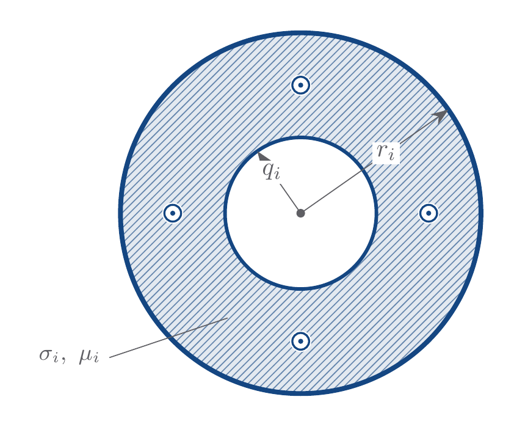

# Conductor Model

`Conductor` stores conductor dimensions, material properties, weight, and phase
labels for the physical conductors in an overhead line.



## Model Parameters

For $K$ physical conductors:

Symbol | Units | JSON | Description | Note
------ | ----- | ---- | ----------- | ----
$r_i$ | [m] | `radius.outer` | Outer radius | $r_i>0$
$q_i$ | [m] | `radius.inner` | Inner radius | $0\le q_i<r_i$; $q_i=0$ for solid conductors
$\sigma_i$ | [S/m] | `conductivity` | Conductivity | $\sigma_i>0$
$\mu_i$ | [H/m] | `permeability` | Permeability | $\mu_i>0$
$w_i$ | [N/m] | `weight` | Conductor weight per unit length | $w_i>0$
$\phi_i$ | [-] | `phase` | Conductor phase label | optional; one of `a`, `b`, `c`, `n`, or `g`

### Parameter Validation

```math
r_i>q_i\ge0,\qquad
\sigma_i>0,\qquad
\mu_i>0,\qquad
w_i>0,\qquad
i=1,\dots,K
```

The conductor vectors use the same conductor order as the other
conductor-indexed parameter models.
If supplied, phase labels use the same conductor order. Each phase label
$\phi_i$ is one of `a`, `b`, `c`, `n`, or `g`, where `g` marks a grounded
conductor.

### Model Derived Parameters

None.

## Model Variables

`Conductor` is a static data model.

### Internal Variables

#### Differential

None.

#### Algebraic

None.

### External Variables

#### Differential

None.

#### Algebraic

None.

## Model Equations

### Differential Equations

None.

### Algebraic Equations

None.

## Initialization

Validate the conductor dimension, material, weight, and optional phase-label
vectors.

## Model Outputs

Symbol | Units | Description | Note
------ | ----- | ----------- | ----
$\mathbf{r}$ | [m] | Outer-radius vector | $\mathbb{R}^{K}$
$\mathbf{q}$ | [m] | Inner-radius vector | $\mathbb{R}^{K}$
$\boldsymbol{\sigma}$ | [S/m] | Conductor conductivity vector | $\mathbb{R}^{K}$
$\boldsymbol{\mu}$ | [H/m] | Conductor permeability vector | $\mathbb{R}^{K}$
$\mathbf{w}$ | [N/m] | Conductor weight per-unit-length vector | $\mathbb{R}^{K}$
$\boldsymbol{\phi}$ | [-] | Phase-label vector | optional; entries in `a`, `b`, `c`, `n`, or `g`
