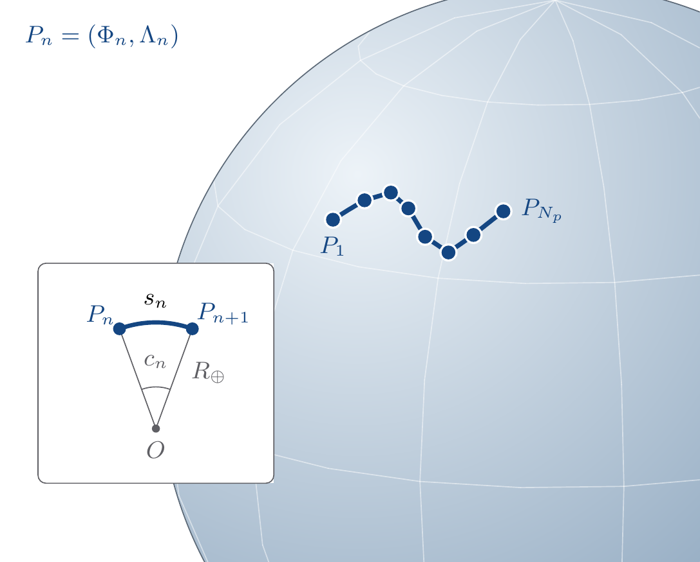

# Path Model

`Path` computes the path length $\ell$ used by finite-line response models from
an explicit length or an ordered GIS route.



## Model Parameters

For GIS points $n=1,\dots,N_p$:

Symbol | Units | JSON | Description | Note
------ | ----- | ---- | ----------- | ----
$\ell^{\mathrm{in}}$ | [m] | `path.length` | Explicit path length | exactly one of `path.length` or `path.points`
$\Phi_n$ | [deg] | `path.points[*].latitude` | Latitude of point $n$ |
$\Lambda_n$ | [deg] | `path.points[*].longitude` | Longitude of point $n$ |
`tower` | [-] | - | Sagged-to-span ratio | from [`Tower`](../Tower/README.md)

The GIS path intervals are not tower spans. GIS points define a long-route
centerline; `Tower` supplies the sagged-to-span ratio.

### Parameter Validation

When supplied:

```math
\ell^{\mathrm{in}}>0
```

When GIS path data is supplied:

```math
N_p\ge2,\qquad
-90\le\Phi_n\le90,\qquad
-180\le\Lambda_n\le180
```

If `path.length` is not supplied, the GIS route length and sagged-to-span ratio
must give $\ell>0$.

### Model Derived Parameters

For fixed mean earth radius

```math
R_\oplus = 6371008.8\ \mathrm{m}
```

If `path.length` is supplied,

```math
\ell=\ell^{\mathrm{in}}
```

Otherwise, for GIS intervals $n=1,\dots,N_p-1$:

```math
\begin{aligned}
\phi_n &= \frac{\pi}{180}\Phi_n \\
\lambda_n &= \frac{\pi}{180}\Lambda_n \\
\Delta\phi_n &= \phi_{n+1}-\phi_n \\
\Delta\lambda_n &= \lambda_{n+1}-\lambda_n \\
a_n &= \sin^2\left(\frac{\Delta\phi_n}{2}\right)
  + \cos\phi_n\cos\phi_{n+1}
    \sin^2\left(\frac{\Delta\lambda_n}{2}\right) \\
c_n &= 2\operatorname{atan2}\left(\sqrt{a_n},\sqrt{1-a_n}\right) \\
s_n &= R_\oplus c_n \\
S_{\mathrm{path}} &= \sum_{n=1}^{N_p-1} s_n
\end{aligned}
```

With sagged-to-span ratio from `Tower`,

```math
\ell=\rho_{\mathrm{sag}}S_{\mathrm{path}}
```

## Model Variables

`Path` is a static data model.

### Internal Variables

#### Differential

None.

#### Algebraic

None.

### External Variables

#### Differential

None.

#### Algebraic

None.

## Model Equations

### Differential Equations

None.

### Algebraic Equations

None.

## Initialization

Compute the path length from the explicit length or the GIS route.

## Model Outputs

Symbol | Units | Description | Note
------ | ----- | ----------- | ----
$\ell$ | [m] | Path length | scalar
