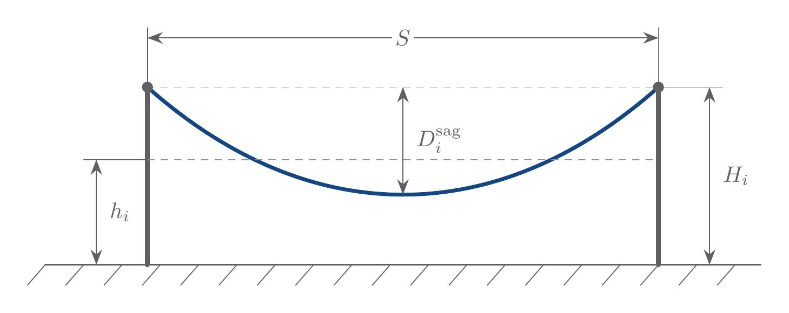
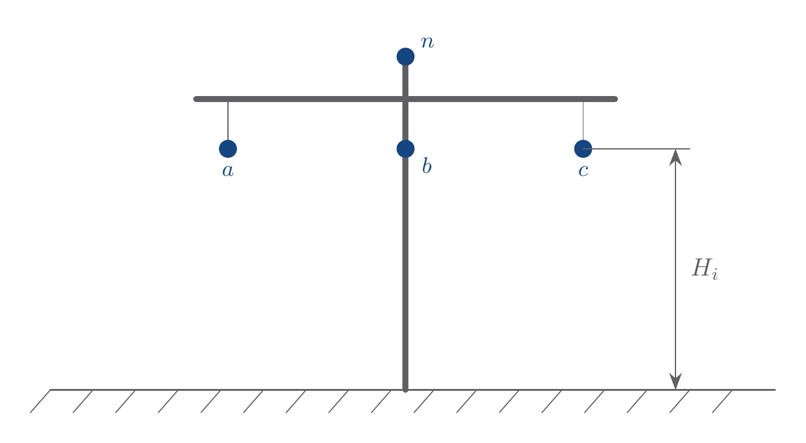
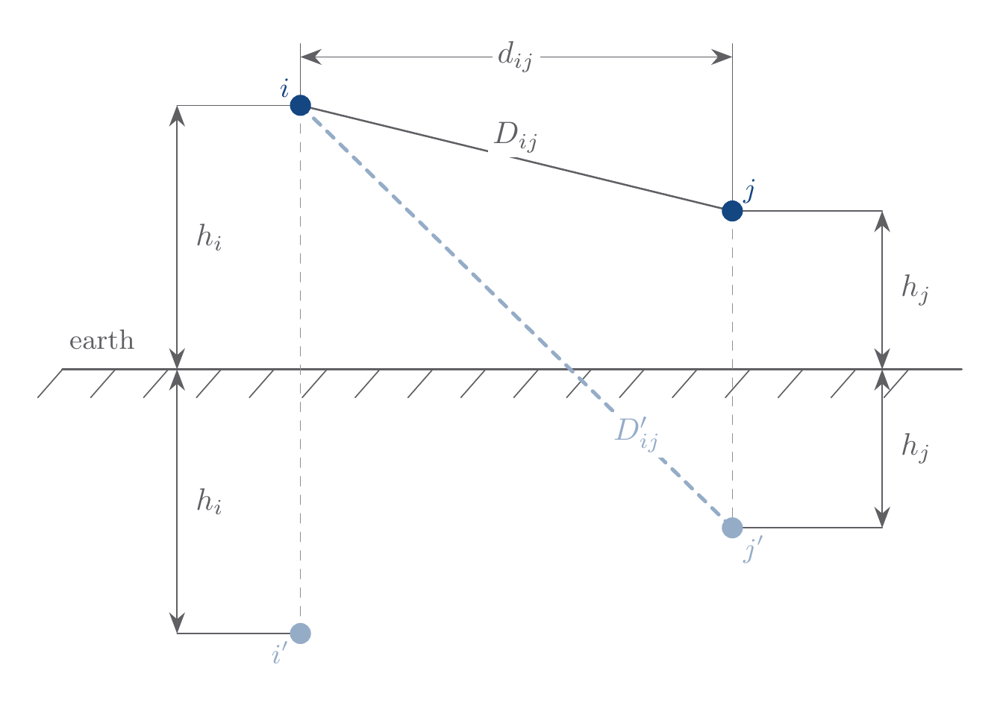

# Tower Model

`Tower` stores conductor attachment coordinates and derives span-scale
geometry from the route span.



## Model Parameters

For physical conductors $i=1,\dots,K$:

Symbol | Units | JSON | Description | Note
------ | ----- | ---- | ----------- | ----
`conductor` | [-] | - | Static conductor data | [`Conductor`](../Conductor/README.md)
$x_i$ | [m] | `conductors[*].x` | Horizontal attachment coordinate | real
$H_i$ | [m] | `conductors[*].h` | Attachment height above earth | $H_i>0$
$S$ | [m] | `path.span` | Support-to-support span length | $S>0$
$T_i$ | [N] | `conductors[*].tension` | Tension | optional

`Tower` does not own conductor phase labels. Phase labels are conductor
metadata owned by [`Conductor`](../Conductor/README.md).



### Parameter Validation

Require finite $x_i$, $H_i>0$, $S>0$, and $D'_{ij}>D_{ij}>0$ for
$i\ne j$. When tension is supplied, require $T_i>0$, $w_i>0$, and
$h_i^{\min}>0$.

### Model Derived Parameters

When tension data is supplied,

```math
\begin{aligned}
a_i &= \frac{T_i}{w_i} \\
D_i^\mathrm{sag} &= a_i\left[\cosh\left(\frac{S}{2a_i}\right)-1\right] \\
\ell_i^{\mathrm{span}} &= 2a_i\sinh\left(\frac{S}{2a_i}\right) \\
h_i^{\min} &= H_i-D_i^\mathrm{sag} \\
h_i &= H_i-D_i^\mathrm{sag}
  + \frac{2a_i^2}{S}\sinh\left(\frac{S}{2a_i}\right)-a_i \\
d_{ij} &= |x_i-x_j| \\
D_{ij} &= \sqrt{d_{ij}^2+(h_i-h_j)^2} \\
D'_{ij} &= \sqrt{d_{ij}^2+(h_i+h_j)^2} \\
\rho_{\mathrm{sag}} &= \frac{1}{K}\sum_{i=1}^{K}
  \frac{\ell_i^{\mathrm{span}}}{S}
\end{aligned}
```

Here $w_i$ is supplied by `Conductor`. $\rho_{\mathrm{sag}}$ is one
conductor-averaged scalar.

When tension data is not supplied, sag is zero: $h_i = H_i$,
$D_{ij}$ and $D'_{ij}$ use the attachment heights directly, and
$\rho_{\mathrm{sag}} = 1$.



## Model Variables

`Tower` is a static data model.

### Internal Variables

#### Differential

None.

#### Algebraic

None.

### External Variables

#### Differential

None.

#### Algebraic

None.

## Model Equations

### Differential Equations

None.

### Algebraic Equations

None.

## Initialization

Compute the span-scale geometry and distance matrices from the tower and
conductor data.

## Model Outputs

Symbol | Units | Description | Note
------ | ----- | ----------- | ----
$x_i$ | [m] | Horizontal attachment coordinate | $\mathbb{R}^{K}$
$h_i$ | [m] | Conductor height above earth | $\mathbb{R}^{K}$
$S$ | [m] | Support-to-support span length | scalar
$d_{ij}$ | [m] | Horizontal separation | $\mathbb{R}^{K\times K}$
$D_{ij}$ | [m] | Direct conductor distance | $\mathbb{R}^{K\times K}$
$D'_{ij}$ | [m] | Image-conductor distance | $\mathbb{R}^{K\times K}$
$D_i^\mathrm{sag}$ | [m] | Midspan sag below attachment height | $\mathbb{R}^{K}$
$\ell_i^{\mathrm{span}}$ | [m] | Span path length for conductor $i$ | $\mathbb{R}^{K}$
$h_i^{\min}$ | [m] | Minimum conductor height | $\mathbb{R}^{K}$
$\rho_{\mathrm{sag}}$ | [-] | Sagged-to-span ratio | scalar
