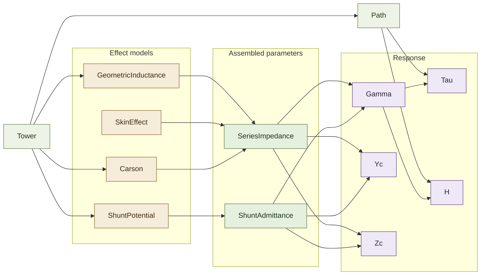

# EMT Parameters

`Parameters` contains frequency-domain EMT parameter models for overhead-line
studies. The family READMEs describe the model groups:

Family | Description
------ | -----------
[`Geometry`](Geometry/README.md) | Static line geometry, conductor data, and route data
[`Effects`](Effects/README.md) | Physical effects used to assemble per-unit-length series and shunt quantities
[`Response`](Response/README.md) | Propagation, finite-length response, and characteristic quantities derived from the assembled parameters

## Overhead Aggregate

`Overhead` aggregates the implemented overhead-line parameter models for one
angular frequency. It owns global state layout, submodel wiring, and monitor
selection for frequency sweeps.

`Overhead` is not an EMT network component and does not own bus ports. Sweep
endpoints, sampling, and linear or logarithmic grids belong to the application
or study driver.

### Model Parameters

Symbol | Units | JSON | Description | Note
------ | ----- | ---- | ----------- | ----
`path` | [-] | `path.length`, `path.points` | Path definition used to compute line length | passed to [`Path`](Geometry/Path/README.md)
`tower` | [-] | `conductors[*].x`, `conductors[*].height`, `conductors[*].tension`, `path.span` | Tower attachment geometry and tension | passed to [`Tower`](Geometry/Tower/README.md)
`conductor` | [-] | `conductors[*].radius`, `conductors[*].inner_radius`, `conductors[*].conductivity`, `conductors[*].permeability`, `conductors[*].weight`, `conductors[*].phase` | Conductor dimensions, material, weight, and phase data | passed to [`Conductor`](Geometry/Conductor/README.md)
$\sigma_g$ | [S/m] | `earth.conductivity` | Earth conductivity | passed to [`Carson`](Effects/Carson/README.md)
$\varepsilon_g$ | [F/m] | `earth.permittivity` | Earth permittivity | passed to [`Carson`](Effects/Carson/README.md)

#### Parameter Validation

The aggregate parser rejects invalid line-data fields before constructing the
child models. The document is resolved first: the tower type and every
conductor type reference from the document's `catalog` section and included
catalogs are replaced with their catalog data, giving one flat record per
physical conductor (`conductors[*]` in the tables above); names of each kind
must be unique across a document and its includes. Detailed validation
belongs to the child models.

#### Model Derived Parameters

None. The aggregate constructs and wires submodels from the parsed line data.

### Model Submodels

Submodel | Inputs | Outputs
-------- | ------ | -------
[`Conductor`](Geometry/Conductor/README.md) | `conductor` | $r_i$, $q_i$, $\sigma_i$, $\mu_i$, $w_i$, $\phi_i$
[`Tower`](Geometry/Tower/README.md) | `tower`, `conductor` | $x_i$, $h_i$, $S$, $d_{ij}$, $D_{ij}$, $D'_{ij}$, $\ell_i^{\mathrm{span}}$, $\rho_{\mathrm{sag}}$
[`Path`](Geometry/Path/README.md) | `path.length`, `path.points`, `Tower` | $\ell$
[`GeometricInductance`](Effects/GeometricInductance/README.md) | `tower`, `conductor` | $\mathbf{L}^{\mathrm{geo}}$
[`SkinEffect`](Effects/SkinEffect/README.md) | `conductor` | $\mathbf{r}^{\mathrm{skin}}$, $\mathbf{l}^{\mathrm{skin}}$
[`Carson`](Effects/Carson/README.md) | `tower`, $\sigma_g$, $\varepsilon_g$ | $\mathbf{R}^{\mathrm{carson}}$, $\mathbf{L}^{\mathrm{carson}}$
[`SeriesImpedance`](Effects/SeriesImpedance/README.md) | `SkinEffect`, `GeometricInductance`, `Carson` | $\mathbf{R}'$, $\mathbf{L}'$
[`ShuntPotential`](Effects/ShuntPotential/README.md) | `tower`, `conductor` | $\mathbf{G}^{\mathrm{pot}}$, $\mathbf{C}^{\mathrm{pot}}$
[`ShuntAdmittance`](Effects/ShuntAdmittance/README.md) | `ShuntPotential` | $\mathbf{G}'$, $\mathbf{C}'$
[`Gamma`](Response/Gamma/README.md) | `SeriesImpedance`, `ShuntAdmittance` | $\boldsymbol{\Gamma}$, $\mathbf{T}_v$, $\mathbf{T}_i$, $\mathbf{a}$, $\mathbf{b}$
[`Tau`](Response/Tau/README.md) | `Gamma`, `Path` | $\boldsymbol{\tau}$
[`H`](Response/H/README.md) | `Gamma`, `Path` | $\mathbf{H}$
[`Yc`](Response/Yc/README.md) | `SeriesImpedance`, `ShuntAdmittance` | $\mathbf{Y}_c$
[`Zc`](Response/Zc/README.md) | `SeriesImpedance`, `ShuntAdmittance` | $\mathbf{Z}_c$

### Signal Wiring

A typical sweep wires static line data into geometry and effect models, assembles
per-unit-length quantities, and then evaluates response models. Arrows point
from the producer to the consumer.

#### Directional Wiring Table

Stage | Source | Target | Values
----- | ------ | ------ | ------
Geometry data | `tower` | [`GeometricInductance`](Effects/GeometricInductance/README.md) | $h_i$, $D_{ij}$, $D'_{ij}$
Geometry data | `conductor` | [`GeometricInductance`](Effects/GeometricInductance/README.md) | $r_i$
Geometry data | `tower` | [`Carson`](Effects/Carson/README.md) | $h_i$, $h_j$, $d_{ij}$
Geometry data | `tower` | [`ShuntPotential`](Effects/ShuntPotential/README.md) | $h_i$, $D_{ij}$, $D'_{ij}$
Geometry data | `conductor` | [`ShuntPotential`](Effects/ShuntPotential/README.md) | $r_i$
Material data | `conductor` | [`SkinEffect`](Effects/SkinEffect/README.md) | $r_i$, $\sigma_i$, $\mu_i$
Earth material | `earth.conductivity`, `earth.permittivity` | [`Carson`](Effects/Carson/README.md) | $\sigma_g$, $\varepsilon_g$
Span geometry | `tower`, `conductor` | [`Tower`](Geometry/Tower/README.md) | $S$, $\ell_i^{\mathrm{span}}$, $\rho_{\mathrm{sag}}$
Series assembly | [`SkinEffect`](Effects/SkinEffect/README.md) | [`SeriesImpedance`](Effects/SeriesImpedance/README.md) | $\mathbf{r}^{\mathrm{skin}}$, $\mathbf{l}^{\mathrm{skin}}$
Series assembly | [`GeometricInductance`](Effects/GeometricInductance/README.md) | [`SeriesImpedance`](Effects/SeriesImpedance/README.md) | $\mathbf{L}^{\mathrm{geo}}$
Series assembly | [`Carson`](Effects/Carson/README.md) | [`SeriesImpedance`](Effects/SeriesImpedance/README.md) | $\mathbf{R}^{\mathrm{carson}}$, $\mathbf{L}^{\mathrm{carson}}$
Shunt assembly | [`ShuntPotential`](Effects/ShuntPotential/README.md) | [`ShuntAdmittance`](Effects/ShuntAdmittance/README.md) | $\mathbf{G}^{\mathrm{pot}}$, $\mathbf{C}^{\mathrm{pot}}$
Response inputs | [`SeriesImpedance`](Effects/SeriesImpedance/README.md) | [`Gamma`](Response/Gamma/README.md), [`Yc`](Response/Yc/README.md), [`Zc`](Response/Zc/README.md) | $\mathbf{R}'$, $\mathbf{L}'$
Response inputs | [`ShuntAdmittance`](Effects/ShuntAdmittance/README.md) | [`Gamma`](Response/Gamma/README.md), [`Yc`](Response/Yc/README.md), [`Zc`](Response/Zc/README.md) | $\mathbf{G}'$, $\mathbf{C}'$
Finite-line inputs | `path.length`, `path.points`, [`Tower`](Geometry/Tower/README.md) | [`Path`](Geometry/Path/README.md) | $\ell$
Finite-line response | [`Gamma`](Response/Gamma/README.md) | [`Tau`](Response/Tau/README.md) | $\mathbf{b}$
Finite-line response | [`Path`](Geometry/Path/README.md) | [`Tau`](Response/Tau/README.md) | $\ell$
Finite-line response | [`Gamma`](Response/Gamma/README.md) | [`H`](Response/H/README.md) | $\mathbf{a}$, $\mathbf{b}$, $\dot{\mathbf{a}}$, $\dot{\mathbf{b}}$
Finite-line response | [`Path`](Geometry/Path/README.md) | [`H`](Response/H/README.md) | $\ell$

### Model Variables

The aggregate stores one concatenated state vector across the submodels listed
above. Each child README documents the variables and residuals owned by that
child model.

### Model Equations

`Overhead` owns no additional residual equations. It binds the child models into
one evaluator and calls each child residual and Jacobian.

### Initialization

Construct the child models from the parsed line data, bind their states into the
aggregate vector, initialize each child model at the current $\omega$, and start
the configured monitor sinks.

### Model Outputs

Model outputs are the child-model outputs listed in the submodel table.

### Monitors

Monitor | Symbol | Units | Shape | Description
------- | ------ | ----- | ----- | -----------
`R` | $\mathbf{R}'$ | [$\Omega$/m] | $K\times K$ | Series resistance
`L` | $\mathbf{L}'$ | [H/m] | $K\times K$ | Series inductance
`G` | $\mathbf{G}'$ | [S/m] | $K\times K$ | Shunt conductance
`C` | $\mathbf{C}'$ | [F/m] | $K\times K$ | Shunt capacitance
`Tv` | $\mathbf{T}_v$ | [-] | $K\times K$ | Voltage modal transformation matrix
`Ti` | $\mathbf{T}_i$ | [-] | $K\times K$ | Current modal transformation matrix
`Alpha` | $\mathbf{a}$ | [1/m] | $K$ | Modal attenuation constants
`Beta` | $\mathbf{b}$ | [1/m] | $K$ | Modal phase constants
`Tau` | $\boldsymbol{\tau}$ | [s] | $K$ | Modal phase delay
`H` | $\mathbf{H}$ | [-] | $K$ | Modal finite-length propagation function
`Yc` | $\mathbf{Y}_c=\mathbf{G}_c+j\mathbf{B}_c$ | [S] | $K\times K$ | Characteristic admittance
`Zc` | $\mathbf{Z}_c=\mathbf{R}_c+j\mathbf{X}_c$ | [$\Omega$] | $K\times K$ | Characteristic impedance
