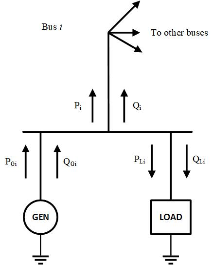

# Bus

A bus is a point of interconnection of electrical devices. The bus component
model also plays a key role in coupling system components. Each bus $k$ owns
two variables: real voltage and imaginary voltage, denoted as $V_{rk}$ and
$V_{ik}$, respectively. The bus also owns current-balance residual equations for
real and imaginary currents entering the bus, denoted as $I_{rk}$ and $I_{ik}$,
respectively. While the bus model owns current residuals, it _does not compute_
them. Instead, each component connected to the bus adds its contribution to the
residual. The bus initializes the residual to zero each time the numerical
integrator requests residual evaluation.

## Notes

Current entering the bus has positive sign, and current exiting the bus has
negative sign.



Figure 1: Bus-variable diagram. This should be updated to represent current
balance instead of power balance.

## Model Parameters

Symbol            | Units | JSON | Description         | Note
------------------|-------|------|---------------------|-------
$V_\mathrm{base}$ | [kV]  | `kv` | Nominal bus voltage | Unused

### Parameter Validation

None.

### Model Derived Parameters

None.

## Model Ports

None.

## Model Variables

### Internal Variables

#### Differential

None.

#### Algebraic

Symbol | Units  | Description
-------|--------|------------
$V_r$  | [p.u.] | Bus voltage, real component
$V_i$  | [p.u.] | Bus voltage, imaginary component

### External Variables

#### Differential

None.

#### Algebraic

None.

## Model Equations

### Internal Equations

#### Differential

None.

#### Algebraic

Let $\mathcal{E}$ denote the set of components connected to the bus.

```math
\begin{aligned}
0 &= \sum_{e \in \mathcal{E}} I_{r,e} \\
0 &= \sum_{e \in \mathcal{E}} I_{i,e}
\end{aligned}
```

### External Equations

None.

## Initialization

### Internal Initialization

Bus initializes its algebraic voltage variables as

```math
\begin{aligned}
V_r &\leftarrow \text{bus voltage, real component} \\
V_i &\leftarrow \text{bus voltage, imaginary component}
\end{aligned}
```

The derivative vector entries initialize to zero.

## Monitors

Monitor | Units  | Description                     | Note
--------|--------|---------------------------------|-----
`Vr`    | [p.u.] | Bus voltage, real component      |
`Vi`    | [p.u.] | Bus voltage, imaginary component |
`Vm`    | [p.u.] | Bus voltage magnitude            | $\sqrt{V_r^2+V_i^2}$
`Va`    | [rad]  | Bus voltage angle                | $\operatorname{atan2}(V_i,V_r)$
