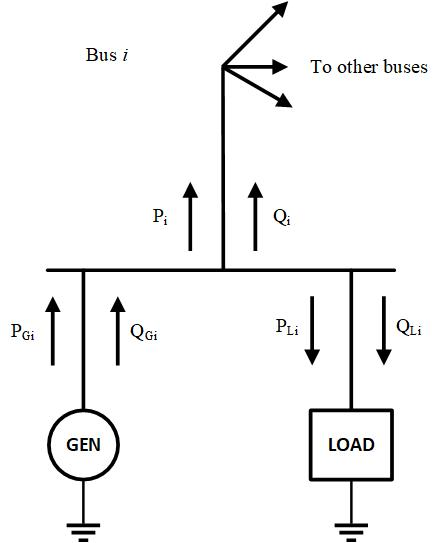

# Bus

A bus owns the terminal voltage components $V_r$ and $V_i$ and the
current-balance residuals. Each connected device adds its current injection
after the bus resets the residuals to zero.

## Notes

Current entering the bus has positive sign, and current exiting the bus has
negative sign.

## Block Diagram



Figure 1: Bus-variable diagram. This should be updated to represent current
balance instead of power balance.

## Model Parameters

Symbol            | Units | JSON | Description         | Typical Value | Note
------------------|-------|------|---------------------|---------------|-------
$V_\mathrm{base}$ | [kV]  | `kv` | Nominal bus voltage |               | Unused

### Parameter Validation

None.

### Model Derived Parameters

None.

## Model Ports

None.

## Model Variables

### Internal Variables

#### Differential

None.

#### Algebraic

Symbol | Units  | Description                      | Note
-------|--------|----------------------------------|-----
$V_r$  | [p.u.] | Bus voltage, real component      |
$V_i$  | [p.u.] | Bus voltage, imaginary component |

### External Variables

#### Differential

None.

#### Algebraic

None.

## Model Equations

### Internal Equations

#### Differential

None.

#### Algebraic

Let $\mathcal{D}$ denote the set of components connected to the bus, and let $G_f$, $B_f$ be the conductance and susceptance of a fault applied to the Bus, respectively, with $G_f + jB_f = 1/(R_f + jX_f)$, both zero when no fault is applied.

```math
\begin{aligned}
0 &= -(G_f V_r - B_f V_i) + \sum_{d \in \mathcal{D}} I_{r,d} \\
0 &= -(B_f V_r + G_f V_i) + \sum_{d \in \mathcal{D}} I_{i,d}
\end{aligned}
```

### External Equations

None.

## Initialization

### Internal Initialization

Bus initializes its algebraic voltage variables as

```math
\begin{aligned}
V_r &\leftarrow \text{bus voltage, real component} \\
V_i &\leftarrow \text{bus voltage, imaginary component}
\end{aligned}
```

The derivative vector entries initialize to zero.

## Monitors

Monitor | Units  | Description                     | Note
--------|--------|---------------------------------|-----
`Vr`    | [p.u.] | Bus voltage, real component      |
`Vi`    | [p.u.] | Bus voltage, imaginary component |
`Vm`    | [p.u.] | Bus voltage magnitude            | $\sqrt{V_r^2+V_i^2}$
`Va`    | [rad]  | Bus voltage angle                | $\operatorname{atan2}(V_i,V_r)$
