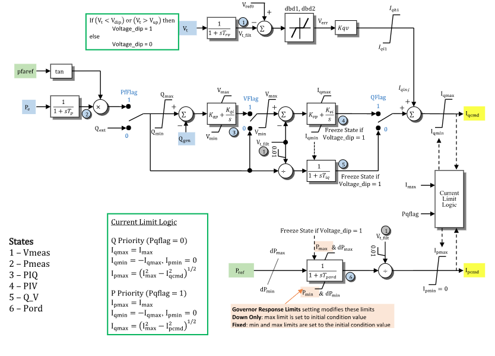

# **Renewable Energy Electrical Control Model (REECB)**

REECB is a WECC renewable electrical-control model with power-factor,
reactive-power, voltage, and active-power command paths for an
inverter-coupled resource.

## Notes

- Current commands and power signals are on system base.
- Internal control states and the reactive-power, active-power, and current
  limits are on REECB component base.
- REECB uses `mva` as its component power base.
- In direct-voltage mode ($s_Q=1$, $s_V=0$) `qext` carries a terminal-voltage
  reference instead of a system-base reactive power.
- REECB contributes no bus current injection.
- GridKit does not apply generator-level Governor Response Limits to `Pmin` or
  `Pmax`.

> [!WARNING]
> GridKit does not yet inherit `mva` from the associated REGCA model. Set it
> explicitly to the REGCA component base; omitting it falls back to the system
> base and is correct only when those bases match.[^reecb-mva-base]

## Block Diagram



Figure 1: REECB electrical-control model. Figure courtesy of the
[PowerWorld REEC_B model reference](https://www.powerworld.com/WebHelp/Content/TransientModels_HTML/Exciter%20REEC_B.htm).

## Model Parameters

Symbol                              | Units     | JSON     | Description                                             | Typical Value | Note
------------------------------------|-----------|----------|---------------------------------------------------------|---------------|-----
$S^\mathrm{base}$                   | [MVA]     | `mva`    | REECB component power base                              | 100.0         | System power base when omitted
$s_\mathrm{pf}$                     | [boolean] | `PfFlag` | Power-factor control selector                           | `false`       | `true` = power-factor control, `false` = reactive-power control
$s_V$                               | [boolean] | `VFlag`  | Voltage-reference selector under $s_Q=1$                | `false`       | `true` = cascaded Q-PI voltage command, `false` = direct external voltage reference
$s_Q$                               | [boolean] | `QFlag`  | Reactive-path selector                                  | `false`       | `true` = Volt/VAr PI control, `false` = reactive-current lag
$s_\mathrm{pq}$                     | [boolean] | `Pqflag` | Converter current-priority selector                     | `false`       | `true` = P priority, `false` = Q priority
$T_\mathrm{rv}$                     | [sec]     | `Trv`    | Voltage-measurement filter time constant                | 0.02          | State 1 in Fig. 1
$T_\mathrm{p}$                      | [sec]     | `Tp`     | Electrical-power measurement filter time constant       | 0.0           | State 2 in Fig. 1
$V^\mathrm{ref}$                    | [p.u.]    | `Vref0`  | Reactive-current-injection voltage reference            | $V_T$         | Initialized from terminal voltage when omitted
$V_\mathrm{dip}$                    | [p.u.]    | `Vdip`   | Low-voltage threshold for the voltage-band gate         | 0.85          |
$V_\mathrm{up}$                     | [p.u.]    | `Vup`    | High-voltage threshold for the voltage-band gate        | 1.15          |
$D_1^\mathrm{db}$                   | [p.u.]    | `dbd1`   | Lower deadband threshold for voltage-error response     | 0.0           |
$D_2^\mathrm{db}$                   | [p.u.]    | `dbd2`   | Upper deadband threshold for voltage-error response     | 0.0           |
$K_\mathrm{qv}$                     | [p.u.]    | `kqv`    | Reactive-current injection gain                         | 5.0           |
$I_{q,\mathrm{inj}}^{\min}$         | [p.u.]    | `Iql1`   | Minimum reactive-current injection                      | -1.1          |
$I_{q,\mathrm{inj}}^{\max}$         | [p.u.]    | `Iqh1`   | Maximum reactive-current injection                      | 1.1           |
$Q^{\max}$                          | [p.u.]    | `Qmax`   | Maximum reactive-power control output                   | 0.436         |
$Q^{\min}$                          | [p.u.]    | `Qmin`   | Minimum reactive-power control output                   | -0.436        |
$K_\mathrm{qp}$                     | [p.u.]    | `Kqp`    | Reactive-power controller proportional gain             | 0.0           |
$K_\mathrm{qi}$                     | [p.u./s]  | `Kqi`    | Reactive-power controller integral gain                 | 0.1           |
$V^{\max}$                          | [p.u.]    | `Vmax`   | Maximum voltage-control output                          | 1.1           |
$V^{\min}$                          | [p.u.]    | `Vmin`   | Minimum voltage-control output                          | 0.9           |
$K_\mathrm{vp}$                     | [p.u.]    | `Kvp`    | Voltage controller proportional gain                    | 18.0          |
$K_\mathrm{vi}$                     | [p.u./s]  | `Kvi`    | Voltage controller integral gain                        | 5.0           |
$T_\mathrm{iq}$                     | [sec]     | `Tiq`    | Reactive-current command lag time constant              | 0.02          | State 5 in Fig. 1
$T_\mathrm{pord}$                   | [sec]     | `Tpord`  | Active-power order filter time constant                 | 0.02          | State 6 in Fig. 1
$R_P^{\max}$                        | [p.u./s]  | `dPmax`  | Positive active-power order ramp-rate limit             | 99.0          |
$R_P^{\min}$                        | [p.u./s]  | `dPmin`  | Negative active-power order ramp-rate limit             | -99.0         |
$P^{\max}$                          | [p.u.]    | `Pmax`   | Maximum active-power order                              | 1.0           |
$P^{\min}$                          | [p.u.]    | `Pmin`   | Minimum active-power order                              | 0.0           |
$I^{\max}$                          | [p.u.]    | `Imax`   | Maximum converter current                               | 1.3           |

All parameters are optional. An omitted parameter starts from its Typical
Value; the time-constant floor below is then applied. Real-valued parameters
accept real or integer JSON values; selectors require Boolean JSON values.

### Parameter Validation

Invalid REECB parameter sets are rejected by the following checks:

```math
\begin{aligned}
  S^\mathrm{base} &> 0,\quad \text{when provided} \\
  T_\mathrm{rv},T_\mathrm{p},T_\mathrm{iq},T_\mathrm{pord} &\ge 0 \\
  V_\mathrm{dip} &< V_\mathrm{up} \\
  D_1^\mathrm{db} &\le 0 \le D_2^\mathrm{db} \\
  K_\mathrm{qv},K_\mathrm{qp},K_\mathrm{qi},K_\mathrm{vp},K_\mathrm{vi} &\ge 0 \\
  I_{q,\mathrm{inj}}^{\min} &\le I_{q,\mathrm{inj}}^{\max} \\
  Q^{\min} &\le Q^{\max} \\
  V^{\min} &\le V^{\max} \\
  R_P^{\min} &< 0 < R_P^{\max} \\
  P^{\min} &\le P^{\max} \\
  I^{\max} &> 0.
\end{aligned}
```

Enabling both `PfFlag` and `QFlag` logs an atypical-configuration warning.

### Model Derived Parameters

Let $\epsilon_T=10^{-3}\ \mathrm{s}$. A time constant below $\epsilon_T$ is
raised to that floor in place, so every equation below uses the raised value:

```math
\begin{aligned}
  T_x &\leftarrow \text{max}(T_x,\epsilon_T), && x\in\{\mathrm{rv},\mathrm{p},\mathrm{iq},\mathrm{pord}\} \\
  s_\mathrm{pf}^\mathrm{off} &= 1 - s_\mathrm{pf} \\
  s_Q^\mathrm{off} &= 1 - s_Q \\
  s_Q^\mathrm{PI} &= s_Q s_V \\
  s_V^\mathrm{ref} &= s_Q(1-s_V) \\
  s_Q^\mathrm{ref} &= 1 - s_V^\mathrm{ref} \\
  s_\mathrm{pq}^\mathrm{off} &= 1 - s_\mathrm{pq} \\
  k_\mathrm{base} &= \dfrac{S^\mathrm{sys}}{S^\mathrm{base}}.
\end{aligned}
```

Multiplying by $k_\mathrm{base}$ converts system base to component base.

## Model Ports

Name     | Port   | Init    | Description
---------|--------|---------|------------
`bus`    | Bus    | Known   | Terminal-bus voltage
`pe`     | Input  | Known   | Active-power feedback
`qgen`   | Input  | Known   | Reactive-power feedback
`qext`   | Input  | Unknown | Volt/VAr reference
`pfaref` | Input  | Unknown | Power-factor angle reference
`pref`   | Input  | Unknown | Active-power reference
`iqcmd`  | Output | Known   | Reactive-current command
`ipcmd`  | Output | Known   | Active-current command

`bus` is required; signal ports are optional and must be linked when attached.
`Known` ports are seeded before `initialize()` and preserved by it. `Unknown`
inputs are resolved during initialization and written to attached signal
storage, or retained as constant inputs when the port is unattached.

## Model Variables

### Internal Variables

#### Differential

Symbol                  | Units  | Description                         | Note
------------------------|--------|-------------------------------------|-----
$V^\mathrm{meas}$       | [p.u.] | Filtered terminal voltage           | State 1 in Fig. 1
$P^\mathrm{meas}$       | [p.u.] | Filtered electrical power           | State 2 in Fig. 1; component base
$x_Q^\mathrm{PI}$       | [p.u.] | Reactive-power PI controller state  | State 3 in Fig. 1
$x_V^\mathrm{PI}$       | [p.u.] | Voltage-control PI controller state | State 4 in Fig. 1; component-base current
$Q_V$                   | [p.u.] | Reactive-current command lag state  | State 5 in Fig. 1; component base
$P^\mathrm{ord}$        | [p.u.] | Filtered active-power order         | State 6 in Fig. 1; component base

#### Algebraic

Symbol               | Units  | Description                                   | Note
---------------------|--------|-----------------------------------------------|-----
$V_T$                | [p.u.] | Terminal voltage magnitude                    |
$I_L^{\max}$         | [p.u.] | Current-circle continuation state             | Component base
$I_q^\mathrm{cmd}$   | [p.u.] | Reactive-current command output               | System base
$I_p^\mathrm{cmd}$   | [p.u.] | Active-current command output                 | System base

### External Variables

#### Differential

None.

#### Algebraic

Symbol                 | Units  | Init    | Description                              | Note
-----------------------|--------|---------|------------------------------------------|-----
$V_\mathrm{r}$         | [p.u.] | Known   | Terminal voltage, real component         | Bus input
$V_\mathrm{i}$         | [p.u.] | Known   | Terminal voltage, imaginary component    | Bus input
$P_e$                  | [p.u.] | Known   | Electrical active-power feedback         | Optional signal port `pe`; system base
$Q^\mathrm{gen}$       | [p.u.] | Known   | Reactive-power feedback                  | Optional signal port `qgen`; system base
$Q^\mathrm{ext}$       | [p.u.] | Unknown | External Volt/VAr reference              | Optional signal port `qext`; terminal voltage in direct-voltage mode
$\phi^\mathrm{ref}$    | [rad]  | Unknown | Power-factor angle reference             | Optional signal port `pfaref`
$P^\mathrm{ref}$       | [p.u.] | Unknown | External active-power reference          | Optional signal port `pref`; system base

## Model Equations

For readability, define:

```math
\begin{aligned}
  V_\mathrm{safe}^\mathrm{meas} &= \text{max}(V^\mathrm{meas},0.01) \\
  s_\mathrm{dip} &= \text{inside}(V_T;\,V_\mathrm{dip},V_\mathrm{up}) \\
  e_V^\mathrm{db} &= \text{deadband2}(V^\mathrm{ref}-V^\mathrm{meas};\,D_1^\mathrm{db},D_2^\mathrm{db}) \\
  I_q^\mathrm{inj} &= \text{clamp}(K_\mathrm{qv}e_V^\mathrm{db};\,I_{q,\mathrm{inj}}^{\min},I_{q,\mathrm{inj}}^{\max}) \\
  Q^\mathrm{ref} &= s_Q^\mathrm{ref}(s_\mathrm{pf}P^\mathrm{meas}\tan(\phi^\mathrm{ref})+s_\mathrm{pf}^\mathrm{off}k_\mathrm{base}Q^\mathrm{ext}) \\
  e_Q &= \text{clamp}(Q^\mathrm{ref};\,Q^{\min},Q^{\max})-k_\mathrm{base}Q^\mathrm{gen} \\
  V_Q^\mathrm{PI} &= \text{clamp}(K_\mathrm{qp}e_Q+x_Q^\mathrm{PI};\,V^{\min},V^{\max}) \\
  e_V^\mathrm{PI} &= s_Q^\mathrm{PI}V_Q^\mathrm{PI}+s_V^\mathrm{ref}Q^\mathrm{ext}-s_QV^\mathrm{meas} \\
  f_P^\mathrm{ord} &= \dfrac{1}{T_\mathrm{pord}}(k_\mathrm{base}P^\mathrm{ref}-P^\mathrm{ord}) \\
  r_P^\mathrm{ord} &= \text{aslew}(f_P^\mathrm{ord};\,R_P^{\min},R_P^{\max}) \\
  N_L &= \sqrt{(I_L^{\max})^2+\epsilon_0},\qquad I_L^\mathrm{cap}=\dfrac{(I_L^{\max})^2}{N_L} \\
  I_q^{\max} &= s_\mathrm{pq}I_L^\mathrm{cap}+s_\mathrm{pq}^\mathrm{off}I^{\max} \\
  I_p^{\max} &= s_\mathrm{pq}I^{\max}+s_\mathrm{pq}^\mathrm{off}I_L^\mathrm{cap} \\
  I_q^\mathrm{base} &= \text{clamp}(K_\mathrm{vp}e_V^\mathrm{PI}+x_V^\mathrm{PI};\,-I_q^{\max},I_q^{\max}) \\
  I_q^\mathrm{raw} &= s_QI_q^\mathrm{base}+s_Q^\mathrm{off}Q_V+I_q^\mathrm{inj}.
\end{aligned}
```

CommonMath defines the [`antiwindup`](../../../../CommonMath.md#antiwindup) and
[smooth limiter](../../../../CommonMath.md#derived-functions) functions used in
these equations. [Appendix B](#appendix-b-aslew) defines `aslew`.

### Differential Equations

```math
\begin{aligned}
  0 &= -\dot{V}^\mathrm{meas} + \dfrac{1}{T_\mathrm{rv}}(V_T-V^\mathrm{meas}) \\
  0 &= -\dot{P}^\mathrm{meas} + \dfrac{1}{T_\mathrm{p}}(k_\mathrm{base}P_e-P^\mathrm{meas}) \\
  0 &= -\dot{x}_Q^\mathrm{PI} + s_Q^\mathrm{PI}s_\mathrm{dip}\,\text{antiwindup}(K_\mathrm{qp}e_Q+x_Q^\mathrm{PI},K_\mathrm{qi}e_Q;\,V^{\min},V^{\max}) \\
  0 &= -\dot{x}_V^\mathrm{PI} + s_Qs_\mathrm{dip}\,\text{antiwindup}(K_\mathrm{vp}e_V^\mathrm{PI}+x_V^\mathrm{PI},K_\mathrm{vi}e_V^\mathrm{PI};\,-I_q^{\max},I_q^{\max}) \\
  0 &= -\dot{Q}_V + \dfrac{1}{T_\mathrm{iq}}s_Q^\mathrm{off}s_\mathrm{dip}\left(\dfrac{Q^\mathrm{ref}}{V_\mathrm{safe}^\mathrm{meas}}-Q_V\right) \\
  0 &= -\dot{P}^\mathrm{ord} + s_\mathrm{dip}\,\text{antiwindup}(P^\mathrm{ord},r_P^\mathrm{ord};\,P^{\min},P^{\max}).
\end{aligned}
```

### Algebraic Equations

```math
\begin{aligned}
  0 &= -V_T^2+V_\mathrm{r}^2+V_\mathrm{i}^2 \\
  0 &= -I_L^{\max}N_L+(I^{\max})^2-s_\mathrm{pq}(k_\mathrm{base}I_p^\mathrm{cmd})^2-s_\mathrm{pq}^\mathrm{off}(k_\mathrm{base}I_q^\mathrm{cmd})^2 \\
  0 &= -k_\mathrm{base}I_q^\mathrm{cmd}+\text{clamp}(I_q^\mathrm{raw};\,-I_q^{\max},I_q^{\max}) \\
  0 &= -k_\mathrm{base}I_p^\mathrm{cmd}+\text{clamp}\left(\dfrac{P^\mathrm{ord}}{V_\mathrm{safe}^\mathrm{meas}};\,0,I_p^{\max}\right).
\end{aligned}
```

Here $\epsilon_0=100\epsilon_\mathrm{machine}$ regularizes the `ILMAX` row at
zero remaining capacity.

## Initialization

REECB reconstructs a steady operating point. Arbitrary-state restart is unsupported.

### Input Initialization

```math
\begin{aligned}
  V_\mathrm{r},V_\mathrm{i} &\leftarrow \text{terminal-bus voltage} \\
  I_q^\mathrm{cmd},I_p^\mathrm{cmd} &\leftarrow \text{owned current-command variables} \\
  P_e &\leftarrow \text{attached active-power feedback},\quad \text{if attached} \\
  Q^\mathrm{gen} &\leftarrow \text{attached reactive-power feedback},\quad \text{if attached}.
\end{aligned}
```

### Internal Initialization

Initialization resolves the steady-state quantities in dependency order; all
internal derivatives start at zero. Let $I_p=k_\mathrm{base}I_p^\mathrm{cmd}$
and $I_q=k_\mathrm{base}I_q^\mathrm{cmd}$ be the component-base commands.
[Appendix A](#appendix-a-iclamp) defines the initialization-only `iclamp`.

```math
\begin{aligned}
  V_T &\leftarrow \sqrt{V_\mathrm{r}^2+V_\mathrm{i}^2} \\
  V^\mathrm{ref} &\leftarrow V_T,\quad \text{if omitted} \\
  V^\mathrm{meas} &\leftarrow V_T \\
  V_\mathrm{safe}^\mathrm{meas} &\leftarrow \text{max}(V^\mathrm{meas},0.01) \\
  P_e &\leftarrow V_\mathrm{safe}^\mathrm{meas}I_p^\mathrm{cmd},\quad \text{if unattached} \\
  Q^\mathrm{gen} &\leftarrow V_\mathrm{safe}^\mathrm{meas}I_q^\mathrm{cmd},\quad \text{if unattached} \\
  P^\mathrm{meas} &\leftarrow k_\mathrm{base}P_e \\
  e_V^\mathrm{db} &\leftarrow \text{deadband2}(V^\mathrm{ref}-V^\mathrm{meas};\,D_1^\mathrm{db},D_2^\mathrm{db}) \\
  I_q^\mathrm{inj} &\leftarrow \text{clamp}(K_\mathrm{qv}e_V^\mathrm{db};\,I_{q,\mathrm{inj}}^{\min},I_{q,\mathrm{inj}}^{\max}) \\
  I_L^{\max}N_L &\leftarrow (I^{\max})^2-s_\mathrm{pq}I_p^2-s_\mathrm{pq}^\mathrm{off}I_q^2,\qquad I_L^{\max}\ge0 \\
  I_q^{\max} &\leftarrow s_\mathrm{pq}I_L^\mathrm{cap}+s_\mathrm{pq}^\mathrm{off}I^{\max},\qquad I_p^{\max}\leftarrow s_\mathrm{pq}I^{\max}+s_\mathrm{pq}^\mathrm{off}I_L^\mathrm{cap}.
\end{aligned}
```

Initialization raises $I^\max$ when needed to reproduce the supplied current
commands; incompatible reactive-current injection is rejected. Q, V, and P
limits are expanded as needed to include their initialized values, and each
adjustment logs a warning.

```math
\begin{aligned}
  I_q^\mathrm{raw} &\leftarrow \text{iclamp}(I_q;\,-I_q^{\max},I_q^{\max}) \\
  I_q^\mathrm{ctrl} &\leftarrow I_q^\mathrm{raw}-I_q^\mathrm{inj} \\
  P^\mathrm{ord} &\leftarrow V_\mathrm{safe}^\mathrm{meas}\text{iclamp}(I_p;\,0,I_p^{\max}) \\
  Q^\mathrm{target} &\leftarrow
      \begin{cases}
        V_\mathrm{safe}^\mathrm{meas}I_q^\mathrm{ctrl} & s_Q=0 \\
        \text{iclamp}(k_\mathrm{base}Q^\mathrm{gen};\,Q^{\min},Q^{\max}) & s_Qs_V=1 \\
        0 & \text{otherwise}
      \end{cases}.
\end{aligned}
```

```math
\begin{aligned}
  \phi^\mathrm{ref} &\leftarrow
      \begin{cases}
        \arctan(Q^\mathrm{target}/P^\mathrm{meas}) & s_\mathrm{pf}=1\ \land\ P^\mathrm{meas}\ne0 \\
        0 & \text{otherwise}
      \end{cases} \\
  Q^\mathrm{ext} &\leftarrow
      \begin{cases}
        V^\mathrm{meas} & s_V^\mathrm{ref}=1 \\
        0 & s_V^\mathrm{ref}=0\ \land\ s_\mathrm{pf}=1 \\
        Q^\mathrm{target}/k_\mathrm{base} & s_V^\mathrm{ref}=0\ \land\ s_\mathrm{pf}=0
      \end{cases} \\
  Q^\mathrm{ref} &\leftarrow s_Q^\mathrm{ref}(s_\mathrm{pf}P^\mathrm{meas}\tan(\phi^\mathrm{ref})+s_\mathrm{pf}^\mathrm{off}k_\mathrm{base}Q^\mathrm{ext}).
\end{aligned}
```

```math
\begin{aligned}
  e_Q &\leftarrow \text{clamp}(Q^\mathrm{ref};\,Q^{\min},Q^{\max})-k_\mathrm{base}Q^\mathrm{gen} \\
  x_Q^\mathrm{PI} &\leftarrow
      \begin{cases}
        \text{iclamp}(V^\mathrm{meas};\,V^{\min},V^{\max})-K_\mathrm{qp}e_Q & s_Qs_V=1 \\
        0 & s_Qs_V=0
      \end{cases} \\
  V_Q^\mathrm{PI} &\leftarrow \text{clamp}(K_\mathrm{qp}e_Q+x_Q^\mathrm{PI};\,V^{\min},V^{\max}) \\
  e_V^\mathrm{PI} &\leftarrow s_Q^\mathrm{PI}V_Q^\mathrm{PI}+s_V^\mathrm{ref}Q^\mathrm{ext}-s_QV^\mathrm{meas} \\
  x_V^\mathrm{PI} &\leftarrow
      \begin{cases}
        -K_\mathrm{vp}e_V^\mathrm{PI} & s_Q=1\ \land\ I_q^{\max}\le\epsilon_0 \\
        \text{iclamp}(I_q^\mathrm{ctrl};\,-I_q^{\max},I_q^{\max})-K_\mathrm{vp}e_V^\mathrm{PI} & s_Q=1\ \land\ I_q^{\max}>\epsilon_0 \\
        0 & s_Q=0
      \end{cases} \\
  Q_V &\leftarrow
      \begin{cases}
        0 & s_Q=1 \\
        Q^\mathrm{ref}/V_\mathrm{safe}^\mathrm{meas} & s_Q=0
      \end{cases}.
\end{aligned}
```

Invalid or non-equilibrium operating points are rejected before any state,
limit, latch, or signal is changed.

### Output Initialization

```math
\begin{aligned}
  \phi^\mathrm{ref} &\leftarrow
      \begin{cases}
        \arctan(Q^\mathrm{target}/P^\mathrm{meas}) & s_\mathrm{pf}=1\ \land\ P^\mathrm{meas}\ne0 \\
        0 & \text{otherwise}
      \end{cases} \\
  Q^\mathrm{ext} &\leftarrow
      \begin{cases}
        V^\mathrm{meas} & s_V^\mathrm{ref}=1 \\
        0 & s_V^\mathrm{ref}=0\ \land\ s_\mathrm{pf}=1 \\
        Q^\mathrm{target}/k_\mathrm{base} & s_V^\mathrm{ref}=0\ \land\ s_\mathrm{pf}=0
      \end{cases} \\
  P^\mathrm{ref} &\leftarrow \dfrac{P^\mathrm{ord}}{k_\mathrm{base}}
\end{aligned}
```

REECB writes the resolved references to attached signal inputs; unattached
ports retain them as constant inputs.

## Monitorable Outputs

Output  | Units  | Description                     | Note
--------|--------|---------------------------------|-----
`iqcmd` | [p.u.] | Reactive-current command output | $I_q^\mathrm{cmd}$ (system base)
`ipcmd` | [p.u.] | Active-current command output   | $I_p^\mathrm{cmd}$ (system base)
`vmeas` | [p.u.] | Filtered terminal voltage       | $V^\mathrm{meas}$
`pmeas` | [p.u.] | Filtered electrical power       | $P^\mathrm{meas}$ (component base)

## Testing

- `validation()` checks configuration and defaults.
- `initializationAndSignals()` checks initialization, signals, monitors, and power bases.
- `initializationDomain()` checks rejected inputs and limit expansion.
- `initializationExactness()` checks endpoint and current-circle initialization.
- `residualEquations()` checks the fixed residual answer key.
- `selectorConfigurations()` checks selectors and optional ports.
- `voltVarReferenceBase()` checks `qext` units.
- `reactiveControl()` checks the reactive-control paths.
- `activeCurrentControl()` checks active-current control and current priority.
- `dependencyTracking()` checks sparse dependencies.
- `jacobian()` compares the Enzyme and dependency-tracking Jacobians.
- `regcaReecb()`, `reecb()`, and `initializationFailure()` check system wiring.

## Appendix A: `iclamp`

For $\ell<z<u$, GridKit's smooth
[`clamp`](../../../../CommonMath.md#clamp) is strictly increasing and has the
unique inverse below. With $a=\mu(z-\ell)$ and $b=\mu(u-z)$,

```math
\text{iclamp}(z;\ell,u) = \ell+\dfrac{1}{\mu}\left[a+\log\left(1-e^{-a}\right)-\log\left(1-e^{-b}\right)\right].
```

At a bound, `iclamp` uses
$\delta_0=-\log(\text{expm1}(\mu\epsilon_0/2))/\mu$ to keep the clamp error
within $\epsilon_0$; collapsed bounds return the bound.

## Appendix B: `aslew`

For $\ell<0<u$, REECB uses

```math
\text{aslew}(f;\ell,u)
=\dfrac{f}{1+\rho(f/u-1)+\rho(f/\ell-1)},
```

where $\rho$ is GridKit's smooth
[`ramp`](../../../../CommonMath.md#primitives). With exact one-sided ramps this
reduces to $\text{clamp}(f;\ell,u)$; the smooth form preserves
$\text{aslew}(0;\ell,u)=0$.

[^reecb-mva-base]: The [WECC Central Station Photovoltaic Power Plant Model Validation Guideline](https://www.wecc.org/sites/default/files/documents/program/2024/Central%20Station%20Photovoltaic%20Power%20Plant%20Model%20Validation%20Guideline%20June%2017%202015.pdf)
    specifies that a nonpositive REEC_B `mvab` inherits the REGC_A base.
