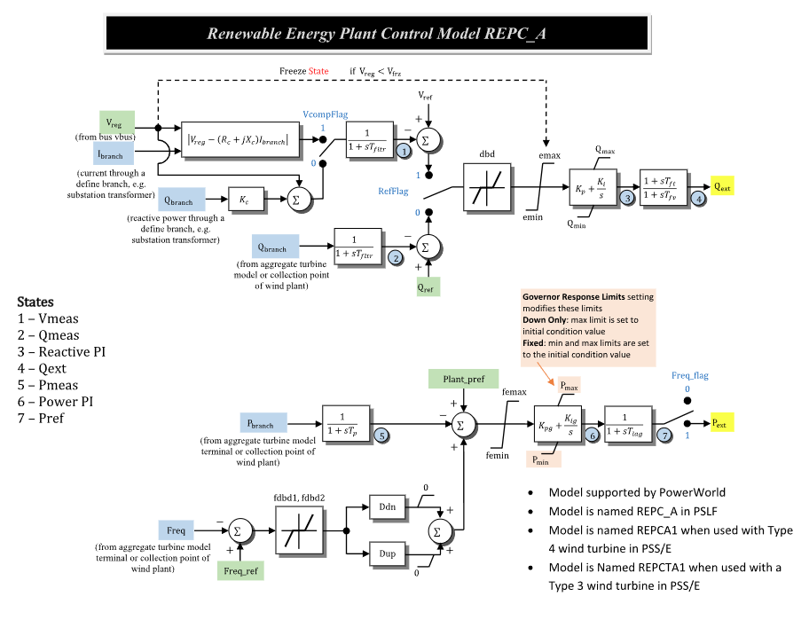

# **Renewable Energy Plant Control Model (REPCA)**

REPCA is a WECC renewable energy plant control model for inverter-coupled
resources.

## Notes

- Fig. 1 hard nonlinearities use the linked CommonMath smooth approximations;
  transition-point values may differ.

> [!WARNING]
> GridKit does not yet apply the associated generator's Governor Response Limits
> modes `Down Only` and `Fixed` to REPCA. The model always uses its configured
> $P^{\min}$ and $P^{\max}$.

## Block Diagram



Figure 1: REPCA plant-control model. Figure courtesy of
[PowerWorld REPC_A model reference](https://www.powerworld.com/WebHelp/Content/TransientModels_PDF/Generator/Others/Plant%20Controller%20REPC_A.pdf).

## Model Parameters

Symbol                              | Units     | JSON        | Description                                             | Typical Value | Note
------------------------------------|-----------|-------------|---------------------------------------------------------|---------------|------
$S^\mathrm{base}$                  | [MVA]     | `mva`       | REPCA component power base                              | 100.0         | Component base
$s_\mathrm{comp}$                  | [boolean] | `VcompFlag` | Voltage-compensation selector                           | `true`        | `true` = line-drop compensation, `false` = reactive droop
$s_\mathrm{ref}$                   | [boolean] | `RefFlag`   | Reactive-loop reference selector                        | `true`        | `true` = voltage control, `false` = reactive-power control
$s_\mathrm{freq}$                  | [boolean] | `Freqflag`  | Active-power output selector                            | `false`       | `true` = command enabled, `false` = zero output
$T_\mathrm{fltr}$                  | [sec]     | `Tfltr`     | Voltage and reactive-power filter time constant         | 0.05          |
$V^\mathrm{frz}$                   | [p.u.]    | `Vfrz`      | Reactive-power PI freeze-voltage threshold              | 0.7           |
$R_c$                               | [p.u.]    | `Rc`        | Line-drop compensation resistance                       | 0.0           | System base
$X_c$                               | [p.u.]    | `Xc`        | Line-drop compensation reactance                        | 0.0           | System base
$K_c$                               | [p.u.]    | `Kc`        | Reactive-current compensation gain                      | 1.0           |
$D_\mathrm{bd1}$                   | [p.u.]    | `dbdlow`    | Lower reactive-loop deadband threshold                  | 0.0           |
$D_\mathrm{bd2}$                   | [p.u.]    | `dbdupper`  | Upper reactive-loop deadband threshold                  | 0.0           |
$e^{\max}$                          | [p.u.]    | `emax`      | Maximum reactive-loop error limit                       | 1.0           |
$e^{\min}$                          | [p.u.]    | `emin`      | Minimum reactive-loop error limit                       | -1.0          |
$K_\mathrm{p}$                     | [p.u.]    | `Kp`        | Reactive-power controller proportional gain             | 10.0          |
$K_\mathrm{i}$                     | [p.u./s]  | `Ki`        | Reactive-power controller integral gain                 | 10.0          |
$Q^{\max}$                          | [p.u.]    | `Qmax`      | Maximum reactive-power command                          | 1.0           | Component base
$Q^{\min}$                          | [p.u.]    | `Qmin`      | Minimum reactive-power command                          | -1.0          | Component base
$T_\mathrm{ft}$                    | [sec]     | `Tft`       | Reactive-command lead time constant                     | 0.0           |
$T_\mathrm{fv}$                    | [sec]     | `Tfv`       | Reactive-command lag time constant                      | 3.0           |
$T_\mathrm{p}$                     | [sec]     | `Tp`        | Active-power measurement filter time constant           | 0.0           |
$D_\mathrm{bd1}^{f}$               | [p.u.]    | `fdbd1`     | Lower frequency-error deadband threshold                | 0.0           |
$D_\mathrm{bd2}^{f}$               | [p.u.]    | `fdbd2`     | Upper frequency-error deadband threshold                | 0.0           |
$D_\mathrm{dn}$                    | [p.u.]    | `Ddn`       | Down-frequency droop response gain                      | 20.0          |
$D_\mathrm{up}$                    | [p.u.]    | `Dup`       | Up-frequency droop response gain                        | 0.0           |
$e_P^{\max}$                        | [p.u.]    | `femax`     | Maximum active-power error limit                        | 1.0           |
$e_P^{\min}$                        | [p.u.]    | `femin`     | Minimum active-power error limit                        | -1.0          |
$K_\mathrm{pg}$                    | [p.u.]    | `Kpg`       | Active-power controller proportional gain               | 10.0          |
$K_\mathrm{ig}$                    | [p.u./s]  | `Kig`       | Active-power controller integral gain                   | 10.0          |
$P^{\max}$                          | [p.u.]    | `Pmax`      | Maximum active-power command                            | 2.0           | Component base
$P^{\min}$                          | [p.u.]    | `Pmin`      | Minimum active-power command                            | 0.0           | Component base
$T_\mathrm{lag}$                   | [sec]     | `Tlag`      | Active-power command lag time constant                  | 3.0           |

### Parameter Validation

All real parameters must be finite. Invalid parameter sets are rejected by:

```math
\begin{aligned}
  S^\mathrm{base} &> 0 \\
  D_\mathrm{bd1} &\le 0 \le D_\mathrm{bd2} \\
  e^{\min} &\le 0 \le e^{\max} \\
  Q^{\min} &\le Q^{\max} \\
  D_\mathrm{bd1}^{f} &\le 0 \le D_\mathrm{bd2}^{f} \\
  e_P^{\min} &\le 0 \le e_P^{\max} \\
  P^{\min} &\le P^{\max}
\end{aligned}
```

The power bases and both conversion ratios must also be finite and positive;
`verify()` also enforces Model Ports.

### Model Derived Parameters

Let $\epsilon_T=10^{-3}\ \mathrm{s}$. Smaller time constants are raised to that
floor with a warning:

```math
\begin{aligned}
  T_x &\leftarrow \max(T_x,\epsilon_T), \quad x\in\{\mathrm{fltr},\mathrm{fv},\mathrm{p},\mathrm{lag}\} \\
  s_\mathrm{comp}^\mathrm{off} &= 1 - s_\mathrm{comp} \\
  s_\mathrm{ref}^\mathrm{off} &= 1 - s_\mathrm{ref} \\
  k_\mathrm{base} &= \dfrac{S^\mathrm{sys}}{S^\mathrm{base}}
\end{aligned}
```

$S^\mathrm{sys}$ is the system power base; $k_\mathrm{base}$ converts system-base
power to component base.

## Model Ports

Name        | Port   | Init    | Description
------------|--------|---------|------------
`bus`       | Bus    | Known   | Regulated-bus voltage
`ir`        | Input  | Known   | Branch-current real component on system base
`ii`        | Input  | Known   | Branch-current imaginary component on system base
`p`         | Input  | Known   | Branch active power on system base
`q`         | Input  | Known   | Branch reactive power on system base
`freq`      | Input  | Known   | Frequency input[^frequency-measurement] Not supported yet.
`vref`      | Input  | Unknown | Voltage-control reference
`pref`      | Input  | Unknown | Plant active-power reference on system base
`qref`      | Input  | Unknown | Reactive-power reference on system base
`freqref`   | Input  | Unknown | Frequency reference
`qext`      | Output | Known   | Reactive-power command on system base
`pext`      | Output | Known   | Active-power command on system base

The bus and measurement inputs are required; attached inputs must be linked.
Optional references are published when attached and latched otherwise. The
`qext` and `pext` assignments are optional; both remain monitorable.
Initialization preserves `qext` and preserves `pext` only when
$s_\mathrm{freq}=1$; otherwise `pext` becomes zero.

## Model Variables

### Internal Variables

#### Differential

Symbol                  | Units  | Description                         | Note
------------------------|--------|-------------------------------------|------
$V^\mathrm{meas}$      | [p.u.] | Filtered regulated voltage          | State 1 in Fig. 1
$Q^\mathrm{meas}$      | [p.u.] | Filtered reactive-power signal      | State 2 in Fig. 1; component base
$x_Q^\mathrm{PI}$      | [p.u.] | Reactive-power PI controller state  | State 3 in Fig. 1; component base
$x_Q^\mathrm{lag}$     | [p.u.] | Reactive-command lead-lag state     | State 4 in Fig. 1; component base
$P^\mathrm{meas}$      | [p.u.] | Filtered active-power signal        | State 5 in Fig. 1; component base
$x_P^\mathrm{PI}$      | [p.u.] | Active-power PI controller state    | State 6 in Fig. 1; component base
$P^\mathrm{ref}$       | [p.u.] | Active-power command lag state      | State 7 in Fig. 1; component base

#### Algebraic

Symbol                    | Units  | Description                         | Note
--------------------------|--------|-------------------------------------|------
$V$                       | [p.u.] | Regulated-bus voltage magnitude     |
$V^\mathrm{ldc}$         | [p.u.] | Line-drop compensated voltage magnitude |
$V^\mathrm{droop}$       | [p.u.] | Reactive-droop-compensated voltage |
$V^\mathrm{ctrl}$        | [p.u.] | Selected voltage-measurement input  |
$s_\mathrm{frz}$         | [-]    | Smooth reactive-power PI voltage-enable gate |
$e_\mathrm{RQ}$          | [p.u.] | Selected reactive-loop error        |
$e_\mathrm{RQ}^\mathrm{db}$    | [p.u.] | Deadbanded reactive-loop error      |
$e_\mathrm{RQ}^\mathrm{lim}$   | [p.u.] | Limited reactive-loop error         |
$Q^\mathrm{PI}$          | [p.u.] | Reactive-power PI output            | Component base
$Q^\mathrm{ext}$         | [p.u.] | Reactive-power command output       | System base
$e_f$                     | [p.u.] | Frequency error after deadband      |
$e_P$                     | [p.u.] | Active-power control error          | Component base
$e_P^\mathrm{lim}$       | [p.u.] | Limited active-power control error  | Component base
$P^\mathrm{PI}$          | [p.u.] | Active-power PI output              | Component base
$P^\mathrm{ext}$         | [p.u.] | Active-power command output         | System base

### External Variables

#### Differential

None.

#### Algebraic

Symbol                         | Units  | Init    | Description                       | Note
-------------------------------|--------|---------|-----------------------------------|------
$V_\mathrm{r}$                | [p.u.] | Known   | Regulated-bus voltage, real component | Bus input
$V_\mathrm{i}$                | [p.u.] | Known   | Regulated-bus voltage, imaginary component | Bus input
$I_\mathrm{r}$                | [p.u.] | Known   | Branch-current real component     | Signal port `ir`; system base
$I_\mathrm{i}$                | [p.u.] | Known   | Branch-current imaginary component | Signal port `ii`; system base
$P$                           | [p.u.] | Known   | Branch active power               | Signal port `p`; system base
$Q$                           | [p.u.] | Known   | Branch reactive power             | Signal port `q`; system base
$f$                           | [p.u.] | Known   | Frequency input                   | Signal port `freq`
$V^\mathrm{ref}$              | [p.u.] | Unknown | Voltage-control reference         | Optional signal port `vref`
$P^\mathrm{ref}$              | [p.u.] | Unknown | Plant active-power reference      | Optional signal port `pref`; system base
$Q^\mathrm{ref}$              | [p.u.] | Unknown | Reactive-power reference          | Optional signal port `qref`; system base
$f^\mathrm{ref}$              | [p.u.] | Unknown | Frequency reference               | Optional signal port `freqref`

## Model Equations

### Internal Equations

#### Differential

```math
\begin{aligned}
  0 &= -\dot{V}^\mathrm{meas} + \dfrac{1}{T_\mathrm{fltr}} (V^\mathrm{ctrl} - V^\mathrm{meas}) \\
  0 &= -\dot{Q}^\mathrm{meas} + \dfrac{1}{T_\mathrm{fltr}} (k_\mathrm{base}Q - Q^\mathrm{meas}) \\
  0 &= -\dot{x}_Q^\mathrm{PI} + s_\mathrm{frz}\, \text{antiwindup}(Q^\mathrm{PI}, K_\mathrm{i}e_\mathrm{RQ}^\mathrm{lim};\,Q^{\min}, Q^{\max}) \\
  0 &= -\dot{x}_Q^\mathrm{lag} + \dfrac{1}{T_\mathrm{fv}} (Q^\mathrm{PI} - x_Q^\mathrm{lag}) \\
  0 &= -\dot{P}^\mathrm{meas} + \dfrac{1}{T_\mathrm{p}} (k_\mathrm{base}P - P^\mathrm{meas}) \\
  0 &= -\dot{x}_P^\mathrm{PI} + \text{antiwindup}(P^\mathrm{PI}, K_\mathrm{ig}e_P^\mathrm{lim};\,P^{\min}, P^{\max}) \\
  0 &= -\dot{P}^\mathrm{ref} + \dfrac{1}{T_\mathrm{lag}} (P^\mathrm{PI} - P^\mathrm{ref}).
\end{aligned}
```

CommonMath defines the [`antiwindup`](../../../../CommonMath.md#antiwindup)
target and smooth approximation.

#### Algebraic

```math
\begin{aligned}
  0 &= -V^2 + V_\mathrm{r}^2 + V_\mathrm{i}^2 \\
  0 &= -(V^\mathrm{ldc})^2 + (V_\mathrm{r} - R_c I_\mathrm{r} + X_c I_\mathrm{i})^2 + (V_\mathrm{i} - R_c I_\mathrm{i} - X_c I_\mathrm{r})^2 \\
  0 &= -V^\mathrm{droop} + V + K_c k_\mathrm{base}Q \\
  0 &= -V^\mathrm{ctrl} + s_\mathrm{comp}V^\mathrm{ldc} + s_\mathrm{comp}^\mathrm{off}V^\mathrm{droop} \\
  0 &= -s_\mathrm{frz} + \text{above}(V;\,V^\mathrm{frz}) \\
  0 &= -e_\mathrm{RQ} + s_\mathrm{ref}(V^\mathrm{ref} - V^\mathrm{meas}) + s_\mathrm{ref}^\mathrm{off} (k_\mathrm{base}Q^\mathrm{ref} - Q^\mathrm{meas}) \\
  0 &= -e_\mathrm{RQ}^\mathrm{db} + \text{deadband2}(e_\mathrm{RQ};\,D_\mathrm{bd1},D_\mathrm{bd2}) \\
  0 &= -e_\mathrm{RQ}^\mathrm{lim} + \text{clamp}(e_\mathrm{RQ}^\mathrm{db};\,e^{\min},e^{\max}) \\
  0 &= -Q^\mathrm{PI} + \text{clamp}(K_\mathrm{p}e_\mathrm{RQ}^\mathrm{lim}+x_Q^\mathrm{PI};\,Q^{\min},Q^{\max}) \\
  0 &= -T_\mathrm{fv} (k_\mathrm{base}Q^\mathrm{ext}-x_Q^\mathrm{lag}) + T_\mathrm{ft} (Q^\mathrm{PI}-x_Q^\mathrm{lag}) \\
  0 &= -e_f + \text{deadband2}(f^\mathrm{ref}-f;\,D_\mathrm{bd1}^{f},D_\mathrm{bd2}^{f}) \\
  0 &= -e_P + k_\mathrm{base}P^\mathrm{ref} - P^\mathrm{meas} + D_\mathrm{dn}\text{ramp}(e_f) - D_\mathrm{up}\text{ramp}(-e_f) \\
  0 &= -e_P^\mathrm{lim} + \text{clamp}(e_P;\,e_P^{\min},e_P^{\max}) \\
  0 &= -P^\mathrm{PI} + \text{clamp}(K_\mathrm{pg}e_P^\mathrm{lim}+x_P^\mathrm{PI};\,P^{\min},P^{\max}) \\
  0 &= -k_\mathrm{base}P^\mathrm{ext} + s_\mathrm{freq}P^\mathrm{ref}.
\end{aligned}
```

CommonMath defines the [derived limiter functions](../../../../CommonMath.md#derived-functions)
and [ramp primitive](../../../../CommonMath.md#primitives) used above.

### External Equations

None.

## Initialization

REPCA reconstructs a steady operating point; arbitrary-state restart is unsupported.

### Input Initialization

```math
\begin{aligned}
  V_\mathrm{r}, V_\mathrm{i} &\leftarrow \text{regulated-bus voltage} \\
  I_\mathrm{r}, I_\mathrm{i} &\leftarrow \text{branch current} \\
  P, Q &\leftarrow \text{branch power} \\
  f &\leftarrow \text{frequency input} \\
  Q^\mathrm{ext} &\leftarrow \text{known reactive-power command on system base} \\
  P^\mathrm{ext} &\leftarrow \text{known active-power command on system base}, \quad s_\mathrm{freq}=1
\end{aligned}
```

### Internal Initialization

For initialization tolerance $\epsilon_\mathrm{init}$ of $10^{-10}$,
$\text{clamp}^{-1}(z;\ell,u)$ returns a finite input matching
$z\in[\ell,u]$ within that tolerance, including the limits.

```math
\begin{aligned}
  V &\leftarrow \sqrt{V_\mathrm{r}^2 + V_\mathrm{i}^2} \\
  V^\mathrm{ldc} &\leftarrow \sqrt{(V_\mathrm{r}-R_c I_\mathrm{r}+X_c I_\mathrm{i})^2 + (V_\mathrm{i}-R_c I_\mathrm{i}-X_c I_\mathrm{r})^2} \\
  V^\mathrm{droop} &\leftarrow V + K_c k_\mathrm{base}Q \\
  V^\mathrm{ctrl} &\leftarrow s_\mathrm{comp}V^\mathrm{ldc} + s_\mathrm{comp}^\mathrm{off}V^\mathrm{droop} \\
  V^\mathrm{meas} &\leftarrow V^\mathrm{ctrl} \\
  Q^\mathrm{meas} &\leftarrow k_\mathrm{base}Q \\
  P^\mathrm{meas} &\leftarrow k_\mathrm{base}P \\
  s_\mathrm{frz} &\leftarrow \text{above}(V;\,V^\mathrm{frz}) \\
  e_\mathrm{RQ} &\leftarrow 0 \\
  e_\mathrm{RQ}^\mathrm{db} &\leftarrow \text{deadband2}(e_\mathrm{RQ};\,D_\mathrm{bd1},D_\mathrm{bd2}) \\
  e_\mathrm{RQ}^\mathrm{lim} &\leftarrow \text{clamp}(e_\mathrm{RQ}^\mathrm{db};\,e^{\min},e^{\max}) \\
  Q^\mathrm{PI} &\leftarrow k_\mathrm{base}Q^\mathrm{ext} \\
  x_Q^\mathrm{lag} &\leftarrow Q^\mathrm{PI} \\
  u_Q^\mathrm{PI} &\leftarrow \text{clamp}^{-1}(Q^\mathrm{PI};\,Q^{\min},Q^{\max}) \\
  x_Q^\mathrm{PI} &\leftarrow u_Q^\mathrm{PI} - K_\mathrm{p}e_\mathrm{RQ}^\mathrm{lim} \\
  e_f &\leftarrow \text{deadband2}(0;\,D_\mathrm{bd1}^{f},D_\mathrm{bd2}^{f}) \\
  P^\mathrm{freq} &\leftarrow D_\mathrm{dn}\text{ramp}(e_f) - D_\mathrm{up}\text{ramp}(-e_f) \\
  e_P &\leftarrow 0 \\
  e_P^\mathrm{lim} &\leftarrow \text{clamp}(e_P;\,e_P^{\min},e_P^{\max}) \\
  P^\mathrm{ref} &\leftarrow \begin{cases}
    k_\mathrm{base}P^\mathrm{ext} & s_\mathrm{freq}=1 \\
    \text{clamp}(P^\mathrm{meas};\,P^{\min},P^{\max}) & s_\mathrm{freq}=0
  \end{cases} \\
  P^\mathrm{PI} &\leftarrow P^\mathrm{ref} \\
  u_P^\mathrm{PI} &\leftarrow \begin{cases}
    \text{clamp}^{-1}(P^\mathrm{PI};\,P^{\min},P^{\max}) & s_\mathrm{freq}=1 \\
    P^\mathrm{meas} & s_\mathrm{freq}=0
  \end{cases} \\
  x_P^\mathrm{PI} &\leftarrow u_P^\mathrm{PI} - K_\mathrm{pg}e_P^\mathrm{lim} \\
  P^\mathrm{ext} &\leftarrow \dfrac{s_\mathrm{freq}}{k_\mathrm{base}}P^\mathrm{ref} \\
  \dot{V}^\mathrm{meas},\dot{Q}^\mathrm{meas}, \dot{x}_Q^\mathrm{PI},\dot{x}_Q^\mathrm{lag}, \dot{P}^\mathrm{meas},\dot{x}_P^\mathrm{PI},\dot{P}^\mathrm{ref} &\leftarrow 0.
\end{aligned}
```

Initialization rejects an operating point if:

- a required input or derived value is not finite;
- $k_\mathrm{base}Q^\mathrm{ext}\notin[Q^{\min},Q^{\max}]$, or
  $s_\mathrm{freq}=1$ and
  $k_\mathrm{base}P^\mathrm{ext}\notin[P^{\min},P^{\max}]$; or
- the gated reactive-power or active-power PI state rate is nonfinite or
  exceeds $\epsilon_\mathrm{init}$ in magnitude.

Initialization is atomic; candidates are validated before state or signal writes.

### Output Initialization

```math
\begin{aligned}
  V^\mathrm{ref} &\leftarrow V^\mathrm{meas} \\
  P^\mathrm{ref} &\leftarrow \dfrac{P^\mathrm{meas}-P^\mathrm{freq}}{k_\mathrm{base}} \\
  Q^\mathrm{ref} &\leftarrow Q \\
  f^\mathrm{ref} &\leftarrow f.
\end{aligned}
```

## Monitorable Outputs

Output          | Units  | Description                         | Note
----------------|--------|-------------------------------------|------
`qext`          | [p.u.] | Reactive-power command output       | $Q^\mathrm{ext}$; system base
`pext`          | [p.u.] | Active-power command output         | $P^\mathrm{ext}$; system base
`vmeas`         | [p.u.] | Filtered regulated voltage          | $V^\mathrm{meas}$
`qmeas`         | [p.u.] | Filtered reactive-power signal      | $Q^\mathrm{meas}$; component base
`pmeas`         | [p.u.] | Filtered active-power signal        | $P^\mathrm{meas}$; component base

## Testing

- `validation()` checks defaults, parameter domains, signal contracts, and time floors.
- `initializationAndSignals()` checks reconstruction, bases, signals, monitors,
  tags, and selectors.
- `initializationDomain()` checks rejection, exact and collapsed limits,
  nonfinite values, and atomicity.
- `residualEquations()` checks every residual against a fixed answer key.
- `reactiveControl()` checks compensation and reference modes, voltage freeze,
  deadbands, smooth limits, anti-windup, and lead-lag behavior.
- `activePowerControl()` checks frequency selection, deadband, droop, smooth
  limits, anti-windup, and the output lag.
- `derivatives()` checks differential-row derivative signs.
- `jacobian()` checks fixed numerical and structural oracles, plus Enzyme
  agreement to $10^{-9}$ when enabled.

[^frequency-measurement]: Background for phase-derived, filtered frequency
    measurement: [PSCAD Frequency/Phase/Magnitude Meter](https://www.pscad.com/webhelp-pscad-v5.1.0-ol/Master_Library_Models/Meters/Frequency_Phase_Magnitude_Meter.htm) and
    [Ting et al., *Evaluating Methods for Measuring Grid Frequency in Low-Inertia Power Systems*](https://research-hub.nrel.gov/en/publications/evaluating-methods-for-measuring-grid-frequency-in-low-inertia-po-3/).
