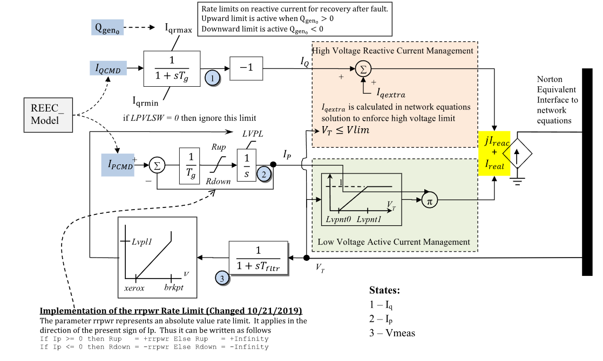

# **Renewable Energy Generator/Converter Model (REGCA)**

REGCA is a first-generation WECC renewable generator/converter model for
inverter-coupled resources. In GridKit it is represented as a controlled
current source at the network interface.

## Notes

- Internal current states and limiter quantities are on component base.
- Signal ports, monitor outputs, branch currents, and branch powers are on system base.
- LVACM uses $V_T$; LVPL uses $V_M$.
- HVRCM is represented by algebraic current $I_q^\mathrm{extra}$.
- PowerWorld fields `Qmin`, `Khv`, and `Xe` are not parameters of this GridKit implementation.

## Block Diagram

Standard REGCA converter-interface model.



Figure 1: Generator/Converter REGCA model. Figure courtesy of [PowerWorld](https://www.powerworld.com/WebHelp/)

## Model Parameters

Symbol                           | Units    | JSON     | Description                                           | Typical Value | Note
---------------------------------|----------|----------|-------------------------------------------------------|---------------|------
$P_0$                            | [p.u.]   | `p0`     | Initial active power injection                        | 1.0           | System base; required initialization source
$Q_0$                            | [p.u.]   | `q0`     | Initial reactive power injection                      | 0.0           | System base; required initialization source
$S^\mathrm{base}$                | [MVA]    | `mva`    | REGCA component power base                            | 100.0         |
$T_{\mathrm{g}}$                 | [sec]    | `Tg`     | Converter current-control lag time constant           | 0.02          | Block name: `Tg`
$T_M$                            | [sec]    | `TM`     | Terminal voltage sensor time constant                 | 0.02          | Block name: `Tfltr`
$R_q^{\max}$                      | [p.u./s] | `Rqmax`  | Reactive-current recovery positive rate limit         | 999.0         | Block name: `Iqrmax`; GridKit requires $R_q^{\max} > 0$
$R_q^{\min}$                      | [p.u./s] | `Rqmin`  | Reactive-current recovery negative rate limit         | -999.0        | Block name: `Iqrmin`; GridKit requires $R_q^{\min} < 0$
$R_p^{\max}$                      | [p.u./s] | `Rpmax`  | Active-current magnitude recovery rate limit          | 999.0         | Block name: `rrpwr`
$s_L$                            | [binary] | `sL`     | LVPL switch                                           | 1             | Block name: `LPVLSW`
$I_{L1}$                         | [p.u.]   | `IL1`    | LVPL upper-current ceiling                            | 1.1           | Block name: `LVPL1`
$V_{L0}$                         | [p.u.]   | `VL0`    | LVPL zero-crossing voltage                            | 0.4           | Block name: `zerox`
$V_{L1}$                         | [p.u.]   | `VL1`    | LVPL upper breakpoint voltage                         | 0.9           | Block name: `brkpt`
$V_{A0}$                         | [p.u.]   | `VA0`    | LVACM lower breakpoint voltage                        | 0.4           | Block name: `LVPnt0`
$V_{A1}$                         | [p.u.]   | `VA1`    | LVACM upper breakpoint voltage                        | 0.9           | Block name: `LVPnt1`
$V_{\mathrm{hv}}^{\max}$          | [p.u.]   | `Vhvmax` | Terminal-voltage ceiling for HV reactive management   | 1.2           | Block name: `VLim`

### Parameter Validation

Invalid REGCA parameter sets are rejected by the following checks. Let $\epsilon_T=10^{-3}$.
Time constants below $\epsilon_T$ are raised to $\epsilon_T$ and logged as a warning,
every other condition is a configuration error.

```math
\begin{aligned}
  T &\leftarrow \max\!\left(T, \epsilon_T\right)
    \quad T\in\{T_{\mathrm{g}},T_M\} \\
  S^\mathrm{base}
    &> 0 \\
  R_p^{\max}
    &> 0 \\
  R_q^{\min}
    &< 0 < R_q^{\max} \\
  s_L
    &\in \{0,1\} \\
  I_{L1}
    &\ge 0 \\
  0
    &\le V_{L0} < V_{L1} \\
  0
    &\le V_{A0} < V_{A1} \\
  V_{\mathrm{hv}}^{\max}
    &> 0
\end{aligned}
```

### Model Derived Parameters

```math
\begin{aligned}
  s_L^\mathrm{off}
    &= 1 - s_L \\
  k_{\mathrm{base}}
    &= \dfrac{S^\mathrm{sys}}{S^\mathrm{base}} \\
  M_p
    &= 100 R_p^{\max}
\end{aligned}
```

$M_p$ is a finite surrogate for inactive active-current rate limits,
not a physical REGCA parameter.

## Model Ports

Name       | Port   | Init    | Description
-----------|--------|---------|------
`bus`      | Bus    | Known   | Terminal bus voltage
`ipcmd`    | Input  | Unknown | Active-current command input
`iqcmd`    | Input  | Unknown | Reactive-current command input
`ibranchr` | Output | Known   | Branch-current real-component output
`ibranchi` | Output | Known   | Branch-current imaginary-component output
`pbranch`  | Output | Known   | Branch active-power output
`qbranch`  | Output | Known   | Branch reactive-power output

## Model Variables

### Internal Variables

#### Differential

Symbol                | Units  | Description               | Note
----------------------|--------|---------------------------|------
$V_M$                 | [p.u.] | Filtered terminal voltage | State 3 in Fig. 1
$I_q$                 | [p.u.] | Reactive-current state    | State 1 in Fig. 1 before the `-1` block; component base
$I_p$                 | [p.u.] | Active-current state      | State 2 in Fig. 1; component base

#### Algebraic

Symbol                     | Units    | Description                                                 | Note
---------------------------|----------|-------------------------------------------------------------|------
$V_T$                      | [p.u.]   | Terminal voltage magnitude                                  |
$I_{\mathrm{r}}$           | [p.u.]   | Branch-current real component                               | System base
$I_{\mathrm{i}}$           | [p.u.]   | Branch-current imaginary component                         | System base
$I_q^\mathrm{extra}$       | [p.u.]   | Extra inductive current from high-voltage reactive current management | Component base
$I_L$                      | [p.u.]   | LVPL upper-limit current curve                              | Component base; function of $V_M$
$\ell_p$                   | [p.u./s] | Smooth active-current lower rate bound                      | Component base; equivalent to diagram `Rdown`
$u_p$                      | [p.u./s] | Smooth active-current upper rate bound                      | Component base; effective `Rup`
$P^\mathrm{br}$            | [p.u.]   | Branch active power                                         | System base
$Q^\mathrm{br}$            | [p.u.]   | Branch reactive power                                       | System base

### External Variables

#### Differential
None.

#### Algebraic

Symbol                          | Units  | Type    | Description                                                      | Note
--------------------------------|--------|---------|------------------------------------------------------------------|------
$V_{\mathrm{r}}$                | [p.u.] | Known   | Terminal voltage, real component                                 | Bus input
$V_{\mathrm{i}}$                | [p.u.] | Known   | Terminal voltage, imaginary component                            | Bus input
$I_p^\mathrm{cmd}$              | [p.u.] | Unknown | Active-current command in the terminal-voltage reference frame   | Optional signal port `ipcmd`; system base
$I_q^\mathrm{cmd}$              | [p.u.] | Unknown | Reactive-current command in the terminal-voltage reference frame | Optional signal port `iqcmd`; system base

REGCA initializes the current-command ports from the required `p0`/`q0`
power-flow injection. If no controller is connected, the resolved initialization
commands are held constant during residual evaluation.

## Model Equations

Define the pre-limit current derivatives:

```math
\begin{aligned}
  f_{\mathrm{q}} &= \dfrac{1}{T_{\mathrm{g}}}\left(k_{\mathrm{base}}I_q^\mathrm{cmd} - I_q\right) \\
  f_{\mathrm{p}} &= \dfrac{1}{T_{\mathrm{g}}}\left(k_{\mathrm{base}}I_p^\mathrm{cmd} - I_p\right)
\end{aligned}
```

### Differential Equations

The $I_q$ limiter branch is selected by the initial reactive power $Q_0$.

```math
\begin{aligned}
  0 &= -\dot V_M + \dfrac{1}{T_M}\left(V_T - V_M\right) \\
  0 &= -\dot I_q +
    \begin{cases}
      \text{min}\left(f_{\mathrm{q}},\ R_q^{\max}\right) & Q_0 > 0 \\
      \text{max}\left(f_{\mathrm{q}},\ R_q^{\min}\right) & Q_0 \le 0
    \end{cases} \\
  0 &= -\dot I_p + \text{clamp}\left(f_{\mathrm{p}},\ \ell_p,\ u_p\right)
\end{aligned}
```

CommonMath defines the [min, max, and clamp](../../../../CommonMath.md#derived-functions)
targets and smooth approximations.

### Algebraic Equations

```math
\begin{aligned}
  0 &= -V_T^2 + V_{\mathrm{r}}^2 + V_{\mathrm{i}}^2 \\
  0 &= -V_T I_{\mathrm{r}}
       + \dfrac{1}{k_{\mathrm{base}}}
         \left[
           V_{\mathrm{i}}\left(I_q - I_q^\mathrm{extra}\right)
           + V_{\mathrm{r}}I_p\text{linseg}(V_T;\ V_{A0},\ V_{A1},\ 1)
         \right] \\
  0 &= -V_T I_{\mathrm{i}}
       + \dfrac{1}{k_{\mathrm{base}}}
         \left[
           -V_{\mathrm{r}}\left(I_q - I_q^\mathrm{extra}\right)
           + V_{\mathrm{i}}I_p\text{linseg}(V_T;\ V_{A0},\ V_{A1},\ 1)
         \right] \\
  0 &= -I_q^\mathrm{extra}
       + \text{ramp}(V_T - V_{\mathrm{hv}}^{\max}) \\
  0 &= -I_L
       + \text{linseg}(V_M;\ V_{L0},\ V_{L1},\ I_{L1}) \\
  0 &= -\ell_p
       - R_p^{\max}
       - \left(M_p - R_p^{\max}\right)\sigma(I_p) \\
  0 &= -u_p
       + M_p\left(1-\sigma(I_p)\right)
       + R_p^{\max}\sigma(I_p)
         \left(s_L^\mathrm{off} + s_L\sigma(I_L - I_p)\right) \\
  0 &= -P^\mathrm{br}
       + V_{\mathrm{r}} I_{\mathrm{r}} + V_{\mathrm{i}} I_{\mathrm{i}} \\
  0 &= -Q^\mathrm{br}
       + V_{\mathrm{i}} I_{\mathrm{r}} - V_{\mathrm{r}} I_{\mathrm{i}}
\end{aligned}
```

Here $\text{linseg}$ and $\text{ramp}$ are the CommonMath
[linear segment](../../../../CommonMath.md#derived-functions) and
[ramp](../../../../CommonMath.md#primitives), and $\sigma$ is the
[step function](../../../../CommonMath.md#primitives).

## Network Interface

The bus receives the REGCA branch-current variables directly:

```math
\begin{aligned}
  I_{\mathrm{r}}^\mathrm{inj} &:= I_{\mathrm{r}} \\
  I_{\mathrm{i}}^\mathrm{inj} &:= I_{\mathrm{i}}
\end{aligned}
```

## Initialization

### Input Initialization

```math
\begin{aligned}
  V_{\mathrm{r}}, V_{\mathrm{i}}
    &\leftarrow \text{terminal-bus voltage} \\
  P_0, Q_0
    &\leftarrow \text{power-flow injection on system base}
\end{aligned}
```

### Internal Initialization

REGCA requires $V_{T,0} \ge V_{A1}$ so low-voltage active-current management
is inactive at the initial power-flow operating point. Initialization rejects
an operating point below this voltage.

Initialization is performed by evaluating the steady-state residuals in
dependency order. Let subscript $0$ denote initial values and set all internal
derivatives to zero:

```math
\begin{aligned}
  V_{T,0}
    &= \sqrt{V_{\mathrm{r},0}^2 + V_{\mathrm{i},0}^2} \\
  V_{M,0}
    &= V_{T,0} \\
  A_0^\mathrm{LVACM}
    &= \text{linseg}\left(V_{T,0};\ V_{A0},\ V_{A1},\ 1\right) \\
  I_{q,0}^\mathrm{extra}
    &= \text{ramp}\left(V_{T,0} - V_{\mathrm{hv}}^{\max}\right) \\
  I_{p,0}^\mathrm{cmd}
    &= \dfrac{P_0}{V_{T,0}A_0^\mathrm{LVACM}} \\
  I_{q,0}^\mathrm{cmd}
    &= \dfrac{Q_0}{V_{T,0}}
       + \dfrac{I_{q,0}^\mathrm{extra}}{k_{\mathrm{base}}} \\
  I_{p,0}
    &= k_{\mathrm{base}}I_{p,0}^\mathrm{cmd} \\
  I_{q,0}
    &= k_{\mathrm{base}}I_{q,0}^\mathrm{cmd} \\
  I_{L,0}
    &= \text{linseg}\left(V_{T,0};\ V_{L0},\ V_{L1},\ I_{L1}\right) \\
  \ell_{p,0}
    &= -R_p^{\max}
       - \left(M_p - R_p^{\max}\right)\sigma(I_{p,0}) \\
  u_{p,0}
    &= M_p\left(1-\sigma(I_{p,0})\right)
       + R_p^{\max}\sigma(I_{p,0})
         \left(s_L^\mathrm{off} + s_L\sigma(I_{L,0} - I_{p,0})\right) \\
  I_{\mathrm{r},0}
    &= \dfrac{1}{k_{\mathrm{base}}V_{T,0}}
       \left[
         V_{\mathrm{i},0}\left(I_{q,0} - I_{q,0}^\mathrm{extra}\right)
         + V_{\mathrm{r},0}I_{p,0}A_0^\mathrm{LVACM}
       \right] \\
  I_{\mathrm{i},0}
    &= \dfrac{1}{k_{\mathrm{base}}V_{T,0}}
       \left[
         -V_{\mathrm{r},0}\left(I_{q,0} - I_{q,0}^\mathrm{extra}\right)
         + V_{\mathrm{i},0}I_{p,0}A_0^\mathrm{LVACM}
       \right] \\
  P_0^\mathrm{br}
    &= V_{\mathrm{r},0}I_{\mathrm{r},0} + V_{\mathrm{i},0}I_{\mathrm{i},0} \\
  Q_0^\mathrm{br}
    &= V_{\mathrm{i},0}I_{\mathrm{r},0} - V_{\mathrm{r},0}I_{\mathrm{i},0}
\end{aligned}
```

Here $\text{linseg}$ and $\text{ramp}$ are the CommonMath
[linear segment](../../../../CommonMath.md#derived-functions) and
[ramp](../../../../CommonMath.md#primitives), and $\sigma$ is the
[step function](../../../../CommonMath.md#primitives).

### Output Initialization

```math
\begin{aligned}
  I_p^\mathrm{cmd}
    &\leftarrow I_{p,0}^\mathrm{cmd} \\
  I_q^\mathrm{cmd}
    &\leftarrow I_{q,0}^\mathrm{cmd}
\end{aligned}
```

REGCA writes the resolved current commands to attached `ipcmd` and `iqcmd`
ports. If no controller is attached, those values are used as constant command
inputs.

## Monitorable Outputs

Output | Units  | Description                 | Note
-------|--------|-----------------------------|------
`ir`   | [p.u.] | Real current injection      | System base; exported through `ibranchr` when assigned
`ii`   | [p.u.] | Imaginary current injection | System base; exported through `ibranchi` when assigned
`p`    | [p.u.] | Active-power output         | System base; exported through `pbranch` when assigned
`q`    | [p.u.] | Reactive-power output       | System base; exported through `qbranch` when assigned
