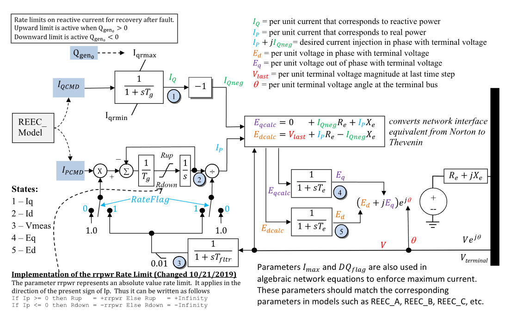

# **Renewable Energy Generator/Converter Model (REGCB)**

REGCB is a WECC renewable energy generator/converter model for inverter-coupled
resources.

## Block Diagram

Standard model diagram for the REGCB converter interface.

Figure 1: Generator/Converter REGCB model. Figure courtesy of [PowerWorld](https://www.powerworld.com/WebHelp/)

## Model Parameters

TBD.

### Parameter Validation

TBD.

### Model Derived Parameters

TBD.

## Model Ports

TBD.

## Model Variables

### Internal Variables

#### Differential

TBD.

#### Algebraic

TBD.

### External Variables

#### Differential

None.

#### Algebraic

TBD.

## Model Equations

### Internal Equations

#### Differential

TBD.

#### Algebraic

TBD.

### External Equations

None.

## Initialization

TBD.

## Monitors

TBD.
