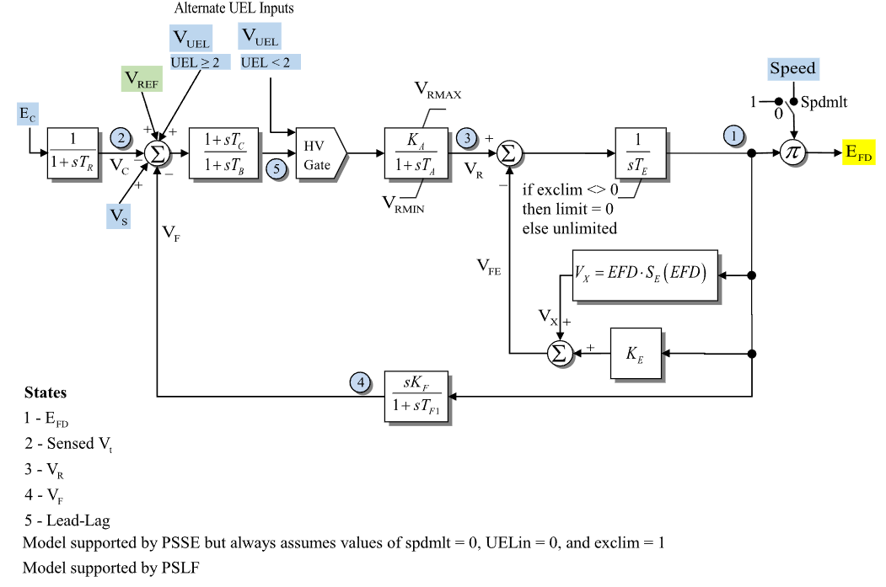

# **IEEE DC1A Excitation System Model (ESDC1A)**

ESDC1A is an IEEE DC1A excitation-system model. In GridKit it reads the
connected bus voltage, optional stabilizer and under-excitation limiter signals,
and publishes field voltage.

## Notes

- Internal voltage signals are on ESDC1A component base unless otherwise
  stated.
- The connected bus supplies $E_C=\sqrt{V_{\mathrm{r}}^2+V_{\mathrm{i}}^2}$.
- The source diagram labels the optional multiplier input as `Speed`; GridKit
  uses machine speed deviation, so the enabled multiplier is $1+\omega$.
- The PowerWorld parameter table names the UEL selector `UEL`; `UEL >= 2`
  routes the UEL input through the input-error summing junction and `UEL < 2`
  routes it through the high-value gate.
- `efd` is a required output signal. `speed` is required only when
  $s_{\mathrm{spd}}=1$; `vs` and `vuel` are optional and default to zero.

## Block Diagram



Figure 1: ESDC1A exciter model. Figure courtesy of the
[PowerWorld ESDC1A model reference](https://www.powerworld.com/WebHelp/Content/TransientModels_HTML/Exciter%20ESDC1A.htm).

## Model Parameters

Symbol                              | Units     | JSON      | Description                                      | Typical Value | Note
------------------------------------|-----------|-----------|--------------------------------------------------|---------------|------
$T_R$                               | [sec]     | `Tr`      | Transducer time constant                         | 0.0           | State 2; raised to the minimum-time floor
$K_A$                               | [p.u.]    | `Ka`      | Voltage-regulator gain                           | 40.0          |
$T_A$                               | [sec]     | `Ta`      | Voltage-regulator time constant                  | 0.1           | State 3
$T_B$                               | [sec]     | `Tb`      | Lead-lag denominator time constant               | 0.0           | State 5; raised to the minimum-time floor
$T_C$                               | [sec]     | `Tc`      | Lead-lag numerator time constant                 | 0.0           |
$V_R^{\max}$                        | [p.u.]    | `Vrmax`   | Maximum voltage-regulator output                 | 1.0           |
$V_R^{\min}$                        | [p.u.]    | `Vrmin`   | Minimum voltage-regulator output                 | -1.0          |
$K_E$                               | [p.u.]    | `Ke`      | Exciter field-resistance line-slope margin       | 0.1           |
$T_E$                               | [sec]     | `Te`      | Exciter field time constant                      | 0.5           | State 1
$K_F$                               | [p.u.]    | `Kf`      | Stabilizing feedback gain                        | 0.05          |
$T_{F1}$                            | [sec]     | `Tf1`     | Feedback lead time constant                      | 0.7           | State 4; raised to the minimum-time floor
$s_{\mathrm{spd}}$                  | [binary]  | `Spdmlt`  | Speed multiplier flag                            | 0             | 1 enables the speed multiplier
$E_1$                               | [p.u.]    | `E1`      | First saturation voltage point                   | 2.8           |
$S_E(E_1)$                          | [p.u.]    | `Se1`     | Saturation value at $E_1$                        | 0.08          |
$E_2$                               | [p.u.]    | `E2`      | Second saturation voltage point                  | 3.7           |
$S_E(E_2)$                          | [p.u.]    | `Se2`     | Saturation value at $E_2$                        | 0.33          |
$I_{\mathrm{UEL}}$                  | [integer] | `UEL`     | Under-excitation limiter input-location selector | 0             | 0/1 = high-value gate, 2/3 = input-error summing junction
$s_{\mathrm{lim}}$                  | [binary]  | `exclim`  | Exciter feedback lower-limit flag                | 1             | 1 enables the zero lower limit on $V_{\mathrm{FE}}$

### Parameter Validation

Invalid ESDC1A parameter sets are rejected by the following checks:

```math
\begin{aligned}
  s_{\mathrm{spd}}, s_{\mathrm{lim}}
    &\in \{0,1\} \\
  T_R, T_B, T_{F1}
    &\ge 0 \\
  K_A
    &> 0 \\
  T_A, T_E
    &> 0 \\
  T_C
    &\ge 0 \\
  V_R^{\min}
    &\le V_R^{\max} \\
  I_{\mathrm{UEL}}
    &\in \{0,1,2,3\} \\
  \left(S_E(E_1), S_E(E_2)\right)
    &=(0,0)
      \quad\text{or}\quad
      \begin{gathered}
        E_1, E_2, S_E(E_1), S_E(E_2) > 0 \\
        E_1 \ne E_2 \\
        S_E(E_1) \ne S_E(E_2)
      \end{gathered}
\end{aligned}
```

### Model Derived Parameters

Let $\epsilon_T=10^{-3}\ \mathrm{s}$. A time constant below $\epsilon_T$ is
raised to that floor in place, so every equation below uses the raised value:

```math
\begin{aligned}
  T_x
    &\leftarrow \max\!\left(T_x,\epsilon_T\right),
       \quad x\in\{R,B,F1\} \\
  s_{\mathrm{UEL}}
    &=
      \begin{cases}
        1 & I_{\mathrm{UEL}} \ge 2 \\
        0 & I_{\mathrm{UEL}} < 2
      \end{cases} \\
  s_{\mathrm{UEL}}^\mathrm{off}
    &= 1 - s_{\mathrm{UEL}} \\
  s_{\mathrm{lim}}^\mathrm{off}
    &= 1 - s_{\mathrm{lim}}
\end{aligned}
```

When saturation is disabled, $S_A=0$ and $S_B=0$. Otherwise,

```math
\begin{aligned}
  C &= \sqrt{\dfrac{S_E(E_2)}{S_E(E_1)}} \\
  S_A &= \dfrac{C E_1 - E_2}{C - 1} \\
  S_B &= \dfrac{S_E(E_1)}{(E_1 - S_A)^2}
\end{aligned}
```

## Model Ports

Name    | Port   | Init    | Description
--------|--------|---------|------
`bus`   | Bus    | Known   | Terminal bus voltage
`speed` | Input  | Known   | Machine speed deviation
`vref`  | Input  | Unknown | Voltage-control reference
`vs`    | Input  | Known   | Stabilizer input signal
`vuel`  | Input  | Known   | Under-excitation limiter input
`efd`   | Output | Known   | Field-voltage output

`Known` ports are seeded before `initialize()` and preserved by it. `Unknown`
inputs are resolved during initialization and written to attached signal
storage, or retained as constant inputs when the port is unattached.

## Model Variables

### Internal Variables

#### Differential

Symbol                              | Units  | Description                                          | Note
------------------------------------|--------|------------------------------------------------------|------
$E_{\mathrm{fd}}'$                  | [p.u.] | Field-voltage state before optional speed multiplier | State 1 in Fig. 1; source label: `EFD`
$V_C$                               | [p.u.] | Sensed compensated voltage                           | State 2 in Fig. 1; source label: `Sensed Vt`
$V_R$                               | [p.u.] | Voltage-regulator output                             | State 3 in Fig. 1; source label: `VR`
$V_F$                               | [p.u.] | Stabilizing feedback output                          | State 4 in Fig. 1; source label: `VF`
$x_{\mathrm{LL}}$                   | [p.u.] | Lead-lag block state                                 | State 5 in Fig. 1; source label: `Lead-Lag`

#### Algebraic

Symbol                              | Units  | Description                                      | Note
------------------------------------|--------|--------------------------------------------------|------
$e_V$                               | [p.u.] | Voltage-regulator input error                    |
$V_{\mathrm{LL}}$                   | [p.u.] | Lead-lag block output                            | Input to high-value gate
$V_{\mathrm{HV}}$                   | [p.u.] | High-value gate output                           | Input to voltage regulator
$S_E$                               | [p.u.] | Saturation coefficient evaluated at $E_{\mathrm{fd}}'$ |
$V_{\mathrm{FE}}$                   | [p.u.] | Exciter feedback signal after optional lower limit |
$E_{\mathrm{fd}}$                   | [p.u.] | Field-voltage output                             | Published through `efd`

### External Variables

#### Differential

None.

#### Algebraic

Symbol                              | Units  | Init    | Description                         | Note
------------------------------------|--------|---------|-------------------------------------|------
$V_{\mathrm{r}}$                    | [p.u.] | Known   | Terminal-bus voltage, real component | Bus input
$V_{\mathrm{i}}$                    | [p.u.] | Known   | Terminal-bus voltage, imaginary component | Bus input
$\omega$                            | [p.u.] | Known   | Machine speed deviation             | Optional signal port `speed`; required when $s_{\mathrm{spd}}=1$
$V_{\mathrm{ref}}$                  | [p.u.] | Unknown | Voltage-control reference           | Optional signal port `vref`; initialized constant setpoint; source label: `VREF`
$V_S$                               | [p.u.] | Known   | Stabilizer input signal             | Optional signal port `vs`; defaults to zero
$V_{\mathrm{UEL}}$                  | [p.u.] | Known   | Under-excitation limiter input      | Optional signal port `vuel`; defaults to zero

## Model Equations

### Differential Equations

```math
\begin{aligned}
  0 &=
    -\dot{E}_{\mathrm{fd}}'
    + \dfrac{1}{T_E}
      \left(V_R - V_{\mathrm{FE}}\right) \\
  0 &=
    -\dot{V}_C
    + \dfrac{1}{T_R}
      \left(
        \sqrt{V_{\mathrm{r}}^2+V_{\mathrm{i}}^2}
        - V_C
      \right) \\
  0 &=
    -\dot{V}_R
    + \dfrac{1}{T_A}
      \text{antiwindup}
      \left(
        V_R,\,
        -V_R + K_A V_{\mathrm{HV}};\,
        V_R^{\min}, V_R^{\max}
      \right) \\
  0 &=
    -\dot{V}_F
    + \dfrac{1}{T_{F1}}
      \left[
        -V_F
        + \dfrac{K_F}{T_E}
          \left(V_R - V_{\mathrm{FE}}\right)
      \right] \\
  0 &=
    -\dot{x}_{\mathrm{LL}}
    + \dfrac{1}{T_B}
      \left(e_V - x_{\mathrm{LL}}\right)
\end{aligned}
```

CommonMath defines the [`antiwindup`](../../../../CommonMath.md#antiwindup)
target and smooth approximation.

### Algebraic Equations

```math
\begin{aligned}
  0 &=
    -e_V
    + V_{\mathrm{ref}}
    + V_S
    + s_{\mathrm{UEL}}V_{\mathrm{UEL}}
    - V_C
    - V_F \\
  0 &=
    -V_{\mathrm{LL}}
    + x_{\mathrm{LL}}
    + \dfrac{T_C}{T_B}
      \left(e_V - x_{\mathrm{LL}}\right) \\
  0 &=
    -V_{\mathrm{HV}}
    + s_{\mathrm{UEL}}V_{\mathrm{LL}}
    + s_{\mathrm{UEL}}^\mathrm{off}
      \text{max}\left(V_{\mathrm{LL}}, V_{\mathrm{UEL}}\right) \\
  0 &=
    -S_E
    + S_B q\left(E_{\mathrm{fd}}' - S_A\right) \\
  0 &=
    -V_{\mathrm{FE}}
    + s_{\mathrm{lim}}^\mathrm{off}
      \left(K_E + S_E\right)E_{\mathrm{fd}}'
    + s_{\mathrm{lim}}\rho
      \left(\left(K_E + S_E\right)E_{\mathrm{fd}}'\right) \\
  0 &=
    -E_{\mathrm{fd}}
    + \left(1 + s_{\mathrm{spd}}\omega\right)E_{\mathrm{fd}}'
\end{aligned}
```

CommonMath defines helper targets and smooth approximations for
[max](../../../../CommonMath.md#derived-functions), the [ramp](../../../../CommonMath.md#primitives)
$\rho$, and the [quadratic ramp](../../../../CommonMath.md#primitives) $q$.

## Initialization

### Input Initialization

```math
\begin{aligned}
  V_{\mathrm{r}}, V_{\mathrm{i}}
    &\leftarrow \text{terminal-bus voltage} \\
  E_{\mathrm{fd}}
    &\leftarrow \text{field-voltage signal start} \\
  \omega
    &\leftarrow \text{speed-deviation input or }0 \\
  V_S
    &\leftarrow \text{stabilizer input or }0 \\
  V_{\mathrm{UEL}}
    &\leftarrow \text{under-excitation limiter input or }0
\end{aligned}
```

Initialization never replaces the seeded value held in $E_{\mathrm{fd}}$.

### Internal Initialization

Initialization is performed by evaluating the steady-state residuals in
dependency order. The high-value gate uses the smooth CommonMath
[ramp](../../../../CommonMath.md#primitives) $\rho$, so an inactive gate is
seeded with the gate *input* through the ramp inverse $\rho^{-1}$. Let
subscript $0$ denote initial values and set all internal derivatives to zero:

```math
\begin{aligned}
  E_{C,0}
    &= \sqrt{V_{\mathrm{r},0}^2+V_{\mathrm{i},0}^2} \\
  d_0
    &= 1 + s_{\mathrm{spd}}\omega_0 \\
  E_{\mathrm{fd},0}'
    &= \dfrac{E_{\mathrm{fd},0}}{d_0} \\
  S_{E,0}
    &= S_B q\left(E_{\mathrm{fd},0}' - S_A\right) \\
  V_{\mathrm{FE},0}
    &=
      s_{\mathrm{lim}}^\mathrm{off}
      \left(K_E + S_{E,0}\right)E_{\mathrm{fd},0}'
      + s_{\mathrm{lim}}\rho
        \left(\left(K_E + S_{E,0}\right)E_{\mathrm{fd},0}'\right) \\
  V_{R,0}
    &= V_{\mathrm{FE},0} \\
  V_{\mathrm{HV},0}
    &= \dfrac{V_{R,0}}{K_A} \\
  g_0
    &=
      \begin{cases}
        V_{\mathrm{HV},0},
          & s_{\mathrm{UEL}}=1 \\
        V_{\mathrm{UEL},0}
          + \rho^{-1}
            \left(V_{\mathrm{HV},0}-V_{\mathrm{UEL},0}\right),
          & s_{\mathrm{UEL}}=0
      \end{cases} \\
  V_{C,0}
    &= E_{C,0} \\
  V_{F,0}
    &= 0 \\
  e_{V,0}
    &= g_0 \\
  x_{\mathrm{LL},0}
    &= g_0 \\
  V_{\mathrm{LL},0}
    &= g_0
\end{aligned}
```

Initialization rejects a non-finite bus voltage or field-voltage seed,
$d_0=0$, $V_{R,0}$ outside $[V_R^{\min},V_R^{\max}]$, and high-value-gate
active starts with $s_{\mathrm{UEL}}=0$ and
$V_{\mathrm{HV},0}\le V_{\mathrm{UEL},0}$.

Every check resolves before any storage is written, so a rejected
initialization leaves state, the `efd` seed, and external signals unchanged.

### Output Initialization

```math
\begin{aligned}
  V_{\mathrm{ref}}
    &\leftarrow
      e_{V,0}
      + V_{C,0}
      + V_{F,0}
      - V_{S,0}
      - s_{\mathrm{UEL}}V_{\mathrm{UEL},0}
\end{aligned}
```

ESDC1A writes the resolved voltage-control reference to an attached `vref`
signal input. If no controller is connected, that value is used as a constant
reference input.

## Monitorable Outputs

Output          | Units  | Description                         | Note
----------------|--------|-------------------------------------|------
`efd`           | [p.u.] | Field-voltage output                | $E_{\mathrm{fd}}$
`vc`            | [p.u.] | Sensed compensated voltage          | $V_C$
`vr`            | [p.u.] | Voltage-regulator output            | $V_R$
`vf`            | [p.u.] | Stabilizing feedback output         | $V_F$
`se`            | [p.u.] | Saturation coefficient              | $S_E$
`vfe`           | [p.u.] | Exciter feedback signal             | $V_{\mathrm{FE}}$
