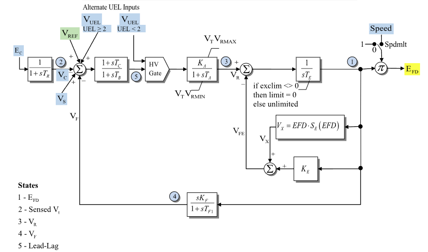

# **Exciter Model (ESDC2A)**

> [!NOTE]
> This README is a documentation stub/template for the ESDC2A exciter. Parameters, variables, equations, initialization details, and outputs are intentionally left unfilled until the model is derived from its source documentation.

## Block Diagram

Standard model of the ESDC2A Exciter.

<div align="center">
   

  Figure 1: Exciter ESDC2A model.
</div>

## Model Parameters

Symbol | Units | Description | Typical Value | Note
-------|-------|-------------|---------------|-----

### Model Derived Parameters

## Model Variables

### Internal Variables

#### Differential

Symbol | Units | Description | Note
-------|-------|-------------|-----

#### Algebraic

Symbol | Units | Description | Note
-------|-------|-------------|-----

### External Variables

#### Differential

Symbol | Units | Description | Note
-------|-------|-------------|-----

#### Algebraic

Symbol | Units | Description | Note
-------|-------|-------------|-----

## Model Equations

### Differential Equations

```math
\begin{aligned}
\end{aligned}
```

### Algebraic Equations

```math
\begin{aligned}
\end{aligned}
```

## Initialization

```math
\begin{aligned}
\end{aligned}
```

## Model Outputs
