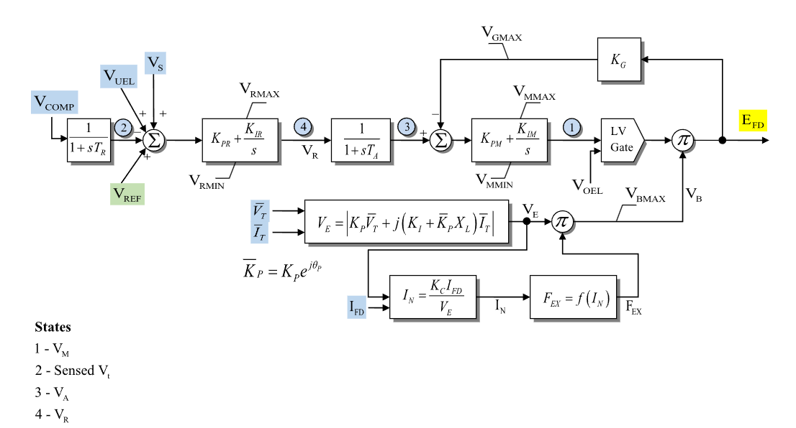

# **IEEE Type ST4B Potential- or Compound-Source Controlled-Rectifier Exciter Model (ESST4B)**

ESST4B is a static excitation system with compensated-voltage sensing, an outer
proportional/integral voltage regulator, a lag block, an inner
proportional/integral regulator with exciter-output feedback, low-value
over-excitation limiter gating, and potential- or compound-source rectifier
scaling.

Notes:
- Internal voltage and current signals are on model base unless otherwise stated.
- The rectifier loading block $F_{\mathrm{ex}}=f(I_N)$ is the source
  controlled-rectifier loading curve from Fig. 1; it is not a CommonMath helper.
- The potential-source calculation uses explicit real and imaginary terminal
  voltage/current components; the diagram's complex expression is not used as
  model-equation notation below.

## Block Diagram

Standard model of the ESST4B Exciter.



Figure 1: Exciter ESST4B model. Figure courtesy of [PowerWorld](https://www.powerworld.com/WebHelp/)

## Model Parameters

Symbol                              | Units  | JSON        | Description                                             | Typical Value | Note
------------------------------------|--------|-------------|---------------------------------------------------------|---------------|------
$T_R$                               | [sec]  | `Tr`        | Compensated-voltage transducer time constant            | 0.0           | Block name: `Tr`; if zero, sensed voltage is algebraic
$K_{\mathrm{pr}}$                   | [p.u.] | `Kpr`       | Outer regulator proportional gain                       | 1.0           | Block name: `KPR`
$K_{\mathrm{ir}}$                   | [p.u./s] | `Kir`     | Outer regulator integral gain                           | 0.0           | Block name: `KIR`
$V_R^{\max}$                        | [p.u.] | `Vrmax`     | Maximum outer regulator output                          | 1.0           | Block name: `VRMAX`
$V_R^{\min}$                        | [p.u.] | `Vrmin`     | Minimum outer regulator output                          | -1.0          | Block name: `VRMIN`
$T_A$                               | [sec]  | `Ta`        | Regulator lag time constant                             | 0.0           | Block name: `Ta`; if zero, $V_A$ is algebraic
$K_{\mathrm{pm}}$                   | [p.u.] | `Kpm`       | Inner regulator proportional gain                       | 1.0           | Block name: `KPM`
$K_{\mathrm{im}}$                   | [p.u./s] | `Kim`     | Inner regulator integral gain                           | 0.0           | Block name: `KIM`
$V_M^{\max}$                        | [p.u.] | `VmMax`     | Maximum inner regulator output                          | 1.0           | Block name: `VMMAX`
$V_M^{\min}$                        | [p.u.] | `VmMin`     | Minimum inner regulator output                          | 0.0           | Block name: `VMMIN`
$K_G$                               | [p.u.] | `Kg`        | Exciter-output feedback gain into inner regulator       | 0.0           | Block name: `KG`
$K_P$                               | [p.u.] | `Kp`        | Potential-source voltage coefficient magnitude          | 0.0           | Source label: `KP`
$K_I$                               | [p.u.] | `Ki`        | Potential-source current coefficient                    | 0.0           | Source label: `KI`
$V_B^{\max}$                        | [p.u.] | `VbMax`     | Maximum rectifier source multiplier                     | 999.0         | Block name: `VBMAX`
$K_C$                               | [p.u.] | `Kc`        | Rectifier loading current coefficient                   | 0.0           | Block name: `Kc`; forms $I_N$
$X_L$                               | [p.u.] | `Xl`        | Source reactance term in potential-source calculation   | 0.0           | Source label: `XL`
$\theta_P$                          | [deg]  | `ThetaPDeg` | Potential-source coefficient angle                      | 0.0           | Source label: `thetaP`; forms $K_P^{\mathrm{r}}$ and $K_P^{\mathrm{i}}$
$V_G^{\max}$                        | [p.u.] | `VgMax`     | Maximum exciter-output feedback signal                  | 999.0         | Block name: `VGMAX`; ceiling on $K_G E_{\mathrm{fd}}$

### Parameter Validation

Invalid ESST4B parameter sets are rejected by the following checks.

```math
\begin{aligned}
  &T_R \ge 0,\quad T_A \ge 0 \\
  &V_R^{\min} \le V_R^{\max},\quad V_M^{\min} \le V_M^{\max} \\
  &V_B^{\max} > 0,\quad V_G^{\max} \ge 0
\end{aligned}
```

### Model Derived Parameters

The potential-source coefficient is resolved into real scalar components:

```math
\begin{aligned}
  K_P^{\mathrm{r}} &= K_P\cos\theta_P \\
  K_P^{\mathrm{i}} &= K_P\sin\theta_P
\end{aligned}
```

Here $\theta_P$ is converted from degrees before evaluating the trigonometric
functions.

## Model Variables

### Internal Variables

#### Differential

Symbol                              | Units  | Description                                             | Note
------------------------------------|--------|---------------------------------------------------------|------
$V_M$                               | [p.u.] | Inner regulator output                                  | State 1 in Fig. 1
$V_C$                               | [p.u.] | Sensed compensated voltage                              | State 2 in Fig. 1; source label: `Sensed Vt`; algebraic when $T_R=0$
$V_A$                               | [p.u.] | Lagged outer-regulator output                           | State 3 in Fig. 1; algebraic when $T_A=0$
$x_R$                               | [p.u.] | Outer regulator integral state                          | State 4 in Fig. 1; source label: `VR`

#### Algebraic

Symbol                              | Units  | Description                                             | Note
------------------------------------|--------|---------------------------------------------------------|------
$e_V$                               | [p.u.] | Voltage-error signal into outer regulator               | Summing junction after sensed voltage
$V_R$                               | [p.u.] | Limited outer regulator output                          | Limited by $V_R^{\min}$ and $V_R^{\max}$
$V_G$                               | [p.u.] | Limited exciter-output feedback signal                  | $K_G E_{\mathrm{fd}}$ limited by $V_G^{\max}$
$e_M$                               | [p.u.] | Inner regulator error                                   | $V_A$ minus $V_G$
$V_{\mathrm{lv}}$                   | [p.u.] | Low-value gate output                                   | Lesser of $V_M$ and $V_{\mathrm{oel}}$
$V_{\mathrm{src}}^{\mathrm{r}}$     | [p.u.] | Real component of the potential-source expression       | From terminal voltage/current components
$V_{\mathrm{src}}^{\mathrm{i}}$     | [p.u.] | Imaginary component of the potential-source expression  | From terminal voltage/current components
$V_E$                               | [p.u.] | Potential- or compound-source voltage magnitude         | Nonnegative source magnitude
$I_N$                               | [p.u.] | Normalized exciter loading current                      | Source label: `IN`; satisfies $V_E I_N=K_C I_{\mathrm{fd}}$
$F_{\mathrm{ex}}$                   | [p.u.] | Rectifier loading factor                                | Source label: `FEX`; source curve $F_{\mathrm{ex}}=f(I_N)$
$V_B$                               | [p.u.] | Rectifier source multiplier                             | Limited by $V_B^{\max}$
$E_{\mathrm{fd}}$                   | [p.u.] | Field-voltage output                                    | Product of low-value gate and $V_B$

### External Variables

#### Differential

None.

#### Algebraic

Symbol                              | Units  | Description                                             | Note
------------------------------------|--------|---------------------------------------------------------|------
$V_{\mathrm{comp}}$                 | [p.u.] | Compensated voltage input                               | Source label: `VCOMP`
$V_{\mathrm{ref}}$                  | [p.u.] | Voltage-control reference                               | Source label: `VREF`
$V_{\mathrm{uel}}$                  | [p.u.] | Under-excitation limiter input                          | Source label: `VUEL`; optional, defaults to zero
$V_S$                               | [p.u.] | Stabilizer input signal                                 | Source label: `VS`; optional, defaults to zero
$V_{\mathrm{oel}}$                  | [p.u.] | Over-excitation limiter input                           | Source label: `VOEL`; optional, defaults to a high value when omitted
$V_{\mathrm{r}}$                    | [p.u.] | Terminal-voltage real component                         | Source label: `VT`
$V_{\mathrm{i}}$                    | [p.u.] | Terminal-voltage imaginary component                    | Source label: `VT`
$I_{\mathrm{r}}$                    | [p.u.] | Terminal-current real component                         | Source label: `IT`
$I_{\mathrm{i}}$                    | [p.u.] | Terminal-current imaginary component                    | Source label: `IT`
$I_{\mathrm{fd}}$                   | [p.u.] | Machine field current                                   | Source label: `IFD`

## Model Equations

### Differential Equations

```math
\begin{aligned}
  0 &= -T_R\dot V_C - V_C + V_{\mathrm{comp}} \\
  0 &=
    -\dot x_R
    + \text{antiwindup}\!\left(
        V_R,
        K_{\mathrm{ir}}e_V,
        V_R^{\min},
        V_R^{\max}
      \right) \\
  0 &= -T_A\dot V_A - V_A + V_R \\
  0 &=
    -\dot V_M
    + \text{antiwindup}\!\left(
        V_M,
        K_{\mathrm{im}}e_M,
        V_M^{\min},
        V_M^{\max}
      \right)
\end{aligned}
```

CommonMath defines the [Anti-Windup](../../../../CommonMath.md#antiwindup)
target and smooth approximation.

### Algebraic Equations

```math
\begin{aligned}
  0 &= -e_V + V_{\mathrm{ref}} + V_{\mathrm{uel}} + V_S - V_C \\
  0 &= -V_R + \text{clamp}(K_{\mathrm{pr}}e_V + x_R, V_R^{\min}, V_R^{\max}) \\
  0 &= -V_G + \text{min}(K_G E_{\mathrm{fd}}, V_G^{\max}) \\
  0 &= -e_M + V_A - V_G \\
  0 &= -V_{\mathrm{lv}} + \text{min}(V_M, V_{\mathrm{oel}}) \\
  0 &= -V_{\mathrm{src}}^{\mathrm{r}}
       + K_P V_{\mathrm{r}}
       - X_L K_P^{\mathrm{i}} I_{\mathrm{r}}
       - \left(K_I + X_L K_P^{\mathrm{r}}\right)I_{\mathrm{i}} \\
  0 &= -V_{\mathrm{src}}^{\mathrm{i}}
       + K_P V_{\mathrm{i}}
       + \left(K_I + X_L K_P^{\mathrm{r}}\right)I_{\mathrm{r}}
       - X_L K_P^{\mathrm{i}} I_{\mathrm{i}} \\
  0 &= -V_E^2
       + \left(V_{\mathrm{src}}^{\mathrm{r}}\right)^2
       + \left(V_{\mathrm{src}}^{\mathrm{i}}\right)^2 \\
  0 &= -V_E I_N + K_C I_{\mathrm{fd}} \\
  0 &= -F_{\mathrm{ex}} + f(I_N) \\
  0 &= -V_B + \text{min}(V_E F_{\mathrm{ex}}, V_B^{\max}) \\
  0 &= -E_{\mathrm{fd}} + V_{\mathrm{lv}}V_B
\end{aligned}
```

CommonMath defines helper targets for [min](../../../../CommonMath.md#minimum)
and [clamp](../../../../CommonMath.md#clamp).
The rectifier loading function $f(I_N)$ is the source curve shown in Fig. 1.

## Initialization

For a standard unsaturated start, the machine initializes
$E_{\mathrm{fd},0}$ and $I_{\mathrm{fd},0}$ first. ESST4B reads those values,
sets all internal derivatives to zero, and evaluates:

```math
\begin{aligned}
  V_{C,0} &= V_{\mathrm{comp},0} \\
  V_{\mathrm{src},0}^{\mathrm{r}}
    &= K_P V_{\mathrm{r},0}
       - X_L K_P^{\mathrm{i}} I_{\mathrm{r},0}
       - \left(K_I + X_L K_P^{\mathrm{r}}\right)I_{\mathrm{i},0} \\
  V_{\mathrm{src},0}^{\mathrm{i}}
    &= K_P V_{\mathrm{i},0}
       + \left(K_I + X_L K_P^{\mathrm{r}}\right)I_{\mathrm{r},0}
       - X_L K_P^{\mathrm{i}} I_{\mathrm{i},0} \\
  V_{E,0} &=
    \sqrt{
      \left(V_{\mathrm{src},0}^{\mathrm{r}}\right)^2
      + \left(V_{\mathrm{src},0}^{\mathrm{i}}\right)^2
    } \\
  0 &= -V_{E,0}I_{N,0} + K_C I_{\mathrm{fd},0} \\
  F_{\mathrm{ex},0} &= f(I_{N,0}) \\
  V_{B,0} &= \text{min}(V_{E,0}F_{\mathrm{ex},0}, V_B^{\max}) \\
  V_{\mathrm{lv},0} &= \dfrac{E_{\mathrm{fd},0}}{V_{B,0}} \\
  V_{M,0} &= V_{\mathrm{lv},0} \\
  V_{G,0} &= \text{min}(K_G E_{\mathrm{fd},0}, V_G^{\max}) \\
  e_{M,0} &= 0 \\
  V_{A,0} &= V_{G,0} \\
  V_{R,0} &= V_{A,0} \\
  x_{R,0} &= V_{R,0} \\
  e_{V,0} &= 0 \\
  V_{\mathrm{ref},0} &= V_{C,0} - V_{\mathrm{uel},0} - V_{S,0}
\end{aligned}
```

This closed-form start requires $V_{E,0}\ne 0$, $V_{B,0}\ne 0$, inactive
$V_R$, $V_M$, $V_G$, and $V_B$ limits, and the low-value gate selecting $V_M$.
Starts with active low-value gate limiting or saturated PI states are outside
these closed-form equations.

## Model Outputs

Output          | Units  | Description                         | Note
----------------|--------|-------------------------------------|------
`efd`           | [p.u.] | Field-voltage output                | $E_{\mathrm{fd}}$
`vm`            | [p.u.] | Inner regulator output              | $V_M$
`vc`            | [p.u.] | Sensed compensated voltage          | $V_C$
`va`            | [p.u.] | Lagged outer-regulator output       | $V_A$
`vr`            | [p.u.] | Outer regulator output              | $V_R$
`vg`            | [p.u.] | Exciter-output feedback signal      | $V_G$
`vlv`           | [p.u.] | Low-value gate output               | $V_{\mathrm{lv}}$
`ve`            | [p.u.] | Potential-source voltage magnitude  | $V_E$
`vb`            | [p.u.] | Rectifier source multiplier         | $V_B$
`in`            | [p.u.] | Normalized exciter loading current  | $I_N$
`fex`           | [p.u.] | Rectifier loading factor            | $F_{\mathrm{ex}}$
