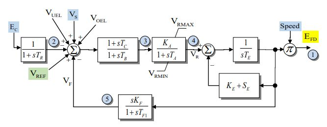

# EXDC1

EXDC1 is a direct-current excitation-system model with a voltage transducer,
input lead–lag compensation, a limited voltage regulator, exciter saturation,
and stabilizing feedback.

## Notes

- Internal voltage signals are on component base.
- The speed input is machine speed deviation, so the field-voltage multiplier
  is $1 + \omega$.

## Block Diagram



Figure 1: EXDC1 exciter model. Figure courtesy of the
[PowerWorld EXDC1 model reference](https://www.powerworld.com/WebHelp/Content/TransientModels_HTML/Exciter%20EXDC1.htm).

## Model Parameters

Symbol       | Units  | JSON | Description                                | Typical Value | Note
-------------|--------|------|--------------------------------------------|---------------|-----
$T_R$        | [s]    | TBD  | Voltage transducer time constant           | 0.0           |
$K_A$        | [p.u.] | TBD  | Voltage-regulator gain                     | 40.0          |
$T_A$        | [s]    | TBD  | Voltage-regulator time constant            | 0.1           |
$T_B$        | [s]    | TBD  | Input lead–lag denominator time constant   | 0.0           |
$T_C$        | [s]    | TBD  | Input lead–lag numerator time constant     | 0.0           |
$V_R^{\max}$ | [p.u.] | TBD  | Maximum voltage-regulator output           | 1.0           |
$V_R^{\min}$ | [p.u.] | TBD  | Minimum voltage-regulator output           | -1.0          |
$K_E$        | [p.u.] | TBD  | Exciter field resistance line slope margin | 0.1           |
$T_E$        | [s]    | TBD  | Exciter time constant                      | 0.5           |
$K_F$        | [p.u.] | TBD  | Stabilizing feedback gain                  | 0.05          |
$T_{F1}$     | [s]    | TBD  | Stabilizing feedback time constant         | 0.7           |
$E_1$        | [p.u.] | TBD  | First saturation voltage point             | 2.8           |
$S_E(E_1)$   | [p.u.] | TBD  | Saturation coefficient at $E_1$            | 0.08          |
$E_2$        | [p.u.] | TBD  | Second saturation voltage point            | 3.7           |
$S_E(E_2)$   | [p.u.] | TBD  | Saturation coefficient at $E_2$            | 0.33          |

JSON parameter names are not yet specified.

### Parameter Validation

A valid EXDC1 parameter set must satisfy the following conditions:

```math
\begin{aligned}
K_A &> 0 \\
T_R, T_B, T_C, T_{F1} &\ge 0 \\
T_A, T_E &> 0 \\
T_B &> 0
  \quad\text{or}\quad
T_B = T_C = 0 \\
V_R^{\min} &\le V_R^{\max}
\end{aligned}
```

All parameters must be finite.

The saturation points are either disabled together,

```math
S_E(E_1) = S_E(E_2) = 0
```

or define a valid two-point scaled-quadratic fit:

```math
\begin{aligned}
E_1, E_2 &> 0 \\
S_E(E_1), S_E(E_2) &\ge 0 \\
(E_2 - E_1) \left[S_E(E_2) - S_E(E_1)\right] &> 0
\end{aligned}
```

### Model Derived Parameters

The scaled saturation contribution is

```math
E S_E(E) = S_B q(E - S_A)
```

where $q$ is the quadratic ramp. When saturation is disabled,

```math
S_A = S_B = 0
```

When one saturation value is zero,

```math
\begin{aligned}
S_E(E_1) = 0 &: \quad
  S_A = E_1, \qquad
  S_B = \dfrac{E_2 S_E(E_2)}{(E_2 - E_1)^2} \\
S_E(E_2) = 0 &: \quad
  S_A = E_2, \qquad
  S_B = \dfrac{E_1 S_E(E_1)}{(E_1 - E_2)^2}
\end{aligned}
```

When both saturation values are positive,

```math
\begin{aligned}
C &= \sqrt{\dfrac{E_2 S_E(E_2)}{E_1 S_E(E_1)}} \\
S_A &= \dfrac{C E_1 - E_2}{C - 1} \\
S_B &= \dfrac{E_1 S_E(E_1)}{(E_1 - S_A)^2}
\end{aligned}
```

## Model Ports

Name    | Port   | Init    | Description
--------|--------|---------|------------
`ec`    | Input  | Known   | Compensated terminal-voltage magnitude
`speed` | Input  | Known   | Machine speed deviation
`vref`  | Input  | Unknown | Voltage-control reference
`vs`    | Input  | Known   | Stabilizer input signal
`vuel`  | Input  | Known   | Under-excitation limiter input
`voel`  | Input  | Known   | Over-excitation limiter input
`efd`   | Output | Known   | Field-voltage output

## Model Variables

### Internal Variables

#### Differential

Symbol              | Units  | Description                         | Note
--------------------|--------|-------------------------------------|-----
$V_C$               | [p.u.] | Filtered terminal-voltage magnitude | Algebraic when $T_R = 0$
$x_{\mathrm{LL}}$   | [p.u.] | Input lead–lag denominator state    | Algebraic when $T_B = 0$
$V_R$               | [p.u.] | Voltage-regulator output            |
$E_{\mathrm{fd}}'$  | [p.u.] | Field-voltage state                 | Before the speed multiplier
$V_F$               | [p.u.] | Stabilizing feedback state          | Algebraic when $T_{F1} = 0$

#### Algebraic

Symbol            | Units  | Description                              | Note
------------------|--------|------------------------------------------|-----
$e_V$             | [p.u.] | Voltage-error summing output             |
$V_B$             | [p.u.] | Input lead–lag output                    |
$s_e$             | [p.u.] | Scaled-quadratic saturation contribution |
$V_{\mathrm{FE}}$ | [p.u.] | Exciter feedback drive                   |
$E_{\mathrm{fd}}$ | [p.u.] | Field-voltage output                     |

### External Variables

#### Differential

None.

#### Algebraic

Symbol             | Units  | Description                            | Note
-------------------|--------|----------------------------------------|-----
$E_C$              | [p.u.] | Compensated terminal-voltage magnitude |
$\omega$           | [p.u.] | Machine speed deviation                |
$V_{\mathrm{ref}}$ | [p.u.] | Voltage-control reference              |
$V_S$              | [p.u.] | Stabilizer input signal                |
$V_{\mathrm{uel}}$ | [p.u.] | Under-excitation limiter input         |
$V_{\mathrm{oel}}$ | [p.u.] | Over-excitation limiter input          |

## Model Equations

### Internal Equations

#### Differential

```math
\begin{aligned}
0 &= -T_R \dot{V}_C - V_C + E_C \\
0 &= -T_B \dot{x}_{\mathrm{LL}} - x_{\mathrm{LL}} + e_V \\
0 &= -T_A \dot{V}_R
  + \text{antiwindup}
    (
      V_R, -V_R + K_A V_B;
      V_R^{\min}, V_R^{\max}
    ) \\
0 &= -T_E \dot{E}_{\mathrm{fd}}' + V_R - V_{\mathrm{FE}} \\
0 &= -T_{F1} \dot{V}_F - V_F
  + \dfrac{K_F}{T_E} (V_R - V_{\mathrm{FE}})
\end{aligned}
```

#### Algebraic

```math
\begin{aligned}
0 &= -e_V + V_{\mathrm{ref}} + V_S + V_{\mathrm{uel}} + V_{\mathrm{oel}} - V_C - V_F \\
0 &=
  \begin{cases}
    -V_B + e_V & T_B = T_C = 0 \\
    -T_B (V_B - x_{\mathrm{LL}})
      + T_C (e_V - x_{\mathrm{LL}}) & T_B > 0
  \end{cases} \\
0 &= -s_e + S_B q(E_{\mathrm{fd}}' - S_A) \\
0 &= -V_{\mathrm{FE}} + K_E E_{\mathrm{fd}}' + s_e \\
0 &= -E_{\mathrm{fd}} + (1 + \omega) E_{\mathrm{fd}}'
\end{aligned}
```

The limiter and saturation use the CommonMath
[antiwindup](../../../../CommonMath.md#antiwindup) and
[quadratic ramp](../../../../CommonMath.md#quadratic-ramp) functions.

### External Equations

None.

## Initialization

### Input Initialization

```math
\begin{aligned}
E_C &\leftarrow \text{compensated terminal-voltage magnitude} \\
E_{\mathrm{fd}} &\leftarrow \text{machine field voltage} \\
\omega &\leftarrow \text{machine speed deviation or }0 \\
V_S &\leftarrow \text{stabilizer signal or }0 \\
V_{\mathrm{uel}} &\leftarrow \text{under-excitation limiter input or }0 \\
V_{\mathrm{oel}} &\leftarrow \text{over-excitation limiter input or }0
\end{aligned}
```

### Internal Initialization

```math
\begin{aligned}
V_C &\leftarrow E_C \\
E_{\mathrm{fd}}' &\leftarrow \dfrac{E_{\mathrm{fd}}}{1 + \omega} \\
s_e &\leftarrow S_B q(E_{\mathrm{fd}}' - S_A) \\
V_{\mathrm{FE}} &\leftarrow K_E E_{\mathrm{fd}}' + s_e \\
V_R &\leftarrow V_{\mathrm{FE}} \\
V_B &\leftarrow \dfrac{V_R}{K_A} \\
V_F &\leftarrow 0 \\
e_V &\leftarrow V_B \\
x_{\mathrm{LL}} &\leftarrow e_V \\
\dot{V}_C, \dot{x}_{\mathrm{LL}}, \dot{V}_R,
\dot{E}_{\mathrm{fd}}', \dot{V}_F &\leftarrow 0
\end{aligned}
```

Initialization requires $1 + \omega > 0$ and
$V_R^{\min} \le V_R \le V_R^{\max}$.

### Output Initialization

```math
V_{\mathrm{ref}}
\leftarrow
e_V + V_C + V_F - V_S - V_{\mathrm{uel}} - V_{\mathrm{oel}}
```

## Monitors

TBD.
