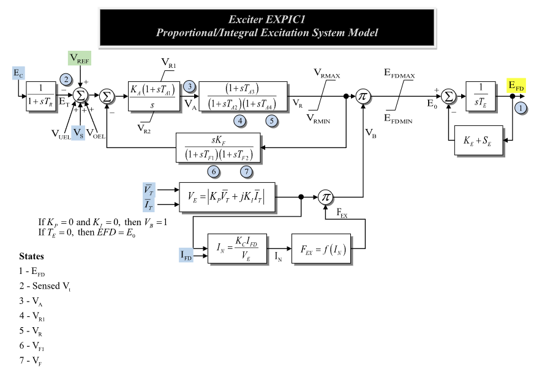

# **Proportional/Integral Excitation System Model (EXPIC1)**

EXPIC1 is a proportional/integral excitation system with terminal-voltage
sensing, a PI regulator, cascaded regulator filters, stabilizing feedback,
potential/current-source scaling, rectifier loading, exciter limits, saturation,
and an exciter field-voltage state.

Notes:
- Internal voltage and current signals are on model base unless otherwise stated.
- The rectifier loading block $F_{\mathrm{ex}}=f(I_N)$ is the source AC-exciter
  loading curve from Fig. 1; it is not a CommonMath helper.
- If $K_P=0$ and $K_I=0$, the diagram sets $V_B=1$.
- If $T_E=0$, the source diagram states $E_{\mathrm{fd}}=E_0$; the exciter
  field state becomes algebraic.

## Block Diagram

Standard model of the EXPIC1 Exciter.



Figure 1: Exciter EXPIC1 model. Figure courtesy of [PowerWorld](https://www.powerworld.com/WebHelp/)

## Model Parameters

Symbol                              | Units    | JSON      | Description                                             | Typical Value | Note
------------------------------------|----------|-----------|---------------------------------------------------------|---------------|------
$T_R$                               | [sec]    | `Tr`      | Transducer time constant                                | 0.0           | Block name: `Tr`; if zero, $E_T$ is algebraic
$K_A$                               | [p.u.]   | `Ka`      | PI regulator gain                                       | 1.0           | Block name: `Ka`
$T_{A1}$                            | [sec]    | `Ta1`     | PI regulator numerator time constant                    | 0.0           | Block name: `Ta1`
$V_{R1}^{\max}$                     | [p.u.]   | `Vr1`     | PI regulator upper output limit                         | 1.0           | Source label: `VR1`
$V_{R2}^{\min}$                     | [p.u.]   | `Vr2`     | PI regulator lower output limit                         | -1.0          | Source label: `VR2`
$T_{A2}$                            | [sec]    | `Ta2`     | First denominator time constant in regulator filter     | 0.0           | Block name: `Ta2`
$T_{A3}$                            | [sec]    | `Ta3`     | Numerator time constant in regulator filter             | 0.0           | Block name: `Ta3`
$T_{A4}$                            | [sec]    | `Ta4`     | Second denominator time constant in regulator filter    | 0.0           | Block name: `Ta4`
$V_R^{\max}$                        | [p.u.]   | `Vrmax`   | Maximum regulator output before source multiplier       | 1.0           | Block name: `Vrmax`
$V_R^{\min}$                        | [p.u.]   | `Vrmin`   | Minimum regulator output before source multiplier       | -1.0          | Block name: `Vrmin`
$K_F$                               | [p.u.]   | `Kf`      | Stabilizing feedback gain                               | 0.0           | Block name: `Kf`
$T_{F1}$                            | [sec]    | `Tf1`     | First feedback denominator time constant                | 0.0           | Block name: `Tf1`
$T_{F2}$                            | [sec]    | `Tf2`     | Second feedback denominator time constant               | 0.0           | Block name: `Tf2`
$E_{\mathrm{fd}}^{\max}$            | [p.u.]   | `Efdmax`  | Maximum exciter input limit                             | 5.0           | Block name: `EFDMAX`
$E_{\mathrm{fd}}^{\min}$            | [p.u.]   | `Efdmin`  | Minimum exciter input limit                             | -5.0          | Block name: `EFDMIN`
$K_E$                               | [p.u.]   | `Ke`      | Exciter field-resistance line-slope margin              | 0.1           | Block name: `Ke`
$T_E$                               | [sec]    | `Te`      | Exciter time constant                                   | 0.5           | Block name: `Te`; if zero, $E_{\mathrm{fd}}=E_0$
$E_1$                               | [p.u.]   | `E1`      | First saturation voltage point                          | 2.8           | Block name: `E1`
$S_E(E_1)$                          | [p.u.]   | `SE1`     | Saturation value at $E_1$                               | 0.08          | Block name: `Se1`
$E_2$                               | [p.u.]   | `E2`      | Second saturation voltage point                         | 3.7           | Block name: `E2`
$S_E(E_2)$                          | [p.u.]   | `SE2`     | Saturation value at $E_2$                               | 0.33          | Block name: `Se2`
$K_P$                               | [p.u.]   | `Kp`      | Potential-source voltage coefficient                    | 0.0           | Source label: `KP`; forms $V_E$
$K_I$                               | [p.u.]   | `Ki`      | Potential-source current coefficient                    | 0.0           | Source label: `KI`; forms $V_E$
$K_C$                               | [p.u.]   | `Kc`      | Rectifier loading current coefficient                   | 0.0           | Block name: `Kc`; forms $I_N$

### Parameter Validation

Invalid EXPIC1 parameter sets are rejected by the following checks.

```math
\begin{aligned}
  &T_R \ge 0,\quad T_{A1}\ge 0,\quad T_{A2}\ge 0,\quad T_{A3}\ge 0,\quad T_{A4}\ge 0 \\
  &T_{F1}\ge 0,\quad T_{F2}\ge 0,\quad T_E\ge 0 \\
  &V_{R2}^{\min}\le V_{R1}^{\max},\quad V_R^{\min}\le V_R^{\max},\quad E_{\mathrm{fd}}^{\min}\le E_{\mathrm{fd}}^{\max}
\end{aligned}
```

The saturation points are either disabled together or define a valid positive
two-point quadratic fit.

### Model Derived Parameters

The saturation curve is fitted from the two supplied saturation points. If both
saturation factors are zero, use $S_A=0$ and $S_B=0$. Otherwise:

```math
\begin{aligned}
  C &= \sqrt{\dfrac{S_E(E_2)}{S_E(E_1)}} \\
  S_A &= \dfrac{C E_1 - E_2}{C - 1} \\
  S_B &= \dfrac{S_E(E_1)}{(E_1 - S_A)^2}
\end{aligned}
```

The source calculation uses explicit real and imaginary terminal voltage/current
components:

```math
\begin{aligned}
  V_{\mathrm{src}}^{\mathrm{r}} &= K_P V_{\mathrm{r}} - K_I I_{\mathrm{i}} \\
  V_{\mathrm{src}}^{\mathrm{i}} &= K_P V_{\mathrm{i}} + K_I I_{\mathrm{r}}
\end{aligned}
```

## Model Ports

Name    | Port   | Init | Description
--------|--------|------|------------
`ec`    | Input  | TBD  | Compensated terminal voltage magnitude $E_C$
`vref`  | Input  | TBD  | Voltage-control reference $V_{\mathrm{ref}}$
`vuel`  | Input  | TBD  | Under-excitation limiter input $V_{\mathrm{uel}}$
`vs`    | Input  | TBD  | Stabilizer input signal $V_S$
`voel`  | Input  | TBD  | Over-excitation limiter input $V_{\mathrm{oel}}$
`vr`    | Input  | TBD  | Terminal-voltage real component $V_{\mathrm{r}}$
`vi`    | Input  | TBD  | Terminal-voltage imaginary component $V_{\mathrm{i}}$
`ir`    | Input  | TBD  | Terminal-current real component $I_{\mathrm{r}}$
`ii`    | Input  | TBD  | Terminal-current imaginary component $I_{\mathrm{i}}$
`ifd`   | Input  | TBD  | Machine field current $I_{\mathrm{fd}}$
`efd`   | Output | TBD  | Field-voltage output $E_{\mathrm{fd}}$

## Model Variables

### Internal Variables

#### Differential

Symbol                              | Units  | Description                                             | Note
------------------------------------|--------|---------------------------------------------------------|------
$E_{\mathrm{fd}}$                   | [p.u.] | Field-voltage output state                              | State 1 in Fig. 1; algebraic when $T_E=0$
$E_T$                               | [p.u.] | Sensed terminal voltage                                 | State 2 in Fig. 1; source label: `Sensed Vt`; algebraic when $T_R=0$
$V_A$                               | [p.u.] | PI regulator output                                     | State 3 in Fig. 1
$x_{R1}$                            | [p.u.] | First regulator filter state                            | State 4 in Fig. 1; source label: `VR1`
$V_R$                               | [p.u.] | Regulator output before source multiplier               | State 5 in Fig. 1; source label: `VR`
$V_{F1}$                            | [p.u.] | First feedback filter state                             | State 6 in Fig. 1; source label: `VF1`
$V_F$                               | [p.u.] | Stabilizing feedback output                             | State 7 in Fig. 1; source label: `VF`

#### Algebraic

Symbol                              | Units  | Description                                             | Note
------------------------------------|--------|---------------------------------------------------------|------
$e_V$                               | [p.u.] | Voltage-error signal after feedback                     | Summing junction after $E_T$
$V_{\mathrm{src}}^{\mathrm{r}}$     | [p.u.] | Real component of the source expression                 | From terminal voltage/current components
$V_{\mathrm{src}}^{\mathrm{i}}$     | [p.u.] | Imaginary component of the source expression            | From terminal voltage/current components
$V_{\mathrm{src}}$                  | [p.u.] | Potential/current source magnitude                      | Nonnegative source magnitude
$I_N$                               | [p.u.] | Normalized exciter loading current                      | Source label: `IN`; satisfies $V_{\mathrm{src}}I_N=K_C I_{\mathrm{fd}}$ when source scaling is active
$F_{\mathrm{ex}}$                   | [p.u.] | Rectifier loading factor                                | Source label: `FEX`; source curve $F_{\mathrm{ex}}=f(I_N)$
$V_B$                               | [p.u.] | Source multiplier after rectifier loading               | Product of $V_{\mathrm{src}}$ and $F_{\mathrm{ex}}$, or 1 when $K_P=K_I=0$
$E_0$                               | [p.u.] | Limited exciter input                                   | Limited by $E_{\mathrm{fd}}^{\min}$ and $E_{\mathrm{fd}}^{\max}$
$S_E$                               | [p.u.] | Saturation coefficient evaluated at $E_{\mathrm{fd}}$   | Uses derived saturation curve

### External Variables

#### Differential

None.

#### Algebraic

Symbol                              | Units  | Description                                             | Note
------------------------------------|--------|---------------------------------------------------------|------
$E_C$                               | [p.u.] | Compensated terminal voltage magnitude                  | Source label: `EC`
$V_{\mathrm{ref}}$                  | [p.u.] | Voltage-control reference                               | Source label: `VREF`
$V_{\mathrm{uel}}$                  | [p.u.] | Under-excitation limiter input                          | Source label: `VUEL`; optional, defaults to zero
$V_S$                               | [p.u.] | Stabilizer input signal                                 | Source label: `VS`; optional, defaults to zero
$V_{\mathrm{oel}}$                  | [p.u.] | Over-excitation limiter input                           | Source label: `VOEL`; optional, defaults to zero
$V_{\mathrm{r}}$                    | [p.u.] | Terminal-voltage real component                         | Source label: `VT`
$V_{\mathrm{i}}$                    | [p.u.] | Terminal-voltage imaginary component                    | Source label: `VT`
$I_{\mathrm{r}}$                    | [p.u.] | Terminal-current real component                         | Source label: `IT`
$I_{\mathrm{i}}$                    | [p.u.] | Terminal-current imaginary component                    | Source label: `IT`
$I_{\mathrm{fd}}$                   | [p.u.] | Machine field current                                   | Source label: `IFD`

## Model Equations

### Internal Equations

#### Differential

```math
\begin{aligned}
  0 &= -T_R\dot E_T - E_T + E_C \\
  0 &=
    -\dot V_A
    + \text{antiwindup}\!\left(
        V_A,
        K_A e_V,
        V_{R2}^{\min},
        V_{R1}^{\max}
      \right) \\
  0 &= -T_{A2}\dot x_{R1} - x_{R1} + V_A \\
  0 &= -T_{A4}\dot V_R - V_R + x_{R1} + T_{A3}\dot x_{R1} \\
  0 &= -T_{F1}\dot V_{F1} - V_{F1} + V_R \\
  0 &= -T_{F2}\dot V_F - V_F + K_F\dot V_{F1} \\
  0 &= -T_E\dot E_{\mathrm{fd}} + E_0 - (K_E + S_E)E_{\mathrm{fd}}
\end{aligned}
```

CommonMath defines the [Anti-Windup](../../../../CommonMath.md#antiwindup)
target and smooth approximation.

#### Algebraic

```math
\begin{aligned}
  0 &= -e_V + V_{\mathrm{ref}} + V_{\mathrm{uel}} + V_S + V_{\mathrm{oel}} - E_T - V_F \\
  0 &= -V_{\mathrm{src}}^{\mathrm{r}} + K_P V_{\mathrm{r}} - K_I I_{\mathrm{i}} \\
  0 &= -V_{\mathrm{src}}^{\mathrm{i}} + K_P V_{\mathrm{i}} + K_I I_{\mathrm{r}} \\
  0 &= -V_{\mathrm{src}}^2
       + \left(V_{\mathrm{src}}^{\mathrm{r}}\right)^2
       + \left(V_{\mathrm{src}}^{\mathrm{i}}\right)^2 \\
  0 &=
       \begin{cases}
          -I_N & K_P=0\ \text{and}\ K_I=0 \\
          -V_{\mathrm{src}}I_N + K_C I_{\mathrm{fd}} & \text{otherwise}
       \end{cases} \\
  0 &= -F_{\mathrm{ex}}
       + \begin{cases}
          1 & K_P=0\ \text{and}\ K_I=0 \\
          f(I_N) & \text{otherwise}
       \end{cases} \\
  0 &= -V_B
       + \begin{cases}
          1 & K_P=0\ \text{and}\ K_I=0 \\
          V_{\mathrm{src}}F_{\mathrm{ex}} & \text{otherwise}
       \end{cases} \\
  0 &= -E_0 + \text{clamp}(V_B V_R, E_{\mathrm{fd}}^{\min}, E_{\mathrm{fd}}^{\max}) \\
  0 &= -S_E + S_B\,q(E_{\mathrm{fd}} - S_A)
\end{aligned}
```

CommonMath defines helper targets for [clamp](../../../../CommonMath.md#clamp)
and the primitive [quadratic ramp](../../../../CommonMath.md#quadratic-ramp) $q$.
The rectifier loading function $f(I_N)$ is the source curve shown in Fig. 1.
The $V_{\mathrm{src}}$ residual uses the nonnegative branch of the squared
source-magnitude equation.

### External Equations

None.

## Initialization

For a standard unsaturated start, the machine initializes
$E_{\mathrm{fd},0}$ and $I_{\mathrm{fd},0}$ first. EXPIC1 reads those values,
sets all internal derivatives to zero, and evaluates:

```math
\begin{aligned}
  E_{T,0} &= E_{C,0} \\
  V_{\mathrm{src},0}^{\mathrm{r}} &= K_P V_{\mathrm{r},0} - K_I I_{\mathrm{i},0} \\
  V_{\mathrm{src},0}^{\mathrm{i}} &= K_P V_{\mathrm{i},0} + K_I I_{\mathrm{r},0} \\
  V_{\mathrm{src},0}
    &= \sqrt{
      \left(V_{\mathrm{src},0}^{\mathrm{r}}\right)^2
      + \left(V_{\mathrm{src},0}^{\mathrm{i}}\right)^2
    } \\
  0 &=
    \begin{cases}
      -I_{N,0} & K_P=0\ \text{and}\ K_I=0 \\
      -V_{\mathrm{src},0}I_{N,0} + K_C I_{\mathrm{fd},0} & \text{otherwise}
    \end{cases} \\
  F_{\mathrm{ex},0} &=
    \begin{cases}
      1 & K_P=0\ \text{and}\ K_I=0 \\
      f(I_{N,0}) & \text{otherwise}
    \end{cases} \\
  V_{B,0} &=
    \begin{cases}
      1 & K_P=0\ \text{and}\ K_I=0 \\
      V_{\mathrm{src},0}F_{\mathrm{ex},0} & \text{otherwise}
    \end{cases} \\
  S_{E,0} &= S_B\,q(E_{\mathrm{fd},0} - S_A) \\
  E_{0,0} &= (K_E + S_{E,0})E_{\mathrm{fd},0} \\
  V_{R,0} &= \dfrac{E_{0,0}}{V_{B,0}} \\
  x_{R1,0} &= V_{R,0} \\
  V_{A,0} &= x_{R1,0} \\
  V_{F1,0} &= V_{R,0} \\
  V_{F,0} &= 0 \\
  e_{V,0} &= \dfrac{V_{A,0}}{K_A} \\
  V_{\mathrm{ref},0}
    &= e_{V,0} + E_{T,0} + V_{F,0}
       - V_{\mathrm{uel},0} - V_{S,0} - V_{\mathrm{oel},0}
\end{aligned}
```

This closed-form start requires nonzero $K_A$ and $V_{B,0}$, inactive PI and
exciter limits, and residual consistency with the source curve. When
$K_P$ and $K_I$ are not both zero, it also requires $V_{\mathrm{src},0}\ne 0$.
If $T_E=0$, the final exciter residual is algebraic and requires
$E_{\mathrm{fd},0}=E_{0,0}$. Starts that bind the PI regulator, cascaded
regulator, or exciter limits are outside these closed-form equations.

## Monitors

Monitor         | Units  | Description                         | Note
----------------|--------|-------------------------------------|------
`efd`           | [p.u.] | Field-voltage output                | $E_{\mathrm{fd}}$
`et`            | [p.u.] | Sensed terminal voltage             | $E_T$
`va`            | [p.u.] | PI regulator state                  | $V_A$
`vr1`           | [p.u.] | First regulator filter state        | $x_{R1}$
`vr`            | [p.u.] | Regulator output                    | $V_R$
`vf1`           | [p.u.] | First feedback filter state         | $V_{F1}$
`vf`            | [p.u.] | Stabilizing feedback output         | $V_F$
`vb`            | [p.u.] | Source multiplier                   | $V_B$
`in`            | [p.u.] | Normalized exciter loading current  | $I_N$
`fex`           | [p.u.] | Rectifier loading factor            | $F_{\mathrm{ex}}$
`se`            | [p.u.] | Saturation coefficient              | $S_E$
