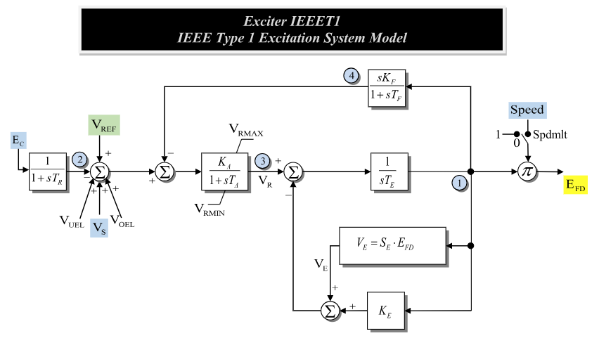

# **IEEE Type 1 Excitation System Model (IEEET1)**

## Block Diagram

Standard model of the IEEET1 Exciter.

Notes:
- The voltage-sensing input currently uses the positive bus-voltage magnitude $\sqrt{V_r^2 + V_i^2}$; a separate compensation-impedance path is not modeled here.



Figure 1: Exciter IEEET1 model. Figure courtesy of [PowerWorld](https://www.powerworld.com/WebHelp/)

## Model Parameters


Symbol      | Units  | Description                          | Typical Value | Note
------------|--------|--------------------------------------|---------| ------
$T_R$       | [sec]  | Time constant for voltage sensing    | 0       |
$K_A$       | [p.u.] | Coefficient for voltage regulation   | 50      |
$T_A$       | [sec]  | Time constant for voltage regulation | 0.04    |
$K_E$       | [p.u.] | Coefficient for excitation system    | -0.06   |
$T_E$       | [sec]  | Time constant for excitation system  | 0.6     |
$K_F$       | [p.u.] | Coefficient for feedback             | 0.09    |
$T_F$       | [sec]  | Time constant for feedback           | 1.46    |
$V_R^{\min}$ | [p.u.] | Lower limit to voltage regulation    | -1      |
$V_R^{\max}$ | [p.u.] | Upper limit to voltage regulation    | 1       |
$E_1$       | [p.u.] | Saturation Parameter                 | 2.8     |
$E_2$       | [p.u.] | Saturation Parameter                 | 3.73    |
$S_1$       | [p.u.] | Saturation Parameter                 | 0.04    |
$S_2$       | [p.u.] | Saturation Parameter                 | 0.33    |
$I_{\mathrm{spdlim}}$ | [binary] | Speed limit flag indicator       | 0       |

### Parameter Validation

Invalid IEEET1 parameter sets are rejected by the following checks. Let $\epsilon_T=10^{-3}$.

```math
\begin{aligned}
  T &\leftarrow \max\!\left(T, \epsilon_T\right)
    \quad T \in \{T_R, T_A, T_E, T_F\} \\
  K_A
    &> 0 \\
  V_R^{\min}
    &\le V_R^{\max} \\
  I_{\mathrm{spdlim}}
    &\in \{0,1\} \\
  \left(S_1, S_2\right)
    &=(0,0)
      \quad\text{or}\quad
      \begin{gathered}
        E_1, E_2, S_1, S_2 > 0 \\
        E_1 \ne E_2 \\
        S_1 \ne S_2
      \end{gathered}
\end{aligned}
```

### Model Derived Parameters

When saturation is disabled, $S_A=0$ and $S_B=0$. Otherwise,
the parameters are chosen so that the following quadratic model represents the
expected saturation near the operating region:

```math
\begin{aligned}
  S_1 &= S_B(E_1-S_A)^2 \\
  S_2 &= S_B(E_2-S_A)^2 \\
\end{aligned}
```

Generally, this system has two solutions. The non-extraneous solution is as follows.

```math
\begin{aligned}
  C &=  \sqrt{
   \dfrac
   {S_2}
   {S_1}
  }
  \\
  S_A &=
   \dfrac
   {C E_1 - E_2}
   {C - 1}
  \\
  S_B &=
   \dfrac
   {S_1}
   {(E_1-S_A)^2}
\end{aligned}
```

## Model Variables

### Internal Variables

#### Differential

Symbol    | Units  | Description                        | Note
----------|--------|------------------------------------|-------
$V_{ts}$  | [p.u.] | Sensed terminal voltage            |
$V_R$     | [p.u.] | Voltage regulator                  |
$E_{fd}'$ | [p.u.] | Field-current pre-speed multiplier |
$V_{fx}$  | [p.u.] | Exciter feedback internal state    |


#### Algebraic


Symbol          | Units  | Description                       | Note
----------------|--------|-----------------------------------|-------
$V_{tr}$        | [p.u.] | Terminal Voltage Error            |
$V_f$           | [p.u.] | Feedback Voltage                  |
$V_E$           | [p.u.] | Excitation control voltage        |
$E_{fd}$        | [p.u.] | Field winding voltage             |
$k_\text{sat}$  | [p.u.] | Saturation variable               |

### External Variables

Symbol          | Units  | Description                       | Note
----------------|--------|-----------------------------------|-------
$V_r$           | [p.u.] | Real bus voltage component                     |
$V_i$           | [p.u.] | Imaginary bus voltage component                |
$V_\text{ref}$  | [p.u.] | Reference terminal voltage                     |
$V_{UEL}$       | [p.u.] | Input from under excitation limiter            | Constant zero until modeled
$V_{OEL}$       | [p.u.] | Input from over excitation limiter             | Constant zero until modeled
$V_S$           | [p.u.] | Input from stabilizer controller               | Optional, defaults to zero
$\omega$        | [p.u.] | Machine speed deviation                        | Optional, defaults to zero


## Model Equations

### Differential Equations

For readability, define the pre-limit derivative of $V_R$ and voltage-sensing input:

```math
\begin{aligned}
f_R &:= \dfrac{1}{T_A}\left(-V_R + K_A V_{tr}\right) \\
E_C &:= \sqrt{V_r^2 + V_i^2}
\end{aligned}
```

The IEEET1 differential equations, as derived from the model diagram, are:

```math
\begin{aligned}
   0 &= -\dot V_{ts} + \dfrac{1}{T_R}\left(E_C - V_{ts}\right) \\
   0 &= -\dot V_R
      + \text{antiwindup}
        \left(V_R, f_R; V_R^{\min}, V_R^{\max}\right) \\
   0 &= -\dot E_{fd}' + \dfrac{1}{T_E}\left(V_R - V_E - K_E E_{fd}'\right) \\
   0 &= -\dot V_{fx} + \dfrac{1}{T_F}\left(V_f\right)
\end{aligned}
```

CommonMath defines the smooth [Anti-Windup](../../../../CommonMath.md#antiwindup) target and approximation.

### Algebraic Equations

The algebraic equations of the exciter.
```math
\begin{aligned}
   0 &= -V_{ts} + V_\text{ref} + V_{UEL} + V_{OEL} + V_S - V_{tr} - V_f \\
   0 &= -T_F(V_f + V_{fx}) + K_F E_{fd}' \\
   0 &= -V_E + k_\text{sat} E_{fd}' \\
   0 &= -E_{fd} + (1 + \omega I_{\mathrm{spdlim}})E_{fd}' \\
   0 &= -k_\text{sat} + S_B\, q(E_{fd}' - S_A)
\end{aligned}
```

Here $q$ is GridKit's [Quadratic Ramp](../../../../CommonMath.md#primitives).


## Initialization

The implementation first applies $T \leftarrow \max(T, 10^{-3})$ for
$T \in \{T_R, T_A, T_E, T_F\}$. This should be replaced with a structural template change in the future.
The machine initializes $E_{fd}$ first. IEEET1
reads that value as $E_{fd,0}$, along with any attached $\omega$ and $V_S$, and
solves the steady-state algebraic chain so all residuals vanish with
$\dot y = 0$. The sensed terminal voltage initializes from the positive
bus-voltage magnitude. Saturation is included when enabled, and the speed-limit
flag is included directly; $V_\text{ref}$ is set to close the $V_{tr}$ equation
with the current input values.

```math
\begin{aligned}
   E_{C,0}  &:= \sqrt{V_r^2 + V_i^2} \\
   E_{fd}'  &= \dfrac{E_{fd,0}}{1 + I_{\mathrm{spdlim}}\,\omega} \\
   k_\text{sat}  &= S_B\, q(E_{fd}' - S_A) \\
   V_E      &= k_\text{sat}\, E_{fd}' \\
   V_R      &= K_E\, E_{fd}' + V_E \\
   V_{tr}   &= \dfrac{V_R}{K_A} \\
   V_{fx}   &= \dfrac{K_F}{T_F}\, E_{fd}' \\
   V_{ts}   &= E_{C,0} \\
   V_f      &= 0 \\
   V_\text{ref}  &= E_{C,0} + V_{tr} - V_{UEL} - V_{OEL} - V_S
\end{aligned}
```

All internal derivatives initialize to zero.

## Monitorable Variables

Variable | Units  | Description                       | Note
---------|--------|-----------------------------------|------
`efd`    | [p.u.] | Field winding voltage             |
`ksat`   | [p.u.] | Magnetic saturation coefficient   | $S_B\,q(E_{fd}'-S_A)$
