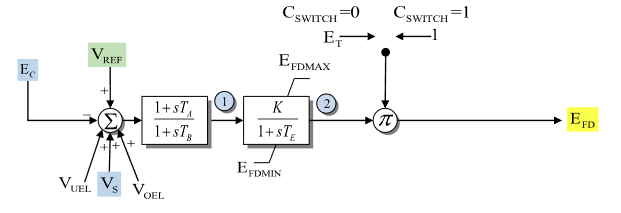

# **Bus Fed or Solid Fed Static Excitation System Model (SCRX)**

SCRX is a static excitation system with a voltage-error lead-lag block, a
limited exciter lag, and a source selector that scales the exciter output by
either terminal voltage or a constant source.

Notes:
- Internal voltage signals are on model base unless otherwise stated.
- The source diagram shows a shared SCRX/SCRX1-style selector. In the diagram,
  `C_SWITCH = 0` selects the bus-fed multiplier $E_T$, and `C_SWITCH = 1`
  selects the solid-fed multiplier 1.
- Some source material labels the lead-lag numerator input as `TA/TB`; the
  model equations below use explicit time constants $T_A$ and $T_B$.
- `Rc_Rfd` is a source-data parameter for input compatibility, but it is not an
  active block in Fig. 1 and is not used by the equations below.

## Block Diagram

Standard model of the SCRX Exciter.



Figure 1: Exciter SCRX model. Figure courtesy of [PowerWorld](https://www.powerworld.com/WebHelp/)

## Model Parameters

Symbol                              | Units    | JSON       | Description                                             | Typical Value | Note
------------------------------------|----------|------------|---------------------------------------------------------|---------------|------
$T_A$                               | [sec]    | `Ta`       | Lead-lag numerator time constant                        | 0.0           | Source label: `TA/TB` in some SCRX source data
$T_B$                               | [sec]    | `Tb`       | Lead-lag denominator time constant                      | 0.0           | Block name: `TB`; if zero, the lead-lag block is algebraic
$K$                                 | [p.u.]   | `K`        | Exciter gain                                            | 1.0           | Block name: `K`
$T_E$                               | [sec]    | `Te`       | Exciter lag time constant                               | 0.0           | Block name: `TE`; if zero, $E_{\mathrm{fd}}'$ is algebraic
$E_{\mathrm{fd}}^{\max}$            | [p.u.]   | `Efdmax`   | Maximum limited exciter output before source multiplier | 5.0           | Block name: `EFDMAX`
$E_{\mathrm{fd}}^{\min}$            | [p.u.]   | `Efdmin`   | Minimum limited exciter output before source multiplier | -5.0          | Block name: `EFDMIN`
$C_{\mathrm{sw}}$                   | [binary] | `Cswitch`  | Source multiplier selector                              | 0             | Source label: `C_SWITCH`; 0 = bus-fed $E_T$, 1 = solid-fed constant 1
$R_c/R_{\mathrm{fd}}$               | [p.u.]   | `Rc_Rfd`   | Source-data compatibility parameter                     | 0.0           | Not active in Fig. 1 equations

### Parameter Validation

Invalid SCRX parameter sets are rejected by the following checks.

```math
\begin{aligned}
  &T_A \ge 0,\quad T_B \ge 0,\quad T_E \ge 0 \\
  &T_B > 0\quad\text{or}\quad(T_B = 0\ \text{and}\ T_A = 0) \\
  &E_{\mathrm{fd}}^{\min} \le E_{\mathrm{fd}}^{\max} \\
  &C_{\mathrm{sw}} \in \{0,1\}
\end{aligned}
```

### Model Derived Parameters

The source multiplier is:

```math
\begin{aligned}
  M_{\mathrm{src}} &= (1 - C_{\mathrm{sw}})E_T + C_{\mathrm{sw}}
\end{aligned}
```

When $T_B=0$, the lead-lag block is treated as a bypass with
$V_{\mathrm{ll}}=e_V$.

## Model Variables

### Internal Variables

#### Differential

Symbol                              | Units  | Description                                             | Note
------------------------------------|--------|---------------------------------------------------------|------
$x_{\mathrm{ll}}$                   | [p.u.] | Lead-lag block state                                    | State 1 in Fig. 1
$E_{\mathrm{fd}}'$                  | [p.u.] | Limited exciter output before source multiplier         | State 2 in Fig. 1; algebraic when $T_E=0$

#### Algebraic

Symbol                              | Units  | Description                                             | Note
------------------------------------|--------|---------------------------------------------------------|------
$e_V$                               | [p.u.] | Voltage-error signal before lead-lag block              | Summing junction in Fig. 1
$V_{\mathrm{ll}}$                   | [p.u.] | Lead-lag output                                         | Drives the limited exciter lag
$M_{\mathrm{src}}$                  | [p.u.] | Source multiplier                                       | $E_T$ when $C_{\mathrm{sw}}=0$, 1 when $C_{\mathrm{sw}}=1$
$E_{\mathrm{fd}}$                   | [p.u.] | Field-voltage output                                    | Output after source multiplier

### External Variables

#### Differential

None.

#### Algebraic

Symbol                              | Units  | Description                                             | Note
------------------------------------|--------|---------------------------------------------------------|------
$E_C$                               | [p.u.] | Compensated terminal voltage magnitude                  | Source label: `EC`
$E_T$                               | [p.u.] | Terminal-voltage source multiplier                      | Source label: `ET`; used only when $C_{\mathrm{sw}}=0$
$V_{\mathrm{ref}}$                  | [p.u.] | Voltage-control reference                               | Source label: `VREF`
$V_{\mathrm{uel}}$                  | [p.u.] | Under-excitation limiter input                          | Source label: `VUEL`; optional, defaults to zero
$V_S$                               | [p.u.] | Stabilizer input signal                                 | Source label: `VS`; optional, defaults to zero
$V_{\mathrm{oel}}$                  | [p.u.] | Over-excitation limiter input                           | Source label: `VOEL`; optional, defaults to zero

## Model Equations

### Differential Equations

```math
\begin{aligned}
  0 &= -T_B\dot x_{\mathrm{ll}} - x_{\mathrm{ll}} + e_V \\
  0 &=
    -T_E\dot E_{\mathrm{fd}}'
    + \text{antiwindup}\!\left(
        E_{\mathrm{fd}}',
        -E_{\mathrm{fd}}' + K V_{\mathrm{ll}},
        E_{\mathrm{fd}}^{\min},
        E_{\mathrm{fd}}^{\max}
      \right)
\end{aligned}
```

CommonMath defines the [Anti-Windup](../../../../CommonMath.md#antiwindup)
target and smooth approximation.

### Algebraic Equations

```math
\begin{aligned}
  0 &= -e_V + V_{\mathrm{ref}} + V_{\mathrm{uel}} + V_S + V_{\mathrm{oel}} - E_C \\
  0 &= -T_B(V_{\mathrm{ll}} - x_{\mathrm{ll}}) + T_A(e_V - x_{\mathrm{ll}}) \\
  0 &= -M_{\mathrm{src}} + (1 - C_{\mathrm{sw}})E_T + C_{\mathrm{sw}} \\
  0 &= -E_{\mathrm{fd}} + M_{\mathrm{src}}E_{\mathrm{fd}}'
\end{aligned}
```

When $T_B=0$, SCRX bypasses the lead-lag block so $V_{\mathrm{ll}}=e_V$.

## Initialization

The machine initializes $E_{\mathrm{fd}}$ first. For a standard unsaturated
start, SCRX reads that value along with $E_C$, $E_T$, and any attached limiter
or stabilizer inputs, sets all internal derivatives to zero, and evaluates:

```math
\begin{aligned}
  M_{\mathrm{src},0} &= (1 - C_{\mathrm{sw}})E_{T,0} + C_{\mathrm{sw}} \\
  E_{\mathrm{fd},0}' &= \dfrac{E_{\mathrm{fd},0}}{M_{\mathrm{src},0}} \\
  V_{\mathrm{ll},0} &= \dfrac{E_{\mathrm{fd},0}'}{K} \\
  x_{\mathrm{ll},0} &= e_{V,0} = V_{\mathrm{ll},0} \\
  V_{\mathrm{ref},0}
    &= e_{V,0} + E_{C,0}
       - V_{\mathrm{uel},0} - V_{S,0} - V_{\mathrm{oel},0}
\end{aligned}
```

This closed-form start requires $M_{\mathrm{src},0}\ne 0$, $K\ne 0$, and
$E_{\mathrm{fd}}^{\min}\le E_{\mathrm{fd},0}'\le E_{\mathrm{fd}}^{\max}$.
Starts that bind the exciter limit are outside these closed-form equations.

## Model Outputs

Output          | Units  | Description                         | Note
----------------|--------|-------------------------------------|------
`efd`           | [p.u.] | Field-voltage output                | $E_{\mathrm{fd}}$
`efd_pre`       | [p.u.] | Limited exciter output before source multiplier | $E_{\mathrm{fd}}'$
`vll`           | [p.u.] | Lead-lag output                     | $V_{\mathrm{ll}}$
`msrc`          | [p.u.] | Source multiplier                   | $M_{\mathrm{src}}$
